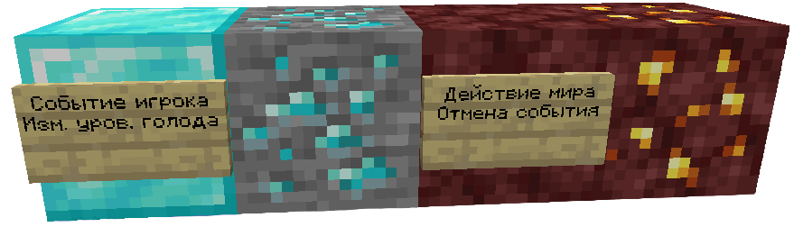
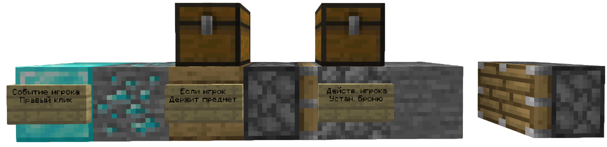
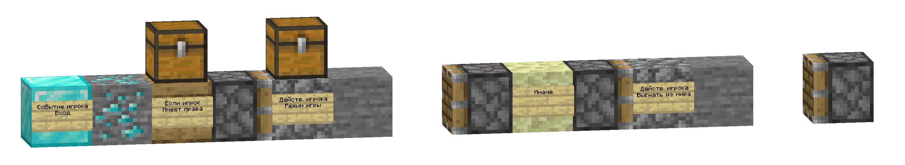
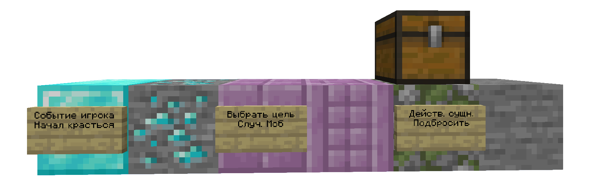
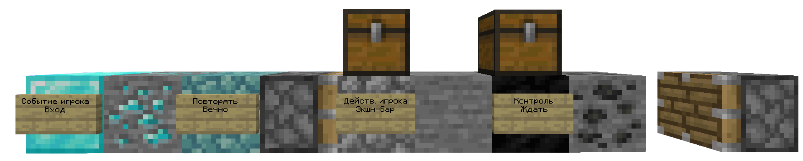
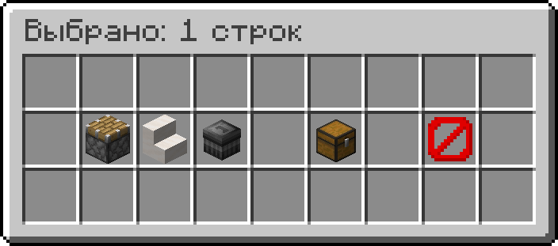

# Редактор кода

Редактор кода представляет из себя специальное пространство для написания кода в игре. Переместиться в редактор кода можно командой `/dev`, а запустить код командой `/play`.

Написание кода происходит на платформе (этаже кода), которая вмещает в себя 23 строки кода. Максимальное количество этажей — 15.

Помимо кода, на этажах можно размещать некоторые функциональные блоки и использовать их, но они исчезают при перезапуске мира.

#### Команды редактора кода:

| Команда                                          | Описание                                                 |
| ------------------------------------------------ | -------------------------------------------------------- |
| `/editor barrels <on/off>`                       | Показ сундуков над блоками кода в виде бочек.            |
| `/editor decorate <action/event/floor/reset>`    | Косметическое изменение элементов редактора кода.        |
| `/editor drops <on/off>`                         | Включение/выключение выпадения предметов из блоков кода. |
| `/editor floor <add/remove>`                     | Добавление/удаление этажа кода.                          |
| `/editor items`                                  | Восстановить все предметы редактора кода в инвентаре.    |
| `/editor save-location <on/off>`                 | Запоминать текущее местоположение в редакторе кода.      |
| `/editor time <day/midnight/night/noon>`         | Изменить время в редакторе кода.                         |
| `/editor tp <floor/function/process/координаты>` | Телепортироваться в любое место в редакторе кода.        |

## Кодинг

### Блоки кода

В основном, строка кода начинается с события. Оно улавливает действие того или иного объекта, выбранного вами.

#### Список событий:

* [ **Событие игрока**](blocks/player_event.md) — выполняет строку кода, когда игрок выполняет действие или действие выполнено над ним.
* [ **Событие сущности**](blocks/entity_event.md) — выполняет строку кода, когда сущность выполняет действие или действие выполнено над ней.
* [ **Событие мира**](blocks/world_event.md) — выполняет код, когда в мире происходит действие.

После того, как вы поставили блок события, необходимо выбрать само событие. Для этого нужно нажать правой кнопкой мыши по блоку события и в открывшемся окне и выбрать нужное событие. Зачастую они разбиты на категории, для более удобного поиска.

Следующим блоком, после события, можно установить действие.

#### Список действий:

* [ **Действие над игроком**](blocks/player_action.md) — выполняет действия над игроком или над группой игроков.
* [ **Действие над сущностью**](blocks/entity_action.md) — выполняет действия над сущностью или над группой сущностей.
* [ **Действие над миром**](blocks/world_action.md) — выполняет действия, связанные с миром.
* [ **Действие с переменной**](blocks/variable_action.md) — используется для взаимодействия с переменными.

Как становится понятно по названию, этот блок выполняет действие. Например, выдать игроку любой предмет, отправить сообщение в чат, или отменить действие.

<figure><figcaption>
Код, при выполнении которого у игрока не будет изменяться уровень голода.
</figcaption></figure>

Зачастую, перед тем, как выполнить действие, нужно поставить условие для его выполнения.

#### Список условий:

* [ **Если игрок**](blocks/if_player.md) — выполняет код внутри поршней, если игрок соблюдает условие, указанное на табличке.
* [ **Если сущность**](blocks/if_entity.md) — выполняет код внутри поршней, если сущность соблюдает условие, указанное на табличке.
* [ **Если переменная**](blocks/if_variable.md) — выполняет код внутри поршней, если указанное условие верно.
* [ **Если в мире**](blocks/if_game.md) — выполняет код внутри поршней, если в мире соблюдается условие, указанное на табличке.

<figure><figcaption>
Игроку устанавливается определённый элемент брони когда он кликает правой кнопкой мыши, держа в руке определённый предмет.
</figcaption></figure>

Некоторые действия и условия имеют селекторы. С их помощью можно выбрать, по отношению к какой именно цели будет выполняться действие. Выбрать селектор можно нажатием Shift + ПКМ по блоку кода.

Условие можно заменить на обратное. Для этого нужно взять предмет  **НЕ стрела** в активный слот и нажать ПКМ по табличке на блоке условия. Таким образом, условие «Если» превратится в «Если НЕ».

После условия, можно установить блок, который вызовет другое действие, если условие события не будет выполнено:

* [ **Иначе**](blocks/else.md) — выполняет код внутри поршней, если условие, привязанное к этому блоку, неверно. Данный блок можно поставить, только если предшествующий ему блок является блоком условия.

<figure><figcaption>
Если игрок имеет определённые права, ему устанавливается определённый режим игры. Если нет, он выгоняется из мира.
</figcaption></figure>

Бывают ситуации, когда действие нужно совершить над определённым или случайным объектом. Для таких случаев существует блок, позволяющий выбрать цель и впоследствии работать именно с ней:

* [ **Выбрать цель**](blocks/select.md) — создаёт выборку из сущностей, с которой можно будет работать до тех пор, пока вы не сбросите выборку.

<figure><figcaption>
Когда игрок приседает, случайный моб подбрасывается вверх.
</figcaption></figure>

Любой код можно зациклить. Для этого, присутствует блок, способный повторять код заданное количество раз:

* [ **Повторение**](blocks/repeat.md) — повторяет код внутри поршней в зависимости от выставленных условий.

Выполнение кода в строке происходит последовательно и моментально. Но с помощью специального блока можно устанавливать задержку перед выполнением следующего действия, полностью останавливать выполнение кода, управлять повторениями и вызывать ошибки:

* [ **Контроль действий**](blocks/control.md) — используется для дальнейшего контроля кода, стоящего после этого блока.

<figure><figcaption>
Раз в некоторое время игроку будет отправляться определённое сообщение в экшн-бар.
</figcaption></figure>

* [ **Контроллер**](blocks/controller.md) — контролирует выполнение кода внутри поршней, может проверять наличие ошибки или затрату по времени на выполнение кода.

В большом коде могут встречаться повторяющиеся фрагменты, выполняющие одну и ту же задачу, но вызываемые разными способами. Для того, чтобы не переписывать эти фрагменты каждый раз, можно уместить их в функции:

* [ **Функция**](blocks/function.md) — хранит строку кода, которую можно вызвать с помощью блока "Вызвать функцию".
* [ **Вызвать функцию**](blocks/call_function.md) — вызывает строку кода, связанную с блоком функции. Строка кода, где вызывается функция, не будет продолжена то тех пор, пока функция не завершит своё выполнение.

Блок функции устанавливается самым первым в строке, после него идёт фрагмент кода, который сохранится в данную функцию.\
Функции необходимо дать название. Для этого, держа в руках заданный текст, нажмите ПКМ по табличке, расположенной на блоке.

Помимо функций, есть также "Процесс", похожий по принципу работы:

* [ **Процесс**](blocks/process.md) — хранит строку кода, которую можно вызвать с помощью блока "Запустить процесс".
* [ **Запустить процесс**](blocks/start_process.md) — вызывает строку кода, связанную с блоком процесса. Строка кода, где вызывается процесс, будет продолжать свою работу, даже если сам процесс не завершился. Блок контроля действий не приостанавливает строку кода, в отличие от функции.

### Взаимодействие с кодом

Каждый блок кода имеет после себя дополнительный блок, как, например, рядом с [ **событием игрока**](blocks/player_event.md) (алмазный блок) стоит алмазная руда.

* Нажатие Shift + ПКМ по доп.блоку, если он не является последним в строке, создаёт отступ после него. Его можно использовать для установки дополнительного блока кода.
* Нажатие Shift + ЛКМ по доп.блоку убирает отступ.
* Нажатие ЛКМ по блоку кода удаляет его. Если нажать на первый блок кода в строке, то удалится вся строка.

Любую строку кода можно сохранить в виде шаблона и разместить в любом месте:

* Нажатие Shift + ЛКМ по первому блоку кода в строке перемещает строку в ваш инвентарь в виде шаблона.

Шаблон можно сохранить в разделе творческого инвентаря «Сохранённые инструменты», чтобы использовать в любом другом мире.

#### Взаимодействие с помощью манипулятора:

 **Манипулятор** — перемещает строки по и между этажами, сохраняет их в [модуль](module.md) или удаляет.

* Нажатие ПКМ по первому блоку в строке кода позволяет выбрать строку. Можно выбрать несколько строк.
* Нажатие ЛКМ убирает выделение со строки.
* Нажатие Shift + ПКМ передвигает строку вперёд.
* Нажатие Shift + ЛКМ передвигает строку назад.
* Нажатие клавиши F открывает [меню манипулятора](#user-content-fn-1)[^1].

### Аргументы

Многие блоки кода имеют над собой хранилище (сундук или бочку). Оно открывает меню аргументов выбранной вами опции в блоке кода. Некоторые аргументы представляют из себя [ **Маркер**](arguments/enum.md) — контекстное меню, где из предложенных вариантов предлагается выбрать подходящий. Но встречаются и пустые ячейки, зачастую они предназначены для значений. Каждая такая ячейка выделена снизу определённым цветом и подписана названием значения, которое требуется в неё положить.

#### Список значений:

* [ **Текст**](arguments/text.md) — значение, используемое для указания текстовых аргументов.
* [ **Число**](arguments/number.md) — значение, используемое для указания числовых аргументов.
* [ **Местоположение**](arguments/location.md) — значение, используемое для указания аргументов типа местоположение.
* [ **Вектор**](arguments/vector.md) — значение, используемое для указания аргументов типа вектор.
* [ **Звук**](arguments/sound.md) — значение, используемое для указания аргументов типа звук.
* [ **Эффект частиц**](arguments/particle.md) — значение, используемое для указания аргументов типа частица.
* [ **Зелье**](arguments/potion.md) — значение, используемое для указания аргументов типа зелье.
* [ **Переменная**](arguments/variable/) — предмет, который может хранить в себе все типы значений. Задать значение можно при помощи действия "установить переменную".
* [ **Игровое значение**](arguments/game_value.md) — автоматически определённое значение, которое зависит от текущего состояния игры (например, местоположение игрока).

Помимо значений, существуют ещё такие аргументы, как [ **Предмет**](arguments/item.md) и [ **Блок**](arguments/block.md).\
Они отличаются от значений тем, что их можно достать из инвентаря Творческого режима.

### Плейсхолдеры

Плейсхолдеры можно встраивать в значения. Например, если вы укажете в значении [ **Текст**](arguments/text.md) "Поздоровайтесь с `%player%`!", то на месте `%player%` образуется ник игрока, который вызвал событие.

#### Список всех плейсхолдеров:



| Плейсхолдер       | Описание                                                                                                                                                                                                                                                                                                                          |
| ----------------- | --------------------------------------------------------------------------------------------------------------------------------------------------------------------------------------------------------------------------------------------------------------------------------------------------------------------------------- |
| `%player%`        | Ник игрока, который вызвал событие или был задействован в процессе с маркером "Каждая цель в выборке".                                                                                                                                                                                                                            |
| `%player_uuid%`   | То же, что и `%player%`, но вместо ника UUID игрока.                                                                                                                                                                                                                                                                              |
| `%entity%`        | Имя существа, которое вызвало событие (например, существо получает урон), или участвовало в нём (например, игрок подбирает опыт), или было задействовано в процессе с типом цели "Каждая цель в выборке". Существо может оказаться игроком, если в событии игрока не участвуют другие существа или процесс был вызван для игрока. |
| `%entity_uuid%`   | То же, что и `%entity%`, но вместо ника UUID сущности.                                                                                                                                                                                                                                                                            |
| `%victim%`        | Имя жертвы в событии (существо/игрок, над которым производилось действие).                                                                                                                                                                                                                                                        |
| `%victim_uuid%`   | UUID жертвы в событии.                                                                                                                                                                                                                                                                                                            |
| `%damager%`       | Имя атакующего в событии (существо/игрок, наносящее(-ий) урон другой цели).                                                                                                                                                                                                                                                       |
| `%damager_uuid%`  | UUID атакующего в событии.                                                                                                                                                                                                                                                                                                        |
| `%shooter%`       | Имя стрелка в событии (существо/игрок, стрельнувшее(-ий) снарядом в цель).                                                                                                                                                                                                                                                        |
| `%shooter_uuid%`  | UUID стрелка в событии.                                                                                                                                                                                                                                                                                                           |
| `%killer%`        | Имя убийцы (существо/игрок) в событии смерти.                                                                                                                                                                                                                                                                                     |
| `%killer_uuid%`   | UUID убийцы в событии смерти.                                                                                                                                                                                                                                                                                                     |
| `%selected%`      | Имя первой цели в текущей выборке.                                                                                                                                                                                                                                                                                                |
| `%selected_uuid%` | UUID первой цели в текущей выборке.                                                                                                                                                                                                                                                                                               |
| `%display_name%`  | То же, что и `%entity%`, но если существом является игрок, то заменяется на ник игрока с префиксом и суффиксом.                                                                                                                                                                                                                   |
| `%uuid%`          | Сокращение плейсхолдера `%entity_uuid%`.                                                                                                                                                                                                                                                                                          |



| Плейсхолдер | Описание             |
| ----------- | -------------------- |
| `\n`        | Символ новой строки. |
| `%space%`   | Пробел.              |
| `%empty%`   | Пустая строка.       |



| Плейсхолдер       | Описание                                                                                                                                                                                                                                                                                                                                                                                                                                                                                                                                           |
| ----------------- | -------------------------------------------------------------------------------------------------------------------------------------------------------------------------------------------------------------------------------------------------------------------------------------------------------------------------------------------------------------------------------------------------------------------------------------------------------------------------------------------------------------------------------------------------- |
| `%var()`          | Значение игровой переменной, имя которой указанно в круглых скобках.                                                                                                                                                                                                                                                                                                                                                                                                                                                                               |
| `%var_local()`    | То же, что и `%var()`, но для локальных переменных.                                                                                                                                                                                                                                                                                                                                                                                                                                                                                                |
| `%var_save()`     | То же, что и `%var()`, но для сохранённых переменных.                                                                                                                                                                                                                                                                                                                                                                                                                                                                                              |
| `%length()`       | Получает длину списка или словаря, имя которого указано в скобках.                                                                                                                                                                                                                                                                                                                                                                                                                                                                                 |
| `%length_save()`  | То же, что и `%length()`, только для сохранённых списков и словарей.                                                                                                                                                                                                                                                                                                                                                                                                                                                                               |
| `%length_local()` | То же, что и `%length()`, только для локальных списков и словарей.                                                                                                                                                                                                                                                                                                                                                                                                                                                                                 |
| `%math()`         | 
Значение алгебраического выражения, написанного в круглых скобках. Поддерживает функции: abs(x) - модуль числа; sqrt(x) - квадратный корень; cbrt(x) - кубический корень; ceil(x) - округление в большую сторону; floor(x) - округление в меньшую сторону; sin(x), cos(x) - тригонометрические функции, x в градусах; round(x, y) - округление числа x с точностью y; pow(x, y) - возведение числа x в степень y; min(x, y), max(x, y) - меньшее и большее из двух чисел; sign(x) - знак числа (1, -1, 0).
 |



| Плейсхолдер       | Описание                                                   |
| ----------------- | ---------------------------------------------------------- |
| `%player_amount%` | Количество игроков в мире.                                 |
| `%entity_count%`  | Количество существ в мире (игроки не учитываются).         |
| `%entity_amount%` | Альтернативное название для плейсхолдера `%entity_count%`. |
| `%global_online%` | Количество игроков на сервере.                             |
| `%online%`        | Сокращение для плейсхолдера `%global_online%`.             |
| `%time%`          | Текущее время сервера, представленное стандартом ISO-8601. |
| `%worlds%`        | Количество онлайн миров игроков.                           |



| Плейсхолдер     | Описание                                                          |
| --------------- | ----------------------------------------------------------------- |
| `%damage%`      | Количество нанесённого урона в событии.                           |
| `%random%`      | Случайное дробное число, большее или равное 0, но меньшее, чем 1. |
| `%random_uuid%` | Случайно сгенерированный UUID.                                    |



[^1]: 
