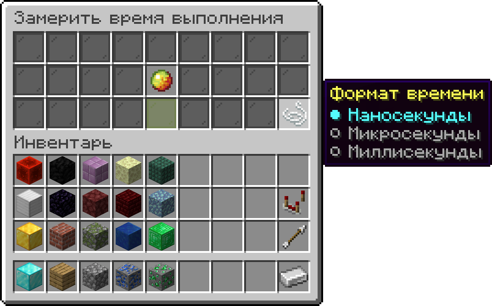

---
layout:
  title:
    visible: true
  description:
    visible: true
  tableOfContents:
    visible: true
  outline:
    visible: true
  pagination:
    visible: false
---

# Маркер

<figure><figcaption>
Условное обозначение
</figcaption></figure>

**Текстовый идентификатор:** `enum`

***

## Использование

Откройте аргументы блока и наведите курсор на маркер, чтобы увидеть его контекстное меню. Как правило, маркер выносится в отдельную ячейку и представляет из себя любой предмет.

* Нажатие ПКМ выбирает вариант снизу.
* Нажатие ЛКМ выбирает вариант сверху.

#### Пример использования:

<figure><figcaption>
Маркер "Формат времени" отображается как нить и предлагает 3 варианта: "Наносекунды", "Микросекунды" и "Миллисекунды".
</figcaption></figure>
