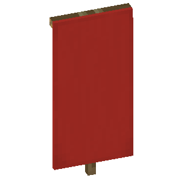

# Игровое значение

<figure><figcaption>
Значение
</figcaption></figure>

**Команда получения:** [`/gamevalue`](#user-content-fn-1)[^1]\
**Текстовый идентификатор:** `game_value`

***

## Использование

Возьмите значение в активный слот и нажмите ПКМ. В открывшемся меню перейдите в нужную категорию и выберите игровое значение.

### Каталог игровых значений



 **Числовые значения параметров цели.**

***

| Значение                                                                                                                                                                 | Описание                                                                                                                         | Возвращаемое значение                                                                                                                                         |
| ------------------------------------------------------------------------------------------------------------------------------------------------------------------------ | -------------------------------------------------------------------------------------------------------------------------------- | ------------------------------------------------------------------------------------------------------------------------------------------------------------- |
| 
 <strong>Текущее здоровье</strong> <code>current_health</code>
                           | Получает оставшееся количество единиц здоровья цели.                                                                             |  **0 (мёртв) до максимального количества здоровья (20 по умолчанию)** |
| 
 <strong>Максимальное здоровье</strong> <code>max_health</code>
                   | Получает максимальное количество единиц здоровья цели.                                                                           |  **Максимальное количество здоровья (от 1)**                          |
| 
 <strong>Дополнительное здоровье</strong> <code>absorption_health</code>
          | Получает количество единиц поглощательного (золотого) здоровья цели.                                                             |  **Количество поглощательного здоровья**                              |
| 
 <strong>Уровень голода</strong> <code>food_level</code>
                           | Получает оставшееся количество единиц еды цели.                                                                                  |  **От 0 (голод) до 20 (сытость)**                                     |
| 
 <strong>Уровень насыщения</strong> <code>food_saturation</code>
                          | Получает количество единиц насыщения едой цели, которое зависит от видов отъеденной еды.                                         |  **От 0 до текущего количества единиц еды игрока**                    |
| 
 <strong>Уровень истощения</strong> <code>food_exhaustion</code>
                  | Получает уровень истощения цели, который увеличивается от выполненных действий игрока.                                           |  **От 0 (нет истощения) до 4 (полное истощение)**                     |
| 
 <strong>Урон от атаки</strong> <code>attack_damage</code>
                          | Получает количество единиц урона от атак цели, которое можно изменить предметами.                                                |  **От 0 (по умолчанию 1)**                                            |
| 
 <strong>Скорость атаки</strong> <code>attack_speed</code>
                        | Получает скорость атаки цели, которую можно изменить предметами.                                                                 |  **От 0 (чем больше - тем быстрее)**                                  |
| 
 <strong>Кулдаун атаки</strong> <code>attack_cooldown_strength</code>
            | Получает текущий кулдаун атаки цели.                                                                                             |  **Текущий кулдаун атаки (от 0 до 1)**                                |
| 
 <strong>Кулдаун атаки в тиках</strong> <code>attack_cooldown_ticks</code>
     | Получает текущий кулдаун атаки цели в тиках.                                                                                     |  **Текущий кулдаун атаки в тиках**                                    |
| 
 <strong>Очки защиты</strong> <code>armor_points</code>
                        | Получает количество единиц брони цели, которое можно изменить предметами.                                                        |  **От 0 (брони нет) до 20 (полная полоска брони)**                    |
| 
 <strong>Твёрдость брони</strong> <code>armor_toughness</code>
               | Получает количество единиц твёрдости брони цели, которое можно изменить предметами.                                              |  **От 0 (незеритовая броня имеет 12 твёрдости)**                      |
| 
 <strong>Время бессмертия</strong> <code>invulnerability_ticks</code>
           | Получает оставшееся количество тиков неуязвимости цели.                                                                          |  **Если больше 0, то цель неуязвима**                                 |
| 
 <strong>Общее время бессмертия</strong> <code>max_invulnerability_ticks</code>
 | Получает количество тиков на которое выдана неуязвимость для цели.                                                               |  **Количество тиков неуязвимости**                                    |
| 
 <strong>Уровень опыта</strong> <code>experience_level</code>
                | Получает количество уровней опыта цели.                                                                                          |  **Количество уровней опыта**                                         |
| 
 <strong>Прогресс опыта</strong> <code>experience_progress</code>
                 | Получает процентный прогресс текущего уровня опыта цели.                                                                         |  **От 0% (нет прогресса) до 100% (следующий уровень)**                |
| 
 <strong>Время горения</strong> <code>fire_ticks</code>
                           | Получает оставшееся количество тиков горения цели.                                                                               |  **Если больше 0, то цель горит**                                     |
| 
 <strong>Время заморозки</strong> <code>freeze_ticks</code>
                 | Получает текущее время заморозки цели.                                                                                           |  **Время заморозки в тиках**                                          |
| 
 <strong>Оставшийся воздух</strong> <code>remaining_air</code>
                    | Получает оставшееся количество тиков воздуха цели.                                                                               |  **От 0 (утопает) до 300 (полная полоска воздуха)**                   |
| 
 <strong>Дистанция падения</strong> <code>fall_distance</code>
                   | Получает дистанцию падения цели в блоках.                                                                                        |  **Если больше 0, то цель падает**                                    |
| 
 <strong>Выбранный слот в хот-баре</strong> <code>held_slot</code>
              | Получает выбранный слот хот-бара цели.                                                                                           |  **Номер выбранного слота (от 0 до 8, слева направо)**                |
| 
 <strong>Скорость ходьбы</strong> <code>walking_speed</code>
                        | Получает текущую скорость ходьбы цели (атрибут).                                                                                 |  **Скорость ходьбы цели**                                             |
| 
 <strong>Скорость полёта</strong> <code>flying_speed</code>
                             | Получает текущую скорость полёта цели (атрибут).                                                                                 |  **Скорость полёта цели**                                             |
| 
 <strong>Пинг игрока</strong> <code>ping</code>
                                       | Получает задержку между игроком и сервером в миллисекундах.                                                                      |  **Пинг игрока**                                                      |
| 
 <strong>Версия протокола клиента</strong> <code>protocol_version</code>
            | Получает версию протокола клиента игрока.                                                                                        |  **Версия протокола**                                                 |
| 
 <strong>Дальность прорисовки игрока</strong> <code>client_view_distance</code>
        | 
Получает дальность прорисовки игрока, установленную в настройках игры.  Работает с: » Игроками
                   |  **Дальность прорисовки**                                             |
| 
 <strong>Прогресс использования предмета</strong> <code>item_usage_progress</code>
    | Получает процентный прогресс использования целью предмета в руке, например еды.                                                  |  **От 0% (не использует предмет) до 100%**                            |
| 
 <strong>Время жизни цели</strong> <code>entity_ticks_lived</code>
                       | Получает количество тиков существования цели.                                                                                    |  **Количество тиков**                                                 |
| 
 <strong>Количество стрел в теле</strong> <code>arrows_in_body</code>
                    | Получает количество стрел в теле цели.                                                                                           |  **Количество стрел**                                                 |
| 
 <strong>Возраст цели</strong> <code>age</code>
                                   | Получает возраст цели в тиках.                                                                                                   |  **Возраст в тиках**                                                  |
| 
 <strong>Прямолинейное движение транспорта</strong> <code>steer_forward</code>
        | Получает значение движения транспорта вперёд или назад.                                                                          |  **1 (вперёд) или -1 (назад)**                                        |
| 
 <strong>Движение транспорта в стороны</strong> <code>steer_sideways</code>
           | Получает значение движения транспорта влево или вправо.                                                                          |  **1 (влево) или -1 (вправо)**                                        |
| 
 <strong>Количество торгов Жителя</strong> <code>merchant_recipe_count</code>
          | Получает количество торгов Жителя.                                                                                               |  **Количество торгов**                                                |
| 
 <strong>Размер открытого инвентаря</strong> <code>open_inventory_size</code>
         | 
Получает размер текущего открытого инвентаря.  Работает: » Игроками
                                              |  **Размер инвентаря**                                                 |
| 
 <strong>Ширина хитбокса</strong> <code>entity_width_x</code>
                      | Получает размер хитбокса цели по оси X.                                                                                          |  **Размер хитбокса**                                                  |
| 
 <strong>Высота хитбокса</strong> <code>entity_height</code>
                       | Получает размер хитбокса цели по оси Y.                                                                                          |  **Высота хитбокса**                                                  |
| 
 <strong>Длина хитбокса</strong> <code>entity_width_z</code>
                       | Получает размер хитбокса цели по оси Z.                                                                                          |  **Размер хитбокса**                                                  |
| 
 <strong>Вектор движения снаряда</strong> <code>projectile_power</code>
            | 
Получает вектор движения снаряда.  Работает с: » Огненными шарами » Зарядами дракона » Головами Иссушителя
 |  **Вектор движения**                                            |



 **Связанные с целью значения местоположений.**

***

| Значение                                                                                                                                                                          | Описание                                                                      | Возвращаемое значение                                                                                                             |
| --------------------------------------------------------------------------------------------------------------------------------------------------------------------------------- | ----------------------------------------------------------------------------- | --------------------------------------------------------------------------------------------------------------------------------- |
| 
 <strong>Местоположение</strong> <code>location</code>
                                       | Получает местоположение цели.                                                 |  **Местоположение и поворот на высоте ног**  |
| 
 <strong>Местоположение целевого блока</strong> <code>target_block_location</code>
              | Получает местоположение блока, на который смотрит цель.                       |  **Центр блока**                             |
| 
 <strong>Местоположение целевой жидкости</strong> <code>target_fluid_location</code>
 | Получает местоположение жидкости, на которую смотрит цель.                    |  **Центр жидкости**                          |
| 
 <strong>Сторона целевого блока</strong> <code>target_block_face</code>
                   | Получает направление стороны блока, на которую смотрит цель.                  |  **Сторона блока**                                |
| 
 <strong>Местоположение глаз</strong> <code>eye_location</code>
                              | Получает местоположение цели на высоте глаз.                                  |  **Местоположение и поворот на высоте глаз** |
| 
 <strong>Местоположение плаща</strong> <code>cape_location</code>
                            | 
Получает местоположение плаща игрока.  Работает с: » Игроками
 |  **Местоположение плаща**                    |
| 
 <strong>Координата X</strong> <code>x_coordinate</code>
                                          | Получает координату X местоположения цели.                                    |  **Координата**                           |
| 
 <strong>Координата Y</strong> <code>y_coordinate</code>
                                          | Получает координату Y местоположения цели.                                    |  **Координата**                           |
| 
 <strong>Координата Z</strong> <code>z_coordinate</code>
                                          | Получает координату Z местоположения цели.                                    |  **Координата**                           |
| 
 <strong>Вертикальный поворот</strong> <code>pitch</code>
                              | Получает вертикальный (вверх/вниз) поворот (pitch) цели.                      |  **От -90 (смотрит вверх) до 90 (вниз)**  |
| 
 <strong>Горизонтальный поворот</strong> <code>yaw</code>
                              | Получает горизонтальный (влево/вправо) поворот (yaw) цели.                    |  **От -180 до 180**                       |



### Селекторы

Нажатием Shift + ЛКМ/ПКМ откроется меню селекторов, в котором можно выбрать цель игрового значения.

| Селектор                                                                                           | Описание                                                                                                                                         |
| -------------------------------------------------------------------------------------------------- | ------------------------------------------------------------------------------------------------------------------------------------------------ |
|  **Текущая цель**      | Цель, выбранная с помощью [ **Выбрать цель**](../blocks/select.md). |
|  **По умолчанию**           | Цель, которая была выбрана по умолчанию.                                                                                                         |
|  **Существо по умолчанию**  | Существо, которое было выбрано по умолчанию.                                                                                                     |
|  **Убийца**             | Цель, которая убила жертву.                                                                                                                      |
|  **Атакующий**         | Цель, которая атаковала жертву.                                                                                                                  |
|  **Жертва**         | Цель, которая получила урон или умерла.                                                                                                          |
|  **Стрелок**                   | Цель, которая выстрелила.                                                                                                                        |
|  **Снаряд**                  | Сущность, которая была запущена стрелком.                                                                                                        |
|  **Последняя сущность** | Сущность, которая появилась в мире последней.                                                                                                    |

[^1]: Можно заменить на: `/gv`
