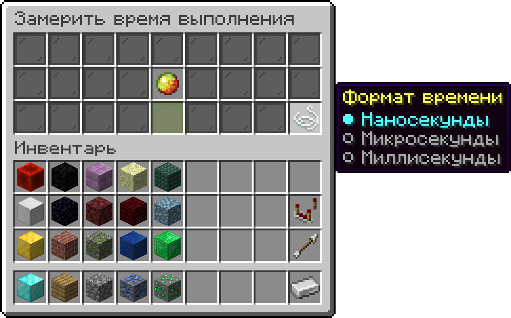

# Маркер

<figure><figcaption>
Условное обозначение
</figcaption></figure>

**Текстовый идентификатор:** `enum`

***

## Использование

Откройте аргументы блока и наведите курсор на маркер, чтобы увидеть его контекстное меню. Как правило, маркер выносится в отдельную ячейку и представляет из себя любой предмет.

* Нажатие <kbd>ПКМ</kbd> выбирает вариант снизу;
* Нажатие <kbd>ЛКМ</kbd> выбирает вариант сверху;
* Нажатие <kbd>Shift</kbd> + <kbd>ПКМ</kbd> выбирает первый вариант;
* Нажатие <kbd>Shift</kbd> + <kbd>ЛКМ</kbd> выбирает последний вариант;
* Нажатие колесом мыши выводит содержимое маркера в чат;
* Нажатие <kbd>F</kbd> открывает специальное меню маркера со всеми его вариантами для быстрого выбора.

Вы также можете привязать значение маркера к переменной. Для этого возьмите переменную в инвентаре и, наведя курсор с переменной на маркер, нажмите <kbd>ПКМ</kbd>/<kbd>ЛКМ</kbd>. Убрать переменную с маркера можно нажатием <kbd>Q</kbd>.

#### Пример использования:

<figure><figcaption>
Маркер "Формат времени" предлагает 3 варианта: "Наносекунды", "Микросекунды" и "Миллисекунды".
</figcaption></figure>
