# Эффект частиц

<figure><figcaption></figcaption></figure>

**Команда получения:** [`/particle`](#user-content-fn-1)[^1]\
**Ячейка:** \
**Текстовый идентификатор:** `particle`

***

## Использование

Возьмите значение в активный слот и нажмите <kbd>ПКМ</kbd>. В открывшемся меню перейдите в нужную категорию и выберите частицу.

Можно изменить атрибуты частицы, введя их в чат: [`amount`](#user-content-fn-2)[^2] [`spread_xz`](#user-content-fn-3)[^3] [`spread_y`](#user-content-fn-4)[^4].\
Некоторые частицы имеют [дополнительные атрибуты](particle.md#dopolnitelnye-atributy).

Нажатие <kbd>ЛКМ</kbd> призовёт эффект частиц перед вами.

### Каталог частиц



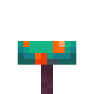 **Различные частицы окружения.**

***

<table><thead><tr><th width="207">Частица</th><th>Описание</th></tr></thead><tbody><tr><td> <strong>Дождь</strong> <code>rain</code></td><td>Частицы дождя.</td></tr><tr><td> <strong>Подводная пыль</strong> <code>underwater</code></td><td>Частицы подводной пыли.</td></tr><tr><td> <strong>Пепел</strong> <code>ash</code></td><td>Частицы пепла из Незера.</td></tr><tr><td> <strong>Белый пепел</strong> <code>white_ash</code></td><td>Частицы белого пепла из Незера.</td></tr><tr><td>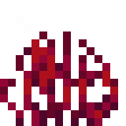 <strong>Багровые споры</strong> <code>crimson_spore</code></td><td>Частицы багровых спор из багрового леса.</td></tr><tr><td> <strong>Искажённые споры</strong> <code>warped_spore</code></td><td>Частицы искажённых спор из искажённого леса.</td></tr><tr><td> <strong>Дурной знак</strong> <code>raid_omen</code></td><td>Частицы дурного знака.</td></tr><tr><td>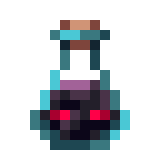 <strong>Испытание</strong> <code>trial_omen</code></td><td>Частицы испытания.</td></tr><tr><td> <strong>Призыв зловещего испытания</strong> <code>ominous_spawning</code></td><td>Частицы призыва зловещего испытания.</td></tr><tr><td> <strong>Паутина</strong> <code>item_cobweb</code></td><td>Частицы паутины.</td></tr></tbody></table>



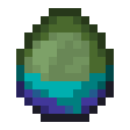 **Различные частицы существ.**

***

| Частица                                                                                                                                                                     | Описание                                | Дополнительные атрибуты                                       |
| --------------------------------------------------------------------------------------------------------------------------------------------------------------------------- | --------------------------------------- | ------------------------------------------------------------- |
| 
 <strong>Дымок от смерти</strong> <code>poof</code>
                                        | Частицы дымка, возникающего при смерти. | **Движение**                                                  |
| 
 <strong>Взрыв</strong> <code>explosion</code>
                                          | Частицы взрыва.                         |                                                               |
| 
 <strong>Большой взрыв</strong> <code>explosion_emitter</code>
                       | Частицы большого взрыва.                |                                                               |
| 
 <strong>След фейерверка</strong> <code>firework</code>
                           | Частицы следа от фейерверка.            | **Движение**                                                  |
| 
 <strong>Капли воды</strong> <code>splash</code>
                                     | Частицы капель воды.                    | **Движение**                                                  |
| 
 <strong>Рыба плывёт к крючку</strong> <code>fishing</code>
                  | Частицы подплывания рыбы к крючку.      | **Движение**                                                  |
| 
 <strong>Критический удар</strong> <code>crit</code>
                                     | Частицы от критического удара.          | **Движение**                                                  |
| 
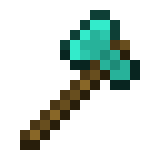 <strong>Магический удар</strong> <code>enchanted_hit</code>
                          | Частицы магического удара.              | **Движение**                                                  |
| 
 <strong>Зелье</strong> <code>effect</code>
                                | Частицы зелья.                          |                                                               |
| 
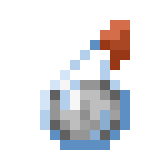 <strong>Моментальное зелье</strong> <code>instant_effect</code>
    | Частицы моментального зелья.            |                                                               |
| 
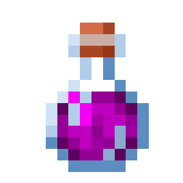 <strong>Цветное зелье</strong> <code>entity_effect</code>
                                 | Частицы цветного зелья.                 | **Цвет**                                                      |
| 
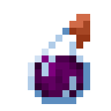 <strong>Ведьма</strong> <code>witch</code>
                                        | Частицы ведьмы.                         |                                                               |
| 
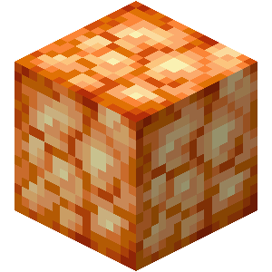 <strong>Житель злится</strong> <code>angry_villager</code>
                           | Частицы злого жителя.                   |                                                               |
| 
 <strong>Житель радуется</strong> <code>happy_villager</code>
                             | Частицы счастливого жителя.             |                                                               |
| 
 <strong>Облако</strong> <code>cloud</code>
                                        | Частицы облака.                         | **Движение**                                                  |
| 
 <strong>Снежок</strong> <code>snowball</code>
                                           | Частицы разбивающегося снежка.          |                                                               |
| 
 <strong>Снежинка</strong> <code>snowflake</code>
                              | Частица рыхлого снега.                  | **Движение**                                                  |
| 
 <strong>Слизь</strong> <code>slime</code>
                                             | Частицы слизи.                          |                                                               |
| 
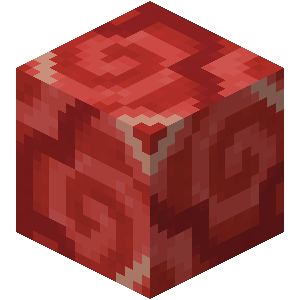 <strong>Сердце</strong> <code>heart</code>
                                 | Частицы сердец.                         |                                                               |
| 
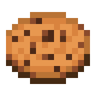 <strong>Разрушение предмета</strong> <code>item</code>
                                    | Частицы разрушения предмета.            | 
<strong>Движение</strong> <strong>Материал</strong>
 |
| 
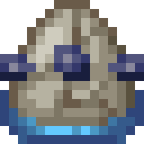 <strong>Утомление</strong> <code>elder_guardian</code>
                  | Частицы утомления (на экране).          |                                                               |
| 
 <strong>Дыхание дракона</strong> <code>dragon_breath</code>
                          | Частицы дыхания дракона.                | **Движение**                                                  |
| 
 <strong>Индикатор урона</strong> <code>damage_indicator</code>
              | Частицы индикатора урона.               | **Движение**                                                  |
| 
 <strong>Взмах удара</strong> <code>sweep_attack</code>
                                | Частицы взмаха от удара.                | **Размер**                                                    |
| 
 <strong>Тотем бессмертия</strong> <code>totem_of_undying</code>
                 | Частицы тотема бессмертия (на экране).  | **Движение**                                                  |
| 
 <strong>Плевок</strong> <code>spit</code>
                                        | Частицы плевка.                         | **Движение**                                                  |
| 
 <strong>Чернила спрута</strong> <code>squid_ink</code>
                                   | Частицы чернил спрута.                  | **Движение**                                                  |
| 
 <strong>Чернила светящегося спрута</strong> <code>glow_squid_ink</code>
             | Частицы чернил светящегося спрута.      | **Движение**                                                  |
| 
 <strong>Свечение спрута</strong> <code>glow</code>
                                | Частица светящегося спрута.             |                                                               |
| 
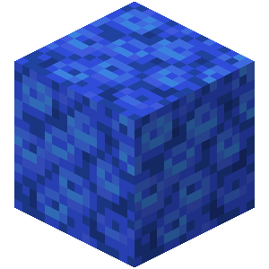 <strong>Пузырьки</strong> <code>bubble</code>
                                   | Частицы пузырьков.                      |                                                               |
| 
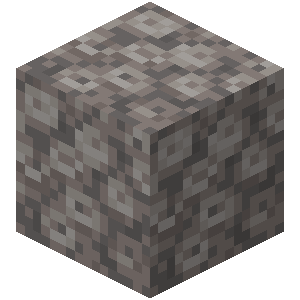 <strong>Лопание пузырьков воздуха</strong> <code>bubble_pop</code>
         | Частицы лопания пузырьков воздуха.      | **Движение**                                                  |
| 
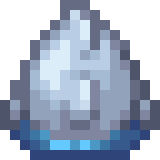 <strong>Дельфин</strong> <code>dolphin</code>
                                  | Частица всплеска воды от дельфина.      |                                                               |
| 
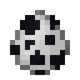 <strong>Чих</strong> <code>sneeze</code>
                                        | Частицы чиха.                           | **Движение**                                                  |
| 
 <strong>Вспышка</strong> <code>flash</code>
                                  | Частицы вспышки от фейерверка.          |                                                               |
| 
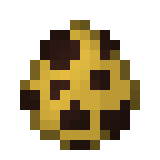 <strong>Падающий мёд</strong> <code>falling_honey</code>
                           | Частицы падающего мёда.                 |                                                               |
| 
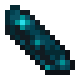 <strong>Ударная волна</strong> <code>sonic_boom</code>
                                | Частицы дальней атаки Надзирателя.      |                                                               |
| 
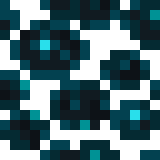 <strong>Скалковые души</strong> <code>sculk_soul</code>
                               | Частицы души скалк-катализатора.        | **Движение**                                                  |
| 
 <strong>Скалковое заражение</strong> <code>sculk_charge</code>
                      | Частицы заражения скалк-катализатором.  | 
<strong>Движение</strong> <strong>Размер</strong>
   |
| 
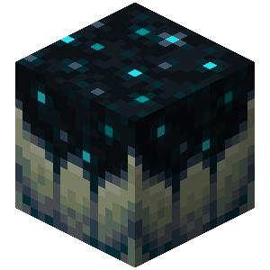 <strong>Скалковые пузырьки</strong> <code>sculk_charge_pop</code>
                 | Частицы пузырей скалк-катализатора.     | **Движение**                                                  |
| 
 <strong>Визг</strong> <code>shriek</code>
                                         | Частицы скалк-крикуна.                  | **Размер**                                                    |
| 
 <strong>Заряд ветра</strong> <code>gust</code>
                                       | Частицы заряда ветра.                   |                                                               |
| 
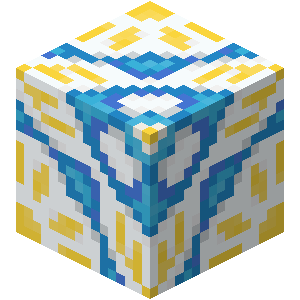 <strong>Маленький выстрел вихря</strong> <code>gust_emitter_small</code>
 | Частицы маленького выстрела вихря.      |                                                               |
| 
 <strong>Большой выстрел вихря</strong> <code>gust_emitter_large</code>
            | Частицы большого выстрела вихря.        |                                                               |
| 
 <strong>Маленький заряд ветра</strong> <code>small_gust</code>
                       | Частицы маленького заряда ветра.        |                                                               |
| 
 <strong>Заражение</strong> <code>infested</code>
                           | Частицы заражения камня чешуйницей.     |                                                               |



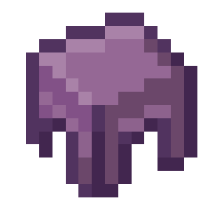 **Различные частицы блоков.**

***

| Частица                                                                                                                                                                                           | Описание                                                                    | Дополнительные атрибуты                                                                   |
| ------------------------------------------------------------------------------------------------------------------------------------------------------------------------------------------------- | --------------------------------------------------------------------------- | ----------------------------------------------------------------------------------------- |
| 
 <strong>Лава</strong> <code>lava</code>
                                                                    | Частицы бурления лавы.                                                      |                                                                                           |
| 
 <strong>Дым</strong> <code>smoke</code>
                                                                           | Частицы дыма.                                                               | **Движение**                                                                              |
| 
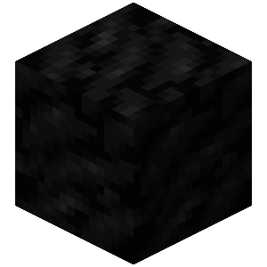 <strong>Густой дым</strong> <code>large_smoke</code>
                                                        | Частицы густого дыма.                                                       | **Движение**                                                                              |
| 
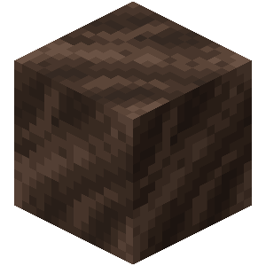 <strong>Души</strong> <code>soul</code>
                                                                      | Частицы душ.                                                                | **Движение**                                                                              |
| 
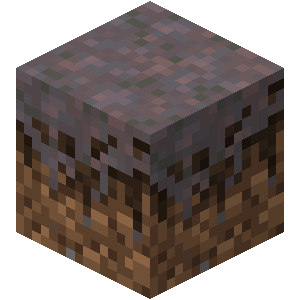 <strong>Мицелий</strong> <code>mycelium</code>
                                                                | Частицы мицелия.                                                            |                                                                                           |
| 
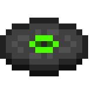 <strong>Ноты</strong> <code>note</code>
                                                                 | Частицы нот.                                                                | **Цвет**                                                                                  |
| 
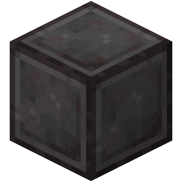 <strong>Портал</strong> <code>portal</code>
                                                            | Частицы портала.                                                            | **Движение**                                                                              |
| 
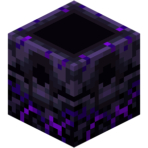 <strong>Обратный портал</strong> <code>reverse_portal</code>
                                            | Частицы обратного портала.                                                  | **Движение**                                                                              |
| 
 <strong>Стол зачарования</strong> <code>enchant</code>
                                                | Частицы стола зачарования.                                                  | **Движение**                                                                              |
| 
 <strong>Пламя</strong> <code>flame</code>
                                                                        | Частицы пламени.                                                            | **Движение**                                                                              |
| 
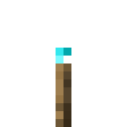 <strong>Пламя огня душ</strong> <code>soul_fire_flame</code>
                                                | Частицы пламени от огня душ.                                                | **Движение**                                                                              |
| 
 <strong>Маленькое пламя</strong> <code>small_flame</code>
                                                 | Частица маленького пламени.                                                 | **Движение**                                                                              |
| 
 <strong>Красная пыль</strong> <code>redstone</code>
                                                           | Частицы красной пыли.                                                       | 
<strong>Цвет</strong> <strong>Размер</strong>
                                   |
| 
 <strong>Цветная пыль</strong> <code>dust_color_transition</code>
                                                 | Частица, которая меняет свой цвет.                                          | 
<strong>Цвет</strong> <strong>Цвет перехода</strong> <strong>Размер</strong>
 |
| 
 <strong>Разрушение блока</strong> <code>block</code>
                                                           | Частицы разрушения блока.                                                   | 
<strong>Движение</strong> <strong>Материал</strong>
                             |
| 
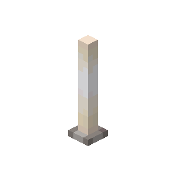 <strong>Стержень Энда</strong> <code>end_rod</code>
                                                            | Частицы дымки от стержня Энда.                                              | **Движение**                                                                              |
| 
 <strong>Падающие песчинки</strong> <code>falling_dust</code>
                                                      | Частицы падающих песчинок.                                                  | **Материал**                                                                              |
| 
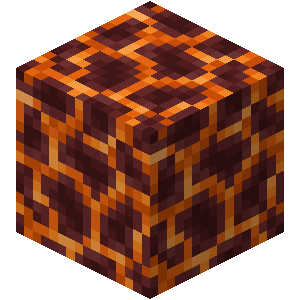 <strong>Пузырики от магмы</strong> <code>current_down</code>
                                               | Частицы спускающихся пузыриков от магмы.                                    |                                                                                           |
| 
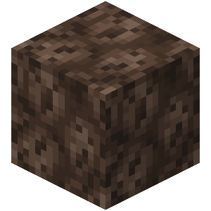 <strong>Колонна пузыриков</strong> <code>bubble_column_up</code>
                                             | Частицы пузыриков в виде колонны.                                           |                                                                                           |
| 
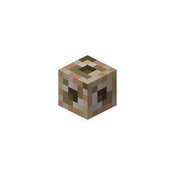 <strong>Наутилус</strong> <code>nautilus</code>
                                                                | Частицы от морского источника.                                              | **Движение**                                                                              |
| 
 <strong>Дым от костра</strong> <code>campfire_cosy_smoke</code>
                                               | Частицы дыма от костра.                                                     | **Движение**                                                                              |
| 
 <strong>Сигнальный дым</strong> <code>campfire_signal_smoke</code>
                                           | Частицы сигнального дыма от костра.                                         | **Движение**                                                                              |
| 
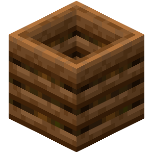 <strong>Компостер</strong> <code>composter</code>
                                                            | Частицы наполнения компостера.                                              |                                                                                           |
| 
 <strong>Блок барьера</strong> <code>block_marker</code>
                                                        | Частица блока барьера.                                                      | **Материал**                                                                              |
| 
 <strong>Капли воды</strong> <code>splash</code>
                                                           | Частицы капель воды.                                                        |                                                                                           |
| 
 <strong>Падающая вода</strong> <code>falling_water</code>
                                                 | Частицы падающих капель воды.                                               |                                                                                           |
| 
 <strong>Стекающая с капельника вода</strong> <code>dripping_dripstone_water</code>
                        | Частицы стекающих с капельника капель воды.                                 |                                                                                           |
| 
 <strong>Падающая с капельника вода</strong> <code>falling_dripstone_water</code>
                          | Частицы падающих с капельника капель воды.                                  |                                                                                           |
| 
  <strong>Капли лавы</strong> <code>dripping_lava</code>
                                                    | Частицы капель лавы.                                                        |                                                                                           |
| 
 <strong>Падающая лава</strong> <code>falling_lava</code>
                                                   | Частицы падающих капель лавы.                                               |                                                                                           |
| 
 <strong>Приземляющаяся лава</strong> <code>landing_lava</code>
                                             | Частицы приземлившихся капель лавы.                                         |                                                                                           |
| 
 <strong>Стекающая с капельника лава</strong> <code>dripping_dripstone_lava</code>
                          | Частицы стекающих с капельника капель воды.                                 |                                                                                           |
| 
 <strong>Падающая с капельника лава</strong> <code>falling_dripstone_lava</code>
                            | Частицы падающих с капельника капель лавы.                                  |                                                                                           |
| 
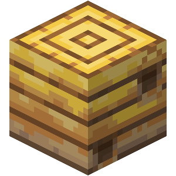 <strong>Стекающий мёд</strong> <code>dripping_honey</code>
                                                    | Частицы стекающих капель мёда.                                              |                                                                                           |
| 
 <strong>Падающий мёд</strong> <code>falling_honey</code>
                                                  | Частицы падающих капель мёда.                                               |                                                                                           |
| 
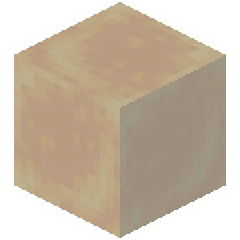 <strong>Приземляющийся мёд</strong> <code>landing_honey</code>
                                             | Частицы приземлившихся капель мёда.                                         |                                                                                           |
| 
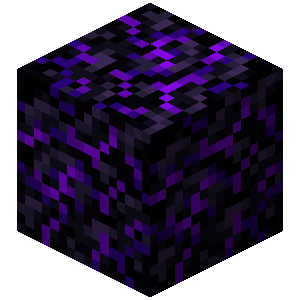 <strong>Стекающие слёзы обсидиана</strong> <code>dripping_obsidian_tear</code>
                         | Частицы стекающих слёз обсидиана.                                           |                                                                                           |
| 
 <strong>Падающие слёзы обсидиана</strong> <code>falling_obsidian_tear</code>
                                  | Частицы падающих слёз обсидиана.                                            |                                                                                           |
| 
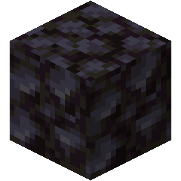 <strong>Приземляющиеся слёзы обсидиана</strong> <code>landing_obsidian_tear</code>
                          | Частицы приземляющихся слёз обсидиана.                                      |                                                                                           |
| 
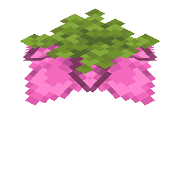 <strong>Споры спороцвета</strong> <code>spore_blossom_air</code>
                                         | Частицы спор спороцвета.                                                    |                                                                                           |
| 
 <strong>Падающие споры</strong> <code>falling_spore_blossom</code>
                                       | Частицы падающих спор спороцвета.                                           |                                                                                           |
| 
 <strong>Треск яйца</strong> <code>egg_crack</code>
                                                                 | Частица треска яйца.                                                        |                                                                                           |
| 
 <strong>Электрическая искра</strong> <code>electric_spark</code>
                                        | Частица электрической искры.                                                | **Движение**                                                                              |
| 
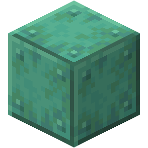 <strong>Снятие окисления меди</strong> <code>scrape</code>
                                             | Частица снятия окисления меди.                                              | **Движение**                                                                              |
| 
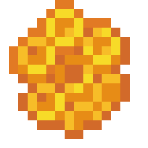 <strong>Нанесение воска</strong> <code>wax_on</code>
                                                         | Частица нанесения воска.                                                    | **Движение**                                                                              |
| 
 <strong>Снятие воска</strong> <code>wax_off</code>
                                                           | Частица снятия воска.                                                       | **Движение**                                                                              |
| 
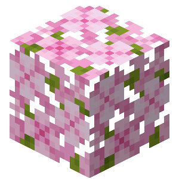 <strong>Листья вишни</strong> <code>cherry_leaves</code>
                                                 | Частицы листьев вишни.                                                      |                                                                                           |
| 
 <strong>Заполнение вазы</strong> <code>dust_plume</code>
                                                 | Частицы заполнения вазы.                                                    |                                                                                           |
| 
 <strong>Белый дым</strong> <code>white_smoke</code>
                                                            | Частицы белого дыма.                                                        |                                                                                           |
| 
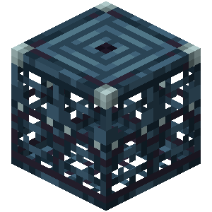 <strong>Активация спавнера испытаний</strong> <code>trial_spawner_detection</code>
                       | Частицы активации спавнера испытаний.                                       |                                                                                           |
| 
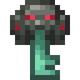 <strong>Активация зловещего спавнера испытаний</strong> <code>trial_spawner_detection_ominous</code>
 | Частицы активации зловещего спавнера испытаний.                             |                                                                                           |
| 
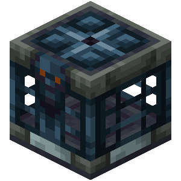 <strong>Хранилище</strong> <code>vault_connection</code>
                                                         | Частицы, появляющиеся при приближении к блоку хранилища спавнера испытаний. |                                                                                           |



### Дополнительные атрибуты

| Атрибут       | Описание                                                                                         |
| ------------- | ------------------------------------------------------------------------------------------------ |
| Размер        | Принимает число. Изменяет размер частицы. Базовый размер — `1`.                                  |
| Материал      | Принимает ID блока.                                                                              |
| Цвет          | Принимает HEX-цвет. Изменяет цвет частицы.                                                       |
| Цвет перехода | Принимает HEX-цвет. Со временем изменяет цвет частицы с первоначального на указанный.            |
| Движение      | Принимает компоненты `x`, `y` и `z`. Частица будет двигаться по вектору вдоль этого направления. |

[^1]: Можно заменить на: `/part`

[^2]: Количество отображаемых частиц.

[^3]: Разброс по ширине.

[^4]: Разброс по высоте.
