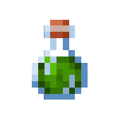
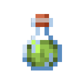

# Зелье

<figure><figcaption></figcaption></figure>

**Команда получения:** `/potion`\
**Ячейка:** \
**Текстовый идентификатор:** `potion`

***

## Использование

Возьмите значение в активный слот и нажмите <kbd>ПКМ</kbd>. В открывшемся меню выберите нужное зелье.

Можно изменить параметры зелья, введя их в чат: [`amplifier`](#user-content-fn-1)[^1] [`duration`](#user-content-fn-2)[^2].

* Нажатие <kbd>ЛКМ</kbd> накладывает эффект зелья на вас.
* Нажатие <kbd>Shift</kbd> + <kbd>ЛКМ</kbd> снимает эффект зелья.

### Каталог зелий



| Зелье                                                                                                                                                                       | Описание                                                                                                            |
| --------------------------------------------------------------------------------------------------------------------------------------------------------------------------- | ------------------------------------------------------------------------------------------------------------------- |
| 
 <strong>Поглощение</strong> <code>absorption</code>
                       | Даёт `4 × уровень` единиц поглощения (дополнительного здоровья).                                                    |
| 
 <strong>Морская сила</strong> <code>conduit_power</code>
               | Улучшает видимость под водой, скорость добычи и предотвращает утопление.                                            |
| 
 <strong>Грация дельфина</strong> <code>dolphins_grace</code>
          | Увеличивает скорость плавания на `40%`.                                                                             |
| 
 <strong>Огнестойкость</strong> <code>fire_resistance</code>
          | Даёт иммунитет к огню и урону от лавы.                                                                              |
| 
 <strong>Спешка</strong> <code>haste</code>
                                     | Увеличивает скорость добычи на `20% × уровень` и скорость атаки на `10% × уровень`.                                 |
| 
 <strong>Прилив здоровья</strong> <code>health_boost</code>
              | Увеличивает максимальное здоровье на `4 × уровень`.                                                                 |
| 
  <strong>Герой деревни</strong> <code>hero_of_the_village</code>
 | Заставляет ближайших жителей бросать подарки и предлагать скидку на торговлю в размере `23.75 + (6.25 × уровень)%`. |
| 
 <strong>Исцеление</strong> <code>heal</code>
                                    | Мгновенно восполняет `2 × 2 ^ уровень` единиц здоровья.                                                             |
| 
 <strong>Невидимость</strong> <code>invisibility</code>
                  | Заставляет сущность стать невидимой.                                                                                |
| 
 <strong>Прыгучесть</strong> <code>jump</code>
                                   | Увеличивает высоту прыжка на `0.5 + уровень`.                                                                       |
| 
 <strong>Удача</strong> <code>luck</code>
                                        | Увеличивает навык рыбалки в зависимости от значения `уровень`.                                                      |
| 
 <strong>Ночное зрение</strong> <code>night_vision</code>
                | Усиливает способность игрока видеть в темноте и под водой.                                                          |
| 
 <strong>Регенерация</strong> <code>regeneration</code>
                  | Восстанавливает `1` единицу здоровья каждые `2.5 ÷ уровень` секунд.                                                 |
| 
 <strong>Сопротивление</strong> <code>damage_resistance</code>
      | Уменьшает количество получаемого урона на `20% × уровень`.                                                          |
| 
 <strong>Насыщение</strong> <code>saturation</code>
                        | Мгновенно восполняет `1 × уровень` единиц сытости и `2 × уровень` единиц насыщения.                                 |
| 
 <strong>Медленное падение</strong> <code>slow_falling</code>
            | Уменьшает скорость падения на `70%` и предотвращает урон от падения.                                                |
| 
 <strong>Скорость</strong> <code>speed</code>
                                   | Увеличивает скорость передвижения на `20% × уровень`.                                                               |
| 
 <strong>Сила</strong> <code>increase_damage</code>
                   | Увеличивает урон от ближнего боя на `3 × уровень`.                                                                  |
| 
 <strong>Подводное дыхание</strong> <code>water_breathing</code>
      | Предотвращает потерю единиц воздуха под водой.                                                                      |



| Зелье                                                                                                                                                        | Описание                                                                               |
| ------------------------------------------------------------------------------------------------------------------------------------------------------------ | -------------------------------------------------------------------------------------- |
| 
 <strong>Свечение</strong> <code>glowing</code>
                | Рисует обводку вокруг сущности и заставляет светиться через стены.                     |
| 
 <strong>Дурное знамение</strong> <code>bad_omen</code>
       | Провоцирует начало рейда, если рядом два и более жителя.                               |
| 
 <strong>Зловещее знамение</strong> <code>trial_omen</code>
 | Превращает рассадники испытаний в зловещие рассадники испытаний вокруг сущности.       |
| 
 <strong>Рейдерское знамение</strong> <code>raid_omen</code>
 | Провоцирует рейд через 30 секунд после входа в деревню, если рядом два и более жителя. |







[^1]: Уровень.

[^2]: Длительность (в тиках).
