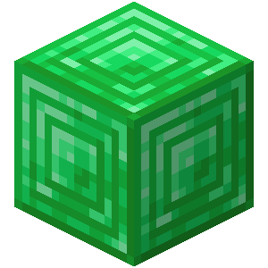
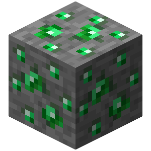

# Блоки кода

* [ **Событие игрока**](player_event.md)
* [ **Событие сущности**](entity_event.md)
* [ **Событие мира**](world_event.md)
* [ **Действие над игроком**](player_action.md)
* [ **Действие над сущностью**](entity_action.md)
* [ **Действие над миром**](world_action.md)
* [ **Действие с переменной**](variable_action.md)
* [ **Если игрок**](if_player.md)
* [ **Если сущность**](if_entity.md)
* [ **Если переменная**](if_variable.md)
* [ **Если в мире**](if_game.md)
* [ **Иначе**](else.md)
* [ **Выбрать цель**](select.md)
* [ **Повторение**](repeat.md)
* [ **Контроль действий**](control.md)
* [ **Контроллер**](controller.md)
* [ **Функция**](function.md)
* [ **Вызвать функцию**](call_function.md)
* [ **Процесс**](process.md)
* [ **Запустить процесс**](start_process.md)
