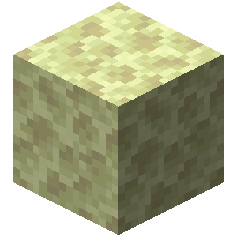
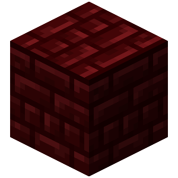
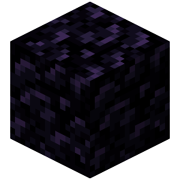

# Иначе

<figure><figcaption></figcaption></figure>

**Тип:** Условие\
**Текстовый идентификатор:** `else`

***

## Использование

Поставьте блок в строку кода. Данный блок можно поставить только если предшествующий ему блок является блоком условия:

* [ **Если игрок**](if_player.md)
* [ **Если сущность**](if_entity.md)
* [ **Если в мире**](if_game.md)
* [ **Если переменная**](if_variable.md)

Внутри поршней выполняется код, который подчиняется поставленному условию. Код, расположенный после поршней, не будет подчиняться условию.

Блок  **Иначе** можно совместить с другим условием при помощи нажатия <kbd>ПКМ</kbd> по блоку  **Иначе**.
