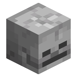
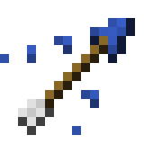
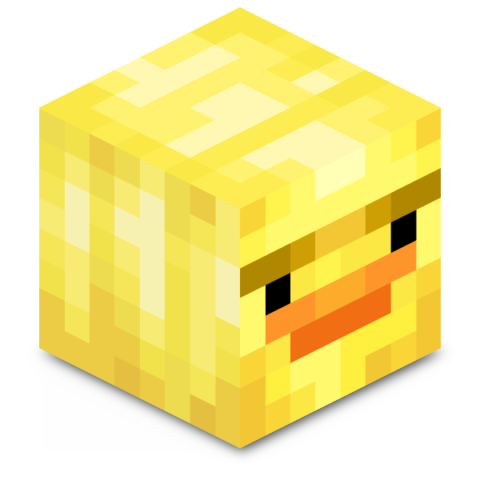
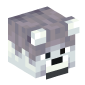
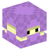
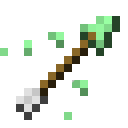
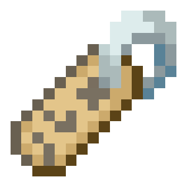
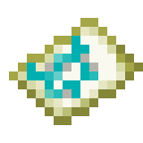

# Действие над сущностью

<figure><figcaption>
Блок кода
</figcaption></figure>

**Тип:** Действие\
**Текстовый идентификатор:** `entity_action`

***

## Использование

Поставьте блок в строку и нажмите ПКМ по нему, чтобы открыть меню опций блока. Перейдите в нужную категорию и выберите действие, которое необходимо выполнить.

При выборе действия, над его блоком может появиться хранилище (по умолчанию: сундук), в котором содержатся [аргументы](../arguments/) действия.

### Опции



 **Изменение параметров существа, такие как здоровье, эффекты, горение и другое.**

***

| Опция                                                                                                                                                                                                          | Описание                                                                                                                                                                                                                                                                                                                                                                       | Аргументы                                                                                                                                                                                                                                                                                                                                                                                                                                                                                                                                                                                                                                                                                                                                                                                                                                                                                                                              |
| -------------------------------------------------------------------------------------------------------------------------------------------------------------------------------------------------------------- | ------------------------------------------------------------------------------------------------------------------------------------------------------------------------------------------------------------------------------------------------------------------------------------------------------------------------------------------------------------------------------ | -------------------------------------------------------------------------------------------------------------------------------------------------------------------------------------------------------------------------------------------------------------------------------------------------------------------------------------------------------------------------------------------------------------------------------------------------------------------------------------------------------------------------------------------------------------------------------------------------------------------------------------------------------------------------------------------------------------------------------------------------------------------------------------------------------------------------------------------------------------------------------------------------------------------------------------- |
| 
 <strong>Исцелить существо</strong> <code>entity_heal</code>
                                                                   | Исцеляет существо.                                                                                                                                                                                                                                                                                                                                                             |  **Количество половинок сердец для излечения**                                                                                                                                                                                                                                                                                                                                                                                                                                                                                                                                                                                                                                                                                                                                                                                    |
| 
 <strong>Установить здоровье существа</strong> <code>entity_set_current_health</code>
                                   | Устанавливает здоровье существа на выбранное количество.                                                                                                                                                                                                                                                                                                                       |  **Количество здоровья**                                                                                                                                                                                                                                                                                                                                                                                                                                                                                                                                                                                                                                                                                                                                                                                                          |
| 
 <strong>Установить дополнительное здоровье</strong> <code>entity_set_absorption_health</code>
                          | Устанавливает дополнительное здоровье существа.                                                                                                                                                                                                                                                                                                                                |  **Количество дополнительного здоровья**                                                                                                                                                                                                                                                                                                                                                                                                                                                                                                                                                                                                                                                                                                                                                                                          |
| 
 <strong>Установить максимальное здоровье существа</strong> <code>entity_set_max_health</code>
                  | Устанавливает максимальное количество здоровья для существа.                                                                                                                                                                                                                                                                                                                   | 
 <strong>Максимальное количество здоровья</strong>  <strong>Исцелить существо</strong> <a data-footnote-ref href="#user-content-fn-1"><strong><code>-></code></strong></a>
                                                                                                                                                                                                                                                                                                                                                                                                                                                                                                               |
| 
 <strong>Нанести урон</strong> <code>entity_damage</code>
                                                                 | Наносит урон существу.                                                                                                                                                                                                                                                                                                                                                         | 
 <strong>Количество урона</strong>  <strong>Источник урона (имя или UUID существа)</strong>
                                                                                                                                                                                                                                                                                                                                                                                                                                                                                                                                                                                                          |
| 
 <strong>Поджечь существо</strong> <code>entity_set_fire_ticks</code>
                                                   | Поджигает существо на выбранное время.                                                                                                                                                                                                                                                                                                                                         |  **Длительность (в тиках)**                                                                                                                                                                                                                                                                                                                                                                                                                                                                                                                                                                                                                                                                                                                                                                                                       |
| 
 <strong>Установить время заморозки</strong> <code>entity_set_freeze_ticks</code>
                                 | Устанавливает существу время заморозки (количество тиков, которое сущность провела в рыхлом снегу).                                                                                                                                                                                                                                                                            | 
 <strong>Время заморозки в тиках</strong>  <strong>Блокировка состояния (время не будет изменяться)</strong> <a data-footnote-ref href="#user-content-fn-2"><strong><code>-></code></strong></a>
                                                                                                                                                                                                                                                                                                                                                                                                                                                                                         |
| 
 <strong>Установить длительность неуязвимости</strong> <code>entity_set_invulnerability_ticks</code>
                  | Устанавливает длительность неуязвимости для существа.                                                                                                                                                                                                                                                                                                                          |  **Длительность неуязвимости (в тиках)**                                                                                                                                                                                                                                                                                                                                                                                                                                                                                                                                                                                                                                                                                                                                                                                          |
| 
 <strong>Установить максимальную длительность неуязвимости</strong> <code>entity_set_max_invulnerability_ticks</code>
 | Устанавливает максимальную длительность неуязвимости для существа.                                                                                                                                                                                                                                                                                                             |  **Длительность (в тиках)**                                                                                                                                                                                                                                                                                                                                                                                                                                                                                                                                                                                                                                                                                                                                                                                                       |
| 
 <strong>Установить длительность смерти</strong> <code>entity_set_death_time</code>
                                   | Устанавливает длительность смерти для существа.                                                                                                                                                                                                                                                                                                                                |  **Длительность смерти (в тиках)**                                                                                                                                                                                                                                                                                                                                                                                                                                                                                                                                                                                                                                                                                                                                                                                                |
| 
 <strong>Выдать эффекты</strong> <code>entity_give_potion_effects</code>
                                               | Выдаёт выбранные эффекты существу.                                                                                                                                                                                                                                                                                                                                             | 
 <strong>Эффекты для выдачи</strong>  <strong>Перезаписывать существующие эффекты</strong> <a data-footnote-ref href="#user-content-fn-3"><strong><code>-></code></strong></a>  <strong>Показывать иконку эффекта</strong> <a data-footnote-ref href="#user-content-fn-4"><strong><code>-></code></strong></a>  <strong>Показывать частицы</strong> <a data-footnote-ref href="#user-content-fn-5"><strong><code>-></code></strong></a>
 |
| 
 <strong>Удалить эффект</strong> <code>entity_remove_potion_effect</code>
                                               | Удаляет выбранные эффекты у существа.                                                                                                                                                                                                                                                                                                                                          |  **Эффекты для удаления**                                                                                                                                                                                                                                                                                                                                                                                                                                                                                                                                                                                                                                                                                                                                                                                                      |
| 
 <strong>Очистить эффекты</strong> <code>entity_celar_potion_effects</code>
                                                 | Очищает все эффекты у существа.                                                                                                                                                                                                                                                                                                                                                |                                                                                                                                                                                                                                                                                                                                                                                                                                                                                                                                                                                                                                                                                                                                                                                                                                                                                                                                        |
| 
 <strong>Установить возраст животному</strong> <code>entity_set_animal_age</code>
                                                | Устанавливает возраст животному.                                                                                                                                                                                                                                                                                                                                               | 
 <strong>Возраст</strong>  <strong>Остановить взросление</strong> <a data-footnote-ref href="#user-content-fn-6"><strong><code>-></code></strong></a>
                                                                                                                                                                                                                                                                                                                                                                                                                                                                                                                                    |
| 
 <strong>Установить дистанцию падения</strong> <code>entity_set_fall_distance</code>
                                       | Устанавливает дистанцию, с которой падает существо.                                                                                                                                                                                                                                                                                                                            |  **Дистанция падения**                                                                                                                                                                                                                                                                                                                                                                                                                                                                                                                                                                                                                                                                                                                                                                                                            |
| 
 <strong>Установить криперу время до взрыва</strong> <code>entity_set_creeper_fuse</code>
                                  | 
Устанавливает криперу время до взрыва.  Работает с: » Криперами
                                                                                                                                                                                                                                                                                                |  **Время до взрыва (в тиках)**                                                                                                                                                                                                                                                                                                                                                                                                                                                                                                                                                                                                                                                                                                                                                                                                    |
| 
 <strong>Установить силу взрыва</strong> <code>entity_set_explosive_power</code>
                                                 | 
Устанавливает силу взрыва сущности.  Работает с: » Криперами » Динамитом » Огненными шарами
                                                                                                                                                                                                                                                              |  **Сила взрыва**                                                                                                                                                                                                                                                                                                                                                                                                                                                                                                                                                                                                                                                                                                                                                                                                                  |
| 
 <strong>Установить радиус облака эффекта</strong> <code>entity_set_potion_cloud_radius</code>
                | 
Устанавливает радиус облака эффекта и скорость его расширения.  Работает с: » Облаком эффекта
                                                                                                                                                                                                                                                                  | 
 <strong>Радиус</strong>  <strong>Скорость</strong>
                                                                                                                                                                                                                                                                                                                                                                                                                                                                                                                                                                                                                                          |
| 
 <strong>Установить опыт жителю</strong> <code>entity_set_villager_experience</code>
                              | 
Устанавливает жителю количество опыта.  Работает с: » Жителями
                                                                                                                                                                                                                                                                                                 |  **Количество опыта**                                                                                                                                                                                                                                                                                                                                                                                                                                                                                                                                                                                                                                                                                                                                                                                                             |
| 
 <strong>Установить неуязвимость иссушителю</strong> <code>entity_set_wither_invulnerability_ticks</code>
      | 
Устанавливает длительность неуязвимости иссушителю.  Работает с: » Иссушителем
                                                                                                                                                                                                                                                                                 |  **Длительность неуязвимости (в тиках)**                                                                                                                                                                                                                                                                                                                                                                                                                                                                                                                                                                                                                                                                                                                                                                                          |
| 
 <strong>Установить лошади силу прыжка</strong> <code>entity_set_horse_jump</code>
                                   | 
Устанавливает лошади силу прыжка.  Работает с: » Лошадьми » Ослами » Мулами » Ламами
                                                                                                                                                                                                                                                                  |  **Сила прыжка**                                                                                                                                                                                                                                                                                                                                                                                                                                                                                                                                                                                                                                                                                                                                                                                                                  |
| 
 <strong>Установить задержку для поднятия</strong> <code>entity_set_pickup_delay</code>
                                  | 
Устанавливает количество тиков, за которое предмет не может быть поднят.  Работает с: » Предметами
                                                                                                                                                                                                                                                             |  **Задержка**                                                                                                                                                                                                                                                                                                                                                                                                                                                                                                                                                                                                                                                                                                                                                                                                                     |
| 
 <strong>Установить задержку рыбалки</strong> <code>entity_set_fishing_wait</code>
                                 | 
Устанавливает задержку рыбалки существу в тиках.  Работает с: » Поплавком удочки
                                                                                                                                                                                                                                                                               |  **Задержка**                                                                                                                                                                                                                                                                                                                                                                                                                                                                                                                                                                                                                                                                                                                                                                                                                     |
| 
 <strong>Установить атрибут</strong> <code>entity_set_attribute</code>
                                                   | Устанавливает указанный атрибут на указанное значение существу.                                                                                                                                                                                                                                                                                                                | 
 <strong>Значение атрибута</strong>  <strong>Тип атрибута</strong> <a data-footnote-ref href="#user-content-fn-7"><strong><code>-></code></strong></a>
                                                                                                                                                                                                                                                                                                                                                                                                                                                                                                                                   |
| 
 <strong>Установить уровень гнева Хранителя</strong> <code>entity_set_warden_anger_level</code>
                          | 
Устанавливает определённый уровень гнева Хранителя на указанное существо.  Работает с: » Хранителями  » Если уровень гнева на сущность достигает 80, Хранитель начинает активно преследовать её.
                                                                                                                                                         | 
 <strong>Имя или UUID сущности</strong>  <strong>Уровень гнева (от 0 до 150)</strong>
                                                                                                                                                                                                                                                                                                                                                                                                                                                                                                                                                                                                                |
| 
 <strong>Установить время жизни Вредины</strong> <code>entity_set_vex_limited_lifetime_ticks</code>
                         | 
Устанавливает время жизни Вредины в тиках.  Работает с: » Врединами
                                                                                                                                                                                                                                                                                            |  **Время жизни**                                                                                                                                                                                                                                                                                                                                                                                                                                                                                                                                                                                                                                                                                                                                                                                                                  |
| 
 <strong>Установить время грусти Панды</strong> <code>entity_set_panda_sad_ticks</code>
                                   | 
Устанавливает время грусти Панды в тиках.  Работает с: » Пандами
                                                                                                                                                                                                                                                                                               |  **Время грусти**                                                                                                                                                                                                                                                                                                                                                                                                                                                                                                                                                                                                                                                                                                                                                                                                                 |
| 
 <strong>Установить снаряду вектор движения</strong> <code>entity_set_projectile_power</code>
                            | 
Устанавливает снаряду вектор движения.  Работает с: » Огненными шарами » Зарядами дракона » Головами Иссушителя
                                                                                                                                                                                                                                          |  **Вектор движения**                                                                                                                                                                                                                                                                                                                                                                                                                                                                                                                                                                                                                                                                                                                                                                                                        |
| 
 <strong>Установить стреле количество пронзаний</strong> <code>entity_set_arrow_pierce</code>
                     | Устанавливает стреле количество раз, которые она может пронзить сущность (от 0 до 127).                                                                                                                                                                                                                                                                                        |  **Количество пронзаний**                                                                                                                                                                                                                                                                                                                                                                                                                                                                                                                                                                                                                                                                                                                                                                                                         |
| 
 <strong>Установить первичный урон снаряду</strong> <code>entity_set_base_arrow_damage</code>
                                  | 
Устанавливает снаряду первичный урон, который будет использован в формуле урона снаряда при попадании.  Работает с: » Стрелами » Трезубцами  » Формула для стрел: <code>первичный_урон</code> * <code>скорость_снаряда</code> = <code>наносимый урон</code>  » Формула для трезубцев: <code>первичный_урон</code> = <code>наносимый урон</code>
 |  **Урон**                                                                                                                                                                                                                                                                                                                                                                                                                                                                                                                                                                                                                                                                                                                                                                                                                         |



 **Изменения внешнего вида существа.**

***

| Опция                                                                                                                                                                                          | Описание                                                                                                                                                                                                                                   | Аргументы                                                                                                                                                                                                                                                                                                                                                                                                                                                                                                                                                                                                                                                                                                                      |
| ---------------------------------------------------------------------------------------------------------------------------------------------------------------------------------------------- | ------------------------------------------------------------------------------------------------------------------------------------------------------------------------------------------------------------------------------------------ | ------------------------------------------------------------------------------------------------------------------------------------------------------------------------------------------------------------------------------------------------------------------------------------------------------------------------------------------------------------------------------------------------------------------------------------------------------------------------------------------------------------------------------------------------------------------------------------------------------------------------------------------------------------------------------------------------------------------------------ |
| 
 <strong>Замаскировать под сущность</strong> <code>entity_disguise_as_entity</code>
        | Замаскировать сущность под сущность.                                                                                                                                                                                                       |  **Сущность для маскировки**                                                                                                                                                                                                                                                                                                                                                                                                                                                                                                                                                                                                |
| 
 <strong>Замаскировать сущность под блок</strong> <code>entity_disguise_as_block</code>
     | Маскирует сущность под блок.                                                                                                                                                                                                               |  **Блок для маскировки**                                                                                                                                                                                                                                                                                                                                                                                                                                                                                                                                                                                        |
| 
 <strong>Замаскировать сущность под игрока</strong> <code>entity_disguise_as_player</code>
 | Маскирует сущность под игрока.                                                                                                                                                                                                             | 
 <strong>Имя или UUID</strong>  <strong>Отображаемое имя сущности</strong>  <strong>Тип сервера скинов</strong> <a data-footnote-ref href="#user-content-fn-8"><strong><code>-></code></strong></a>
                                                                                                                                                                           |
| 
 <strong>Замаскировать сущность под предмет</strong> <code>entity_disguise_as_item</code>
           | Маскирует сущность под предмет.                                                                                                                                                                                                            |  **Предмет для маскировки**                                                                                                                                                                                                                                                                                                                                                                                                                                                                                                                                                                                                 |
| 
 <strong>Убрать маскировку</strong> <code>entity_remove_disguise</code>
                       | Убирает маскировку у сущности.                                                                                                                                                                                                             |                                                                                                                                                                                                                                                                                                                                                                                                                                                                                                                                                                                                                                                                                                                                |
| 
 <strong>Установить цвет сущности</strong> <code>entity_set_dye_color</code>
                    | 
Устанавливает определённый цвет существу.  Работает с: » Овцами » Шалкерами » Ошейниками собак » Ошейниками котов
                                                                                                 |  **Цвет сущности** [**`->`**](#user-content-fn-9)[^9]                                                                                                                                                                                                                                                                                                                                                                                                                                                                                                                                                                 |
| 
 <strong>Установить позу сущности</strong> <code>entity_set_pose</code>
                                    | Устанавливает определённую позу существу.                                                                                                                                                                                                  |  **Отображаемая поза** [**`->`**](#user-content-fn-10)[^10]                                                                                                                                                                                                                                                                                                                                                                                                                                                                                                                                                           |
| 
 <strong>Установить узор рыбы</strong> <code>entity_set_tropical_fish_pattern</code>
                   | 
Устанавливает окрас и узор тропической рыбе.  Работает с: » Тропической рыбой
                                                                                                                                              | 
 <strong>Цвет узора</strong> <a data-footnote-ref href="#user-content-fn-11"><strong><code>-></code></strong></a>  <strong>Цвет тела</strong> <a data-footnote-ref href="#user-content-fn-12"><strong><code>-></code></strong></a>  <strong>Узор</strong> <a data-footnote-ref href="#user-content-fn-13"><strong><code>-></code></strong></a>
        |
| 
 <strong>Установить позу стойки для брони</strong> <code>entity_set_armor_stand_pose</code>
              | 
Устанавливает позу стойки для брони.  Работает с: » Стойками для брони
                                                                                                                                                     | 
 <strong>Поворот по оси X</strong>  <strong>Поворот по оси Y</strong>  <strong>Поворот по оси Z</strong>  <strong>Часть стойки для изменения</strong> <a data-footnote-ref href="#user-content-fn-14"><strong><code>-></code></strong></a>
 |
| 
 <strong>Установить детали стойки для брони</strong> <code>entity_set_armor_stand_parts</code>
     | 
Установить детали стойки для брони.  Работает с: » Стойками для брони
                                                                                                                                                      | 
 <strong>Видимость рук</strong> <a data-footnote-ref href="#user-content-fn-15"><strong><code>-></code></strong></a>  <strong>Видимость плиты</strong> <a data-footnote-ref href="#user-content-fn-16"><strong><code>-></code></strong></a>
                                                                                                                                                                                                                                  |
| 
 <strong>Установить тип кролика</strong> <code>entity_set_rabbit_type</code>
                             | 
Устанавливает тип кролика.  Работает с: » Кроликами
                                                                                                                                                                        |  **Тип кролика** [**`->`**](#user-content-fn-17)[^17]                                                                                                                                                                                                                                                                                                                                                                                                                                                                                                                                                                 |
| 
 <strong>Установить тип кошки</strong> <code>entity_set_cat_type</code>
                                | 
Устанавливает тип кошки.  Работает с: » Кошками
                                                                                                                                                                            |  **Тип кошки** [**`->`**](#user-content-fn-18)[^18]                                                                                                                                                                                                                                                                                                                                                                                                                                                                                                                                                                   |
| 
 <strong>Установить тип волка</strong> <code>entity_set_wolf_type</code>
                        | 
Устанавливает тип волка.  Работает с: » Волками
                                                                                                                                                                            |  **Тип волка** [**`->`**](#user-content-fn-19)[^19]                                                                                                                                                                                                                                                                                                                                                                                                                                                                                                                                                                   |
| 
 <strong>Установить режим лежания кошке</strong> <code>entity_set_cat_lying_down</code>
                      | 
Устанавливает режим лежания кошке.  Работает с: » Кошками
                                                                                                                                                                  |  **Режим лежания** [**`->`**](#user-content-fn-20)[^20]                                                                                                                                                                                                                                                                                                                                                                                                                                                                                                                                                               |
| 
 <strong>Установить тип грибной коровы</strong> <code>entity_set_mushroom_cow_type</code>
       | 
Устанавливает тип грибной коровы.  Работает с: » Грибными коровами
                                                                                                                                                         |  **Тип грибной коровы** [**`->`**](#user-content-fn-21)[^21]                                                                                                                                                                                                                                                                                                                                                                                                                                                                                                                                                          |
| 
 <strong>Установить тип попугая</strong> <code>entity_set_parrot_type</code>
                        | 
Устанавливает тип попугая.  Работает с: » Попугаями
                                                                                                                                                                        |  **Тип попугая** [**`->`**](#user-content-fn-22)[^22]                                                                                                                                                                                                                                                                                                                                                                                                                                                                                                                                                                 |
| 
 <strong>Установить узор лошади</strong> <code>entity_set_horse_pattern</code>
                   | 
Устанавливает окрас и узор лошади.  Работает с: » Лошадьми
                                                                                                                                                                 | 
 <strong>Цвет лошади</strong> <a data-footnote-ref href="#user-content-fn-23"><strong><code>-></code></strong></a>  <strong>Узор лошади</strong> <a data-footnote-ref href="#user-content-fn-24"><strong><code>-></code></strong></a>
                                                                                                                                                                                                                                        |
| 
 <strong>Установить тип аксолотля</strong> <code>entity_set_axolotl_type</code>
                       | 
Устанавливает тип аксолотля.  Работает с: » Аксолотлями
                                                                                                                                                                    |  **Тип аксолотля** [**`->`**](#user-content-fn-25)[^25]                                                                                                                                                                                                                                                                                                                                                                                                                                                                                                                                                               |
| 
 <strong>Установить предмет снаряда</strong> <code>entity_set_projectile_display_item</code>
             | 
Устанавливает видимый предмет снаряду.  Работает с: » Снежками » Яйцами » Огненными шарами » Огненными шарами Гаста » Эндер-жемчугами » Пузырьками опыта » Очами Края » Брошенными зельями
            |  **Предмет для установки**                                                                                                                                                                                                                                                                                                                                                                                                                                                                                                                                                                                                  |
| 
 <strong>Установить предмет в рамку</strong> <code>entity_set_item_in_frame</code>
                        | 
Устанавливает указанный предмет в рамку.  Работает с: » Рамками
                                                                                                                                                            |  **Предмет**                                                                                                                                                                                                                                                                                                                                                                                                                                                                                                                                                                                                                |
| 
 <strong>Установить блок в вагонетку</strong> <code>entity_set_minecart_block</code>
                        | 
Устанавливает указанный блок в вагонетку.  Работает с: » Вагонетками
                                                                                                                                                       | 
 <strong>Блок для установки</strong>  <strong>Сдвиг в блоках</strong>
                                                                                                                                                                                                                                                                                                                                                                                                      |
| 
 <strong>Замаскировать зажжённый динамит под блок</strong> <code>entity_set_primed_tnt_block</code>
              | 
Маскирует зажжённый динамит под указанный блок.  Работает с: » Зажжённым динамитом
                                                                                                                                         |  **Блок**                                                                                                                                                                                                                                                                                                                                                                                                                                                                                                                                                                                                       |
| 
 <strong>Установить свечение сущности</strong> <code>entity_set_glowing</code>
                   | Устанавливает существу эффект свечения.                                                                                                                                                                                                    |  **Свечение** [**`->`**](#user-content-fn-26)[^26]                                                                                                                                                                                                                                                                                                                                                                                                                                                                                                                                                                    |
| 
 <strong>Установить тип лисы</strong> <code>entity_set_fox_type</code>
                                      | 
Устанавливает тип лисы.  Работает с: » Лисами
                                                                                                                                                                              |  **Тип лисы** [**`->`**](#user-content-fn-27)[^27]                                                                                                                                                                                                                                                                                                                                                                                                                                                                                                                                                                    |
| 
 <strong>Установить анимацию прыжка лисе</strong> <code>entity_set_fox_leaping</code>
                  | 
Устанавливает анимацию прыжка лисе.  Работает с: » Лисами
                                                                                                                                                                  |  **Анимация прыжка** [**`->`**](#user-content-fn-28)[^28]                                                                                                                                                                                                                                                                                                                                                                                                                                                                                                                                                             |
| 
 <strong>Установить цвет ламы</strong> <code>entity_set_llama_type</code>
                            | 
Устанавливает цвет ламы.  Работает с: » Ламами
                                                                                                                                                                             |  **Цвет для установки** [**`->`**](#user-content-fn-29)[^29]                                                                                                                                                                                                                                                                                                                                                                                                                                                                                                                                                          |
| 
 <strong>Установить биом жителю</strong> <code>entity_set_villager_biome</code>
                              | 
Устанавливает жителю окрас в зависимости от выбранного биома.  Работает с: » Жителями
                                                                                                                                      |  **Биом** [**`->`**](#user-content-fn-30)[^30]                                                                                                                                                                                                                                                                                                                                                                                                                                                                                                                                                                        |
| 
 <strong>Установить тыкву снеговику</strong> <code>entity_set_snowman_pumpkin</code>
                         | 
Устанавливает видимость тыквы снеговику.  Работает с: » Снежными големами
                                                                                                                                                  |  **Видимость тыквы** [**`->`**](#user-content-fn-31)[^31]                                                                                                                                                                                                                                                                                                                                                                                                                                                                                                                                                             |
| 
 <strong>Установить блок Эндермену</strong> <code>entity_set_enderman_block</code>
                       | 
Устанавливает отображаемый блок Эндермену.  Работает с: » Эндерменами
                                                                                                                                                      |  **Отображаемый блок**                                                                                                                                                                                                                                                                                                                                                                                                                                                                                                                                                                                          |
| 
 <strong>Установить пыльцу пчеле</strong> <code>entity_set_bee_nectar</code>
                                 | 
Устанавливает видимость пыльцы пчеле.  Работает с: » Пчёлами
                                                                                                                                                               |  **Видимость пыльцы** [**`->`**](#user-content-fn-32)[^32]                                                                                                                                                                                                                                                                                                                                                                                                                                                                                                                                                            |
| 
 <strong>Установить время тьмы спруту</strong> <code>entity_set_glow_squid_dark</code>
                  | 
Устанавливает время тьмы в тиках светящемуся спруту.  Работает с: » Светящимися спрутами
                                                                                                                                   |  **Время тьмы (в тиках)**                                                                                                                                                                                                                                                                                                                                                                                                                                                                                                                                                                                                 |
| 
 <strong>Установить тип жабы</strong> <code>entity_set_frog_type</code>
                               | 
Устанавливает окрас жабы.  Работает с: » Жабами
                                                                                                                                                                            |  **Тип жабы** [**`->`**](#user-content-fn-33)[^33]                                                                                                                                                                                                                                                                                                                                                                                                                                                                                                                                                                    |
| 
 <strong>Установить процент открытия шалкера</strong> <code>entity_set_shulker_peek</code>
   | 
Устанавливает шалкеру процент, на который он открыт.  Работает с: » Шалкерами
                                                                                                                                              | 
 <strong>Процент открытия</strong>  <strong>Звук от изменения открытости</strong> <a data-footnote-ref href="#user-content-fn-34"><strong><code>-></code></strong></a>
                                                                                                                                                                                                                                                                                                           |
| 
 <strong>Установить агрессивность</strong> <code>entity_set_mob_aggressive</code>
          | 
Устанавливает агрессивность сущности.  Работает с: » Утопленниками » Пиглинами » Скелетами » Зомби » Зомби-жителями » Иллюзорами » Поборниками » Пандами » Разбойниками » Брутальными пиглинами
 |  **Агрессивность** [**`->`**](#user-content-fn-35)[^35]                                                                                                                                                                                                                                                                                                                                                                                                                                                                                                                                                               |
| 
 <strong>Отображать огонь</strong> <code>entity_set_visual_fire</code>
                                      | Отображает огонь на существе.                                                                                                                                                                                                              |  **Отображение огня** [**`->`**](#user-content-fn-36)[^36]                                                                                                                                                                                                                                                                                                                                                                                                                                                                                                                                                            |
| 
 <strong>Отобразить анимацию урона</strong> <code>entity_play_damage_animation</code>
                     | Отображает анимацию урона существу.                                                                                                                                                                                                        |  **Тип урона** [**`->`**](#user-content-fn-37)[^37]                                                                                                                                                                                                                                                                                                                                                                                                                                                                                                                                                                   |
| 
 <strong>Отобразить анимацию получения урона</strong> <code>entity_play_hurt_animation</code>
                 | Отображает существу анимацию получения урона с определённым наклоном.                                                                                                                                                                      |  **Угол получения урона (0-360)**                                                                                                                                                                                                                                                                                                                                                                                                                                                                                                                                                                                         |
| 
 <strong>Проиграть анимацию взмаха руки</strong> <code>entity_swing_hand</code>
                         | Проигрывает для сущности анимацию взмаха руки.                                                                                                                                                                                             |  **Тип руки** [**`->`**](#user-content-fn-38)[^38]                                                                                                                                                                                                                                                                                                                                                                                                                                                                                                                                                                    |



 **Запуск, телепортация и другие взаимодействия, связанные с перемещением сущности.**

***

| Опция                                                                                                                                                                                 | Описание                                                                          | Аргументы                                                                                                                                                                                                                                                                                                                                                                                                                                                                                                                                                                                                                                                     |
| ------------------------------------------------------------------------------------------------------------------------------------------------------------------------------------- | --------------------------------------------------------------------------------- | ------------------------------------------------------------------------------------------------------------------------------------------------------------------------------------------------------------------------------------------------------------------------------------------------------------------------------------------------------------------------------------------------------------------------------------------------------------------------------------------------------------------------------------------------------------------------------------------------------------------------------------------------------------- |
| 
 <strong>Телепортация</strong> <code>entity_teleport</code>
                                     | Телепортирует существо в выбранное местоположение.                                | 
 <strong>Новая позиция</strong>  <strong>Оставить текущий поворот</strong> <a data-footnote-ref href="#user-content-fn-39"><strong><code>-></code></strong></a>
                                                                                                                                                                                                                                                    |
| 
 <strong>Подбросить вверх</strong> <code>entity_launch_up</code>
                                | Подбрасывает существо вверх или вниз в зависимости от силы.                       | 
 <strong>Сила подбрасывания</strong>  <strong>Учитывать текущую инерцию</strong> <a data-footnote-ref href="#user-content-fn-40"><strong><code>-></code></strong></a>
                                                                                                                                                                                                                                           |
| 
 <strong>Запустить вперёд</strong> <code>entity_launch_forward</code>
                                | Запускает существо вперёд или назад по направлению взгляда в зависимости от силы. | 
 <strong>Сила подбрасывания</strong>  <strong>Учитывать текущую инерцию</strong> <a data-footnote-ref href="#user-content-fn-41"><strong><code>-></code></strong></a>  <strong>Ось запуска</strong> <a data-footnote-ref href="#user-content-fn-42"><strong><code>-></code></strong></a>
 |
| 
 <strong>Запустить к местоположению</strong> <code>entity_launch_to_location</code>
           | Запускает существо к выбранному местоположению.                                   | 
 <strong>Конечная позиция</strong>  <strong>Сила запуска</strong>  <strong>Учитывать текущую инерцию</strong> <a data-footnote-ref href="#user-content-fn-43"><strong><code>-></code></strong></a>
                                                                                              |
| 
 <strong>Посадить на существо</strong> <code>entity_ride_entity</code>
                               | Сажает существо на другое существо или игрока.                                    |  **Имя или UUID цели**                                                                                                                                                                                                                                                                                                                                                                                                                                                                                                                                           |
| 
 <strong>Высадить из транспорта</strong> <code>entity_leave_vehicle</code>
                     | Высаживает существо из транспорта или существа.                                   |                                                                                                                                                                                                                                                                                                                                                                                                                                                                                                                                                                                                                                                               |
| 
 <strong>Установить полёт на элитрах</strong> <code>entity_set_gliding</code>
                        | Устанавливает для существа состояние полёта на элитрах.                           |  **Полёт на элитрах** [**`->`**](#user-content-fn-44)[^44]                                                                                                                                                                                                                                                                                                                                                                                                                                                                                           |
| 
 <strong>Установить гравитацию</strong> <code>entity_set_gravity</code>
                               | Устанавливает, будет ли сущность подчиняться гравитации.                          |  **Гравитация** [**`->`**](#user-content-fn-45)[^45]                                                                                                                                                                                                                                                                                                                                                                                                                                                                                                 |
| 
 <strong>Установить поворот</strong> <code>entity_set_rotation</code>
                      | Устанавливает поворот сущности.                                                   | 
 <strong>Горизонтальный поворот (yaw)</strong>  <strong>Вертикальный поворот (pitch)</strong>
                                                                                                                                                                                                                                                                                                                       |
| 
 <strong>Установить поворот по вектору</strong> <code>entity_set_rotation_by_vector</code>
 | Устанавливает поворот сущности по вектору.                                        |  **Вектор для поворота**                                                                                                                                                                                                                                                                                                                                                                                                                                                                                                                           |
| 
 <strong>Повернуть к местоположению</strong> <code>entity_face_location</code>
                   | Поворачивает существо в сторону к местоположению.                                 |  **Местоположение**                                                                                                                                                                                                                                                                                                                                                                                                                                                                                                                                         |
| 
 <strong>Запустить по вектору</strong> <code>entity_set_location</code>
                     | Запускает существо по указанному вектору.                                         | 
 <strong>Вектор движения</strong>  <strong>Учитывать текущую инерцию</strong> <a data-footnote-ref href="#user-content-fn-46"><strong><code>-></code></strong></a>
                                                                                                                                                                                                                                        |
| 
 <strong>Привязать на поводок</strong> <code>entity_attach_lead</code>
                                 | Привязывает существо на поводок к забору или существу.                            | 
 <strong>Имя существа или UUID</strong>  <strong>Местоположение забора</strong>
                                                                                                                                                                                                                                                                                                                                                |
| 
 <strong>Установить трение</strong> <code>entity_set_friction</code>
                                    | Устанавливает, будет ли сущность испытывать трение.                               |  **Испытывать трение** [**`->`**](#user-content-fn-47)[^47]                                                                                                                                                                                                                                                                                                                                                                                                                                                                                          |



 **Базовые настройки сущности, такие как установки имени, неуязвимости и другое.**

***

| Опция                                                                                                                                                                                                 | Описание                                                                                                                                                                                                                             | Аргументы                                                                                                                                                                                                                                                                                                                                                                                                                                                                                                                                                                                                                                                                                                                                                                                                                                                                                                                                                                                                                                                                                                                                                                                                                                                                                                                                                                                                                                                                                                                                                                                                                                                                                                                                                                                                                                                                                                                                                                                                                                                                                                                                                                                                                                                                                                         |
| ----------------------------------------------------------------------------------------------------------------------------------------------------------------------------------------------------- | ------------------------------------------------------------------------------------------------------------------------------------------------------------------------------------------------------------------------------------ | ----------------------------------------------------------------------------------------------------------------------------------------------------------------------------------------------------------------------------------------------------------------------------------------------------------------------------------------------------------------------------------------------------------------------------------------------------------------------------------------------------------------------------------------------------------------------------------------------------------------------------------------------------------------------------------------------------------------------------------------------------------------------------------------------------------------------------------------------------------------------------------------------------------------------------------------------------------------------------------------------------------------------------------------------------------------------------------------------------------------------------------------------------------------------------------------------------------------------------------------------------------------------------------------------------------------------------------------------------------------------------------------------------------------------------------------------------------------------------------------------------------------------------------------------------------------------------------------------------------------------------------------------------------------------------------------------------------------------------------------------------------------------------------------------------------------------------------------------------------------------------------------------------------------------------------------------------------------------------------------------------------------------------------------------------------------------------------------------------------------------------------------------------------------------------------------------------------------------------------------------------------------------------------------------------------------- |
| 
 <strong>Установить имя</strong> <code>entity_set_custom_name</code>
                                               | Устанавливает имя существа.                                                                                                                                                                                                          |  **Имя существа**                                                                                                                                                                                                                                                                                                                                                                                                                                                                                                                                                                                                                                                                                                                                                                                                                                                                                                                                                                                                                                                                                                                                                                                                                                                                                                                                                                                                                                                                                                                                                                                                                                                                                                                                                                                                                                                                                                                                                                                                                                                                                                                                                                                                    |
| 
 <strong>Установить видимость имени</strong> <code>entity_set_custom_name_visibility</code>
                     | Устанавливает видимость имени существа.                                                                                                                                                                                              |  **Видимость имени** [**`->`**](#user-content-fn-48)[^48]                                                                                                                                                                                                                                                                                                                                                                                                                                                                                                                                                                                                                                                                                                                                                                                                                                                                                                                                                                                                                                                                                                                                                                                                                                                                                                                                                                                                                                                                                                                                                                                                                                                                                                                                                                                                                                                                                                                                                                                                                                                                                                                                                |
| 
 <strong>Установить интеллект сущности</strong> <code>entity_set_ai</code>
                             | Устанавливает интеллект сущности.                                                                                                                                                                                                    |  **Интеллект** [**`->`**](#user-content-fn-49)[^49]                                                                                                                                                                                                                                                                                                                                                                                                                                                                                                                                                                                                                                                                                                                                                                                                                                                                                                                                                                                                                                                                                                                                                                                                                                                                                                                                                                                                                                                                                                                                                                                                                                                                                                                                                                                                                                                                                                                                                                                                                                                                                                                                                      |
| 
 <strong>Заглушить сущность</strong> <code>entity_set_silenced</code>
                                         | Убирает звуки сущности.                                                                                                                                                                                                              |  **Заглушение** [**`->`**](#user-content-fn-50)[^50]                                                                                                                                                                                                                                                                                                                                                                                                                                                                                                                                                                                                                                                                                                                                                                                                                                                                                                                                                                                                                                                                                                                                                                                                                                                                                                                                                                                                                                                                                                                                                                                                                                                                                                                                                                                                                                                                                                                                                                                                                                                                                                                                                     |
| 
 <strong>Установить видимость</strong> <code>entity_set_default_visible</code>
                                 | Устанавливает сущности видимость.                                                                                                                                                                                                    |  **Видимость** [**`->`**](#user-content-fn-51)[^51]                                                                                                                                                                                                                                                                                                                                                                                                                                                                                                                                                                                                                                                                                                                                                                                                                                                                                                                                                                                                                                                                                                                                                                                                                                                                                                                                                                                                                                                                                                                                                                                                                                                                                                                                                                                                                                                                                                                                                                                                                                                                                                                                                      |
| 
 <strong>Установить выпадение предметов</strong> <code>entity_set_death_drops</code>
                         | Устанавливает, будет ли выпадать лут с существа.                                                                                                                                                                                     |  **Выпадение предметов** [**`->`**](#user-content-fn-52)[^52]                                                                                                                                                                                                                                                                                                                                                                                                                                                                                                                                                                                                                                                                                                                                                                                                                                                                                                                                                                                                                                                                                                                                                                                                                                                                                                                                                                                                                                                                                                                                                                                                                                                                                                                                                                                                                                                                                                                                                                                                                                                                                                                                            |
| 
 <strong>Установить режим столкновения</strong> <code>entity_set_collidable</code>
                                    | Устанавливает существу режим столкновения с другими существами.                                                                                                                                                                      |  **Режим столкновения** [**`->`**](#user-content-fn-53)[^53]                                                                                                                                                                                                                                                                                                                                                                                                                                                                                                                                                                                                                                                                                                                                                                                                                                                                                                                                                                                                                                                                                                                                                                                                                                                                                                                                                                                                                                                                                                                                                                                                                                                                                                                                                                                                                                                                                                                                                                                                                                                                                                                                             |
| 
 <strong>Установить неуязвимость сущности</strong> <code>entity_set_invulnerable</code>
                              | Устанавливает неуязвимость сущности, но в режиме креатива можно нанести урон.                                                                                                                                                        |  **Неуязвимость** [**`->`**](#user-content-fn-54)[^54]                                                                                                                                                                                                                                                                                                                                                                                                                                                                                                                                                                                                                                                                                                                                                                                                                                                                                                                                                                                                                                                                                                                                                                                                                                                                                                                                                                                                                                                                                                                                                                                                                                                                                                                                                                                                                                                                                                                                                                                                                                                                                                                                                   |
| 
 <strong>Установить физику для сущности</strong> <code>entity_set_no_physics</code>
                                   | Устанавливает существу физику.                                                                                                                                                                                                       |  **Физика** [**`->`**](#user-content-fn-55)[^55]                                                                                                                                                                                                                                                                                                                                                                                                                                                                                                                                                                                                                                                                                                                                                                                                                                                                                                                                                                                                                                                                                                                                                                                                                                                                                                                                                                                                                                                                                                                                                                                                                                                                                                                                                                                                                                                                                                                                                                                                                                                                                                                                                         |
| 
 <strong>Установить режим сидения</strong> <code>entity_set_sitting</code>
                                       | 
Устанавливает существу режим сидения.  Работает с: » Волками » Кошками » Попугаями » Лисами » Пандами
                                                                                                    |  **Режим сидения** [**`->`**](#user-content-fn-56)[^56]                                                                                                                                                                                                                                                                                                                                                                                                                                                                                                                                                                                                                                                                                                                                                                                                                                                                                                                                                                                                                                                                                                                                                                                                                                                                                                                                                                                                                                                                                                                                                                                                                                                                                                                                                                                                                                                                                                                                                                                                                                                                                                                                                  |
| 
 <strong>Установить режим ребёнка</strong> <code>entity_set_baby</code>
                                          | Устанавливает существу режим ребёнка.                                                                                                                                                                                                |  **Режим ребёнка** [**`->`**](#user-content-fn-57)[^57]                                                                                                                                                                                                                                                                                                                                                                                                                                                                                                                                                                                                                                                                                                                                                                                                                                                                                                                                                                                                                                                                                                                                                                                                                                                                                                                                                                                                                                                                                                                                                                                                                                                                                                                                                                                                                                                                                                                                                                                                                                                                                                                                                  |
| 
 <strong>Установить размер существа</strong> <code>entity_set_size</code>
                                        | 
Устанавливает размер существу.  Работает с: » Слизнями » Фантомами
                                                                                                                                                |  **Размер**                                                                                                                                                                                                                                                                                                                                                                                                                                                                                                                                                                                                                                                                                                                                                                                                                                                                                                                                                                                                                                                                                                                                                                                                                                                                                                                                                                                                                                                                                                                                                                                                                                                                                                                                                                                                                                                                                                                                                                                                                                                                                                                                                                                                  |
| 
 <strong>Установить видимость седла</strong> <code>entity_set_wearing_saddle</code>
                                  | 
Устанавливает существу седло.  Работает с: » Свиньями » Лошадьми » Лавомерками
                                                                                                                                 |  **Наличие седла** [**`->`**](#user-content-fn-58)[^58]                                                                                                                                                                                                                                                                                                                                                                                                                                                                                                                                                                                                                                                                                                                                                                                                                                                                                                                                                                                                                                                                                                                                                                                                                                                                                                                                                                                                                                                                                                                                                                                                                                                                                                                                                                                                                                                                                                                                                                                                                                                                                                                                                  |
| 
 <strong>Установить видимость сундука</strong> <code>entity_set_carrying_chest</code>
                            | 
Устанавливает видимость сундука на сущности.  Работает с: » Ослами » Мулами » Ламами
                                                                                                                           |  **Наличие сундука** [**`->`**](#user-content-fn-59)[^59]                                                                                                                                                                                                                                                                                                                                                                                                                                                                                                                                                                                                                                                                                                                                                                                                                                                                                                                                                                                                                                                                                                                                                                                                                                                                                                                                                                                                                                                                                                                                                                                                                                                                                                                                                                                                                                                                                                                                                                                                                                                                                                                                                |
| 
 <strong>Установить анимацию рывка верблюду</strong> <code>entity_set_camel_dashing</code>
         | 
Устанавливает анимацию рывка верблюду.  Работает с: » Верблюдами
                                                                                                                                                     |  **Анимация рывка** [**`->`**](#user-content-fn-60)[^60]                                                                                                                                                                                                                                                                                                                                                                                                                                                                                                                                                                                                                                                                                                                                                                                                                                                                                                                                                                                                                                                                                                                                                                                                                                                                                                                                                                                                                                                                                                                                                                                                                                                                                                                                                                                                                                                                                                                                                                                                                                                                                                                                                 |
| 
 <strong>Установить режим маркера</strong> <code>entity_set_marker</code>
                                             | 
Устанавливает режим маркера стойке для брони.  Работает с: » Стойками для брони
                                                                                                                                      |  **Режим маркера** [**`->`**](#user-content-fn-61)[^61]                                                                                                                                                                                                                                                                                                                                                                                                                                                                                                                                                                                                                                                                                                                                                                                                                                                                                                                                                                                                                                                                                                                                                                                                                                                                                                                                                                                                                                                                                                                                                                                                                                                                                                                                                                                                                                                                                                                                                                                                                                                                                                                                                  |
| 
 <strong>Установить режим гнева</strong> <code>entity_set_angry</code>
                                       | 
Устанавливает существу режим гнева на определённую цель.  Работает с: » Пчёлами » Волками » Зомбифицированными пиглинами » Эндерменами » Мобами  » Для корректной работы сущности необходима цель.
 | 
 <strong>Режим гнева</strong> <a data-footnote-ref href="#user-content-fn-62"><strong><code>-></code></strong></a>  <strong>Имя цели</strong>
                                                                                                                                                                                                                                                                                                                                                                                                                                                                                                                                                                                                                                                                                                                                                                                                                                                                                                                                                                                                                                                                                                                                                                                                                                                                                                                                                                                                                                                                                                                                                                                                                                                                                                                                                                                                                                                                                                                               |
| 
 <strong>Установить позу лошади</strong> <code>entity_set_rearing</code>
                                | 
Устанавливает, будет ли лошадь стоять на задних ногах.  Работает с: » Лошадьми
                                                                                                                                       |  **Поза лошади** [**`->`**](#user-content-fn-63)[^63]                                                                                                                                                                                                                                                                                                                                                                                                                                                                                                                                                                                                                                                                                                                                                                                                                                                                                                                                                                                                                                                                                                                                                                                                                                                                                                                                                                                                                                                                                                                                                                                                                                                                                                                                                                                                                                                                                                                                                                                                                                                                                                                                                    |
| 
 <strong>Установить анимацию Тягун</strong> <code>entity_set_riptiding</code>
                                       | Устанавливает существу анимацию использования зачарования трезубца Тягун.                                                                                                                                                            |  **Анимация Тягун** [**`->`**](#user-content-fn-64)[^64]                                                                                                                                                                                                                                                                                                                                                                                                                                                                                                                                                                                                                                                                                                                                                                                                                                                                                                                                                                                                                                                                                                                                                                                                                                                                                                                                                                                                                                                                                                                                                                                                                                                                                                                                                                                                                                                                                                                                                                                                                                                                                                                                                 |
| 
 <strong>Установить заряженность криперу</strong> <code>entity_set_creeper_charge</code>
          | 
Устанавливает, будет ли крипер заряженным.  Работает с: » Криперами
                                                                                                                                                  |  **Заряженность крипера** [**`->`**](#user-content-fn-65)[^65]                                                                                                                                                                                                                                                                                                                                                                                                                                                                                                                                                                                                                                                                                                                                                                                                                                                                                                                                                                                                                                                                                                                                                                                                                                                                                                                                                                                                                                                                                                                                                                                                                                                                                                                                                                                                                                                                                                                                                                                                                                                                                                                                           |
| 
 <strong>Установить режим невидимости</strong> <code>entity_set_invisible</code>
                     | Устанавливает существу режим невидимости.                                                                                                                                                                                            |  **Режим невидимости** [**`->`**](#user-content-fn-66)[^66]                                                                                                                                                                                                                                                                                                                                                                                                                                                                                                                                                                                                                                                                                                                                                                                                                                                                                                                                                                                                                                                                                                                                                                                                                                                                                                                                                                                                                                                                                                                                                                                                                                                                                                                                                                                                                                                                                                                                                                                                                                                                                                                                              |
| 
 <strong>Установить козла кричащим</strong> <code>entity_set_goat_screaming</code>
                                | 
Устанавливает тег "кричащий" козлу.  Работает с: » Козлами
                                                                                                                                                           |  **Тег "Кричащий"** [**`->`**](#user-content-fn-67)[^67]                                                                                                                                                                                                                                                                                                                                                                                                                                                                                                                                                                                                                                                                                                                                                                                                                                                                                                                                                                                                                                                                                                                                                                                                                                                                                                                                                                                                                                                                                                                                                                                                                                                                                                                                                                                                                                                                                                                                                                                                                                                                                                                                                 |
| 
 <strong>Приручить существо</strong> <code>entity_set_tame</code>
                                                      | 
Устанавливает привязанность существа к указанному хозяину.  Работает с: » Волками » Кошками » Лошадьми » Мулами » Ламами » Попугаями
                                                                  |  **Имя или UUID хозяина**                                                                                                                                                                                                                                                                                                                                                                                                                                                                                                                                                                                                                                                                                                                                                                                                                                                                                                                                                                                                                                                                                                                                                                                                                                                                                                                                                                                                                                                                                                                                                                                                                                                                                                                                                                                                                                                                                                                                                                                                                                                                                                                                                                                            |
| 
 <strong>Указать луч кристалла Энда</strong> <code>entity_set_end_crystal_beam</code>
           | 
Указывает луч кристалла Энда на определённое местоположение.  Работает с: » Кристаллами Энда
                                                                                                                         |  **Местоположение для указания**                                                                                                                                                                                                                                                                                                                                                                                                                                                                                                                                                                                                                                                                                                                                                                                                                                                                                                                                                                                                                                                                                                                                                                                                                                                                                                                                                                                                                                                                                                                                                                                                                                                                                                                                                                                                                                                                                                                                                                                                                                                                                                                                                                                |
| 
 <strong>Установить ген панды</strong> <code>entity_set_panda_gene</code>
                                  | 
Устанавливает ген панды. Это влияет на их поведение и внешний вид.  Работает с: » Пандами
                                                                                                                            | 
 <strong>Ген</strong> <a data-footnote-ref href="#user-content-fn-68"><strong><code>-></code></strong></a>  <strong>Тип гена</strong> <a data-footnote-ref href="#user-content-fn-69"><strong><code>-></code></strong></a>
                                                                                                                                                                                                                                                                                                                                                                                                                                                                                                                                                                                                                                                                                                                                                                                                                                                                                                                                                                                                                                                                                                                                                                                                                                                                                                                                                                                                                                                                                                                                                                                                                                                                                                                                                                                                                                      |
| 
 <strong>Установить профессию жителю</strong> <code>entity_set_villager_profession</code>
    | 
Устанавливает определённую профессию жителю.  Работает с: » Жителями » Зомби-жителями
                                                                                                                             |  **Профессия жителя** [**`->`**](#user-content-fn-70)[^70]                                                                                                                                                                                                                                                                                                                                                                                                                                                                                                                                                                                                                                                                                                                                                                                                                                                                                                                                                                                                                                                                                                                                                                                                                                                                                                                                                                                                                                                                                                                                                                                                                                                                                                                                                                                                                                                                                                                                                                                                                                                                                                                                               |
| 
 <strong>Установить состояние нюхача</strong> <code>entity_set_sniffer_state</code>
                            | 
Устанавливает определённое состояние нюхачу.  Работает с: » Нюхачами
                                                                                                                                                 |  **Состояние нюхача** [**`->`**](#user-content-fn-71)[^71]                                                                                                                                                                                                                                                                                                                                                                                                                                                                                                                                                                                                                                                                                                                                                                                                                                                                                                                                                                                                                                                                                                                                                                                                                                                                                                                                                                                                                                                                                                                                                                                                                                                                                                                                                                                                                                                                                                                                                                                                                                                                                                                                               |
| 
 <strong>Установить Пчеле жало</strong> <code>entity_set_bee_has_stinger</code>
                                    | 
Устанавливает состояние жала пчеле.  Работает: » Пчёлами
                                                                                                                                                             |  **Состояние жала** [**`->`**](#user-content-fn-72)[^72]                                                                                                                                                                                                                                                                                                                                                                                                                                                                                                                                                                                                                                                                                                                                                                                                                                                                                                                                                                                                                                                                                                                                                                                                                                                                                                                                                                                                                                                                                                                                                                                                                                                                                                                                                                                                                                                                                                                                                                                                                                                                                                                                                 |
| 
 <strong>Посадить панду</strong> <code>entity_set_panda_on_back</code>
                                   | 
Устанавливает Панде состояние сидения.  Работает с: » Пандами
                                                                                                                                                        |  **Состояние сидения** [**`->`**](#user-content-fn-73)[^73]                                                                                                                                                                                                                                                                                                                                                                                                                                                                                                                                                                                                                                                                                                                                                                                                                                                                                                                                                                                                                                                                                                                                                                                                                                                                                                                                                                                                                                                                                                                                                                                                                                                                                                                                                                                                                                                                                                                                                                                                                                                                                                                                              |
| 
 <strong>Установить стрелка снаряду</strong> <code>entity_set_projectile_shooter</code>
                               | Устанавливает указанное существо как стрелка для снаряда.                                                                                                                                                                            |  **Имя или UUID стрелка**                                                                                                                                                                                                                                                                                                                                                                                                                                                                                                                                                                                                                                                                                                                                                                                                                                                                                                                                                                                                                                                                                                                                                                                                                                                                                                                                                                                                                                                                                                                                                                                                                                                                                                                                                                                                                                                                                                                                                                                                                                                                                                                                                                                            |
| 
 <strong>Установить исчезание существа</strong> <code>entity_set_persistence</code>
                               | 
Устанавливает, будет ли предмет или падающий блок исчезать.  Работает с: » Предметами » Падающими блоками
                                                                                                         |  **Исчезание существа** [**`->`**](#user-content-fn-74)[^74]                                                                                                                                                                                                                                                                                                                                                                                                                                                                                                                                                                                                                                                                                                                                                                                                                                                                                                                                                                                                                                                                                                                                                                                                                                                                                                                                                                                                                                                                                                                                                                                                                                                                                                                                                                                                                                                                                                                                                                                                                                                                                                                                             |
| 
 <strong>Установить пропадание существа</strong> <code>entity_set_despawning</code>
                                 | Устанавливает, будет ли пропадать существо.                                                                                                                                                                                          |  **Пропадание существа** [**`->`**](#user-content-fn-75)[^75]                                                                                                                                                                                                                                                                                                                                                                                                                                                                                                                                                                                                                                                                                                                                                                                                                                                                                                                                                                                                                                                                                                                                                                                                                                                                                                                                                                                                                                                                                                                                                                                                                                                                                                                                                                                                                                                                                                                                                                                                                                                                                                                                            |
| 
 <strong>Установить товар Жителю</strong> <code>entity_set_merchant_recipe</code>
                                   | 
Устанавливает товар Жителю за определённые предметы по указанному индексу.  Работает с: » Жителями » Странствующими торговцами
                                                                                    | 
 <strong>Покупаемый товар</strong>  <strong>Первый предмет</strong>  <strong>Второй предмет</strong>  <strong>Индекс товара</strong>  <strong>Режим установки</strong> <a data-footnote-ref href="#user-content-fn-76"><strong><code>-></code></strong></a>  <strong>Количество использований</strong>  <strong>Максимальное количество использований</strong>  <strong>Опыт для Жителя</strong>  <strong>Множитель цены</strong>  <strong>Спрос товара</strong>  <strong>Особая цена</strong>  <strong>Игнорирование скидок</strong> <a data-footnote-ref href="#user-content-fn-77"><strong><code>-></code></strong></a>  <strong>Награда опытом</strong> <a data-footnote-ref href="#user-content-fn-78"><strong><code>-></code></strong></a>
 |
| 
 <strong>Удалить товар Жителю</strong> <code>entity_remove_merchant_recipe</code>
                                  | 
Удаляет товар Жителю по указанному индексу.  Работает с: » Жителями » Странствующими торговцами
                                                                                                                   |  **Индекс товара**                                                                                                                                                                                                                                                                                                                                                                                                                                                                                                                                                                                                                                                                                                                                                                                                                                                                                                                                                                                                                                                                                                                                                                                                                                                                                                                                                                                                                                                                                                                                                                                                                                                                                                                                                                                                                                                                                                                                                                                                                                                                                                                                                                                           |
| 
 <strong>Очистить торги Жителю</strong> <code>entity_clear_merchant_recipes</code>
                           | 
Очищает все торги Жителю.  Работает с: » Жителями » Странствующими торговцами
                                                                                                                                     |                                                                                                                                                                                                                                                                                                                                                                                                                                                                                                                                                                                                                                                                                                                                                                                                                                                                                                                                                                                                                                                                                                                                                                                                                                                                                                                                                                                                                                                                                                                                                                                                                                                                                                                                                                                                                                                                                                                                                                                                                                                                                                                                                                                                                                                                                                                   |
| 
 <strong>Изменить торги пиглина</strong> <code>entity_modify_piglin_barter_materials</code>
                      | 
Изменяет предметы, которые может дать пиглин при обмене.  Работает с: » Пиглинами  » Нельзя изменить предметы, которые пиглин продаёт по умолчанию.
                                                            | 
 <strong>Предметы для изменения</strong>  <strong>Режим изменения</strong> <a data-footnote-ref href="#user-content-fn-79"><strong><code>-></code></strong></a>
                                                                                                                                                                                                                                                                                                                                                                                                                                                                                                                                                                                                                                                                                                                                                                                                                                                                                                                                                                                                                                                                                                                                                                                                                                                                                                                                                                                                                                                                                                                                                                                                                                                                                                                                                                                                                                                                                                       |
| 
 <strong>Изменить предметы для торга с пиглином</strong> <code>entity_modify_piglin_interested_materials</code>
 | 
Изменяет предметы, требуемые для обмена с пиглином.  Работает с: » Пиглинами  » Нельзя изменить предметы, которые пиглин требует по умолчанию.
                                                                 | 
 <strong>Предметы для изменения</strong>  <strong>Режим изменения</strong> <a data-footnote-ref href="#user-content-fn-80"><strong><code>-></code></strong></a>
                                                                                                                                                                                                                                                                                                                                                                                                                                                                                                                                                                                                                                                                                                                                                                                                                                                                                                                                                                                                                                                                                                                                                                                                                                                                                                                                                                                                                                                                                                                                                                                                                                                                                                                                                                                                                                                                                                       |
| 
 <strong>Установить размер сущности взаимодействия</strong> <code>entity_set_interaction_size</code>
    | 
Устанавливает горизонтальный и вертикальный размеры сущности взаимодействия.  Работает с: » Сущностями взаимодействия
                                                                                                | 
 <strong>Горизонтальный размер</strong>  <strong>Вертикальный размер</strong>
                                                                                                                                                                                                                                                                                                                                                                                                                                                                                                                                                                                                                                                                                                                                                                                                                                                                                                                                                                                                                                                                                                                                                                                                                                                                                                                                                                                                                                                                                                                                                                                                                                                                                                                                                                                                                                                                                                                                                                                           |
| 
 <strong>Установить отзывчивость сущности взаимодействия</strong> <code>entity_set_interaction_responsive</code>
 | 
Устанавливает, будет ли сущность взаимодействия отзываться на взаимодействия.  Работает с: » Сущностями взаимодействия
                                                                                               |  **Отзывчивость** [**`->`**](#user-content-fn-81)[^81]                                                                                                                                                                                                                                                                                                                                                                                                                                                                                                                                                                                                                                                                                                                                                                                                                                                                                                                                                                                                                                                                                                                                                                                                                                                                                                                                                                                                                                                                                                                                                                                                                                                                                                                                                                                                                                                                                                                                                                                                                                                                                                                                                   |
| 
 <strong>Установить иммунитет к зомбифицированию</strong> <code>entity_set_immune_to_zombification</code>
      | 
Устанавливает существу иммунитет к зомбифицированию.  Работает с: » Пиглинами » Брутальными пиглинами » Хоглинами
                                                                                              |  **Иммунитет к зомбифицированию** [**`->`**](#user-content-fn-82)[^82]                                                                                                                                                                                                                                                                                                                                                                                                                                                                                                                                                                                                                                                                                                                                                                                                                                                                                                                                                                                                                                                                                                                                                                                                                                                                                                                                                                                                                                                                                                                                                                                                                                                                                                                                                                                                                                                                                                                                                                                                                                                                                                                                   |
| 
 <strong>Установить возможность подбора</strong> <code>entity_set_pickup</code>
                                     | 
Устанавливает сущности возможность подбора.  Работает с: » Сущностями предметов
                                                                                                                                      | 
 <strong>Подбор мобами</strong> <a data-footnote-ref href="#user-content-fn-83"><strong><code>-></code></strong></a>  <strong>Подбор игроками</strong> <a data-footnote-ref href="#user-content-fn-84"><strong><code>-></code></strong></a>
                                                                                                                                                                                                                                                                                                                                                                                                                                                                                                                                                                                                                                                                                                                                                                                                                                                                                                                                                                                                                                                                                                                                                                                                                                                                                                                                                                                                                                                                                                                                                                                                                                                                                                                                                                                                                     |



 **Установка различных целей существа.**

***

| Опция                                                                                                                                                                                                      | Описание                                                                                                                                                                                                                                                                                        | Аргументы                                                                                                                                                                                                                                                                                                                                                                                                                                                                              |
| ---------------------------------------------------------------------------------------------------------------------------------------------------------------------------------------------------------- | ----------------------------------------------------------------------------------------------------------------------------------------------------------------------------------------------------------------------------------------------------------------------------------------------- | -------------------------------------------------------------------------------------------------------------------------------------------------------------------------------------------------------------------------------------------------------------------------------------------------------------------------------------------------------------------------------------------------------------------------------------------------------------------------------------- |
| 
 <strong>Установить режим празднования</strong> <code>entity_set_celebrating</code>
                                         | 
Устанавливает режим празднования существу.  Работает с: » Пиглинами » Рейдерами
                                                                                                                                                                                              |  **Режим празднования** [**`->`**](#user-content-fn-85)[^85]                                                                                                                                                                                                                                                                                                                  |
| 
 <strong>Установить цель существу</strong> <code>entity_set_target</code>
                                         | 
Инструктирует ИИ существа нацеливаться на определённое существо.  Работает с: » Мобами  » Оставьте пустой слот в поле <a href="../arguments/text.md"> <strong>Текст</strong></a>, чтобы убрать цель.
 |  **Имя или UUID цели**                                                                                                                                                                                                                                                                                                                                                                    |
| 
 <strong>Установить осведомлённость моба</strong> <code>entity_set_aware</code>
                                       | 
В выключенном состоянии отключает ИИ моба, но оставляет взаимодействие с гравитацией, толканием и т.д.  Работает с: » Мобами
                                                                                                                                                    |  **Осведомлённость** [**`->`**](#user-content-fn-86)[^86]                                                                                                                                                                                                                                                                                                                     |
| 
 <strong>Установить движение к местоположению</strong> <code>entity_move_to_location</code>
                        | 
Инструктирует ИИ существа всегда находить путь к определённому местоположению с определённой скоростью.  Работает с: » Мобами
                                                                                                                                                   | 
 <strong>Конечное местоположение</strong>  <strong>Скорость передвижения</strong>
                                                                                                                                                               |
| 
 <strong>Остановить движение к местоположению</strong> <code>entity_move_to_location_stop</code>
                    | 
Останавливает сущность, идущую к местоположению.  Работает с: » Мобами
                                                                                                                                                                                                          |                                                                                                                                                                                                                                                                                                                                                                                                                                                                                        |
| 
 <strong>Прыгнуть</strong> <code>entity_jump</code>
                                                              | 
Заставляет существо прыгнуть.  Работает с: » Мобами
                                                                                                                                                                                                                             |                                                                                                                                                                                                                                                                                                                                                                                                                                                                                        |
| 
 <strong>Таранить сущность</strong> <code>entity_ram_target</code>
                                                     | 
Заставляет козлов таранить указанную сущность.  Работает с: » Козлами
                                                                                                                                                                                                           |  **Имя или UUID сущности**                                                                                                                                                                                                                                                                                                                                                                |
| 
 <strong>Установить цель поедания</strong> <code>entity_eat_target</code>
                                              | 
Устанавливает существу цель для поедания.  Работает с: » Жабами
                                                                                                                                                                                                                 |  **Имя или UUID цели**                                                                                                                                                                                                                                                                                                                                                                    |
| 
 <strong>Есть траву</strong> <code>entity_eat_grass</code>
                                                           | 
Заставляет овцу есть траву.  Работает с: » Овцами
                                                                                                                                                                                                                               |                                                                                                                                                                                                                                                                                                                                                                                                                                                                                        |
| 
 <strong>Зажечь крипера</strong> <code>entity_ignite_creeper</code>
                                        | 
Поджигает крипера, заставляя его взорваться после определённого периода.  Работает с: » Криперами
                                                                                                                                                                               |                                                                                                                                                                                                                                                                                                                                                                                                                                                                                        |
| 
 <strong>Взорваться</strong> <code>entity_explode</code>
                                                                     | 
Заставляет существо взорваться.  Работает с: » Криперами » Динамитом » Фейерверками
                                                                                                                                                                                       |                                                                                                                                                                                                                                                                                                                                                                                                                                                                                        |
| 
 <strong>Установить анимацию сна</strong> <code>entity_sleep</code>
                                                     | 
Устанавливает существу анимацию сна. Лучше всего использовать это действие в цикле.  Работает с: » Лисами
                                                                                                                                                                       |  **Режим сна** [**`->`**](#user-content-fn-87)[^87]                                                                                                                                                                                                                                                                                                                           |
| 
 <strong>Установить фазу Эндер-дракона</strong> <code>entity_set_dragon_phase</code>
                                 | 
Устанавливает определённую фазу Эндер-дракону.  Работает с: » Эндер-драконами
                                                                                                                                                                                                   |  **Фаза Эндер-дракона** [**`->`**](#user-content-fn-88)[^88]                                                                                                                                                                                                                                                                                                                  |
| 
 <strong>Установить цель снаряду Шалкера</strong> <code>entity_set_shulker_bullet_target</code>
 | 
Устанавливает цель атаки снаряду Шалкера.  Работает с: » Снарядами Шалкера
                                                                                                                                                                                                      |  **Имя или UUID цели**                                                                                                                                                                                                                                                                                                                                                                    |
| 
 <strong>Использовать предмет</strong> <code>entity_use_item</code>
                                                          | 
Инструктирует ИИ существа на использование предмета в его руке.  Работает с: » Мобами
                                                                                                                                                                                           | 
 <strong>Тип руки</strong> <a data-footnote-ref href="#user-content-fn-89"><strong><code>-></code></strong></a>  <strong>Использование</strong> <a data-footnote-ref href="#user-content-fn-90"><strong><code>-></code></strong></a>
 |
| 
 <strong>Установить состояние зарядки арбалета</strong> <code>entity_set_piglin_charging_crossbow</code>
                | 
Устанавливает пиглину состояние зарядки арбалета.  Работает с: » Пиглинами
                                                                                                                                                                                                      |  **Состояние зарядки** [**`->`**](#user-content-fn-91)[^91]                                                                                                                                                                                                                                                                                                                   |
| 
 <strong>Установить состояние охоты</strong> <code>entity_set_piglin_able_to_hunt</code>
                              | 
Устанавливает пиглину состояние охоты на хоглинов.  Работает с: » Пиглинами
                                                                                                                                                                                                     |  **Состояние охоты** [**`->`**](#user-content-fn-92)[^92]                                                                                                                                                                                                                                                                                                                     |
| 
 <strong>Установить стадию танца</strong> <code>entity_set_piglin_dancing</code>
                                     | 
Устанавливает пиглину стадию танца на указанное время.  Работает с: » Пиглинами  » Если значение продолжительности меньше 0, то танец будет длиться бесконечно.
                                                                                                           |  **Продолжительность танца (в тиках)**                                                                                                                                                                                                                                                                                                                                            |
| 
 <strong>Сделать Тихоню танцующим</strong> <code>entity_set_allay_dancing</code>
                                      | 
Заставляет Тихоню отображать анимацию танца.  Работает с: » Тихонями
                                                                                                                                                                                                            |  **Анимация танца** [**`->`**](#user-content-fn-93)[^93]                                                                                                                                                                                                                                                                                                                    |
| 
 <strong>Установить Вредине злость</strong> <code>entity_set_vex_charging</code>
                                        | 
Устанавливает Вредине стадию злости.  Работает с: » Врединами
                                                                                                                                                                                                                   |  **Стадия злости** [**`->`**](#user-content-fn-94)[^94]                                                                                                                                                                                                                                                                                                                       |
| 
 <strong>Установить Панде состояние переката</strong> <code>entity_set_panda_rolling</code>
                           | 
Устанавливает Панде состояние переката.  Работает с: » Пандами
                                                                                                                                                                                                                  |  **Состояние переката** [**`->`**](#user-content-fn-95)[^95]                                                                                                                                                                                                                                                                                                                  |



 **Различные настройки, связанные с сущностями-визуализаторами.**

***

| Опция                                                                                                                                                                                                       | Описание                                                                                                                                               | Аргументы                                                                                                                                                                                                                                                                                                                                                                                                                                                                                                                                                                                                                                                                                                                                                                                                                                                                                                                                                                                                                                                                                                                                                                                                                       |
| ----------------------------------------------------------------------------------------------------------------------------------------------------------------------------------------------------------- | ------------------------------------------------------------------------------------------------------------------------------------------------------ | ------------------------------------------------------------------------------------------------------------------------------------------------------------------------------------------------------------------------------------------------------------------------------------------------------------------------------------------------------------------------------------------------------------------------------------------------------------------------------------------------------------------------------------------------------------------------------------------------------------------------------------------------------------------------------------------------------------------------------------------------------------------------------------------------------------------------------------------------------------------------------------------------------------------------------------------------------------------------------------------------------------------------------------------------------------------------------------------------------------------------------------------------------------------------------------------------------------------------------- |
| 
 <strong>Установить дальность видимости</strong> <code>entity_set_display_view_range</code>
                       | 
Устанавливает дальность видимости сущности-визуализатору.  Работает с: » Любой сущностью-визуализатором
                                |  **Дальность видимости**                                                                                                                                                                                                                                                                                                                                                                                                                                                                                                                                                                                                                                                                                                                                                                                                                                                                                                                                                                                                                                                                                                   |
| 
 <strong>Установить режим отображения</strong> <code>entity_set_display_billboard</code>
                             | 
Устанавливает режим отображения сущности-визуализатору.  Работает с: » Любой сущностью-визуализатором
                                  |  **Режим отображения** [**`->`**](#user-content-fn-96)[^96]                                                                                                                                                                                                                                                                                                                                                                                                                                                                                                                                                                                                                                                                                                                                                                                                                                                                                                                                                                                                                                                            |
| 
 <strong>Установить настройки тени</strong> <code>entity_set_display_shadow</code>
                      | 
Устанавливает размер и прозрачность тени сущности-визуализатору.  Работает с: » Любой сущностью-визуализатором
                         | 
 <strong>Радиус тени</strong>  <strong>Процент непрозрачности</strong>
                                                                                                                                                                                                                                                                                                                                                                                                                                                                                                                                                                                                                                                                                                                                                                                                                                                                                                                |
| 
 <strong>Установить яркость</strong> <code>entity_set_display_brightness</code>
                                          | 
Устанавливает яркость сущности-визуализатору.  Работает с: » Любой сущностью-визуализатором
                                            | 
 <strong>Уровень света от блоков</strong>  <strong>Уровень света от неба</strong>
                                                                                                                                                                                                                                                                                                                                                                                                                                                                                                                                                                                                                                                                                                                                                                                                                                                                                                     |
| 
 <strong>Сбросить яркость</strong> <code>entity_reset_display_brightness</code>
                                           | 
Сбросить яркость сущности-визуализатору.  Работает с: » Любой сущностью-визуализатором
                                                 |                                                                                                                                                                                                                                                                                                                                                                                                                                                                                                                                                                                                                                                                                                                                                                                                                                                                                                                                                                                                                                                                                                                                                                                                                                 |
| 
 <strong>Установить интерполяцию</strong> <code>entity_set_display_interpolation</code>
                                  | 
Устанавливает длительность интерполяции сущности-визуализатору.  Работает с: » Любой сущностью-визуализатором
                          | 
 <strong>Длительность интерполяции</strong>  <strong>Задержка перед интерполяцией</strong>
                                                                                                                                                                                                                                                                                                                                                                                                                                                                                                                                                                                                                                                                                                                                                                                                                                                                                            |
| 
 <strong>Установить длительность телепорта визуализатора</strong> <code>entity_set_display_teleport_duration</code>
   | 
Устанавливает длительность телепорта визуализатора.  Работает с: » Любой сущностью-визуализатором
                                      |  **Длительность телепорта**                                                                                                                                                                                                                                                                                                                                                                                                                                                                                                                                                                                                                                                                                                                                                                                                                                                                                                                                                                                                                                                                                                |
| 
 <strong>Установить размер области видимости</strong> <code>entity_set_display_culling_suze</code>
                          | 
Устанавливает размер области видимости модели сущности-визуализатору.  Работает с: » Любой сущностью-визуализатором
                    | 
 <strong>Горизонтальный размер</strong>  <strong>Вертикальный размер</strong>
                                                                                                                                                                                                                                                                                                                                                                                                                                                                                                                                                                                                                                                                                                                                                                                                                                                                                                         |
| 
 <strong>Установить отображаемый текст</strong> <code>entity_set_text_display_text</code>
                                    | 
Устанавливает отображаемый текст визуализатору текста.  Работает с: » Визуализаторами текста
                                           | 
 <strong>Отображаемый текст</strong>  <strong>Объединение текста</strong> <a data-footnote-ref href="#user-content-fn-97"><strong><code>-></code></strong></a>
                                                                                                                                                                                                                                                                                                                                                                                                                                                                                                                                                                                                                                                                                                                                                                                                                            |
| 
 <strong>Установить ширину строки</strong> <code>entity_set_text_display_line_width</code>
                               | 
Устанавливает максимальную ширину строки визуализатору текста.  Работает с: » Визуализаторами текста
                                   |  **Ширина строки**                                                                                                                                                                                                                                                                                                                                                                                                                                                                                                                                                                                                                                                                                                                                                                                                                                                                                                                                                                                                                                                                                                         |
| 
 <strong>Установить прозрачность текста</strong> <code>entity_set_text_display_opacity</code>
                          | 
Устанавливает прозрачность текста визуализатору текста.  Работает с: » Визуализаторами текста
                                          |  **Прозрачность текста**                                                                                                                                                                                                                                                                                                                                                                                                                                                                                                                                                                                                                                                                                                                                                                                                                                                                                                                                                                                                                                                                                                   |
| 
 <strong>Установить выравнивание текста</strong> <code>entity_set_text_display_alignment</code>
                            | 
Устанавливает выравнивание текста визуализатору текста.  Работает: » Визуализаторами текста
                                            |  **Выравнивание текста** [**`->`**](#user-content-fn-98)[^98]                                                                                                                                                                                                                                                                                                                                                                                                                                                                                                                                                                                                                                                                                                                                                                                                                                                                                                                                                                                                                                                          |
| 
 <strong>Установить тень текста</strong> <code>entity_set_text_display_text_shadow</code>
                                | 
Устанавливает видимость тени текста визуализатору текста.  Работает с: » Визуализаторами текста
                                        |  **Тень текста** [**`->`**](#user-content-fn-99)[^99]                                                                                                                                                                                                                                                                                                                                                                                                                                                                                                                                                                                                                                                                                                                                                                                                                                                                                                                                                                                                                                                                  |
| 
 <strong>Установить видимость через блоки</strong> <code>entity_set_text_display_see_through</code>
                | 
Устанавливает видимость текста через блоки визуализатору текста.  Работает с: » Визуализаторами текста
                                 |  **Видимость через блоки** [**`->`**](#user-content-fn-100)[^100]                                                                                                                                                                                                                                                                                                                                                                                                                                                                                                                                                                                                                                                                                                                                                                                                                                                                                                                                                                                                                                                      |
| 
 <strong>Установить цвет фона</strong> <code>entity_set_text_display_background</code>
                               | 
Устанавливает цвет и прозрачность фона визуализатору текста.  Работает с: » Визуализаторами текста
                                     | 
 <strong>HEX цвет</strong>  <strong>Процент непрозрачности</strong>
                                                                                                                                                                                                                                                                                                                                                                                                                                                                                                                                                                                                                                                                                                                                                                                                                                                                                                                           |
| 
 <strong>Сбросить цвет фона</strong> <code>entity_reset_text_display_background</code>
                   | 
Сбросить цвет и прозрачность фона визуализатору текста.  Работает с: » Визуализаторами текста
                                          |                                                                                                                                                                                                                                                                                                                                                                                                                                                                                                                                                                                                                                                                                                                                                                                                                                                                                                                                                                                                                                                                                                                                                                                                                                 |
| 
 <strong>Установить цвет свечения</strong> <code>entity_set_display_glow_color</code>
                                | 
Устанавливает цвет свечения сущности-визуализатору.  Работает с: » Визуализаторами предмета » Визуализаторами блока
                 |  **HEX цвет**                                                                                                                                                                                                                                                                                                                                                                                                                                                                                                                                                                                                                                                                                                                                                                                                                                                                                                                                                                                                                                                                                                                      |
| 
 <strong>Сбросить цвет свечения</strong> <code>entity_reset_display_glow_color</code>
                                     | 
Сбросить цвет свечения сущности-визуализатору.  Работает с: » Визуализаторами предмета » Визуализаторами блока
                      |                                                                                                                                                                                                                                                                                                                                                                                                                                                                                                                                                                                                                                                                                                                                                                                                                                                                                                                                                                                                                                                                                                                                                                                                                                 |
| 
 <strong>Установить отображаемый предмет</strong> <code>entity_set_item_display_item</code>
                        | 
Устанавливает отображаемый предмет визуализатору предмета.  Работает с: » Визуализаторами предмета
                                     |  **Отображаемый предмет**                                                                                                                                                                                                                                                                                                                                                                                                                                                                                                                                                                                                                                                                                                                                                                                                                                                                                                                                                                                                                                                                                                    |
| 
 <strong>Установить тип модели предмета</strong> <code>entity_set_item_display_model_type</code>
                          | 
Устанавливает тип отображаемой модели предмета визуализатору предмета.  Работает с: » Визуализаторами предмета
                         |  **Тип модели** [**`->`**](#user-content-fn-101)[^101]                                                                                                                                                                                                                                                                                                                                                                                                                                                                                                                                                                                                                                                                                                                                                                                                                                                                                                                                                                                                                                                                 |
| 
 <strong>Установить отображаемый блок</strong> <code>entity_set_block_display_block</code>
                                 | 
Устанавливает отображаемый блок визуализатору блока.  Работает с: » Визуализаторами блока
                                              |  **Отображаемый блок**                                                                                                                                                                                                                                                                                                                                                                                                                                                                                                                                                                                                                                                                                                                                                                                                                                                                                                                                                                                                                                                                                           |
| 
 <strong>Установить матрицу преобразования</strong> <code>entity_set_display_transformation_matrix</code>
       | 
Устанавливает матрицу преобразования (ряд-столбец) сущности-визуализатору.  Работает с: » Любой сущностью-визуализатором
               |  **Матрица из 16 чисел**                                                                                                                                                                                                                                                                                                                                                                                                                                                                                                                                                                                                                                                                                                                                                                                                                                                                                                                                                                                                                                                                                                   |
| 
 <strong>Установить поворот по углам Эйлера</strong> <code>entity_set_display_rotation_from_euler_angles</code>
  | 
Устанавливает левый или правый поворот по углам Эйлера сущности-визуализатору.  Работает с: » Любой сущностью-визуализатором
           | 
 <strong>Угол тангажа (pitch)</strong>  <strong>Угол рыскания (yaw)</strong>  <strong>Угол крена (roll)</strong>  <strong>Режим установки</strong> <a data-footnote-ref href="#user-content-fn-102"><strong><code>-></code></strong></a>  <strong>Тип угла</strong> <a data-footnote-ref href="#user-content-fn-103"><strong><code>-></code></strong></a>  <strong>Порядок применения поворота</strong> <a data-footnote-ref href="#user-content-fn-104"><strong><code>-></code></strong></a>
 |
| 
 <strong>Установить поворот по осевому вектору</strong> <code>entity_set_display_rotation_from_axis_angle</code>
 | 
Устанавливает левый или правый поворот по осевому вектору и углу сущности-визуализатору.  Работает с: » Любой сущностью-визуализатором
 | 
 <strong>Осевой вектор</strong>  <strong>Угол поворота</strong>  <strong>Режим установки</strong> <a data-footnote-ref href="#user-content-fn-105"><strong><code>-></code></strong></a>  <strong>Тип угла</strong> <a data-footnote-ref href="#user-content-fn-106"><strong><code>-></code></strong></a>  <strong>Порядок применения поворота</strong> <a data-footnote-ref href="#user-content-fn-107"><strong><code>-></code></strong></a>
                                                                                                                                                               |
| 
 <strong>Установить смещение</strong> <code>entity_set_display_translation</code>
                                           | 
Устанавливает смещение сущности-визуализатору.  Работает с: » Любой сущностью-визуализатором
                                           | 
 <strong>Новое смещение</strong>  <strong>Режим установки</strong> <a data-footnote-ref href="#user-content-fn-108"><strong><code>-></code></strong></a>
                                                                                                                                                                                                                                                                                                                                                                                                                                                                                                                                                                                                                                                                                                                                                                                                                    |
| 
 <strong>Установить размер</strong> <code>entity_set_display_scale</code>
                                                   | 
Устанавливает размер сущности-визуализатору.  Работает с: » Любой сущностью-визуализатором
                                             | 
 <strong>Новый размер</strong>  <strong>Режим установки</strong> <a data-footnote-ref href="#user-content-fn-109"><strong><code>-></code></strong></a>
                                                                                                                                                                                                                                                                                                                                                                                                                                                                                                                                                                                                                                                                                                                                                                                                                      |



 **Действия, которые относятся к другим категориям.**

***

| Опция                                                                                                                                                                                    | Описание                                                                                                                           | Аргументы                                                                                                                                                                                                                                                                                                                                                                                                                                                                                                                                                                                                                                                                                                                                                                                                                                                                                                                                                                              |
| ---------------------------------------------------------------------------------------------------------------------------------------------------------------------------------------- | ---------------------------------------------------------------------------------------------------------------------------------- | -------------------------------------------------------------------------------------------------------------------------------------------------------------------------------------------------------------------------------------------------------------------------------------------------------------------------------------------------------------------------------------------------------------------------------------------------------------------------------------------------------------------------------------------------------------------------------------------------------------------------------------------------------------------------------------------------------------------------------------------------------------------------------------------------------------------------------------------------------------------------------------------------------------------------------------------------------------------------------------- |
| 
 <strong>Удалить сущность</strong> <code>entity_remove</code>
                                          | Удаляет сущность из мира.                                                                                                          |                                                                                                                                                                                                                                                                                                                                                                                                                                                                                                                                                                                                                                                                                                                                                                                                                                                                                                                                                                                        |
| 
 <strong>Установить экипировку</strong> <code>entity_set_equipment_item</code>
              | Устанавливает предметы в один из слотов экипировки (броня и предметы в руках) сущности.                                            | 
 <strong>Предметы для выдачи</strong>  <strong>Слот снаряжения</strong> <a data-footnote-ref href="#user-content-fn-110"><strong><code>-></code></strong></a>
                                                                                                                                                                                                                                                                                                                                                                                                                                                                                                                                                                              |
| 
 <strong>Установить броню</strong> <code>entity_set_armor_items</code>
                           | 
Устанавливает броню сущности.  » Любой предмет или блок будет отображаться на голове, если положить его в слот шлема.
 | 
 <strong>Головной убор</strong>  <strong>Нагрудник</strong>  <strong>Штаны</strong>  <strong>Ботинки</strong>
                                                                                                                                                                                                                                                                                                                                                                                                  |
| 
 <strong>Запустить снаряд</strong> <code>entity_launch_projectile</code>
                                 | Запустить снаряд из местоположения существа.                                                                                       | 
 <strong>Снаряд для запуска</strong>  <strong>Место запуска</strong>  <strong>Имя снаряда</strong>  <strong>Скорость снаряда</strong>  <strong>Отклонение снаряда (0, чтобы снаряд летел ровно)</strong>  <strong>След, который будет оставаться за снарядом</strong>
 |
| 
 <strong>Подстричь сущность</strong> <code>entity_shear</code>
                                          | 
Стрижёт сущность.  Работает с: » Овцами » Грибными коровами » Болотниками » Снеговиками
                   |                                                                                                                                                                                                                                                                                                                                                                                                                                                                                                                                                                                                                                                                                                                                                                                                                                                                                                                                                                                        |
| 
 <strong>Установить кастомный тег</strong> <code>entity_set_custom_tag</code>
                   | Устанавливает кастомный нбт-тег существу.                                                                                          | 
 <strong>Имя тега</strong>  <strong>Значение тега</strong>
                                                                                                                                                                                                                                                                                                                                                                                                                                                                                                                                                                                                                                                                                                   |
| 
 <strong>Получить кастомный тег</strong> <code>entity_get_custom_tag</code>
                    | Получает кастомный нбт-тег существа.                                                                                               | 
 <strong>Переменная для присвоения</strong>  <strong>Имя тега</strong>  <strong>Значение по умолчанию</strong>
                                                                                                                                                                                                                                                                                                                                                                                                                                                                                                                             |
| 
 <strong>Удалить кастомный тег</strong> <code>entity_remove_custom_tag</code>
                     | Удаляет кастомный нбт-тег у существа.                                                                                              |  **Имя тега**                                                                                                                                                                                                                                                                                                                                                                                                                                                                                                                                                                                                                                                                                                                                                                                                                                                                             |
| 
 <strong>Установить тип существу Предмет</strong> <code>entity_set_item</code>
                      | 
Устанавливает определённый тип (ID) существу Предмет.  Работает с: » Предметами
                                    |  **Предмет для установки**                                                                                                                                                                                                                                                                                                                                                                                                                                                                                                                                                                                                                                                                                                                                                                                                                                                          |
| 
 <strong>Установить звук попадания снаряда</strong> <code>entity_set_arrow_hit_sound</code>
 | 
Устанавливает снаряду звук, издаваемый при попадании в сущность.  Работает с: » Стрелами » Трезубцами
           |  **Звук попадания**                                                                                                                                                                                                                                                                                                                                                                                                                                                                                                                                                                                                                                                                                                                                                                                                                                                            |
| 
 <strong>Установить тип существу Падающий блок</strong> <code>entity_set_falling_block_type</code>
        | 
Устанавливает новый тип блока существу Падающий блок.  Работает с: » Падающими блоками
                             |  **Новый блок**                                                                                                                                                                                                                                                                                                                                                                                                                                                                                                                                                                                                                                                                                                                                                                                                                                                         |
| 
 <strong>Установить Вардену тип копания</strong> <code>entity_set_warden_digging</code>
            | 
Устанавливает Вардену тип копания.  Работает с: » Варденом
                                                         |  **Состояние копания** [**`->`**](#user-content-fn-111)[^111]                                                                                                                                                                                                                                                                                                                                                                                                                                                                                                                                                                                                                                                                                                                                                                                                                 |



### Селекторы

Нажатием Shift + ПКМ по блоку кода открывается меню селекторов, позволяющее выбрать цель, по отношению к которой будет воспроизведено действие.

| Селектор                                                                                             | Описание                                                                                                                                                 |
| ---------------------------------------------------------------------------------------------------- | -------------------------------------------------------------------------------------------------------------------------------------------------------- |
|  **Текущая цель**        | Игроки, мобы и существа выбранные с помощью [ **Выбрать цель**](select.md). |
|  **Сущность по умолчанию**    | Сущность, которая спровоцировала данное событие.                                                                                                         |
|  **Убийца**               | Сущность, которая убила жертву в данном событии.                                                                                                         |
|  **Атакующая сущность**  | Сущность, которая атаковала жертву в данном событии.                                                                                                     |
|  **Стрелок**                     | Сущность, которая выстрелила в данном событии.                                                                                                           |
|  **Снаряд стрелка**            | Выбирает сущность, которую запустил стрелок.                                                                                                             |
|  **Жертва**           | Сущность, которая получила урон или умерла в данном событии.                                                                                             |
|  **Случайная сущность** | Случайная сущность в мире.                                                                                                                               |
|  **Все мобы**          | Все мобы в мире.                                                                                                                                         |
|  **Все сущности**             | Все сущности в мире.                                                                                                                                     |
|  **Последняя сущность**   | Последняя появившаяся сущность в мире.                                                                                                                   |

[^1]: * Да
    * Нет

[^2]: * Включить
    * Выключить

[^3]: * Да
    * Нет

[^4]: * Да
    * Нет

[^5]: * Да
    * Прозрачными
    * Нет

[^6]: * Включено
    * Выключено
    * Не замедлять

[^7]: * Максимальное здоровье
    * Максимальное поглощение
    * Расстояние следования
    * Сопротивление отталкиванию
    * Скорость передвижения
    * Скорость полёта
    * Урон атаки
    * Отталкивание атаки
    * Скорость атаки
    * Очки защиты
    * Очки плотности защиты
    * Удача рыбалки
    * Сила прыжка
    * Шанс подкрепления зомби
    * Множитель урона от падения
    * Безопасная высота падения
    * Масштаб
    * Высота шага
    * Гравитация
    * Расстояние взаимодействия с блоками
    * Расстояние взаимодействия с сущностями
    * Скорость ломания блока
    * Время горения
    * Сопротивление отбрасыванию от взрыва
    * Скорость передвижения по замедляющим блокам
    * Воздух под водой
    * Скорость передвижения под водой
    * Скорость копания
    * Скорость передвижения крадясь
    * Скорость копания под водой
    * Коэффициент разящего удара

[^8]: * Скин Mojang
    * Скин JustMC

[^9]: * Белый
    * Оранжевый
    * Пурпурный
    * Голубой
    * Жёлтый
    * Лаймовый
    * Розовый
    * Серый
    * Светло-серый
    * Бирюзовый
    * Фиолетовый
    * Синий
    * Коричневый
    * Зелёный
    * Красный
    * Чёрный

[^10]: * Обычное состояние
    * Полёт на Элитрах
    * Лежание
    * Плавание
    * Использование Тягуна
    * Приседание
    * Длинный прыжок
    * Смерть
    * Кваканье (для Жаб)
    * Использование языка (для Жаб)
    * Сидение
    * Рёв (для Хранителя)
    * Нюханье (для Хранителя)
    * Появление из земли (для Хранителя)
    * Зарывание в землю (для Хранителя)

[^11]: * Белый
    * Оранжевый
    * Пурпурный
    * Голубой
    * Жёлтый
    * Лаймовый
    * Розовый
    * Серый
    * Светло-серый
    * Бирюзовый
    * Фиолетовый
    * Синий
    * Коричневый
    * Зелёный
    * Красный
    * Чёрный
    * Не изменять

[^12]: * Белый
    * Оранжевый
    * Пурпурный
    * Голубой
    * Жёлтый
    * Лаймовый
    * Розовый
    * Серый
    * Светло-серый
    * Бирюзовый
    * Фиолетовый
    * Синий
    * Коричневый
    * Зелёный
    * Красный
    * Чёрный
    * Не изменять

[^13]: * Kob
    * SunStreak
    * Snooper
    * Dasher
    * Brinely
    * Spotty
    * Flopper
    * Stripey
    * Glitter
    * Blockfish
    * Betty
    * Clayfish
    * Не изменять

[^14]: * Голова
    * Тело
    * Левая рука
    * Правая рука
    * Левая нога
    * Правая нога

[^15]: * Включить
    * Выключить
    * Не изменять

[^16]: * Включить
    * Выключить
    * Не изменять

[^17]: * Коричневый
    * Белый
    * Чёрный
    * Чёрно-белый
    * Золотой
    * Бело-коричневый
    * Кролик-убийца

[^18]: * Полосатая
    * Чёрно-белая
    * Рыжая
    * Сиамская
    * Британская короткошёрстая
    * Ситцевая
    * Персидская
    * Тряпичная
    * Белая
    * Бело-серая
    * Чёрная

[^19]: * Пепельный
    * Снежный
    * Рыжий
    * Чёрный
    * Каштановый
    * Пятнистый
    * Полосатый
    * Обычный

[^20]: * Включить
    * Выключить

[^21]: * Красная
    * Коричневая

[^22]: * Красный
    * Синий
    * Зелёный
    * Бирюзовый
    * Серый

[^23]: * Белый
    * Бежевый
    * Рыжий
    * Коричневый
    * Тёмно-коричневый
    * Серый
    * Чёрный
    * Не изменять

[^24]: * Без узора
    * Белые полосы на ногах и голове
    * Крупные белые пятна
    * Тёмные пятна на спине
    * Не изменять

[^25]: * Лейкист
    * Коричневый
    * Золотой
    * Голубой
    * Синий

[^26]: * Включить
    * Выключить

[^27]: * Стандартный
    * Зимний

[^28]: * Включить
    * Выключить

[^29]: * Бежевый
    * Белый
    * Коричневый
    * Серый

[^30]: * Пустынный
    * Джунгли
    * Равнины
    * Саванна
    * Снежный
    * Болото
    * Тайга

[^31]: * Включить
    * Выключить

[^32]: * Включить
    * Выключить

[^33]: * Умеренный
    * Тёплый
    * Холодный

[^34]: * Нет
    * Да

[^35]: * Да
    * Нет

[^36]: * Включить
    * Выключить

[^37]: * Обычный
    * Критический
    * Магический

[^38]: * Главная
    * Второстепенная

[^39]: * Включено
    * Выключено

[^40]: * Включено
    * Выключено

[^41]: * Включено
    * Выключено

[^42]: * Все оси
    * Только по горизонтали

[^43]: * Включено
    * Выключено

[^44]: * Включено
    * Выключено

[^45]: * Включить
    * Выключить

[^46]: * Включено
    * Выключено

[^47]: * По умолчанию
    * Нет
    * Да

[^48]: * Включить
    * Выключить

[^49]: * Включить
    * Выключить

[^50]: * Включить
    * Выключить

[^51]: * Видимый
    * Невидимый

[^52]: * Включить
    * Выключить

[^53]: * Сталкивается с другими существами
    * Не сталкивается с другими существами

[^54]: * Включить
    * Выключить

[^55]: * Нет
    * Да

[^56]: * Включить
    * Выключить

[^57]: * Включить
    * Выключить

[^58]: * Включить
    * Выключить

[^59]: * Включить
    * Выключить

[^60]: * Включить
    * Выключить

[^61]: * Включить
    * Выключить

[^62]: * Включить
    * Выключить

[^63]: * Стоять на задних ногах
    * Обычное состояние

[^64]: * Включить
    * Выключить

[^65]: * Заряжен
    * Не заряжен

[^66]: * Включить
    * Выключить

[^67]: * Включить
    * Выключить

[^68]: * Главный ген
    * Скрытый ген
    * Оба гена

[^69]: * Нормальный
    * Ленивый
    * Тревожный
    * Игривый
    * Суровый
    * Слабый
    * Агрессивный

[^70]: * Без профессии
    * Бронник
    * Мясник
    * Картограф
    * Священник
    * Фермер
    * Рыбак
    * Лучник
    * Кожевник
    * Библиотекарь
    * Каменщик
    * Нищий
    * Пастух
    * Инструментальщик
    * Оружейник

[^71]: * Обычное состояние
    * Чувствует себя счастливым
    * Идёт по следу
    * Нюхает
    * Ищет
    * Копает
    * Поднимается

[^72]: * Есть
    * Нет

[^73]: * Да
    * Нет

[^74]: * Не будет исчезать
    * Будет исчезать

[^75]: * Включить
    * Выключить

[^76]: * Замена
    * Добавление

[^77]: * Включить
    * Выключить

[^78]: * Включить
    * Выключить

[^79]: * Добавление
    * Удаление

[^80]: * Добавление
    * Удаление

[^81]: * Включить
    * Выключить

[^82]: * Включить
    * Выключить

[^83]: * Включен
    * Отключен

[^84]: * Включен
    * Отключен

[^85]: * Включить
    * Выключить

[^86]: * Включить
    * Выключить

[^87]: * Включить
    * Выключить

[^88]: * Кружение
    * Уворот
    * Полёт к порталу
    * Приземление на портал
    * Покидание портала
    * Атака дыханием
    * Поиск цели для атаки дыханием
    * Крик перед атакой
    * Атака на игрока
    * Смерть
    * Полёт

[^89]: * Основная рука
    * Второстепенная рука

[^90]: * Включить
    * Выключить

[^91]: * Заряжать
    * Не заряжать

[^92]: * Охотится
    * Не охотится

[^93]: * Включить
    * Выключить

[^94]: * Злой
    * Не злой

[^95]: * Да
    * Нет

[^96]: * Фиксированный
    * Фиксированный по вертикали
    * Фиксированный по горизонтали
    * Всегда повёрнут к игроку

[^97]: * Разделение пробелом
    * Объединение
    * Разделение на строки

[^98]: * По центру
    * Слева
    * Справа

[^99]: * Включить
    * Выключить

[^100]: * Включить
    * Выключить

[^101]: * Стандартный
    * Левая рука от третьего лица
    * Правая рука от третьего лица
    * Левая рука от первого лица
    * Правая рука от первого лица
    * Голова
    * Инвентарь
    * На земле
    * Фиксированный

[^102]: * Установка
    * Добавление

[^103]: * Градусы
    * Радианы

[^104]: * Левый поворот (Поворот x Размер)
    * Правый поворот (Размер x Поворот)

[^105]: * Установка
    * Добавление

[^106]: * Градусы
    * Радианы

[^107]: * Левый поворот (Поворот x Размер)
    * Правый поворот (Размер x Поворот)

[^108]: * Установка
    * Добавление

[^109]: * Установка
    * Добавление

[^110]: * Основная рука
    * Второстепенная рука
    * Ботинки
    * Поножи
    * Нагрудник
    * Шлем
    * Тело

[^111]: * Появление
    * Закапывание
