# Действие над сущностью

<figure>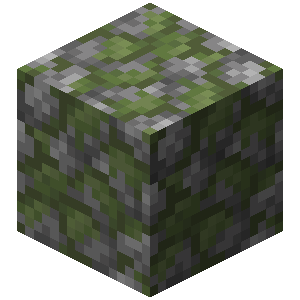<figcaption></figcaption></figure>

**Тип:** Действие\
**Текстовый идентификатор:** `entity_action`

***

## Использование

Поставьте блок в строку и нажмите <kbd>ПКМ</kbd> по нему, чтобы открыть меню опций блока. Перейдите в нужную категорию и выберите действие, которое необходимо выполнить.

При выборе действия, над его блоком может появиться хранилище (по умолчанию: сундук), в котором содержатся [аргументы](../arguments/) действия.

### Опции



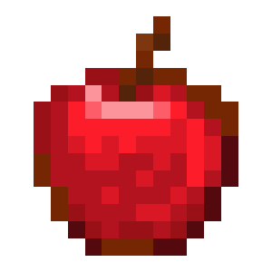 **Изменение параметров существа, такие как здоровье, эффекты, горение и другое.**

***

| Опция                                                                                                                                                                                                                    | Описание                                                                                                                                                                                                                                                                                                                                                                       | Аргументы                                                                                                                                                                                                                                                                                                                                                                                                                                                                                                                                                                                                                                                                                                                                                                                                                                                                                                                                                            |
| ------------------------------------------------------------------------------------------------------------------------------------------------------------------------------------------------------------------------ | ------------------------------------------------------------------------------------------------------------------------------------------------------------------------------------------------------------------------------------------------------------------------------------------------------------------------------------------------------------------------------ | -------------------------------------------------------------------------------------------------------------------------------------------------------------------------------------------------------------------------------------------------------------------------------------------------------------------------------------------------------------------------------------------------------------------------------------------------------------------------------------------------------------------------------------------------------------------------------------------------------------------------------------------------------------------------------------------------------------------------------------------------------------------------------------------------------------------------------------------------------------------------------------------------------------------------------------------------------------------- |
| 
 <strong>Исцелить существо</strong> <code>entity_heal</code>
                                                                             | Исцеляет существо.                                                                                                                                                                                                                                                                                                                                                             |  **Количество половинок сердец для излечения**                                                                                                                                                                                                                                                                                                                                                                                                                                                                                                                                                                                                                                                                                                                                                                                                                  |
| 
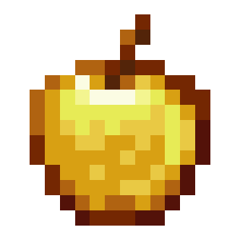 <strong>Установить здоровье существа</strong> <code>entity_set_current_health</code>
                                             | Устанавливает здоровье существа на выбранное количество.                                                                                                                                                                                                                                                                                                                       |  **Количество здоровья**                                                                                                                                                                                                                                                                                                                                                                                                                                                                                                                                                                                                                                                                                                                                                                                                                                        |
| 
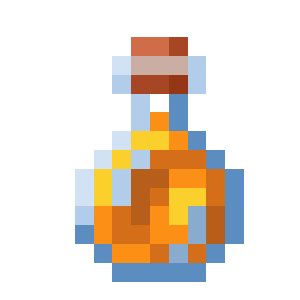 <strong>Установить дополнительное здоровье</strong> <code>entity_set_absorption_health</code>
                                    | Устанавливает дополнительное здоровье существа.                                                                                                                                                                                                                                                                                                                                |  **Количество дополнительного здоровья**                                                                                                                                                                                                                                                                                                                                                                                                                                                                                                                                                                                                                                                                                                                                                                                                                        |
| 
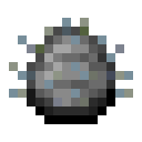 <strong>Установить максимальное здоровье существа</strong> <code>entity_set_max_health</code>
                            | Устанавливает максимальное количество здоровья для существа.                                                                                                                                                                                                                                                                                                                   | 
 <strong>Максимальное количество здоровья</strong>  <strong>Исцелить существо</strong> <a data-footnote-ref href="#user-content-fn-1"><strong><code>-></code></strong></a>
                                                                                                                                                                                                                                                                                                                                                                                                                                                                                                                                   |
| 
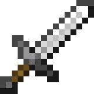 <strong>Нанести урон</strong> <code>entity_damage</code>
                                                                           | Наносит урон существу.                                                                                                                                                                                                                                                                                                                                                         | 
 <strong>Количество урона</strong>  <strong>Источник урона (имя или UUID существа)</strong>
                                                                                                                                                                                                                                                                                                                                                                                                                                                                                                                                                                                                                                        |
| 
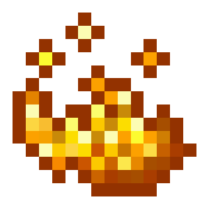 <strong>Поджечь существо</strong> <code>entity_set_fire_ticks</code>
                                                             | Поджигает существо на выбранное время.                                                                                                                                                                                                                                                                                                                                         |  **Длительность (в тиках)**                                                                                                                                                                                                                                                                                                                                                                                                                                                                                                                                                                                                                                                                                                                                                                                                                                     |
| 
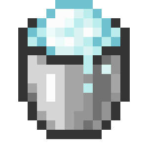 <strong>Установить время заморозки</strong> <code>entity_set_freeze_ticks</code>
                                           | Устанавливает существу время заморозки (количество тиков, которое сущность провела в рыхлом снегу).                                                                                                                                                                                                                                                                            | 
 <strong>Время заморозки в тиках</strong>  <strong>Блокировка состояния (время не будет изменяться)</strong> <a data-footnote-ref href="#user-content-fn-2"><strong><code>-></code></strong></a>
                                                                                                                                                                                                                                                                                                                                                                                                                                                                                                             |
| 
 <strong>Установить длительность неуязвимости</strong> <code>entity_set_invulnerability_ticks</code>
                            | Устанавливает длительность неуязвимости для существа.                                                                                                                                                                                                                                                                                                                          |  **Длительность неуязвимости (в тиках)**                                                                                                                                                                                                                                                                                                                                                                                                                                                                                                                                                                                                                                                                                                                                                                                                                        |
| 
 <strong>Установить максимальную длительность неуязвимости</strong> <code>entity_set_max_invulnerability_ticks</code>
 | Устанавливает максимальную длительность неуязвимости для существа.                                                                                                                                                                                                                                                                                                             |  **Длительность (в тиках)**                                                                                                                                                                                                                                                                                                                                                                                                                                                                                                                                                                                                                                                                                                                                                                                                                                     |
| 
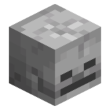 <strong>Установить длительность смерти</strong> <code>entity_set_death_time</code>
                                             | Устанавливает длительность смерти для существа.                                                                                                                                                                                                                                                                                                                                |  **Длительность смерти (в тиках)**                                                                                                                                                                                                                                                                                                                                                                                                                                                                                                                                                                                                                                                                                                                                                                                                                              |
| 
 <strong>Выдать эффекты</strong> <code>entity_give_potion_effects</code>
                                                         | Выдаёт выбранные эффекты существу.                                                                                                                                                                                                                                                                                                                                             | 
 <strong>Эффекты для выдачи</strong>  <strong>Перезаписывать существующие эффекты</strong> <a data-footnote-ref href="#user-content-fn-3"><strong><code>-></code></strong></a>  <strong>Показывать иконку эффекта</strong> <a data-footnote-ref href="#user-content-fn-4"><strong><code>-></code></strong></a>  <strong>Показывать частицы</strong> <a data-footnote-ref href="#user-content-fn-5"><strong><code>-></code></strong></a>
 |
| 
 <strong>Удалить эффект</strong> <code>entity_remove_potion_effect</code>
                                                         | Удаляет выбранные эффекты у существа.                                                                                                                                                                                                                                                                                                                                          |  **Эффекты для удаления**                                                                                                                                                                                                                                                                                                                                                                                                                                                                                                                                                                                                                                                                                                                                                                                                                                    |
| 
 <strong>Очистить эффекты</strong> <code>entity_celar_potion_effects</code>
                                                           | Очищает все эффекты у существа.                                                                                                                                                                                                                                                                                                                                                |                                                                                                                                                                                                                                                                                                                                                                                                                                                                                                                                                                                                                                                                                                                                                                                                                                                                                                                                                                      |
| 
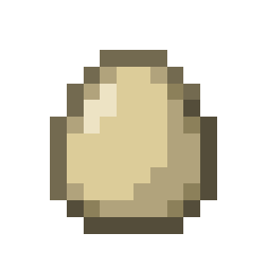 <strong>Установить возраст животному</strong> <code>entity_set_animal_age</code>
                                                          | Устанавливает возраст животному.                                                                                                                                                                                                                                                                                                                                               | 
 <strong>Возраст</strong>  <strong>Остановить взросление</strong> <a data-footnote-ref href="#user-content-fn-6"><strong><code>-></code></strong></a>
                                                                                                                                                                                                                                                                                                                                                                                                                                                                                                                                                        |
| 
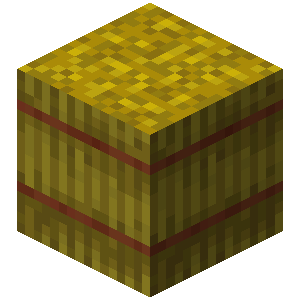 <strong>Установить дистанцию падения</strong> <code>entity_set_fall_distance</code>
                                                 | Устанавливает дистанцию, с которой падает существо.                                                                                                                                                                                                                                                                                                                            |  **Дистанция падения**                                                                                                                                                                                                                                                                                                                                                                                                                                                                                                                                                                                                                                                                                                                                                                                                                                          |
| 
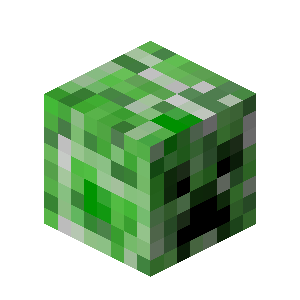 <strong>Установить максимальное время взрыва криперу</strong> <code>entity_set_creeper_fuse</code>
                               | 
Устанавливает максимальное время взрыва криперу.  Работает с: » Криперами
                                                                                                                                                                                                                                                                                      |  **Время до взрыва (в тиках)**                                                                                                                                                                                                                                                                                                                                                                                                                                                                                                                                                                                                                                                                                                                                                                                                                                  |
| 
 <strong>Установить силу взрыва</strong> <code>entity_set_explosive_power</code>
                                                           | 
Устанавливает силу взрыва сущности.  Работает с: » Криперами » Динамитом » Огненными шарами
                                                                                                                                                                                                                                                              |  **Сила взрыва**                                                                                                                                                                                                                                                                                                                                                                                                                                                                                                                                                                                                                                                                                                                                                                                                                                                |
| 
 <strong>Установить время до взрыва</strong> <code>entity_set_fuse_ticks</code>
                                                      | 
Устанавливает время до взрыва сущности.  Работает с: » Криперами » Динамитом » Фейерверками
                                                                                                                                                                                                                                                              |  **Время до взрыва (в тиках)**                                                                                                                                                                                                                                                                                                                                                                                                                                                                                                                                                                                                                                                                                                                                                                                                                                  |
| 
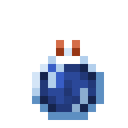 <strong>Установить радиус облака эффекта</strong> <code>entity_set_potion_cloud_radius</code>
                          | 
Устанавливает радиус облака эффекта и скорость его расширения.  Работает с: » Облаком эффекта
                                                                                                                                                                                                                                                                  | 
 <strong>Радиус</strong>  <strong>Скорость</strong>
                                                                                                                                                                                                                                                                                                                                                                                                                                                                                                                                                                                                                                                                        |
| 
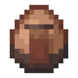 <strong>Установить опыт жителю</strong> <code>entity_set_villager_experience</code>
                                        | 
Устанавливает жителю количество опыта.  Работает с: » Жителями
                                                                                                                                                                                                                                                                                                 |  **Количество опыта**                                                                                                                                                                                                                                                                                                                                                                                                                                                                                                                                                                                                                                                                                                                                                                                                                                           |
| 
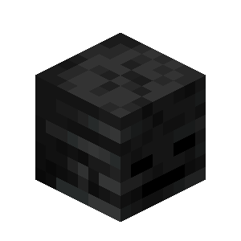 <strong>Установить неуязвимость иссушителю</strong> <code>entity_set_wither_invulnerability_ticks</code>
                | 
Устанавливает длительность неуязвимости иссушителю.  Работает с: » Иссушителем
                                                                                                                                                                                                                                                                                 |  **Длительность неуязвимости (в тиках)**                                                                                                                                                                                                                                                                                                                                                                                                                                                                                                                                                                                                                                                                                                                                                                                                                        |
| 
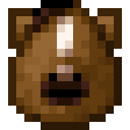 <strong>Установить лошади силу прыжка</strong> <code>entity_set_horse_jump</code>
                                             | 
Устанавливает лошади силу прыжка.  Работает с: » Лошадьми » Ослами » Мулами » Ламами
                                                                                                                                                                                                                                                                  |  **Сила прыжка**                                                                                                                                                                                                                                                                                                                                                                                                                                                                                                                                                                                                                                                                                                                                                                                                                                                |
| 
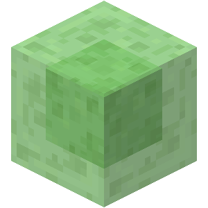 <strong>Установить задержку для поднятия</strong> <code>entity_set_pickup_delay</code>
                                            | 
Устанавливает количество тиков, за которое предмет не может быть поднят.  Работает с: » Предметами
                                                                                                                                                                                                                                                             |  **Задержка**                                                                                                                                                                                                                                                                                                                                                                                                                                                                                                                                                                                                                                                                                                                                                                                                                                                   |
| 
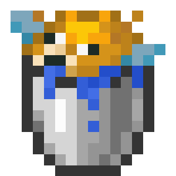 <strong>Установить задержку рыбалки</strong> <code>entity_set_fishing_wait</code>
                                           | 
Устанавливает задержку рыбалки существу в тиках.  Работает с: » Поплавком удочки
                                                                                                                                                                                                                                                                               | 
 <strong>Задержка</strong>  <strong>Тип задержки</strong> <a data-footnote-ref href="#user-content-fn-7"><strong><code>-></code></strong></a>
                                                                                                                                                                                                                                                                                                                                                                                                                                                                                                                                                                |
| 
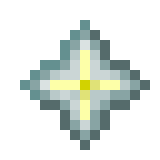 <strong>Получить значение атрибута сущности</strong> <code>entity_get_attribute</code>
                                            | Получает значение указанного атрибута сущности и присваивает результат к переменной.                                                                                                                                                                                                                                                                                           | 
 <strong>Переменная для присвоения</strong>  <strong>Тип атрибута <code>-></code></strong>  <strong>Тип значения</strong> <a data-footnote-ref href="#user-content-fn-8"><strong><code>-></code></strong></a>
                                                                                                                                                                                                                                                                                                                                                              |
| 
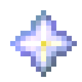 <strong>Установить атрибут</strong> <code>entity_set_attribute</code>
                                                             | Устанавливает указанный атрибут на указанное значение существу.                                                                                                                                                                                                                                                                                                                | 
 <strong>Значение атрибута</strong>  <strong>Тип атрибута</strong> <a data-footnote-ref href="#user-content-fn-9"><strong><code>-></code></strong></a>
                                                                                                                                                                                                                                                                                                                                                                                                                                                                                                                                                       |
| 
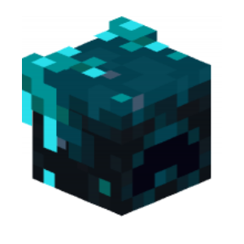 <strong>Установить уровень гнева Хранителя</strong> <code>entity_set_warden_anger_level</code>
                                    | 
Устанавливает определённый уровень гнева Хранителя на указанное существо.  Работает с: » Хранителями  » Если уровень гнева на сущность достигает 80, Хранитель начинает активно преследовать её.
                                                                                                                                                         | 
 <strong>Имя или UUID сущности</strong>  <strong>Уровень гнева (от 0 до 150)</strong>
                                                                                                                                                                                                                                                                                                                                                                                                                                                                                                                                                                                                                                              |
| 
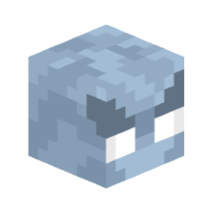 <strong>Установить время жизни Вредины</strong> <code>entity_set_vex_limited_lifetime_ticks</code>
                                   | 
Устанавливает время жизни Вредины в тиках.  Работает с: » Врединами
                                                                                                                                                                                                                                                                                            |  **Время жизни**                                                                                                                                                                                                                                                                                                                                                                                                                                                                                                                                                                                                                                                                                                                                                                                                                                                |
| 
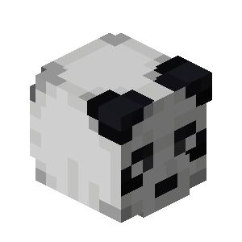 <strong>Установить время грусти Панды</strong> <code>entity_set_panda_sad_ticks</code>
                             | 
Устанавливает время грусти Панды в тиках.  Работает с: » Пандами
                                                                                                                                                                                                                                                                                               |  **Время грусти**                                                                                                                                                                                                                                                                                                                                                                                                                                                                                                                                                                                                                                                                                                                                                                                                                                               |
| 
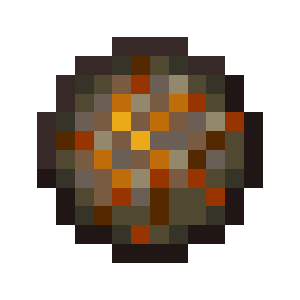 <strong>Установить снаряду вектор движения</strong> <code>entity_set_projectile_power</code>
                                      | 
Устанавливает снаряду вектор движения.  Работает с: » Огненными шарами » Зарядами дракона » Головами Иссушителя
                                                                                                                                                                                                                                          |  **Вектор движения**                                                                                                                                                                                                                                                                                                                                                                                                                                                                                                                                                                                                                                                                                                                                                                                                                                      |
| 
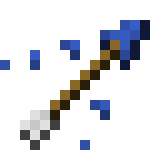 <strong>Установить стреле количество пронзаний</strong> <code>entity_set_arrow_pierce</code>
                               | Устанавливает стреле количество раз, которые она может пронзить сущность (от 0 до 127).                                                                                                                                                                                                                                                                                        |  **Количество пронзаний**                                                                                                                                                                                                                                                                                                                                                                                                                                                                                                                                                                                                                                                                                                                                                                                                                                       |
| 
 <strong>Установить первичный урон снаряду</strong> <code>entity_set_base_arrow_damage</code>
                                            | 
Устанавливает снаряду первичный урон, который будет использован в формуле урона снаряда при попадании.  Работает с: » Стрелами » Трезубцами  » Формула для стрел: <code>первичный_урон</code> * <code>скорость_снаряда</code> = <code>наносимый урон</code>  » Формула для трезубцев: <code>первичный_урон</code> = <code>наносимый урон</code>
 |  **Урон**                                                                                                                                                                                                                                                                                                                                                                                                                                                                                                                                                                                                                                                                                                                                                                                                                                                       |
| 
 <strong>Получить NBT-теги сущности</strong> <code>entity_get_nbt</code>
                                                               | Получает NBT-теги сущности по введённому пути и присваивает результат к переменной.                                                                                                                                                                                                                                                                                            | 
 <strong>Переменная для присвоения</strong>  <strong>Путь</strong>  <strong>Тип данных</strong> <a data-footnote-ref href="#user-content-fn-10"><strong><code>-></code></strong></a>
                                                                                                                                                                                                                                                                                                                                                                                                             |



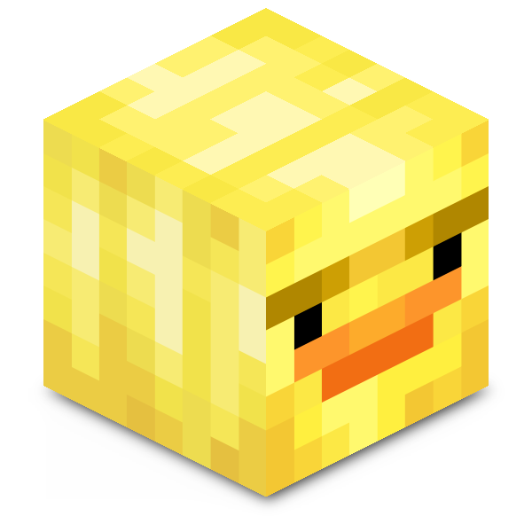 **Изменения внешнего вида существа.**

***

| Опция                                                                                                                                                                                          | Описание                                                                                                                                                                                                                                   | Аргументы                                                                                                                                                                                                                                                                                                                                                                                                                                                                                                                                                                                                                                                                                                                                             |
| ---------------------------------------------------------------------------------------------------------------------------------------------------------------------------------------------- | ------------------------------------------------------------------------------------------------------------------------------------------------------------------------------------------------------------------------------------------ | ----------------------------------------------------------------------------------------------------------------------------------------------------------------------------------------------------------------------------------------------------------------------------------------------------------------------------------------------------------------------------------------------------------------------------------------------------------------------------------------------------------------------------------------------------------------------------------------------------------------------------------------------------------------------------------------------------------------------------------------------------- |
| 
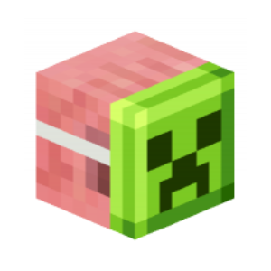 <strong>Замаскировать под сущность</strong> <code>entity_disguise_as_entity</code>
        | Замаскировать сущность под сущность.                                                                                                                                                                                                       |  **Сущность для маскировки**                                                                                                                                                                                                                                                                                                                                                                                                                                                                                                                                                                                                                       |
| 
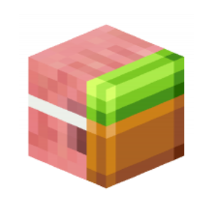 <strong>Замаскировать сущность под блок</strong> <code>entity_disguise_as_block</code>
     | Маскирует сущность под блок.                                                                                                                                                                                                               |  **Блок для маскировки**                                                                                                                                                                                                                                                                                                                                                                                                                                                                                                                                                                                                               |
| 
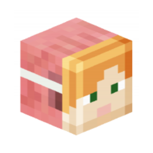 <strong>Замаскировать сущность под игрока</strong> <code>entity_disguise_as_player</code>
 | Маскирует сущность под игрока.                                                                                                                                                                                                             | 
 <strong>Имя или UUID</strong>  <strong>Отображаемое имя сущности</strong>  <strong>Тип сервера скинов</strong> <a data-footnote-ref href="#user-content-fn-11"><strong><code>-></code></strong></a>
                                                                                                                                                                                       |
| 
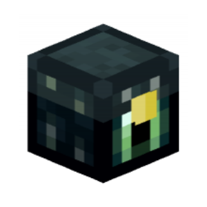 <strong>Замаскировать сущность под предмет</strong> <code>entity_disguise_as_item</code>
           | Маскирует сущность под предмет.                                                                                                                                                                                                            |  **Предмет для маскировки**                                                                                                                                                                                                                                                                                                                                                                                                                                                                                                                                                                                                                        |
| 
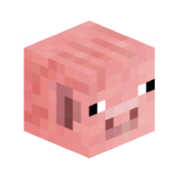 <strong>Убрать маскировку</strong> <code>entity_remove_disguise</code>
                       | Убирает маскировку у сущности.                                                                                                                                                                                                             |                                                                                                                                                                                                                                                                                                                                                                                                                                                                                                                                                                                                                                                                                                                                                       |
| 
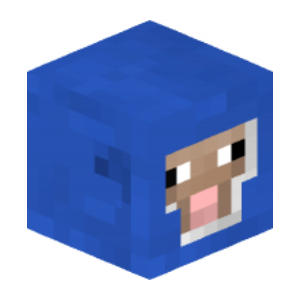 <strong>Установить цвет сущности</strong> <code>entity_set_dye_color</code>
                    | 
Устанавливает определённый цвет существу.  Работает с: » Овцами » Шалкерами » Ошейниками собак » Ошейниками котов
                                                                                                 |  **Цвет сущности** [**`->`**](#user-content-fn-12)[^12]                                                                                                                                                                                                                                                                                                                                                                                                                                                                                                                                                                            |
| 
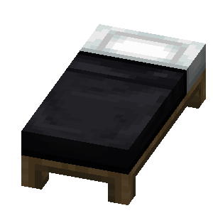 <strong>Установить позу сущности</strong> <code>entity_set_pose</code>
                                    | Устанавливает определённую позу существу.                                                                                                                                                                                                  |  **Отображаемая поза** [**`->`**](#user-content-fn-13)[^13]                                                                                                                                                                                                                                                                                                                                                                                                                                                                                                                                                                        |
| 
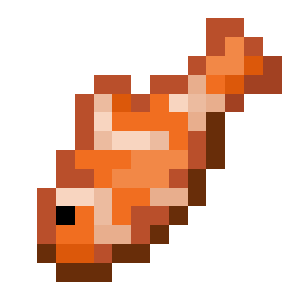 <strong>Установить узор рыбы</strong> <code>entity_set_tropical_fish_pattern</code>
                   | 
Устанавливает окрас и узор тропической рыбе.  Работает с: » Тропической рыбой
                                                                                                                                              | 
 <strong>Цвет узора</strong> <a data-footnote-ref href="#user-content-fn-14"><strong><code>-></code></strong></a>  <strong>Цвет тела</strong> <a data-footnote-ref href="#user-content-fn-15"><strong><code>-></code></strong></a>  <strong>Узор</strong> <a data-footnote-ref href="#user-content-fn-16"><strong><code>-></code></strong></a>
 |
| 
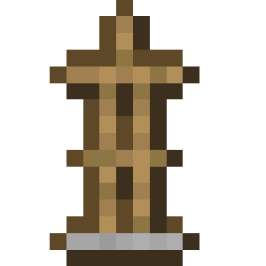 <strong>Установить позу стойки для брони</strong> <code>entity_set_armor_stand_pose</code>
              | 
Устанавливает позу стойки для брони.  Работает с: » Стойками для брони
                                                                                                                                                     | 
 <strong>Поворот по оси X</strong>  <strong>Поворот по оси Y</strong>  <strong>Поворот по оси Z</strong>  <strong>Часть стойки для изменения</strong> <a data-footnote-ref href="#user-content-fn-17"><strong><code>-></code></strong></a>
              |
| 
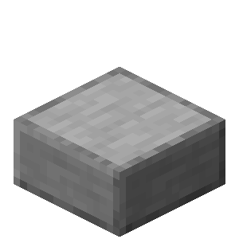 <strong>Установить детали стойки для брони</strong> <code>entity_set_armor_stand_parts</code>
     | 
Установить детали стойки для брони.  Работает с: » Стойками для брони
                                                                                                                                                      | 
 <strong>Видимость рук</strong> <a data-footnote-ref href="#user-content-fn-18"><strong><code>-></code></strong></a>  <strong>Видимость плиты</strong> <a data-footnote-ref href="#user-content-fn-19"><strong><code>-></code></strong></a>
                                                                                                                                                                                                                                     |
| 
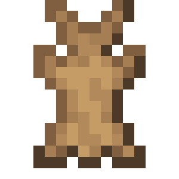 <strong>Установить тип кролика</strong> <code>entity_set_rabbit_type</code>
                             | 
Устанавливает тип кролика.  Работает с: » Кроликами
                                                                                                                                                                        |  **Тип кролика** [**`->`**](#user-content-fn-20)[^20]                                                                                                                                                                                                                                                                                                                                                                                                                                                                                                                                                                              |
| 
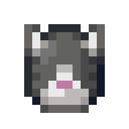 <strong>Установить тип кошки</strong> <code>entity_set_cat_type</code>
                                | 
Устанавливает тип кошки.  Работает с: » Кошками
                                                                                                                                                                            |  **Тип кошки** [**`->`**](#user-content-fn-21)[^21]                                                                                                                                                                                                                                                                                                                                                                                                                                                                                                                                                                                |
| 
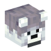 <strong>Установить тип волка</strong> <code>entity_set_wolf_type</code>
                        | 
Устанавливает тип волка.  Работает с: » Волками
                                                                                                                                                                            |  **Тип волка** [**`->`**](#user-content-fn-22)[^22]                                                                                                                                                                                                                                                                                                                                                                                                                                                                                                                                                                                |
| 
 <strong>Установить тип курицы</strong> <code>entity_set_chicken_type</code>
                             | 
Устанавливает курице тип окраски.  Работает с: » Курицами
                                                                                                                                                                  |  **Тип окраски** [**`->`**](#user-content-fn-23)[^23]                                                                                                                                                                                                                                                                                                                                                                                                                                                                                                                                                                              |
| 
 <strong>Установить тип коровы</strong> <code>entity_set_cow_type</code>
                                 | 
Устанавливает корове тип окраски.  Работает с: » Коровами
                                                                                                                                                                  |  **Тип окраски** [**`->`**](#user-content-fn-23)[^23]                                                                                                                                                                                                                                                                                                                                                                                                                                                                                                                                                                              |
| 
 <strong>Установить тип свиньи</strong> <code>entity_set_pig_type</code>
                                 | 
Устанавливает свинье тип окраски.  Работает с: » Свиньями
                                                                                                                                                                  |  **Тип окраски** [**`->`**](#user-content-fn-23)[^23]                                                                                                                                                                                                                                                                                                                                                                                                                                                                                                                                                                              |
| 
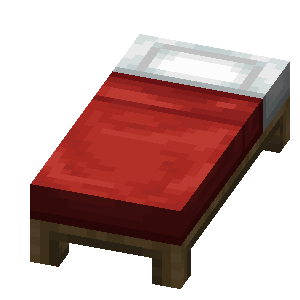 <strong>Установить режим лежания кошке</strong> <code>entity_set_cat_lying_down</code>
                      | 
Устанавливает режим лежания кошке.  Работает с: » Кошками
                                                                                                                                                                  |  **Режим лежания** [**`->`**](#user-content-fn-24)[^24]                                                                                                                                                                                                                                                                                                                                                                                                                                                                                                                                                                            |
| 
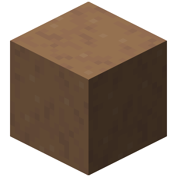 <strong>Установить тип грибной коровы</strong> <code>entity_set_mushroom_cow_type</code>
       | 
Устанавливает тип грибной коровы.  Работает с: » Грибными коровами
                                                                                                                                                         |  **Тип грибной коровы** [**`->`**](#user-content-fn-25)[^25]                                                                                                                                                                                                                                                                                                                                                                                                                                                                                                                                                                       |
| 
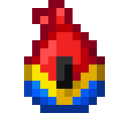 <strong>Установить тип попугая</strong> <code>entity_set_parrot_type</code>
                        | 
Устанавливает тип попугая.  Работает с: » Попугаями
                                                                                                                                                                        |  **Тип попугая** [**`->`**](#user-content-fn-26)[^26]                                                                                                                                                                                                                                                                                                                                                                                                                                                                                                                                                                              |
| 
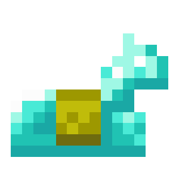 <strong>Установить узор лошади</strong> <code>entity_set_horse_pattern</code>
                   | 
Устанавливает окрас и узор лошади.  Работает с: » Лошадьми
                                                                                                                                                                 | 
 <strong>Цвет лошади</strong> <a data-footnote-ref href="#user-content-fn-27"><strong><code>-></code></strong></a>  <strong>Узор лошади</strong> <a data-footnote-ref href="#user-content-fn-28"><strong><code>-></code></strong></a>
                                                                                                                                                                                                                                           |
| 
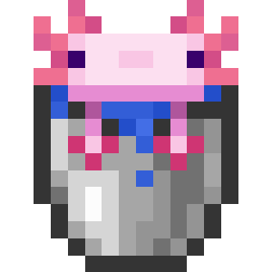 <strong>Установить тип аксолотля</strong> <code>entity_set_axolotl_type</code>
                       | 
Устанавливает тип аксолотля.  Работает с: » Аксолотлями
                                                                                                                                                                    |  **Тип аксолотля** [**`->`**](#user-content-fn-29)[^29]                                                                                                                                                                                                                                                                                                                                                                                                                                                                                                                                                                            |
| 
 <strong>Установить предмет снаряда</strong> <code>entity_set_projectile_display_item</code>
             | 
Устанавливает видимый предмет снаряду.  Работает с: » Снежками » Яйцами » Огненными шарами » Огненными шарами Гаста » Эндер-жемчугами » Пузырьками опыта » Очами Края » Брошенными зельями
            |  **Предмет для установки**                                                                                                                                                                                                                                                                                                                                                                                                                                                                                                                                                                                                                         |
| 
 <strong>Установить предмет в рамку</strong> <code>entity_set_item_in_frame</code>
                        | 
Устанавливает указанный предмет в рамку.  Работает с: » Рамками
                                                                                                                                                            | 
 <strong>Предмет</strong>  <strong>Проиграть звук</strong> <a data-footnote-ref href="#user-content-fn-30"><strong><code>-></code></strong></a>
                                                                                                                                                                                                                                                                                                                                                 |
| 
 <strong>Установить блок в вагонетку</strong> <code>entity_set_minecart_block</code>
                        | 
Устанавливает указанный блок в вагонетку.  Работает с: » Вагонетками
                                                                                                                                                       | 
 <strong>Блок для установки</strong>  <strong>Сдвиг в блоках</strong>
                                                                                                                                                                                                                                                                                                                                                                                                                             |
| 
 <strong>Замаскировать зажжённый динамит под блок</strong> <code>entity_set_primed_tnt_block</code>
              | 
Маскирует зажжённый динамит под указанный блок.  Работает с: » Зажжённым динамитом
                                                                                                                                         |  **Блок**                                                                                                                                                                                                                                                                                                                                                                                                                                                                                                                                                                                                                              |
| 
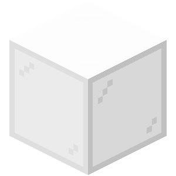 <strong>Установить свечение сущности</strong> <code>entity_set_glowing</code>
                   | Устанавливает существу эффект свечения.                                                                                                                                                                                                    |  **Свечение** [**`->`**](#user-content-fn-31)[^31]                                                                                                                                                                                                                                                                                                                                                                                                                                                                                                                                                                                 |
| 
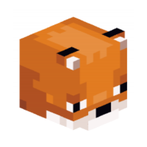 <strong>Установить тип лисы</strong> <code>entity_set_fox_type</code>
                                      | 
Устанавливает тип лисы.  Работает с: » Лисами
                                                                                                                                                                              |  **Тип лисы** [**`->`**](#user-content-fn-32)[^32]                                                                                                                                                                                                                                                                                                                                                                                                                                                                                                                                                                                 |
| 
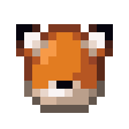 <strong>Установить анимацию прыжка лисе</strong> <code>entity_set_fox_leaping</code>
                  | 
Устанавливает анимацию прыжка лисе.  Работает с: » Лисами
                                                                                                                                                                  |  **Анимация прыжка** [**`->`**](#user-content-fn-33)[^33]                                                                                                                                                                                                                                                                                                                                                                                                                                                                                                                                                                          |
| 
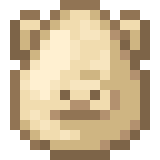 <strong>Установить цвет ламы</strong> <code>entity_set_llama_type</code>
                            | 
Устанавливает цвет ламы.  Работает с: » Ламами
                                                                                                                                                                             |  **Цвет для установки** [**`->`**](#user-content-fn-34)[^34]                                                                                                                                                                                                                                                                                                                                                                                                                                                                                                                                                                       |
| 
 <strong>Установить биом жителю</strong> <code>entity_set_villager_biome</code>
                              | 
Устанавливает жителю окрас в зависимости от выбранного биома.  Работает с: » Жителями
                                                                                                                                      |  **Биом** [**`->`**](#user-content-fn-35)[^35]                                                                                                                                                                                                                                                                                                                                                                                                                                                                                                                                                                                     |
| 
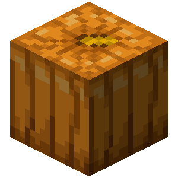 <strong>Установить тыкву снеговику</strong> <code>entity_set_snowman_pumpkin</code>
                         | 
Устанавливает видимость тыквы снеговику.  Работает с: » Снежными големами
                                                                                                                                                  |  **Видимость тыквы** [**`->`**](#user-content-fn-36)[^36]                                                                                                                                                                                                                                                                                                                                                                                                                                                                                                                                                                          |
| 
 <strong>Установить блок Эндермену</strong> <code>entity_set_enderman_block</code>
                       | 
Устанавливает отображаемый блок Эндермену.  Работает с: » Эндерменами
                                                                                                                                                      |  **Отображаемый блок**                                                                                                                                                                                                                                                                                                                                                                                                                                                                                                                                                                                                                 |
| 
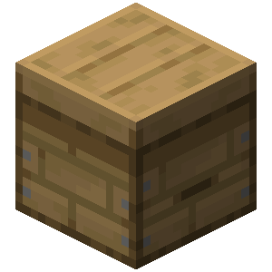 <strong>Установить пыльцу пчеле</strong> <code>entity_set_bee_nectar</code>
                                 | 
Устанавливает видимость пыльцы пчеле.  Работает с: » Пчёлами
                                                                                                                                                               |  **Видимость пыльцы** [**`->`**](#user-content-fn-37)[^37]                                                                                                                                                                                                                                                                                                                                                                                                                                                                                                                                                                         |
| 
 <strong>Установить время тьмы спруту</strong> <code>entity_set_glow_squid_dark</code>
                  | 
Устанавливает время тьмы в тиках светящемуся спруту.  Работает с: » Светящимися спрутами
                                                                                                                                   |  **Время тьмы (в тиках)**                                                                                                                                                                                                                                                                                                                                                                                                                                                                                                                                                                                                                        |
| 
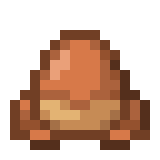 <strong>Установить тип жабы</strong> <code>entity_set_frog_type</code>
                               | 
Устанавливает окрас жабы.  Работает с: » Жабами
                                                                                                                                                                            |  **Тип жабы** [**`->`**](#user-content-fn-38)[^38]                                                                                                                                                                                                                                                                                                                                                                                                                                                                                                                                                                                 |
| 
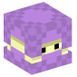 <strong>Установить процент открытия шалкера</strong> <code>entity_set_shulker_peek</code>
   | 
Устанавливает шалкеру процент, на который он открыт.  Работает с: » Шалкерами
                                                                                                                                              | 
 <strong>Процент открытия</strong>  <strong>Звук от изменения открытости</strong> <a data-footnote-ref href="#user-content-fn-39"><strong><code>-></code></strong></a>
                                                                                                                                                                                                                                                                                                                        |
| 
 <strong>Установить агрессивность</strong> <code>entity_set_mob_aggressive</code>
          | 
Устанавливает агрессивность сущности.  Работает с: » Утопленниками » Пиглинами » Скелетами » Зомби » Зомби-жителями » Иллюзорами » Поборниками » Пандами » Разбойниками » Брутальными пиглинами
 |  **Агрессивность** [**`->`**](#user-content-fn-40)[^40]                                                                                                                                                                                                                                                                                                                                                                                                                                                                                                                                                                            |
| 
 <strong>Отображать огонь</strong> <code>entity_set_visual_fire</code>
                                      | Отображает огонь на существе.                                                                                                                                                                                                              |  **Отображение огня** [**`->`**](#user-content-fn-41)[^41]                                                                                                                                                                                                                                                                                                                                                                                                                                                                                                                                                                         |
| 
 <strong>Отобразить анимацию урона</strong> <code>entity_play_damage_animation</code>
                     | Отображает анимацию урона существу.                                                                                                                                                                                                        |  **Тип урона** [**`->`**](#user-content-fn-42)[^42]                                                                                                                                                                                                                                                                                                                                                                                                                                                                                                                                                                                |
| 
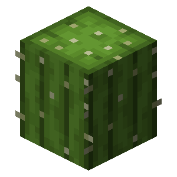 <strong>Отобразить анимацию получения урона</strong> <code>entity_play_hurt_animation</code>
                 | Отображает существу анимацию получения урона с определённым наклоном.                                                                                                                                                                      |  **Угол получения урона (0-360)**                                                                                                                                                                                                                                                                                                                                                                                                                                                                                                                                                                                                                |
| 
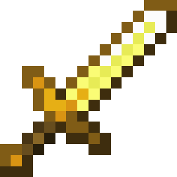 <strong>Проиграть анимацию взмаха руки</strong> <code>entity_swing_hand</code>
                         | Проигрывает для сущности анимацию взмаха руки.                                                                                                                                                                                             |  **Тип руки** [**`->`**](#user-content-fn-43)[^43]                                                                                                                                                                                                                                                                                                                                                                                                                                                                                                                                                                                 |



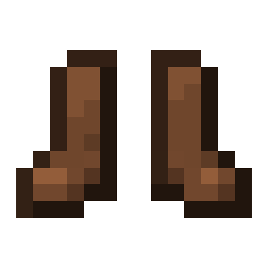 **Запуск, телепортация и другие взаимодействия, связанные с перемещением сущности.**

***

| Опция                                                                                                                                                                                 | Описание                                                                          | Аргументы                                                                                                                                                                                                                                                                                                                                                                                                                                                                                                                                                                                                                                                                         |
| ------------------------------------------------------------------------------------------------------------------------------------------------------------------------------------- | --------------------------------------------------------------------------------- | --------------------------------------------------------------------------------------------------------------------------------------------------------------------------------------------------------------------------------------------------------------------------------------------------------------------------------------------------------------------------------------------------------------------------------------------------------------------------------------------------------------------------------------------------------------------------------------------------------------------------------------------------------------------------------- |
| 
 <strong>Телепортация</strong> <code>entity_teleport</code>
                                     | Телепортирует существо в выбранное местоположение.                                | 
 <strong>Новая позиция</strong>  <strong>Оставить текущий поворот</strong> <a data-footnote-ref href="#user-content-fn-44"><strong><code>-></code></strong></a>
                                                                                                                                                                                                                                                                |
| 
 <strong>Подбросить вверх</strong> <code>entity_launch_up</code>
                                | Подбрасывает существо вверх или вниз в зависимости от силы.                       | 
 <strong>Сила подбрасывания</strong>  <strong>Учитывать текущую инерцию</strong> <a data-footnote-ref href="#user-content-fn-45"><strong><code>-></code></strong></a>
                                                                                                                                                                                                                                                     |
| 
 <strong>Запустить вперёд</strong> <code>entity_launch_forward</code>
                                | Запускает существо вперёд или назад по направлению взгляда в зависимости от силы. | 
 <strong>Сила подбрасывания</strong>  <strong>Учитывать текущую инерцию</strong> <a data-footnote-ref href="#user-content-fn-45"><strong><code>-></code></strong></a>  <strong>Ось запуска</strong> <a data-footnote-ref href="#user-content-fn-46"><strong><code>-></code></strong></a>
 |
| 
 <strong>Запустить к местоположению</strong> <code>entity_launch_to_location</code>
           | Запускает существо к выбранному местоположению.                                   | 
 <strong>Конечная позиция</strong>  <strong>Сила запуска</strong>  <strong>Учитывать текущую инерцию</strong> <a data-footnote-ref href="#user-content-fn-45"><strong><code>-></code></strong></a>
                                                                                                          |
| 
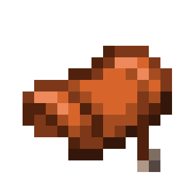 <strong>Посадить на существо</strong> <code>entity_ride_entity</code>
                               | Сажает существо на другое существо или игрока.                                    |  **Имя или UUID цели**                                                                                                                                                                                                                                                                                                                                                                                                                                                                                                                                                               |
| 
 <strong>Высадить из транспорта</strong> <code>entity_leave_vehicle</code>
                     | Высаживает существо из транспорта или существа.                                   |                                                                                                                                                                                                                                                                                                                                                                                                                                                                                                                                                                                                                                                                                   |
| 
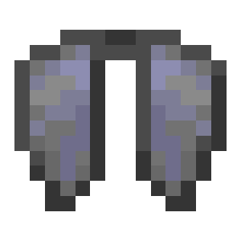 <strong>Установить полёт на элитрах</strong> <code>entity_set_gliding</code>
                        | Устанавливает для существа состояние полёта на элитрах.                           |  **Полёт на элитрах** [**`->`**](#user-content-fn-47)[^47]                                                                                                                                                                                                                                                                                                                                                                                                                                                                                                     |
| 
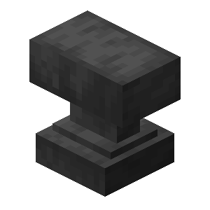 <strong>Установить гравитацию</strong> <code>entity_set_gravity</code>
                               | Устанавливает, будет ли сущность подчиняться гравитации.                          |  **Гравитация** [**`->`**](#user-content-fn-48)[^48]                                                                                                                                                                                                                                                                                                                                                                                                                                                                                                           |
| 
 <strong>Установить поворот</strong> <code>entity_set_rotation</code>
                      | Устанавливает поворот сущности.                                                   | 
 <strong>Горизонтальный поворот (yaw)</strong>  <strong>Вертикальный поворот (pitch)</strong>
                                                                                                                                                                                                                                                                                                                                           |
| 
 <strong>Установить поворот по вектору</strong> <code>entity_set_rotation_by_vector</code>
 | Устанавливает поворот сущности по вектору.                                        |  **Вектор для поворота**                                                                                                                                                                                                                                                                                                                                                                                                                                                                                                                                               |
| 
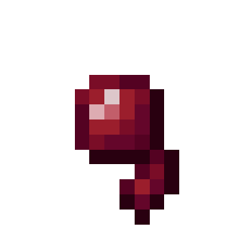 <strong>Повернуть к местоположению</strong> <code>entity_face_location</code>
                   | Поворачивает существо в сторону к местоположению.                                 |  **Местоположение**                                                                                                                                                                                                                                                                                                                                                                                                                                                                                                                                                               |
| 
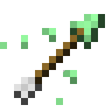 <strong>Запустить по вектору</strong> <code>entity_set_location</code>
                     | Запускает существо по указанному вектору.                                         | 
 <strong>Вектор движения</strong>  <strong>Учитывать текущую инерцию</strong> <a data-footnote-ref href="#user-content-fn-45"><strong><code>-></code></strong></a>
                                                                                                                                                                                                                                                  |
| 
 <strong>Привязать на поводок</strong> <code>entity_attach_lead</code>
                                 | Привязывает существо на поводок к забору или существу.                            | 
 <strong>Имя существа или UUID</strong>  <strong>Местоположение забора</strong>
                                                                                                                                                                                                                                                                                                                                                                      |
| 
 <strong>Установить трение</strong> <code>entity_set_friction</code>
                                    | Устанавливает, будет ли сущность испытывать трение.                               |  **Испытывать трение** [**`->`**](#user-content-fn-49)[^49]                                                                                                                                                                                                                                                                                                                                                                                                                                                                                                    |



 **Базовые настройки сущности, такие как установки имени, неуязвимости и другое.**

***

| Опция                                                                                                                                                                                                 | Описание                                                                                                                                                                                                                                                         | Аргументы                                                                                                                                                                                                                                                                                                                                                                                                                                                                                                                                                                                                                                                                                                                                                                                                                                                                                                                                                                                                                                                                                                                                                                                                                                                                                                                                                                                                                                                                                                                                                                                                                                                                                                                                                                                                                                                                                                                                                                                                                                                                                                                                                                                                                                                                                                                                       |
| ----------------------------------------------------------------------------------------------------------------------------------------------------------------------------------------------------- | ---------------------------------------------------------------------------------------------------------------------------------------------------------------------------------------------------------------------------------------------------------------- | ----------------------------------------------------------------------------------------------------------------------------------------------------------------------------------------------------------------------------------------------------------------------------------------------------------------------------------------------------------------------------------------------------------------------------------------------------------------------------------------------------------------------------------------------------------------------------------------------------------------------------------------------------------------------------------------------------------------------------------------------------------------------------------------------------------------------------------------------------------------------------------------------------------------------------------------------------------------------------------------------------------------------------------------------------------------------------------------------------------------------------------------------------------------------------------------------------------------------------------------------------------------------------------------------------------------------------------------------------------------------------------------------------------------------------------------------------------------------------------------------------------------------------------------------------------------------------------------------------------------------------------------------------------------------------------------------------------------------------------------------------------------------------------------------------------------------------------------------------------------------------------------------------------------------------------------------------------------------------------------------------------------------------------------------------------------------------------------------------------------------------------------------------------------------------------------------------------------------------------------------------------------------------------------------------------------------------------------------- |
| 
 <strong>Установить имя</strong> <code>entity_set_custom_name</code>
                                               | Устанавливает имя существа.                                                                                                                                                                                                                                      |  **Имя существа**                                                                                                                                                                                                                                                                                                                                                                                                                                                                                                                                                                                                                                                                                                                                                                                                                                                                                                                                                                                                                                                                                                                                                                                                                                                                                                                                                                                                                                                                                                                                                                                                                                                                                                                                                                                                                                                                                                                                                                                                                                                                                                                                                                                                                                  |
| 
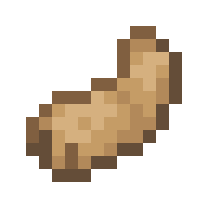 <strong>Установить видимость имени</strong> <code>entity_set_custom_name_visibility</code>
                     | Устанавливает видимость имени существа.                                                                                                                                                                                                                          |  **Видимость имени** [**`->`**](#user-content-fn-50)[^50]                                                                                                                                                                                                                                                                                                                                                                                                                                                                                                                                                                                                                                                                                                                                                                                                                                                                                                                                                                                                                                                                                                                                                                                                                                                                                                                                                                                                                                                                                                                                                                                                                                                                                                                                                                                                                                                                                                                                                                                                                                                                                                                                                                    |
| 
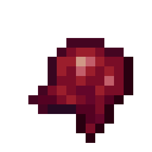 <strong>Установить интеллект сущности</strong> <code>entity_set_ai</code>
                             | Устанавливает интеллект сущности.                                                                                                                                                                                                                                |  **Интеллект** [**`->`**](#user-content-fn-51)[^51]                                                                                                                                                                                                                                                                                                                                                                                                                                                                                                                                                                                                                                                                                                                                                                                                                                                                                                                                                                                                                                                                                                                                                                                                                                                                                                                                                                                                                                                                                                                                                                                                                                                                                                                                                                                                                                                                                                                                                                                                                                                                                                                                                                          |
| 
 <strong>Заглушить сущность</strong> <code>entity_set_silenced</code>
                                         | Убирает звуки сущности.                                                                                                                                                                                                                                          |  **Заглушение** [**`->`**](#user-content-fn-52)[^52]                                                                                                                                                                                                                                                                                                                                                                                                                                                                                                                                                                                                                                                                                                                                                                                                                                                                                                                                                                                                                                                                                                                                                                                                                                                                                                                                                                                                                                                                                                                                                                                                                                                                                                                                                                                                                                                                                                                                                                                                                                                                                                                                                                         |
| 
 <strong>Установить видимость</strong> <code>entity_set_default_visible</code>
                                 | 
Устанавливает сущности видимость.  » Видимость сущности может быть изменена через действие <a href="player_action.md#mir"> <strong>Скрыть сущность игроку</strong></a>.
 |  **Видимость** [**`->`**](#user-content-fn-53)[^53]                                                                                                                                                                                                                                                                                                                                                                                                                                                                                                                                                                                                                                                                                                                                                                                                                                                                                                                                                                                                                                                                                                                                                                                                                                                                                                                                                                                                                                                                                                                                                                                                                                                                                                                                                                                                                                                                                                                                                                                                                                                                                                                                                                          |
| 
 <strong>Установить выпадение предметов</strong> <code>entity_set_death_drops</code>
                         | Устанавливает, будет ли выпадать лут с существа.                                                                                                                                                                                                                 |  **Выпадение предметов** [**`->`**](#user-content-fn-54)[^54]                                                                                                                                                                                                                                                                                                                                                                                                                                                                                                                                                                                                                                                                                                                                                                                                                                                                                                                                                                                                                                                                                                                                                                                                                                                                                                                                                                                                                                                                                                                                                                                                                                                                                                                                                                                                                                                                                                                                                                                                                                                                                                                                                                |
| 
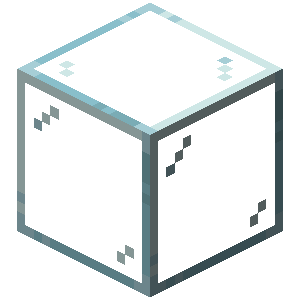 <strong>Установить режим столкновения</strong> <code>entity_set_collidable</code>
                                    | Устанавливает существу режим столкновения с другими существами.                                                                                                                                                                                                  |  **Режим столкновения** [**`->`**](#user-content-fn-55)[^55]                                                                                                                                                                                                                                                                                                                                                                                                                                                                                                                                                                                                                                                                                                                                                                                                                                                                                                                                                                                                                                                                                                                                                                                                                                                                                                                                                                                                                                                                                                                                                                                                                                                                                                                                                                                                                                                                                                                                                                                                                                                                                                                                                                 |
| 
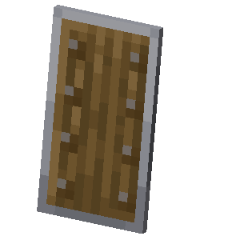 <strong>Установить неуязвимость сущности</strong> <code>entity_set_invulnerable</code>
                              | Устанавливает неуязвимость сущности, но в режиме креатива можно нанести урон.                                                                                                                                                                                    |  **Неуязвимость** [**`->`**](#user-content-fn-56)[^56]                                                                                                                                                                                                                                                                                                                                                                                                                                                                                                                                                                                                                                                                                                                                                                                                                                                                                                                                                                                                                                                                                                                                                                                                                                                                                                                                                                                                                                                                                                                                                                                                                                                                                                                                                                                                                                                                                                                                                                                                                                                                                                                                                                       |
| 
 <strong>Установить физику для сущности</strong> <code>entity_set_no_physics</code>
                                   | Устанавливает существу физику.                                                                                                                                                                                                                                   |  **Физика** [**`->`**](#user-content-fn-57)[^57]                                                                                                                                                                                                                                                                                                                                                                                                                                                                                                                                                                                                                                                                                                                                                                                                                                                                                                                                                                                                                                                                                                                                                                                                                                                                                                                                                                                                                                                                                                                                                                                                                                                                                                                                                                                                                                                                                                                                                                                                                                                                                                                                                                             |
| 
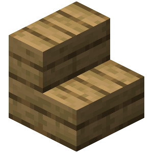 <strong>Установить режим сидения</strong> <code>entity_set_sitting</code>
                                       | 
Устанавливает существу режим сидения.  Работает с: » Волками » Кошками » Попугаями » Лисами » Пандами
                                                                                                                                |  **Режим сидения** [**`->`**](#user-content-fn-58)[^58]                                                                                                                                                                                                                                                                                                                                                                                                                                                                                                                                                                                                                                                                                                                                                                                                                                                                                                                                                                                                                                                                                                                                                                                                                                                                                                                                                                                                                                                                                                                                                                                                                                                                                                                                                                                                                                                                                                                                                                                                                                                                                                                                                                      |
| 
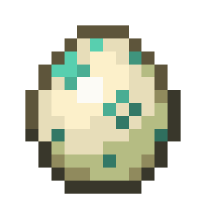 <strong>Установить режим ребёнка</strong> <code>entity_set_baby</code>
                                          | Устанавливает существу режим ребёнка.                                                                                                                                                                                                                            |  **Режим ребёнка** [**`->`**](#user-content-fn-59)[^59]                                                                                                                                                                                                                                                                                                                                                                                                                                                                                                                                                                                                                                                                                                                                                                                                                                                                                                                                                                                                                                                                                                                                                                                                                                                                                                                                                                                                                                                                                                                                                                                                                                                                                                                                                                                                                                                                                                                                                                                                                                                                                                                                                                      |
| 
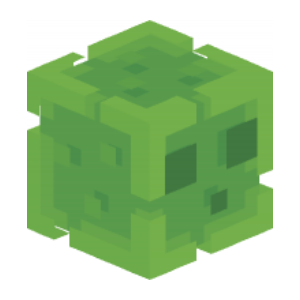 <strong>Установить размер существа</strong> <code>entity_set_size</code>
                                        | 
Устанавливает размер существу.  Работает с: » Слизнями » Фантомами
                                                                                                                                                                            |  **Размер**                                                                                                                                                                                                                                                                                                                                                                                                                                                                                                                                                                                                                                                                                                                                                                                                                                                                                                                                                                                                                                                                                                                                                                                                                                                                                                                                                                                                                                                                                                                                                                                                                                                                                                                                                                                                                                                                                                                                                                                                                                                                                                                                                                                                                                |
| 
 <strong>Установить видимость седла</strong> <code>entity_set_wearing_saddle</code>
                                  | 
Устанавливает существу седло.  Работает с: » Свиньями » Лошадьми » Лавомерками
                                                                                                                                                             |  **Наличие седла** [**`->`**](#user-content-fn-60)[^60]                                                                                                                                                                                                                                                                                                                                                                                                                                                                                                                                                                                                                                                                                                                                                                                                                                                                                                                                                                                                                                                                                                                                                                                                                                                                                                                                                                                                                                                                                                                                                                                                                                                                                                                                                                                                                                                                                                                                                                                                                                                                                                                                                                      |
| 
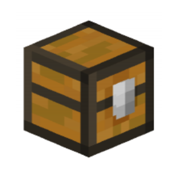 <strong>Установить видимость сундука</strong> <code>entity_set_carrying_chest</code>
                            | 
Устанавливает видимость сундука на сущности.  Работает с: » Ослами » Мулами » Ламами
                                                                                                                                                       |  **Наличие сундука** [**`->`**](#user-content-fn-61)[^61]                                                                                                                                                                                                                                                                                                                                                                                                                                                                                                                                                                                                                                                                                                                                                                                                                                                                                                                                                                                                                                                                                                                                                                                                                                                                                                                                                                                                                                                                                                                                                                                                                                                                                                                                                                                                                                                                                                                                                                                                                                                                                                                                                                    |
| 
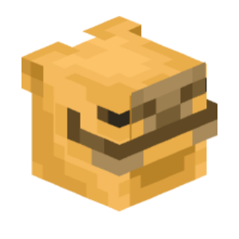 <strong>Установить анимацию рывка верблюду</strong> <code>entity_set_camel_dashing</code>
         | 
Устанавливает анимацию рывка верблюду.  Работает с: » Верблюдами
                                                                                                                                                                                 |  **Анимация рывка** [**`->`**](#user-content-fn-62)[^62]                                                                                                                                                                                                                                                                                                                                                                                                                                                                                                                                                                                                                                                                                                                                                                                                                                                                                                                                                                                                                                                                                                                                                                                                                                                                                                                                                                                                                                                                                                                                                                                                                                                                                                                                                                                                                                                                                                                                                                                                                                                                                                                                                                     |
| 
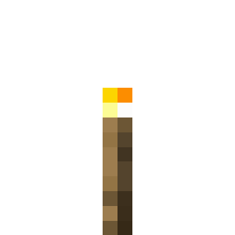 <strong>Установить режим маркера</strong> <code>entity_set_marker</code>
                                             | 
Устанавливает режим маркера стойке для брони.  Работает с: » Стойками для брони
                                                                                                                                                                  |  **Режим маркера** [**`->`**](#user-content-fn-63)[^63]                                                                                                                                                                                                                                                                                                                                                                                                                                                                                                                                                                                                                                                                                                                                                                                                                                                                                                                                                                                                                                                                                                                                                                                                                                                                                                                                                                                                                                                                                                                                                                                                                                                                                                                                                                                                                                                                                                                                                                                                                                                                                                                                                                      |
| 
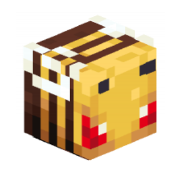 <strong>Установить режим гнева</strong> <code>entity_set_angry</code>
                                       | 
Устанавливает существу режим гнева на определённую цель.  Работает с: » Пчёлами » Волками » Зомбифицированными пиглинами » Эндерменами » Мобами  » Для корректной работы сущности необходима цель.
                             | 
 <strong>Режим гнева</strong> <a data-footnote-ref href="#user-content-fn-64"><strong><code>-></code></strong></a>  <strong>Имя цели</strong>
                                                                                                                                                                                                                                                                                                                                                                                                                                                                                                                                                                                                                                                                                                                                                                                                                                                                                                                                                                                                                                                                                                                                                                                                                                                                                                                                                                                                                                                                                                                                                                                                                                                                                                                                                                                                                                                                                                                                                   |
| 
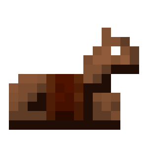 <strong>Установить позу лошади</strong> <code>entity_set_rearing</code>
                                | 
Устанавливает, будет ли лошадь стоять на задних ногах.  Работает с: » Лошадьми
                                                                                                                                                                   |  **Поза лошади** [**`->`**](#user-content-fn-65)[^65]                                                                                                                                                                                                                                                                                                                                                                                                                                                                                                                                                                                                                                                                                                                                                                                                                                                                                                                                                                                                                                                                                                                                                                                                                                                                                                                                                                                                                                                                                                                                                                                                                                                                                                                                                                                                                                                                                                                                                                                                                                                                                                                                                                        |
| 
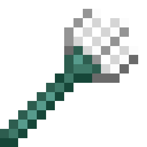 <strong>Установить анимацию Тягун</strong> <code>entity_set_riptiding</code>
                                       | Устанавливает существу анимацию использования зачарования трезубца Тягун.                                                                                                                                                                                        |  **Анимация Тягун** [**`->`**](#user-content-fn-66)[^66]                                                                                                                                                                                                                                                                                                                                                                                                                                                                                                                                                                                                                                                                                                                                                                                                                                                                                                                                                                                                                                                                                                                                                                                                                                                                                                                                                                                                                                                                                                                                                                                                                                                                                                                                                                                                                                                                                                                                                                                                                                                                                                                                                                     |
| 
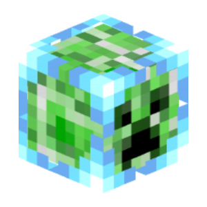 <strong>Установить заряженность криперу</strong> <code>entity_set_creeper_charge</code>
          | 
Устанавливает, будет ли крипер заряженным.  Работает с: » Криперами
                                                                                                                                                                              |  **Заряженность крипера** [**`->`**](#user-content-fn-67)[^67]                                                                                                                                                                                                                                                                                                                                                                                                                                                                                                                                                                                                                                                                                                                                                                                                                                                                                                                                                                                                                                                                                                                                                                                                                                                                                                                                                                                                                                                                                                                                                                                                                                                                                                                                                                                                                                                                                                                                                                                                                                                                                                                                                               |
| 
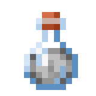 <strong>Установить режим невидимости</strong> <code>entity_set_invisible</code>
                     | Устанавливает существу режим невидимости.                                                                                                                                                                                                                        |  **Режим невидимости** [**`->`**](#user-content-fn-68)[^68]                                                                                                                                                                                                                                                                                                                                                                                                                                                                                                                                                                                                                                                                                                                                                                                                                                                                                                                                                                                                                                                                                                                                                                                                                                                                                                                                                                                                                                                                                                                                                                                                                                                                                                                                                                                                                                                                                                                                                                                                                                                                                                                                                                  |
| 
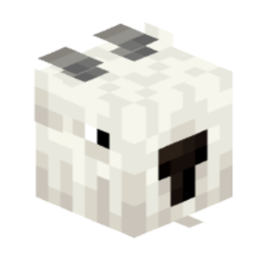 <strong>Установить козла кричащим</strong> <code>entity_set_goat_screaming</code>
                                | 
Устанавливает тег "кричащий" козлу.  Работает с: » Козлами
                                                                                                                                                                                       |  **Тег "Кричащий"** [**`->`**](#user-content-fn-69)[^69]                                                                                                                                                                                                                                                                                                                                                                                                                                                                                                                                                                                                                                                                                                                                                                                                                                                                                                                                                                                                                                                                                                                                                                                                                                                                                                                                                                                                                                                                                                                                                                                                                                                                                                                                                                                                                                                                                                                                                                                                                                                                                                                                                                     |
| 
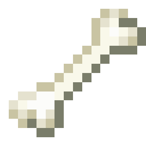 <strong>Приручить существо</strong> <code>entity_set_tame</code>
                                                      | 
Устанавливает привязанность существа к указанному хозяину.  Работает с: » Волками » Кошками » Лошадьми » Мулами » Ламами » Попугаями
                                                                                              |  **Имя или UUID хозяина**                                                                                                                                                                                                                                                                                                                                                                                                                                                                                                                                                                                                                                                                                                                                                                                                                                                                                                                                                                                                                                                                                                                                                                                                                                                                                                                                                                                                                                                                                                                                                                                                                                                                                                                                                                                                                                                                                                                                                                                                                                                                                                                                                                                                                          |
| 
 <strong>Установить владельца предмета</strong> <code>entity_set_item_owner</code>
                          | 
Устанавливает сущности предмета владельца.  Работает с: » Предметами
                                                                                                                                                                             |  **Имя или UUID владельца**                                                                                                                                                                                                                                                                                                                                                                                                                                                                                                                                                                                                                                                                                                                                                                                                                                                                                                                                                                                                                                                                                                                                                                                                                                                                                                                                                                                                                                                                                                                                                                                                                                                                                                                                                                                                                                                                                                                                                                                                                                                                                                                                                                                                                        |
| 
 <strong>Указать луч кристалла Энда</strong> <code>entity_set_end_crystal_beam</code>
           | 
Указывает луч кристалла Энда на определённое местоположение.  Работает с: » Кристаллами Энда
                                                                                                                                                     |  **Местоположение для указания**                                                                                                                                                                                                                                                                                                                                                                                                                                                                                                                                                                                                                                                                                                                                                                                                                                                                                                                                                                                                                                                                                                                                                                                                                                                                                                                                                                                                                                                                                                                                                                                                                                                                                                                                                                                                                                                                                                                                                                                                                                                                                                                                                                                                                |
| 
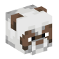 <strong>Установить ген панды</strong> <code>entity_set_panda_gene</code>
                                  | 
Устанавливает ген панды. Это влияет на их поведение и внешний вид.  Работает с: » Пандами
                                                                                                                                                        | 
 <strong>Ген</strong> <a data-footnote-ref href="#user-content-fn-70"><strong><code>-></code></strong></a>  <strong>Тип гена</strong> <a data-footnote-ref href="#user-content-fn-71"><strong><code>-></code></strong></a>
                                                                                                                                                                                                                                                                                                                                                                                                                                                                                                                                                                                                                                                                                                                                                                                                                                                                                                                                                                                                                                                                                                                                                                                                                                                                                                                                                                                                                                                                                                                                                                                                                                                                                                                                                                                                                                                |
| 
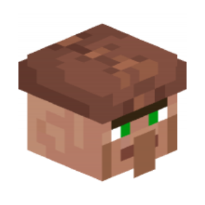 <strong>Установить профессию жителю</strong> <code>entity_set_villager_profession</code>
    | 
Устанавливает определённую профессию жителю.  Работает с: » Жителями » Зомби-жителями
                                                                                                                                                         |  **Профессия жителя** [**`->`**](#user-content-fn-72)[^72]                                                                                                                                                                                                                                                                                                                                                                                                                                                                                                                                                                                                                                                                                                                                                                                                                                                                                                                                                                                                                                                                                                                                                                                                                                                                                                                                                                                                                                                                                                                                                                                                                                                                                                                                                                                                                                                                                                                                                                                                                                                                                                                                                                   |
| 
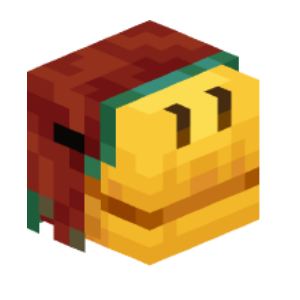 <strong>Установить состояние нюхача</strong> <code>entity_set_sniffer_state</code>
                            | 
Устанавливает определённое состояние нюхачу.  Работает с: » Нюхачами
                                                                                                                                                                             |  **Состояние нюхача** [**`->`**](#user-content-fn-73)[^73]                                                                                                                                                                                                                                                                                                                                                                                                                                                                                                                                                                                                                                                                                                                                                                                                                                                                                                                                                                                                                                                                                                                                                                                                                                                                                                                                                                                                                                                                                                                                                                                                                                                                                                                                                                                                                                                                                                                                                                                                                                                                                                                                                                   |
| 
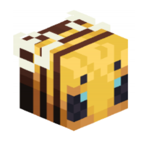 <strong>Установить Пчеле жало</strong> <code>entity_set_bee_has_stinger</code>
                                    | 
Устанавливает состояние жала пчеле.  Работает: » Пчёлами
                                                                                                                                                                                         |  **Состояние жала** [**`->`**](#user-content-fn-74)[^74]                                                                                                                                                                                                                                                                                                                                                                                                                                                                                                                                                                                                                                                                                                                                                                                                                                                                                                                                                                                                                                                                                                                                                                                                                                                                                                                                                                                                                                                                                                                                                                                                                                                                                                                                                                                                                                                                                                                                                                                                                                                                                                                                                                     |
| 
 <strong>Посадить панду</strong> <code>entity_set_panda_on_back</code>
                                   | 
Устанавливает Панде состояние сидения.  Работает с: » Пандами
                                                                                                                                                                                    |  **Состояние сидения** [**`->`**](#user-content-fn-75)[^75]                                                                                                                                                                                                                                                                                                                                                                                                                                                                                                                                                                                                                                                                                                                                                                                                                                                                                                                                                                                                                                                                                                                                                                                                                                                                                                                                                                                                                                                                                                                                                                                                                                                                                                                                                                                                                                                                                                                                                                                                                                                                                                                                                                  |
| 
 <strong>Установить звук Волка</strong> <code>entity_set_wolf_sound</code>
                                      | 
Устанавливает тип издаваемых звуков волку.  Работает с: » Волками
                                                                                                                                                                                |  **Тип издаваемых звуков** [**`->`**](#user-content-fn-76)[^76]                                                                                                                                                                                                                                                                                                                                                                                                                                                                                                                                                                                                                                                                                                                                                                                                                                                                                                                                                                                                                                                                                                                                                                                                                                                                                                                                                                                                                                                                                                                                                                                                                                                                                                                                                                                                                                                                                                                                                                                                                                                                                                                                                              |
| 
 <strong>Установить стрелка снаряду</strong> <code>entity_set_projectile_shooter</code>
                               | Устанавливает указанное существо как стрелка для снаряда.                                                                                                                                                                                                        |  **Имя или UUID стрелка**                                                                                                                                                                                                                                                                                                                                                                                                                                                                                                                                                                                                                                                                                                                                                                                                                                                                                                                                                                                                                                                                                                                                                                                                                                                                                                                                                                                                                                                                                                                                                                                                                                                                                                                                                                                                                                                                                                                                                                                                                                                                                                                                                                                                                          |
| 
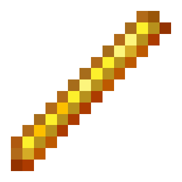 <strong>Установить исчезание существа</strong> <code>entity_set_persistence</code>
                               | 
Устанавливает, будет ли предмет или падающий блок исчезать.  Работает с: » Предметами » Падающими блоками
                                                                                                                                     |  **Исчезание существа** [**`->`**](#user-content-fn-77)[^77]                                                                                                                                                                                                                                                                                                                                                                                                                                                                                                                                                                                                                                                                                                                                                                                                                                                                                                                                                                                                                                                                                                                                                                                                                                                                                                                                                                                                                                                                                                                                                                                                                                                                                                                                                                                                                                                                                                                                                                                                                                                                                                                                                                 |
| 
 <strong>Установить пропадание существа</strong> <code>entity_set_despawning</code>
                                 | Устанавливает, будет ли пропадать существо.                                                                                                                                                                                                                      |  **Пропадание существа** [**`->`**](#user-content-fn-78)[^78]                                                                                                                                                                                                                                                                                                                                                                                                                                                                                                                                                                                                                                                                                                                                                                                                                                                                                                                                                                                                                                                                                                                                                                                                                                                                                                                                                                                                                                                                                                                                                                                                                                                                                                                                                                                                                                                                                                                                                                                                                                                                                                                                                                |
| 
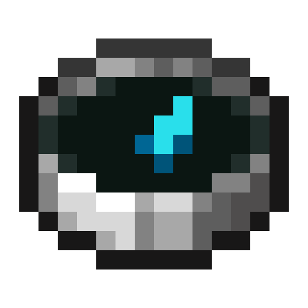 <strong>Установить сущности сохранение</strong> <code>entity_set_persistent</code>
                        | Устанавливает сущности состояние, будет ли она сохранена после отгрузки мира.                                                                                                                                                                                    |  **Сохранение сущности** [**`->`**](#user-content-fn-79)[^79]                                                                                                                                                                                                                                                                                                                                                                                                                                                                                                                                                                                                                                                                                                                                                                                                                                                                                                                                                                                                                                                                                                                                                                                                                                                                                                                                                                                                                                                                                                                                                                                                                                                                                                                                                                                                                                                                                                                                                                                                                                                                                                                                                                |
| 
 <strong>Установить товар Жителю</strong> <code>entity_set_merchant_recipe</code>
                                   | 
Устанавливает товар Жителю за определённые предметы по указанному индексу.  Работает с: » Жителями » Странствующими торговцами
                                                                                                                | 
 <strong>Покупаемый товар</strong>  <strong>Первый предмет</strong>  <strong>Второй предмет</strong>  <strong>Индекс товара</strong>  <strong>Режим установки</strong> <a data-footnote-ref href="#user-content-fn-80"><strong><code>-></code></strong></a>  <strong>Количество использований</strong>  <strong>Максимальное количество использований</strong>  <strong>Опыт для Жителя</strong>  <strong>Множитель цены</strong>  <strong>Спрос товара</strong>  <strong>Особая цена</strong>  <strong>Игнорирование скидок</strong> <a data-footnote-ref href="#user-content-fn-81"><strong><code>-></code></strong></a>  <strong>Награда опытом</strong> <a data-footnote-ref href="#user-content-fn-82"><strong><code>-></code></strong></a>
 |
| 
 <strong>Удалить товар Жителю</strong> <code>entity_remove_merchant_recipe</code>
                                  | 
Удаляет товар Жителю по указанному индексу.  Работает с: » Жителями » Странствующими торговцами
                                                                                                                                               |  **Индекс товара**                                                                                                                                                                                                                                                                                                                                                                                                                                                                                                                                                                                                                                                                                                                                                                                                                                                                                                                                                                                                                                                                                                                                                                                                                                                                                                                                                                                                                                                                                                                                                                                                                                                                                                                                                                                                                                                                                                                                                                                                                                                                                                                                                                                                                         |
| 
 <strong>Очистить торги Жителю</strong> <code>entity_clear_merchant_recipes</code>
                           | 
Очищает все торги Жителю.  Работает с: » Жителями » Странствующими торговцами
                                                                                                                                                                 |                                                                                                                                                                                                                                                                                                                                                                                                                                                                                                                                                                                                                                                                                                                                                                                                                                                                                                                                                                                                                                                                                                                                                                                                                                                                                                                                                                                                                                                                                                                                                                                                                                                                                                                                                                                                                                                                                                                                                                                                                                                                                                                                                                                                                                                                                                                                                 |
| 
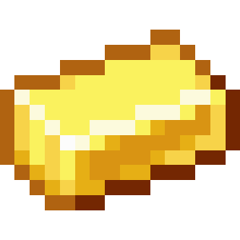 <strong>Изменить торги пиглина</strong> <code>entity_modify_piglin_barter_materials</code>
                      | 
Изменяет предметы, которые может дать пиглин при обмене.  Работает с: » Пиглинами  » Нельзя изменить предметы, которые пиглин продаёт по умолчанию.
                                                                                        | 
 <strong>Предметы для изменения</strong>  <strong>Режим изменения</strong> <a data-footnote-ref href="#user-content-fn-83"><strong><code>-></code></strong></a>
                                                                                                                                                                                                                                                                                                                                                                                                                                                                                                                                                                                                                                                                                                                                                                                                                                                                                                                                                                                                                                                                                                                                                                                                                                                                                                                                                                                                                                                                                                                                                                                                                                                                                                                                                                                                                                                                                                                           |
| 
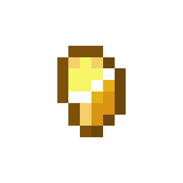 <strong>Изменить предметы для торга с пиглином</strong> <code>entity_modify_piglin_interested_materials</code>
 | 
Изменяет предметы, требуемые для обмена с пиглином.  Работает с: » Пиглинами  » Нельзя изменить предметы, которые пиглин требует по умолчанию.
                                                                                             | 
 <strong>Предметы для изменения</strong>  <strong>Режим изменения</strong> <a data-footnote-ref href="#user-content-fn-84"><strong><code>-></code></strong></a>
                                                                                                                                                                                                                                                                                                                                                                                                                                                                                                                                                                                                                                                                                                                                                                                                                                                                                                                                                                                                                                                                                                                                                                                                                                                                                                                                                                                                                                                                                                                                                                                                                                                                                                                                                                                                                                                                                                                           |
| 
 <strong>Установить размер сущности взаимодействия</strong> <code>entity_set_interaction_size</code>
    | 
Устанавливает горизонтальный и вертикальный размеры сущности взаимодействия.  Работает с: » Сущностями взаимодействия
                                                                                                                            | 
 <strong>Горизонтальный размер</strong>  <strong>Вертикальный размер</strong>
                                                                                                                                                                                                                                                                                                                                                                                                                                                                                                                                                                                                                                                                                                                                                                                                                                                                                                                                                                                                                                                                                                                                                                                                                                                                                                                                                                                                                                                                                                                                                                                                                                                                                                                                                                                                                                                                                                                                                                                                                         |
| 
 <strong>Установить отзывчивость сущности взаимодействия</strong> <code>entity_set_interaction_responsive</code>
 | 
Устанавливает, будет ли сущность взаимодействия отзываться на взаимодействия.  Работает с: » Сущностями взаимодействия
                                                                                                                           |  **Отзывчивость** [**`->`**](#user-content-fn-85)[^85]                                                                                                                                                                                                                                                                                                                                                                                                                                                                                                                                                                                                                                                                                                                                                                                                                                                                                                                                                                                                                                                                                                                                                                                                                                                                                                                                                                                                                                                                                                                                                                                                                                                                                                                                                                                                                                                                                                                                                                                                                                                                                                                                                                       |
| 
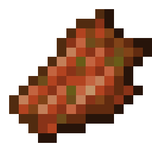 <strong>Установить иммунитет к зомбифицированию</strong> <code>entity_set_immune_to_zombification</code>
      | 
Устанавливает существу иммунитет к зомбифицированию.  Работает с: » Пиглинами » Брутальными пиглинами » Хоглинами
                                                                                                                          |  **Иммунитет к зомбифицированию** [**`->`**](#user-content-fn-86)[^86]                                                                                                                                                                                                                                                                                                                                                                                                                                                                                                                                                                                                                                                                                                                                                                                                                                                                                                                                                                                                                                                                                                                                                                                                                                                                                                                                                                                                                                                                                                                                                                                                                                                                                                                                                                                                                                                                                                                                                                                                                                                                                                                                                       |
| 
 <strong>Установить возможность подбора</strong> <code>entity_set_pickup</code>
                                     | 
Устанавливает сущности возможность подбора.  Работает с: » Сущностями предметов
                                                                                                                                                                  | 
 <strong>Подбор мобами</strong> <a data-footnote-ref href="#user-content-fn-87"><strong><code>-></code></strong></a>  <strong>Подбор игроками</strong> <a data-footnote-ref href="#user-content-fn-88"><strong><code>-></code></strong></a>
                                                                                                                                                                                                                                                                                                                                                                                                                                                                                                                                                                                                                                                                                                                                                                                                                                                                                                                                                                                                                                                                                                                                                                                                                                                                                                                                                                                                                                                                                                                                                                                                                                                                                                                                                                                                                               |



 **Установка различных целей существа.**

***

| Опция                                                                                                                                                                                                      | Описание                                                                                                                                                                                                                                                                                        | Аргументы                                                                                                                                                                                                                                                                                                                                                                                                                                                                                                  |
| ---------------------------------------------------------------------------------------------------------------------------------------------------------------------------------------------------------- | ----------------------------------------------------------------------------------------------------------------------------------------------------------------------------------------------------------------------------------------------------------------------------------------------- | ---------------------------------------------------------------------------------------------------------------------------------------------------------------------------------------------------------------------------------------------------------------------------------------------------------------------------------------------------------------------------------------------------------------------------------------------------------------------------------------------------------- |
| 
 <strong>Установить режим празднования</strong> <code>entity_set_celebrating</code>
                                         | 
Устанавливает режим празднования существу.  Работает с: » Пиглинами » Рейдерами
                                                                                                                                                                                              |  **Режим празднования** [**`->`**](#user-content-fn-89)[^89]                                                                                                                                                                                                                                                                                                                            |
| 
 <strong>Установить цель существу</strong> <code>entity_set_target</code>
                                         | 
Инструктирует ИИ существа нацеливаться на определённое существо.  Работает с: » Мобами  » Оставьте пустой слот в поле <a href="../arguments/text.md"> <strong>Текст</strong></a>, чтобы убрать цель.
 |  **Имя или UUID цели**                                                                                                                                                                                                                                                                                                                                                                                        |
| 
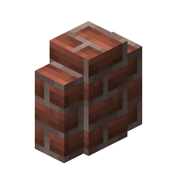 <strong>Установить осведомлённость моба</strong> <code>entity_set_aware</code>
                                       | 
В выключенном состоянии отключает ИИ моба, но оставляет взаимодействие с гравитацией, толканием и т.д.  Работает с: » Мобами
                                                                                                                                                    |  **Осведомлённость** [**`->`**](#user-content-fn-90)[^90]                                                                                                                                                                                                                                                                                                                               |
| 
 <strong>Установить движение к местоположению</strong> <code>entity_move_to_location</code>
                        | 
Инструктирует ИИ существа всегда находить путь к определённому местоположению с определённой скоростью.  Работает с: » Мобами
                                                                                                                                                   | 
 <strong>Конечное местоположение</strong>  <strong>Скорость передвижения</strong>
                                                                                                                                                                                     |
| 
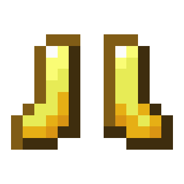 <strong>Остановить движение к местоположению</strong> <code>entity_move_to_location_stop</code>
                    | 
Останавливает сущность, идущую к местоположению.  Работает с: » Мобами
                                                                                                                                                                                                          |                                                                                                                                                                                                                                                                                                                                                                                                                                                                                                            |
| 
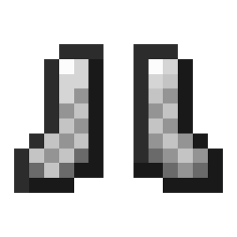 <strong>Прыгнуть</strong> <code>entity_jump</code>
                                                              | 
Заставляет существо прыгнуть.  Работает с: » Мобами
                                                                                                                                                                                                                             |                                                                                                                                                                                                                                                                                                                                                                                                                                                                                                            |
| 
 <strong>Таранить сущность</strong> <code>entity_ram_target</code>
                                                     | 
Заставляет козлов таранить указанную сущность.  Работает с: » Козлами
                                                                                                                                                                                                           |  **Имя или UUID сущности**                                                                                                                                                                                                                                                                                                                                                                                    |
| 
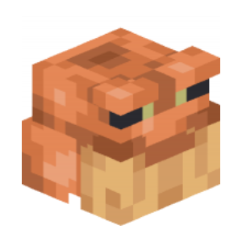 <strong>Установить цель поедания</strong> <code>entity_eat_target</code>
                                              | 
Устанавливает существу цель для поедания.  Работает с: » Жабами
                                                                                                                                                                                                                 |  **Имя или UUID цели**                                                                                                                                                                                                                                                                                                                                                                                        |
| 
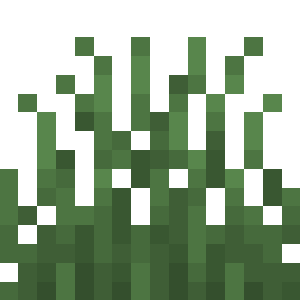 <strong>Есть траву</strong> <code>entity_eat_grass</code>
                                                           | 
Заставляет овцу есть траву.  Работает с: » Овцами
                                                                                                                                                                                                                               |                                                                                                                                                                                                                                                                                                                                                                                                                                                                                                            |
| 
 <strong>Зажечь крипера</strong> <code>entity_ignite_creeper</code>
                                        | 
Поджигает крипера, заставляя его взорваться после определённого периода.  Работает с: » Криперами
                                                                                                                                                                               |                                                                                                                                                                                                                                                                                                                                                                                                                                                                                                            |
| 
 <strong>Взорваться</strong> <code>entity_explode</code>
                                                                     | 
Заставляет существо взорваться.  Работает с: » Криперами » Динамитом » Фейерверками
                                                                                                                                                                                       |                                                                                                                                                                                                                                                                                                                                                                                                                                                                                                            |
| 
 <strong>Установить анимацию сна</strong> <code>entity_sleep</code>
                                                     | 
Устанавливает существу анимацию сна. Лучше всего использовать это действие в цикле.  Работает с: » Лисами
                                                                                                                                                                       |  **Режим сна** [**`->`**](#user-content-fn-91)[^91]                                                                                                                                                                                                                                                                                                                                     |
| 
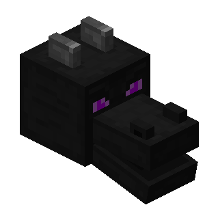 <strong>Установить фазу Эндер-дракона</strong> <code>entity_set_dragon_phase</code>
                                 | 
Устанавливает определённую фазу Эндер-дракону.  Работает с: » Эндер-драконами
                                                                                                                                                                                                   |  **Фаза Эндер-дракона** [**`->`**](#user-content-fn-92)[^92]                                                                                                                                                                                                                                                                                                                            |
| 
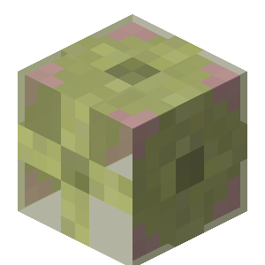 <strong>Установить цель снаряду Шалкера</strong> <code>entity_set_shulker_bullet_target</code>
 | 
Устанавливает цель атаки снаряду Шалкера.  Работает с: » Снарядами Шалкера
                                                                                                                                                                                                      |  **Имя или UUID цели**                                                                                                                                                                                                                                                                                                                                                                                        |
| 
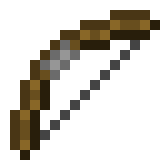 <strong>Использовать предмет</strong> <code>entity_use_item</code>
                                                          | 
Инструктирует ИИ существа на использование предмета в его руке.  Работает с: » Мобами
                                                                                                                                                                                           | 
 <strong>Тип руки</strong> <a data-footnote-ref href="#user-content-fn-93"><strong><code>-></code></strong></a>  <strong>Использование</strong> <a data-footnote-ref href="#user-content-fn-94"><strong><code>-></code></strong></a>
 |
| 
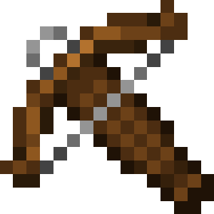 <strong>Установить состояние зарядки арбалета</strong> <code>entity_set_piglin_charging_crossbow</code>
                | 
Устанавливает пиглину состояние зарядки арбалета.  Работает с: » Пиглинами
                                                                                                                                                                                                      |  **Состояние зарядки** [**`->`**](#user-content-fn-95)[^95]                                                                                                                                                                                                                                                                                                                             |
| 
 <strong>Установить состояние охоты</strong> <code>entity_set_piglin_able_to_hunt</code>
                              | 
Устанавливает пиглину состояние охоты на хоглинов.  Работает с: » Пиглинами
                                                                                                                                                                                                     |  **Состояние охоты** [**`->`**](#user-content-fn-96)[^96]                                                                                                                                                                                                                                                                                                                               |
| 
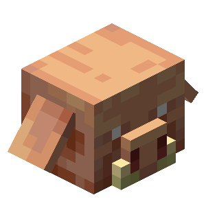 <strong>Установить стадию танца</strong> <code>entity_set_piglin_dancing</code>
                                     | 
Устанавливает пиглину стадию танца на указанное время.  Работает с: » Пиглинами  » Если значение продолжительности меньше <code>0</code>, то танец будет длиться бесконечно.
                                                                                              |  **Продолжительность танца (в тиках)**                                                                                                                                                                                                                                                                                                                                                                |
| 
 <strong>Сделать Тихоню танцующим</strong> <code>entity_set_allay_dancing</code>
                                      | 
Заставляет Тихоню отображать анимацию танца.  Работает с: » Тихонями
                                                                                                                                                                                                            |  **Анимация танца** [**`->`**](#user-content-fn-97)[^97]                                                                                                                                                                                                                                                                                                                                        |
| 
 <strong>Установить Вредине злость</strong> <code>entity_set_vex_charging</code>
                                        | 
Устанавливает Вредине стадию злости.  Работает с: » Врединами
                                                                                                                                                                                                                   |  **Стадия злости** [**`->`**](#user-content-fn-98)[^98]                                                                                                                                                                                                                                                                                                                                 |
| 
 <strong>Установить Панде состояние переката</strong> <code>entity_set_panda_rolling</code>
                           | 
Устанавливает Панде состояние переката.  Работает с: » Пандами
                                                                                                                                                                                                                  |  **Состояние переката** [**`->`**](#user-content-fn-99)[^99]                                                                                                                                                                                                                                                                                                                            |



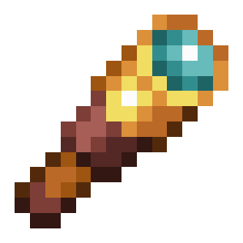 **Различные настройки, связанные с сущностями-визуализаторами.**

***

| Опция                                                                                                                                                                                                      | Описание                                                                                                                                               | Аргументы                                                                                                                                                                                                                                                                                                                                                                                                                                                                                                                                                                                                                                                                                                                                                                                                                                                                                                                                                                                                                                                                                                                                                                                                                                                     |
| ---------------------------------------------------------------------------------------------------------------------------------------------------------------------------------------------------------- | ------------------------------------------------------------------------------------------------------------------------------------------------------ | ------------------------------------------------------------------------------------------------------------------------------------------------------------------------------------------------------------------------------------------------------------------------------------------------------------------------------------------------------------------------------------------------------------------------------------------------------------------------------------------------------------------------------------------------------------------------------------------------------------------------------------------------------------------------------------------------------------------------------------------------------------------------------------------------------------------------------------------------------------------------------------------------------------------------------------------------------------------------------------------------------------------------------------------------------------------------------------------------------------------------------------------------------------------------------------------------------------------------------------------------------------- |
| 
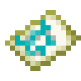 <strong>Установить дальность видимости</strong> <code>entity_set_display_view_range</code>
                      | 
Устанавливает дальность видимости сущности-визуализатору.  Работает с: » Любой сущностью-визуализатором
                                |  **Дальность видимости**                                                                                                                                                                                                                                                                                                                                                                                                                                                                                                                                                                                                                                                                                                                                                                                                                                                                                                                                                                                                                                                                                                                                 |
| 
 <strong>Установить режим отображения</strong> <code>entity_set_display_billboard</code>
                               | 
Устанавливает режим отображения сущности-визуализатору.  Работает с: » Любой сущностью-визуализатором
                                  |  **Режим отображения** [**`->`**](#user-content-fn-100)[^100]                                                                                                                                                                                                                                                                                                                                                                                                                                                                                                                                                                                                                                                                                                                                                                                                                                                                                                                                                                                                                                                                              |
| 
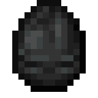 <strong>Установить настройки тени</strong> <code>entity_set_display_shadow</code>
                     | 
Устанавливает размер и прозрачность тени сущности-визуализатору.  Работает с: » Любой сущностью-визуализатором
                         | 
 <strong>Радиус тени</strong>  <strong>Процент непрозрачности</strong>
                                                                                                                                                                                                                                                                                                                                                                                                                                                                                                                                                                                                                                                                                                                                                                                                                                                                                                                                              |
| 
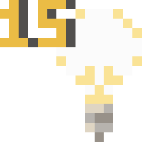 <strong>Установить яркость</strong> <code>entity_set_display_brightness</code>
                                         | 
Устанавливает яркость сущности-визуализатору.  Работает с: » Любой сущностью-визуализатором
                                            | 
 <strong>Уровень света от блоков</strong>  <strong>Уровень света от неба</strong>
                                                                                                                                                                                                                                                                                                                                                                                                                                                                                                                                                                                                                                                                                                                                                                                                                                                                                                                                   |
| 
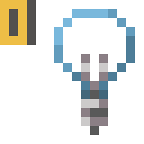 <strong>Сбросить яркость</strong> <code>entity_reset_display_brightness</code>
                                          | 
Сбросить яркость сущности-визуализатору.  Работает с: » Любой сущностью-визуализатором
                                                 |                                                                                                                                                                                                                                                                                                                                                                                                                                                                                                                                                                                                                                                                                                                                                                                                                                                                                                                                                                                                                                                                                                                                                                                                                                                               |
| 
 <strong>Установить интерполяцию</strong> <code>entity_set_display_interpolation</code>
                                 | 
Устанавливает длительность интерполяции сущности-визуализатору.  Работает с: » Любой сущностью-визуализатором
                          | 
 <strong>Длительность интерполяции</strong>  <strong>Задержка перед интерполяцией</strong>
                                                                                                                                                                                                                                                                                                                                                                                                                                                                                                                                                                                                                                                                                                                                                                                                                                                                                                                          |
| 
 <strong>Установить длительность телепорта визуализатора</strong> <code>entity_set_display_teleport_duration</code>
  | 
Устанавливает длительность телепорта визуализатора.  Работает с: » Любой сущностью-визуализатором
                                      |  **Длительность телепорта**                                                                                                                                                                                                                                                                                                                                                                                                                                                                                                                                                                                                                                                                                                                                                                                                                                                                                                                                                                                                                                                                                                                              |
| 
 <strong>Установить размер области видимости</strong> <code>entity_set_display_culling_suze</code>
                         | 
Устанавливает размер области видимости модели сущности-визуализатору.  Работает с: » Любой сущностью-визуализатором
                    | 
 <strong>Горизонтальный размер</strong>  <strong>Вертикальный размер</strong>
                                                                                                                                                                                                                                                                                                                                                                                                                                                                                                                                                                                                                                                                                                                                                                                                                                                                                                                                       |
| 
 <strong>Установить отображаемый текст</strong> <code>entity_set_text_display_text</code>
                                   | 
Устанавливает отображаемый текст визуализатору текста.  Работает с: » Визуализаторами текста
                                           | 
 <strong>Отображаемый текст</strong>  <strong>Объединение текста</strong> <a data-footnote-ref href="#user-content-fn-101"><strong><code>-></code></strong></a>
                                                                                                                                                                                                                                                                                                                                                                                                                                                                                                                                                                                                                                                                                                                                                                                                                                               |
| 
 <strong>Установить ширину строки</strong> <code>entity_set_text_display_line_width</code>
                              | 
Устанавливает максимальную ширину строки визуализатору текста.  Работает с: » Визуализаторами текста
                                   |  **Ширина строки**                                                                                                                                                                                                                                                                                                                                                                                                                                                                                                                                                                                                                                                                                                                                                                                                                                                                                                                                                                                                                                                                                                                                       |
| 
 <strong>Установить прозрачность текста</strong> <code>entity_set_text_display_opacity</code>
                         | 
Устанавливает прозрачность текста визуализатору текста.  Работает с: » Визуализаторами текста
                                          |  **Прозрачность текста**                                                                                                                                                                                                                                                                                                                                                                                                                                                                                                                                                                                                                                                                                                                                                                                                                                                                                                                                                                                                                                                                                                                                 |
| 
 <strong>Установить выравнивание текста</strong> <code>entity_set_text_display_alignment</code>
                           | 
Устанавливает выравнивание текста визуализатору текста.  Работает: » Визуализаторами текста
                                            |  **Выравнивание текста** [**`->`**](#user-content-fn-102)[^102]                                                                                                                                                                                                                                                                                                                                                                                                                                                                                                                                                                                                                                                                                                                                                                                                                                                                                                                                                                                                                                                                            |
| 
 <strong>Установить тень текста</strong> <code>entity_set_text_display_text_shadow</code>
                               | 
Устанавливает видимость тени текста визуализатору текста.  Работает с: » Визуализаторами текста
                                        |  **Тень текста** [**`->`**](#user-content-fn-103)[^103]                                                                                                                                                                                                                                                                                                                                                                                                                                                                                                                                                                                                                                                                                                                                                                                                                                                                                                                                                                                                                                                                                    |
| 
 <strong>Установить видимость через блоки</strong> <code>entity_set_text_display_see_through</code>
               | 
Устанавливает видимость текста через блоки визуализатору текста.  Работает с: » Визуализаторами текста
                                 |  **Видимость через блоки** [**`->`**](#user-content-fn-104)[^104]                                                                                                                                                                                                                                                                                                                                                                                                                                                                                                                                                                                                                                                                                                                                                                                                                                                                                                                                                                                                                                                                          |
| 
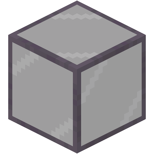 <strong>Установить цвет фона</strong> <code>entity_set_text_display_background</code>
                              | 
Устанавливает цвет и прозрачность фона визуализатору текста.  Работает с: » Визуализаторами текста
                                     | 
 <strong>HEX цвет</strong>  <strong>Процент непрозрачности</strong>
                                                                                                                                                                                                                                                                                                                                                                                                                                                                                                                                                                                                                                                                                                                                                                                                                                                                                                                                                         |
| 
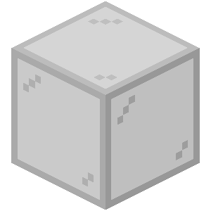 <strong>Сбросить цвет фона</strong> <code>entity_reset_text_display_background</code>
                  | 
Сбросить цвет и прозрачность фона визуализатору текста.  Работает с: » Визуализаторами текста
                                          |                                                                                                                                                                                                                                                                                                                                                                                                                                                                                                                                                                                                                                                                                                                                                                                                                                                                                                                                                                                                                                                                                                                                                                                                                                                               |
| 
 <strong>Установить цвет свечения</strong> <code>entity_set_display_glow_color</code>
                               | 
Устанавливает цвет свечения сущности-визуализатору.  Работает с: » Визуализаторами предмета » Визуализаторами блока
                 |  **HEX цвет**                                                                                                                                                                                                                                                                                                                                                                                                                                                                                                                                                                                                                                                                                                                                                                                                                                                                                                                                                                                                                                                                                                                                                    |
| 
 <strong>Сбросить цвет свечения</strong> <code>entity_reset_display_glow_color</code>
                                    | 
Сбросить цвет свечения сущности-визуализатору.  Работает с: » Визуализаторами предмета » Визуализаторами блока
                      |                                                                                                                                                                                                                                                                                                                                                                                                                                                                                                                                                                                                                                                                                                                                                                                                                                                                                                                                                                                                                                                                                                                                                                                                                                                               |
| 
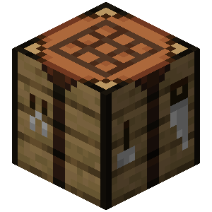 <strong>Установить отображаемый предмет</strong> <code>entity_set_item_display_item</code>
                       | 
Устанавливает отображаемый предмет визуализатору предмета.  Работает с: » Визуализаторами предмета
                                     |  **Отображаемый предмет**                                                                                                                                                                                                                                                                                                                                                                                                                                                                                                                                                                                                                                                                                                                                                                                                                                                                                                                                                                                                                                                                                                                                  |
| 
 <strong>Установить тип модели предмета</strong> <code>entity_set_item_display_model_type</code>
                         | 
Устанавливает тип отображаемой модели предмета визуализатору предмета.  Работает с: » Визуализаторами предмета
                         |  **Тип модели** [**`->`**](#user-content-fn-105)[^105]                                                                                                                                                                                                                                                                                                                                                                                                                                                                                                                                                                                                                                                                                                                                                                                                                                                                                                                                                                                                                                                                                     |
| 
 <strong>Установить отображаемый блок</strong> <code>entity_set_block_display_block</code>
                                | 
Устанавливает отображаемый блок визуализатору блока.  Работает с: » Визуализаторами блока
                                              |  **Отображаемый блок**                                                                                                                                                                                                                                                                                                                                                                                                                                                                                                                                                                                                                                                                                                                                                                                                                                                                                                                                                                                                                                                                                                                         |
| 
 <strong>Установить матрицу преобразования</strong> <code>entity_set_display_transformation_matrix</code>
      | 
Устанавливает матрицу преобразования (ряд-столбец) сущности-визуализатору.  Работает с: » Любой сущностью-визуализатором
               |  **Матрица из 16 чисел**                                                                                                                                                                                                                                                                                                                                                                                                                                                                                                                                                                                                                                                                                                                                                                                                                                                                                                                                                                                                                                                                                                                                 |
| 
 <strong>Установить поворот по углам Эйлера</strong> <code>entity_set_display_rotation_from_euler_angles</code>
 | 
Устанавливает левый или правый поворот по углам Эйлера сущности-визуализатору.  Работает с: » Любой сущностью-визуализатором
           | 
 <strong>Угол тангажа (pitch)</strong>  <strong>Угол рыскания (yaw)</strong>  <strong>Угол крена (roll)</strong>  <strong>Режим установки</strong> <a data-footnote-ref href="#user-content-fn-106"><strong><code>-></code></strong></a>  <strong>Тип угла</strong> <a data-footnote-ref href="#user-content-fn-107"><strong><code>-></code></strong></a>  <strong>Порядок применения поворота</strong> <a data-footnote-ref href="#user-content-fn-108"><strong><code>-></code></strong></a>
 |
| 
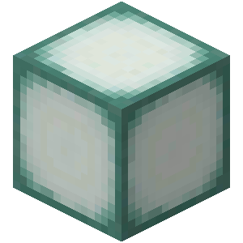 <strong>Установить поворот по осевому вектору</strong> <code>entity_set_display_rotation_from_axis_angle</code>
     | 
Устанавливает левый или правый поворот по осевому вектору и углу сущности-визуализатору.  Работает с: » Любой сущностью-визуализатором
 | 
 <strong>Осевой вектор</strong>  <strong>Угол поворота</strong>  <strong>Режим установки</strong> <a data-footnote-ref href="#user-content-fn-106"><strong><code>-></code></strong></a>  <strong>Тип угла</strong> <a data-footnote-ref href="#user-content-fn-107"><strong><code>-></code></strong></a>  <strong>Порядок применения поворота</strong> <a data-footnote-ref href="#user-content-fn-108"><strong><code>-></code></strong></a>
                                                                                                                                                               |
| 
 <strong>Установить смещение</strong> <code>entity_set_display_translation</code>
                                          | 
Устанавливает смещение сущности-визуализатору.  Работает с: » Любой сущностью-визуализатором
                                           | 
 <strong>Новое смещение</strong>  <strong>Режим установки</strong> <a data-footnote-ref href="#user-content-fn-106"><strong><code>-></code></strong></a>
                                                                                                                                                                                                                                                                                                                                                                                                                                                                                                                                                                                                                                                                                                                                                                                                                                        |
| 
 <strong>Установить размер</strong> <code>entity_set_display_scale</code>
                                                  | 
Устанавливает размер сущности-визуализатору.  Работает с: » Любой сущностью-визуализатором
                                             | 
 <strong>Новый размер</strong>  <strong>Режим установки</strong> <a data-footnote-ref href="#user-content-fn-106"><strong><code>-></code></strong></a>
                                                                                                                                                                                                                                                                                                                                                                                                                                                                                                                                                                                                                                                                                                                                                                                                                                          |



 **Действия, которые относятся к другим категориям.**

***

| Опция                                                                                                                                                                                       | Описание                                                                                                                           | Аргументы                                                                                                                                                                                                                                                                                                                                                                                                                                                                                                                                                                                                                                                                                                                                                                                                                                                                                                                                                                            |
| ------------------------------------------------------------------------------------------------------------------------------------------------------------------------------------------- | ---------------------------------------------------------------------------------------------------------------------------------- | ------------------------------------------------------------------------------------------------------------------------------------------------------------------------------------------------------------------------------------------------------------------------------------------------------------------------------------------------------------------------------------------------------------------------------------------------------------------------------------------------------------------------------------------------------------------------------------------------------------------------------------------------------------------------------------------------------------------------------------------------------------------------------------------------------------------------------------------------------------------------------------------------------------------------------------------------------------------------------------ |
| 
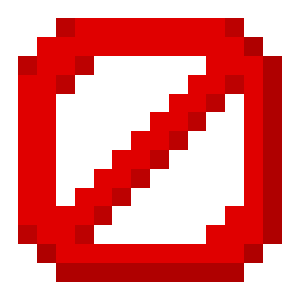 <strong>Удалить сущность</strong> <code>entity_remove</code>
                                             | Удаляет сущность из мира.                                                                                                          |                                                                                                                                                                                                                                                                                                                                                                                                                                                                                                                                                                                                                                                                                                                                                                                                                                                                                                                                                                                      |
| 
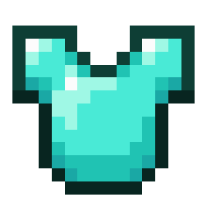 <strong>Установить экипировку</strong> <code>entity_set_equipment_item</code>
                 | Устанавливает предметы в один из слотов экипировки (броня и предметы в руках) сущности.                                            | 
 <strong>Предметы для выдачи</strong>  <strong>Слот снаряжения</strong> <a data-footnote-ref href="#user-content-fn-109"><strong><code>-></code></strong></a>
                                                                                                                                                                                                                                                                                                                                                                                                                                                                                                                                                                  |
| 
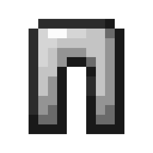 <strong>Установить броню</strong> <code>entity_set_armor_items</code>
                              | 
Устанавливает броню сущности.  » Любой предмет или блок будет отображаться на голове, если положить его в слот шлема.
 | 
 <strong>Головной убор</strong>  <strong>Нагрудник</strong>  <strong>Штаны</strong>  <strong>Ботинки</strong>
                                                                                                                                                                                                                                                                                                                                                                                                |
| 
 <strong>Запустить снаряд</strong> <code>entity_launch_projectile</code>
                                    | Запустить снаряд из местоположения существа.                                                                                       | 
 <strong>Снаряд для запуска</strong>  <strong>Место запуска</strong>  <strong>Имя снаряда</strong>  <strong>Скорость снаряда</strong>  <strong>Отклонение снаряда (0, чтобы снаряд летел ровно)</strong>  <strong>След, который будет оставаться за снарядом</strong>
 |
| 
 <strong>Подстричь сущность</strong> <code>entity_shear</code>
                                             | 
Стрижёт сущность.  Работает с: » Овцами » Грибными коровами » Болотниками » Снеговиками
                   |                                                                                                                                                                                                                                                                                                                                                                                                                                                                                                                                                                                                                                                                                                                                                                                                                                                                                                                                                                                      |
| 
 <strong>Установить кастомный тег</strong> <code>entity_set_custom_tag</code>
                      | Устанавливает кастомный нбт-тег существу.                                                                                          | 
 <strong>Имя тега</strong>  <strong>Значение тега</strong>
                                                                                                                                                                                                                                                                                                                                                                                                                                                                                                                                                                                                                                                                                                 |
| 
 <strong>Получить кастомный тег</strong> <code>entity_get_custom_tag</code>
                       | Получает кастомный нбт-тег существа.                                                                                               | 
 <strong>Переменная для присвоения</strong>  <strong>Имя тега</strong>  <strong>Значение по умолчанию</strong>
                                                                                                                                                                                                                                                                                                                                                                                                                                                                                                                           |
| 
 <strong>Удалить кастомный тег</strong> <code>entity_remove_custom_tag</code>
                        | Удаляет кастомный нбт-тег у существа.                                                                                              |  **Имя тега**                                                                                                                                                                                                                                                                                                                                                                                                                                                                                                                                                                                                                                                                                                                                                                                                                                                                           |
| 
 <strong>Установить тип существу Предмет</strong> <code>entity_set_item</code>
                         | 
Устанавливает определённый тип (ID) существу Предмет.  Работает с: » Предметами
                                    |  **Предмет для установки**                                                                                                                                                                                                                                                                                                                                                                                                                                                                                                                                                                                                                                                                                                                                                                                                                                                        |
| 
 <strong>Установить звук попадания снаряда</strong> <code>entity_set_arrow_hit_sound</code>
    | 
Устанавливает снаряду звук, издаваемый при попадании в сущность.  Работает с: » Стрелами » Трезубцами
           |  **Звук попадания**                                                                                                                                                                                                                                                                                                                                                                                                                                                                                                                                                                                                                                                                                                                                                                                                                                                          |
| 
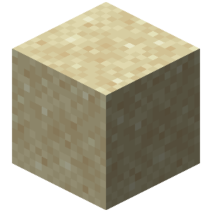 <strong>Установить тип существу Падающий блок</strong> <code>entity_set_falling_block_type</code>
           | 
Устанавливает новый тип блока существу Падающий блок.  Работает с: » Падающими блоками
                             |  **Новый блок**                                                                                                                                                                                                                                                                                                                                                                                                                                                                                                                                                                                                                                                                                                                                                                                                                                                       |
| 
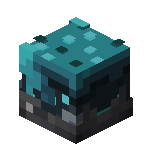 <strong>Установить Вардену тип копания</strong> <code>entity_set_warden_digging</code>
 | 
Устанавливает Вардену тип копания.  Работает с: » Варденом
                                                         |  **Состояние копания** [**`->`**](#user-content-fn-110)[^110]                                                                                                                                                                                                                                                                                                                                                                                                                                                                                                                                                                                                                                                                                                                                                                                                     |



### Селекторы

Нажатием <kbd>Shift</kbd> + <kbd>ПКМ</kbd> по блоку кода открывается меню селекторов, позволяющее выбрать цель, по отношению к которой будет воспроизведено действие.

<table data-search="false"><thead><tr><th>Селектор</th><th>Описание</th></tr></thead><tbody><tr><td> <strong>Текущая цель</strong></td><td>Игроки, мобы и существа выбранные с помощью <a href="select.md">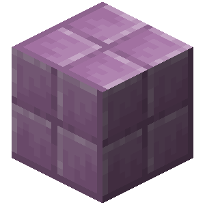 <strong>Выбрать цель</strong></a>.</td></tr><tr><td>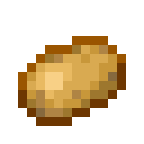 <strong>Сущность по умолчанию</strong></td><td>Сущность, которая спровоцировала данное событие.</td></tr><tr><td> <strong>Убийца</strong></td><td>Сущность, которая убила жертву в данном событии.</td></tr><tr><td>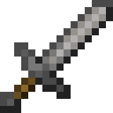 <strong>Атакующая сущность</strong></td><td>Сущность, которая атаковала жертву в данном событии.</td></tr><tr><td> <strong>Стрелок</strong></td><td>Сущность, которая выстрелила в данном событии.</td></tr><tr><td> <strong>Снаряд стрелка</strong></td><td>Выбирает сущность, которую запустил стрелок.</td></tr><tr><td> <strong>Жертва</strong></td><td>Сущность, которая получила урон или умерла в данном событии.</td></tr><tr><td> <strong>Случайная сущность</strong></td><td>Случайная сущность в мире.</td></tr><tr><td>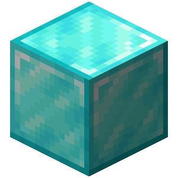 <strong>Все мобы</strong></td><td>Все мобы в мире.</td></tr><tr><td>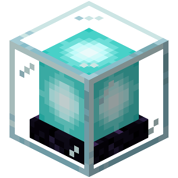 <strong>Все сущности</strong></td><td>Все сущности в мире.</td></tr><tr><td> <strong>Последняя сущность</strong></td><td>Последняя появившаяся сущность в мире.</td></tr></tbody></table>

[^1]: **Исцелить существо** `heal_to_max`:

    *  **Да**\
      `true`
    *  **Нет**\
      `false`

[^2]: **Блокировка состояния (время не будет изменяться)** `ticking_locked`:

    *  **Включить**\
      `true`
    *  **Выключить**\
      `false`

[^3]: **Перезаписывать существующие эффекты** `overwrite`:

    *  **Да**\
      `true`
    *  **Нет**\
      `false`

[^4]: **Показывать иконку эффекта** `show_icon`:

    *  **Да**\
      `true`
    *  **Нет**\
      `false`

[^5]: **Показывать частицы** `particle_mode`:

    * 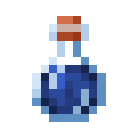 **Да**\
      `regular`
    *  **Прозрачными**\
      `ambient`
    *  **Нет**\
      `none`

[^6]: **Остановить взросление** `lock`:

    * 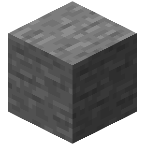 **Включено**\
      `enable`
    *  **Выключено**\
      `disable`
    *  **Не заменять**\
      `dont_change`

[^7]: **Тип задержки** `wait_type`:

    *  **Минимальная и максимальная задержка**\
      `min_max_wait`
    *  **Текущая задержка**\
      `wait`
    * 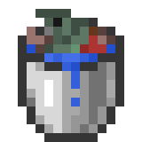 **Минимальная задержка**\
      `min_wait`
    * 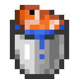 **Максимальная задержка**\
      `max_wait`

[^8]: **Тип значения** `return_value`:

    *  **Текущее значение**\
      `value`
    * 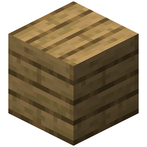 **Базовое значение**\
      `base_value`
    * 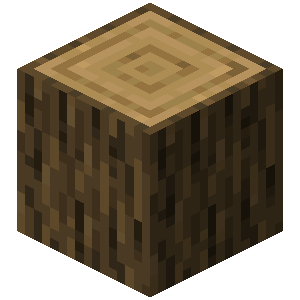 **Значение по умолчанию**\
      `default_value`

[^9]: **Тип атрибута** `attribute_type`:

    *  **Максимальное здоровье**\
      `generic_max_health`
    *  **Максимальное поглощение**\
      `generic_max_absorption`
    *  **Расстояние следования**\
      `generic_follow_range`
    *  **Сопротивление отталкиванию**\
      `generic_knockback_resistance`
    *  **Скорость передвижения**\
      `generic_movement_speed`
    *  **Скорость полёта**\
      `generic_flying_speed`
    *  **Урон атаки**\
      `generic_attack_damage`
    *  **Отталкивание атаки**\
      `generic_attack_knockback`
    *  **Скорость атаки**\
      `generic_attack_speed`
    * 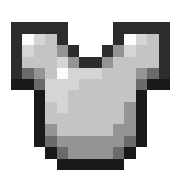 **Очки защиты**\
      `generic_armor`
    *  **Очки плотности защиты**\
      `generic_armor_toughness`
    *  **Удача рыбалки**\
      `generic_luck`
    *  **Сила прыжка**\
      `generic_jump_strength`
    *  **Шанс подкрепления зомби**\
      `zombie_spawn_reinforcements`
    * 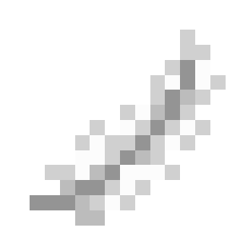 **Множитель урона от падения**\
      `generic_fall_damage_multiplier`
    *  **Безопасная высота падения**\
      `generic_safe_fall_distance`
    *  **Масштаб**\
      `generic_scale`
    * 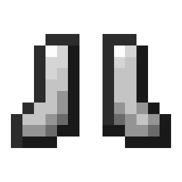 **Высота шага**\
      `generic_step_height`
    * 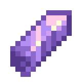 **Гравитация**\
      `generic_gravity`
    * 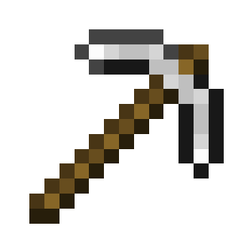 **Расстояние взаимодействия с блоками**\
      `player_block_interaction_range`
    * 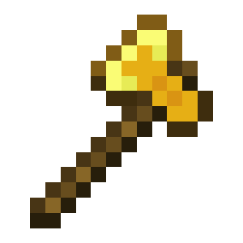 **Расстояние взаимодействия с сущностями**\
      `player_entity_interaction_range`
    * 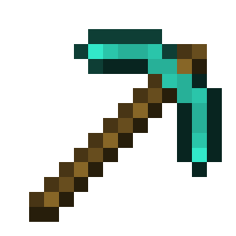 **Скорость ломания блока**\
      `player_block_break_speed`
    *  **Время горения**\
      `generic_burning_time`
    *  **Сопротивление отбрасыванию от взрыва**\
      `generic_explosion_knockback_resistance`
    * 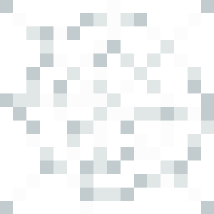 **Скорость передвижения по замедляющим блокам**\
      `generic_movement_efficiency`
    *  **Воздух под водой**\
      `generic_oxygen_bonus`
    * 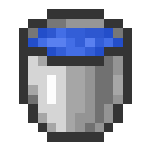 **Скорость передвижения под водой**\
      `generic_water_movement_efficiency`
    * 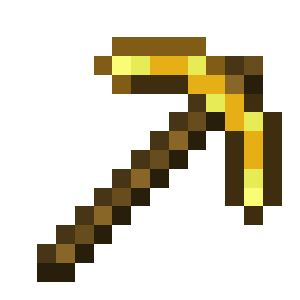 **Скорость копания**\
      `player_mining_efficiency`
    * 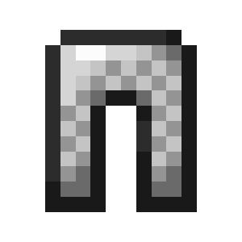 **Скорость передвижения крадясь**\
      `player_sneaking_speed`
    *  **Скорость копания под водой**\
      `player_submerged_mining_speed`
    *  **Коэффициент разящего удара**\
      `player_sweeping_damage_ratio`

[^10]: **Тип данных** `value_type`:

    *  **Любое значение**\
      `any_value`
    *  **NBT-строка**\
      `nbt_string`

[^11]: **Тип сервера скинов** `server_type`:

    *  **Скин Mojang**\
      `mojang`
    *  **Скин JustMC**\
      `server`
    * 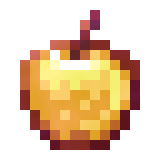 **Скин JustMC (по умолчанию)**\
      `server_default`

[^12]: **Цвет сущности** `color`:

    *  **Белый**\
      `white`
    * 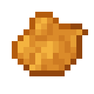 **Оранжевый**\
      `orange`
    * 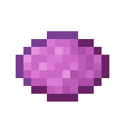 **Пурпурный**\
      `magenta`
    * 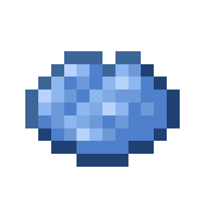 **Голубой**\
      `light_blue`
    *  **Жёлтый**\
      `yellow`
    *  **Лаймовый**\
      `lime`
    *  **Розовый**\
      `pink`
    *  **Серый**\
      `gray`
    * 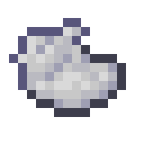 **Светло-серый**\
      `light_gray`
    * 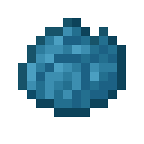 **Бирюзовый**\
      `cyan`
    *  **Фиолетовый**\
      `purple`
    * 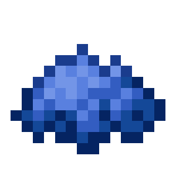 **Синий**\
      `blue`
    * 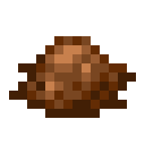 **Коричневый**\
      `brown`
    * 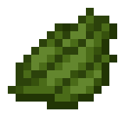 **Зелёный**\
      `green`
    * 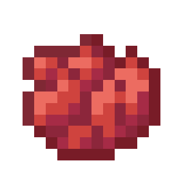 **Красный**\
      `red`
    * 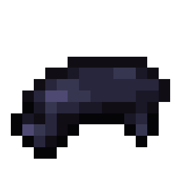 **Чёрный**\
      `black`

[^13]: **Отображаемая поза** `pose`:

    *  **Обычное состояние**\
      `standing`
    *  **Полёт на Элитрах**\
      `fall_flying`
    *  **Лежание**\
      `sleeping`
    *  **Плавание**\
      `swimming`
    *  **Использование Тягуна**\
      `spin_attack`
    *  **Приседание**\
      `crouching`
    *  **Длинный прыжок**\
      `long_jumping`
    *  **Смерть**\
      `dying`
    * 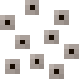 **Кваканье (для Жаб)**\
      `croaking`
    * 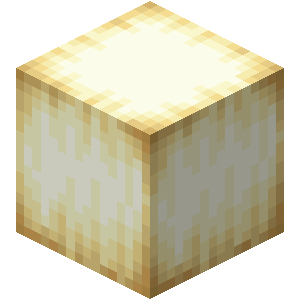 **Использование языка (для Жаб)**\
      `using_tongue`
    *  **Сидение**\
      `sitting`
    *  **Рёв (для Хранителя)**\
      `roaring`
    *  **Нюханье (для Хранителя)**\
      `sniffing`
    * 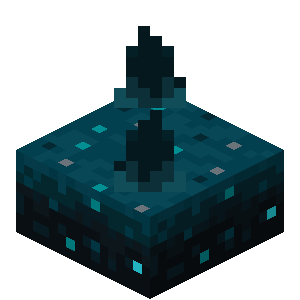 **Появление из земли (для Хранителя)**\
      `emerging`
    *  **Зарывание в землю (для Хранителя)**\
      `digging`
    *  **Скольжение (для Вихря)**\
      `sliding`
    *  **Выстреливание (для Вихря)**\
      `shooting`
    *  **Вдыхание (для Вихря)**\
      `inhaling`

[^14]: **Цвет узора** `pattern_color`:

    *  **Белый**\
      `white`
    * 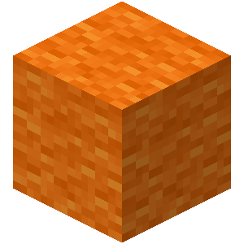 **Оранжевый**\
      `orange`
    * 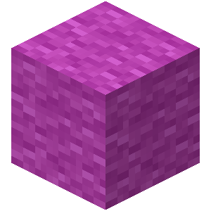 **Пурпурный**\
      `magenta`
    * 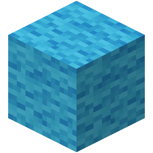 **Голубой**\
      `light_blue`
    *  **Жёлтый**\
      `yellow`
    *  **Лаймовый**\
      `lime`
    * 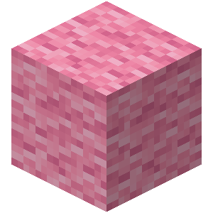 **Розовый**\
      `pink`
    * 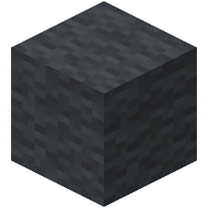 **Серый**\
      `gray`
    *  **Светло-серый**\
      `light_gray`
    * 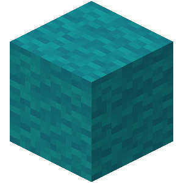 **Бирюзовый**\
      `cyan`
    * 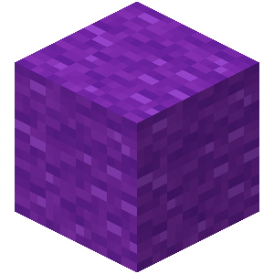 **Фиолетовый**\
      `purple`
    * 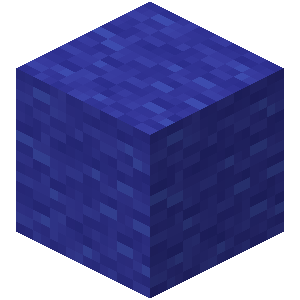 **Синий**\
      `blue`
    * 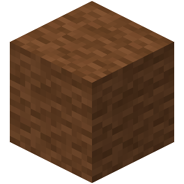 **Коричневый**\
      `brown`
    * 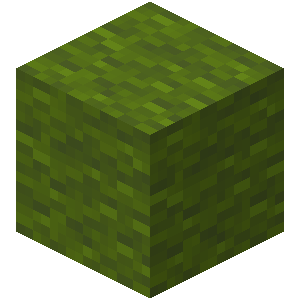 **Зелёный**\
      `green`
    * 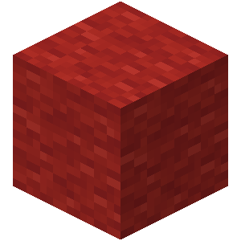 **Красный**\
      `red`
    * 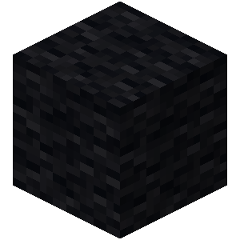 **Чёрный**\
      `black`
    *  **Не изменять**\
      `do_not_change`

[^15]: **Цвет тела** `body_color`:

    *  **Белый**\
      `white`
    *  **Оранжевый**\
      `orange`
    *  **Пурпурный**\
      `magenta`
    *  **Голубой**\
      `light_blue`
    *  **Жёлтый**\
      `yellow`
    *  **Лаймовый**\
      `lime`
    *  **Розовый**\
      `pink`
    *  **Серый**\
      `gray`
    *  **Светло-серый**\
      `light_gray`
    *  **Бирюзовый**\
      `cyan`
    *  **Фиолетовый**\
      `purple`
    *  **Синий**\
      `blue`
    *  **Коричневый**\
      `brown`
    *  **Зелёный**\
      `green`
    *  **Красный**\
      `red`
    *  **Чёрный**\
      `black`
    *  **Не изменять**\
      `do_not_change`

[^16]: **Узор** `pattern`:

    *  **Kob**\
      `kob`
    *  **SunStreak**\
      `sunstreak`
    *  **Snooper**\
      `snooper`
    *  **Dasher**\
      `dasher`
    *  **Brinely**\
      `brinely`
    *  **Spotty**\
      `spotty`
    *  **Flopper**\
      `flopper`
    *  **Stripey**\
      `stripey`
    *  **Glitter**\
      `glitter`
    *  **Blockfish**\
      `blockfish`
    *  **Betty**\
      `betty`
    *  **Clayfish**\
      `clayfish`
    *  **Не изменять**\
      `do_not_change`

[^17]: **Часть стойки для изменения** `body_part`:

    *  **Голова**\
      `head`
    * 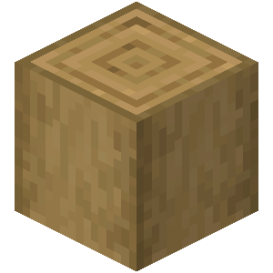 **Тело**\
      `body`
    * 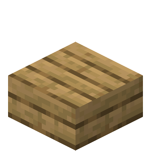 **Левая рука**\
      `left_arm`
    *  **Правая рука**\
      `right_arm`
    *  **Левая нога**\
      `left_leg`
    *  **Правая нога**\
      `right_leg`

[^18]: **Видимость рук** `arms`:

    *  **Включить**\
      `enable`
    *  **Выключить**\
      `disable`
    *  **Не изменять**\
      `dont_change`

[^19]: **Видимость плиты** `base_plate`:

    *  **Включить**\
      `enable`
    *  **Выключить**\
      `disable`
    *  **Не изменять**\
      `dont_change`

[^20]: **Тип кролика** `rabbit_type`:

    *  **Коричневый**\
      `brown`
    *  **Белый**\
      `white`
    *  **Чёрный**\
      `black`
    *  **Чёрно-белый**\
      `black_and_white`
    *  **Золотой**\
      `gold`
    *  **Бело-коричневый**\
      `salt_and_pepper`
    *  **Кролик-убийца**\
      `the_killer_bunny`

[^21]: **Тип кошки** `cat_type`:

    *  **Полосатая**\
      `tabby`
    *  **Чёрно-белая**\
      `black`
    *  **Рыжая**\
      `red`
    *  **Сиамская**\
      `siamese`
    *  **Британская короткошёрстая**\
      `british_shorthair`
    *  **Ситцевая**\
      `calico`
    *  **Персидская**\
      `persian`
    *  **Тряпичная**\
      `ragdoll`
    *  **Белая**\
      `white`
    *  **Бело-серая**\
      `jellie`
    *  **Чёрная**\
      `all_black`

[^22]: **Тип волка** `wolf_type`:

    * 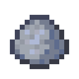 **Пепельный**\
      `ashen`
    *  **Снежный**\
      `snowy`
    *  **Рыжий**\
      `rusty`
    *  **Чёрный**\
      `black`
    * 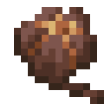 **Каштановый**\
      `chestnut`
    *  **Пятнистый**\
      `spotted`
    * 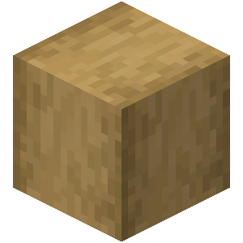 **Полосатый**\
      `striped`
    * 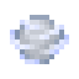 **Обычный**\
      `pale`

[^23]: **Тип окраски** `variant`:

    *  **Снежная**\
      `cold`
    *  **Тропическая**\
      `warm`
    *  **Обычная**\
      `temperate`

[^24]: **Режим лежания** `lying_down`:

    *  **Включить**\
      `true`
    *  **Выключить**\
      `false`

[^25]: **Тип грибной коровы** `cow_type`:

    * 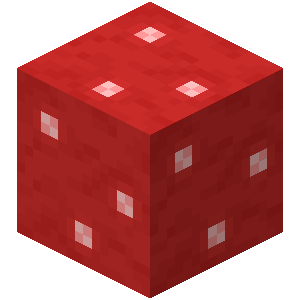 **Красная**\
      `red`
    *  **Коричневая**\
      `brown`

[^26]: **Тип попугая** `parrot_type`:

    *  **Красный**\
      `red`
    *  **Синий**\
      `blue`
    *  **Зелёный**\
      `green`
    *  **Бирюзовый**\
      `cyan`
    *  **Серый**\
      `gray`

[^27]: **Цвет лошади** `horse_color`:

    *  **Белый**\
      `white`
    *  **Бежевый**\
      `creamy`
    * 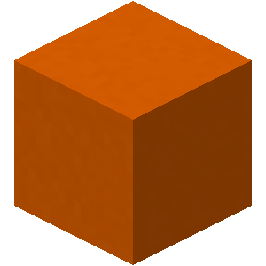 **Рыжий**\
      `chestnut`
    *  **Коричневый**\
      `brown`
    * 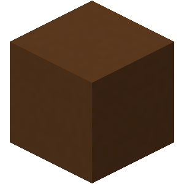 **Тёмно-коричневый**\
      `dark_brown`
    *  **Серый**\
      `gray`
    *  **Чёрный**\
      `black`
    *  **Не изменять**\
      `do_not_change`

[^28]: **Узор лошади** `horse_style`:

    *  **Без узора**\
      `none`
    *  **Белые полосы на ногах и голове**\
      `white`
    *  **Крупные белые пятна**\
      `whitefield`
    *  **Мелкие белые пятна**\
      `white_dots`
    *  **Тёмные пятна на спине**\
      `black_dots`
    *  **Не изменять**\
      `do_not_change`

[^29]: **Тип аксолотля** `axolotl_type`:

    *  **Лейкист**\
      `lucy`
    *  **Коричневый**\
      `wild`
    *  **Золотой**\
      `gold`
    *  **Голубой**\
      `cyan`
    *  **Синий**\
      `blue`

[^30]: **Проиграть звук** `play_sound`:

    *  **Да**\
      `true`
    *  **Нет**\
      `false`

[^31]: **Свечение** `glowing`:

    *  **Включить**\
      `true`
    *  **Выключить**\
      `true`

[^32]: **Тип лисы** `fox_type`:

    *  **Стандартный**\
      `red`
    * 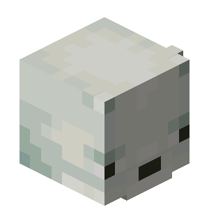 **Зимний**\
      `snow`

[^33]: **Анимация прыжка** `leaping`:

    *  **Включить**\
      `true`
    *  **Выключить**\
      `false`

[^34]: **Цвет для установки** `type`:

    *  **Бежевый**\
      `creamy`
    *  **Белый**\
      `white`
    *  **Коричневый**\
      `brown`
    *  **Серый**\
      `gray`

[^35]: **Биом** `biome`:

    * 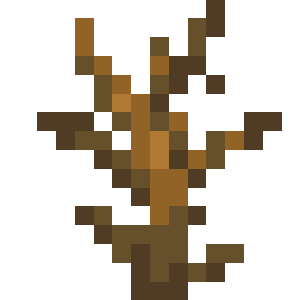 **Пустынный**\
      `desert`
    * 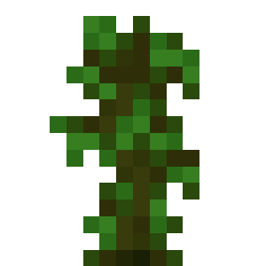 **Джунгли**\
      `jungle`
    * 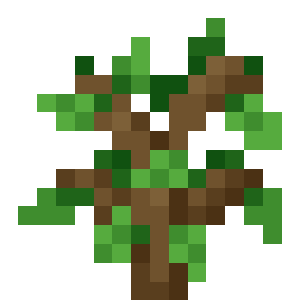 **Равнины**\
      `plains`
    * 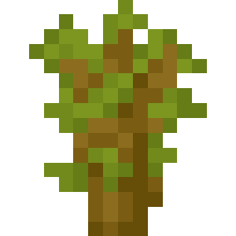 **Саванна**\
      `savanna`
    *  **Снежный**\
      `snow`
    * 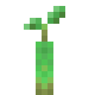 **Болото**\
      `swamp`
    * 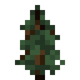 **Тайга**\
      `taiga`

[^36]: **Видимость тыквы** `pumpkin`:

    *  **Включить**\
      `true`
    *  **Выключить**\
      `false`

[^37]: **Видимость пыльцы** `nectar`:

    *  **Включить**\
      `true`
    *  **Выключить**\
      `false`

[^38]: **Тип жабы** `frog_variant`:

    *  **Умеренный**\
      `temperate`
    * 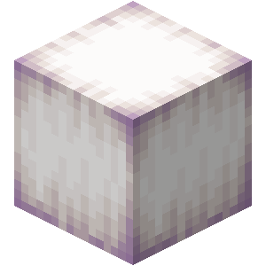 **Тёплый**\
      `warm`
    * 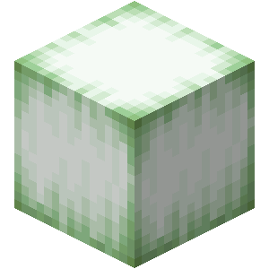 **Холодный**\
      `cold`

[^39]: **Звук от изменения открытости** `silent`:

    *  **Нет**\
      `true`
    *  **Да**\
      `false`

[^40]: **Агрессивность** `aggressive`:

    *  **Да**\
      `true`
    *  **Нет**\
      `false`

[^41]: **Отображение огня** `visual_fire`:

    *  **Включить**\
      `true`
    *  **Выключить**\
      `false`

[^42]: **Тип урона** `damage_type`:

    *  **Обычный**\
      `damage`
    * 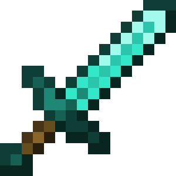 **Критический**\
      `critical_damage`
    * 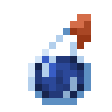 **Магический**\
      `magical_damage`

[^43]: **Тип руки** `hand_type`:

    *  **Главная**\
      `main`
    *  **Второстепенная**\
      `off`

[^44]: **Оставить текущий поворот** `keep_rotation`:

    *  **Включено**\
      `true`
    *  **Выключено**\
      `false`

[^45]: **Учитывать текущую инерцию** `increment`:

    *  **Включено**\
      `true`
    *  **Выключено**\
      `false`

[^46]: **Ось запуска** `launch_axis`:

    *  **Все оси**\
      `yaw_and_pitch`
    *  **Только по горизонтали**\
      `yaw`

[^47]: **Полёт на элитрах** `is_gliding`:

    *  **Включено**\
      `true`
    *  **Выключено**\
      `false`

[^48]: **Гравитация** `gravity`:

    *  **Включить**\
      `true`
    *  **Выключить**\
      `false`

[^49]: **Испытывать трение** `friction`:

    * 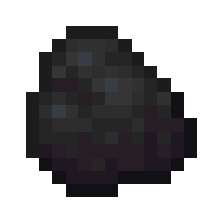 **По умолчанию**\
      `not_set`
    *  **Нет**\
      `false`
    *  **Да**\
      `true`

[^50]: **Видимость имени** `visibility`:

    *  **Включить**\
      `true`
    *  **Выключить**\
      `false`

[^51]: **Интеллект** `ai`:

    *  **Включить**\
      `true`
    *  **Выключить**\
      `false`

[^52]: **Заглушение** `silenced`:

    *  **Включить**\
      `true`
    *  **Выключить**\
      `false`

[^53]: **Видимость** `default_visible`:

    *  **Видимый**\
      `true`
    *  **Невидимый**\
      `false`

[^54]: **Выпадение предметов** `drops`:

    *  **Включить**\
      `true`
    *  **Выключить**\
      `false`

[^55]: **Режим столкновения** `collidable`:

    *  **Сталкивается с другими существами**\
      `true`
    *  **Не сталкивается с другими существами**\
      `false`

[^56]: **Неуязвимость** `invulnerable`:

    *  **Включить**\
      `true`
    *  **Выключить**\
      `false`

[^57]: **Физика** `no_physics`:

    *  **Нет**\
      `true`
    *  **Да**\
      `false`

[^58]: **Режим сидения** `sitting`:

    *  **Включить**\
      `true`
    *  **Выключить**\
      `false`

[^59]: **Режим ребёнка** `baby`:

    *  **Включить**\
      `true`
    *  **Выключить**\
      `false`

[^60]: **Наличие седла** `wearing`:

    *  **Включить**\
      `true`
    *  **Выключить**\
      `false`

[^61]: **Наличие сундука** `carrying`:

    *  **Включить**\
      `true`
    *  **Выключить**\
      `false`

[^62]: **Анимация рывка** `dashing`:

    *  **Включить**\
      `true`
    *  **Выключить**\
      `false`

[^63]: **Режим маркера** `marker`:

    *  **Включить**\
      `true`
    *  **Выключить**\
      `false`

[^64]: **Режим гнева** `angry`:

    *  **Включить**\
      `true`
    *  **Выключить**\
      `false`

[^65]: **Поза лошади** `rearing`:

    *  **Стоять на задних ногах**\
      `true`
    *  **Обычное состояние**\
      `false`

[^66]: **Анимация Тягун** `riptiding`:

    *  **Включить**\
      `true`
    *  **Выключить**\
      `false`

[^67]: **Заряженность крипера** `charged`:

    *  **Заряжен**\
      `true`
    *  **Не заряжен**\
      `false`

[^68]: **Режим невидимости** `invisible`:

    *  **Включить**\
      `true`
    *  **Выключить**\
      `false`

[^69]: **Тег "Кричащий"** `screams`:

    *  **Включить**\
      `true`
    *  **Выключить**\
      `false`

[^70]: **Ген** `gene`:

    * 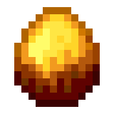 **Главный ген**\
      `main`
    * 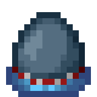 **Скрытый ген**\
      `hidden`
    * 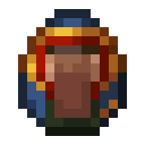 **Оба гена**\
      `both`

[^71]: **Тип гена** `gene_type`:

    *  **Нормальный**\
      `normal`
    *  **Ленивый**\
      `lazy`
    *  **Тревожный**\
      `worried`
    *  **Игривый**\
      `playful`
    *  **Суровый**\
      `brown`
    *  **Слабый**\
      `weak`
    *  **Агрессивный**\
      `aggressive`

[^72]: **Профессия жителя** `profession`:

    *  **Без профессии**\
      `none`
    *  **Бронник**\
      `armorer`
    *  **Мясник**\
      `butcher`
    *  **Картограф**\
      `cartographer`
    *  **Священник**\
      `cleric`
    *  **Фермер**\
      `farmer`
    *  **Рыбак**\
      `fisherman`
    *  **Лучник**\
      `fletcher`
    *  **Кожевник**\
      `leatherworker`
    *  **Библиотекарь**\
      `librarian`
    *  **Каменщик**\
      `mason`
    *  **Нищий**\
      `nitwit`
    *  **Пастух**\
      `shepherd`
    *  **Инструментальщик**\
      `toolsmith`
    *  **Оружейник**\
      `weaponsmith`

[^73]: **Состояние нюхача** `state`:

    *  **Обычное состояние**\
      `idling`
    *  **Чувствует себя счастливым**\
      `feeling_happy`
    *  **Идёт по следу**\
      `scenting`
    * 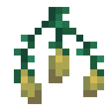 **Нюхает**\
      `sniffing`
    *  **Ищет**\
      `searching`
    *  **Копает**\
      `digging`
    *  **Поднимается**\
      `rising`

[^74]: **Состояние жала** `stinger`:

    *  **Есть**\
      `true`
    *  **Нет**\
      `false`

[^75]: **Состояние сидения** `on_back`:

    *  **Да**\
      `true`
    *  **Нет**\
      `false`

[^76]: **Тип издаваемых звуков** `sound_variant`:

    *  **Злой**\
      `angry`
    *  **Большой**\
      `big`
    *  **Обычный**\
      `classic`
    *  **Добрый**\
      `cute`
    *  **Сварливый**\
      `grumpy`
    *  **Мопс**\
      `puglin`
    *  **Грустный**\
      `sad`

[^77]: **Исчезание существа** `persistence`:

    *  **Не будет исчезать**\
      `true`
    *  **Будет исчезать**\
      `false`

[^78]: **Пропадание существа** `despawning`:

    *  **Включить**\
      `true`
    *  **Выключить**\
      `false`

[^79]: **Сохранение сущности** `persistent`:

    *  **Сохранять**\
      `true`
    *  **Удалять**\
      `false`

[^80]: **Режим установки** `mode`:

    * 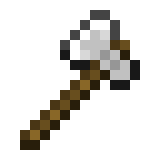 **Замена**\
      `merge`
    *  **Добавление**\
      `append`

[^81]: **Игнорирование скидок** `ignore_discounts`:

    *  **Включить**\
      `true`
    *  **Выключить**\
      `false`

[^82]: **Награда опытом** `experience_reward`:

    *  **Включить**\
      `true`
    *  **Выключить**\
      `false`

[^83]: **Режим изменения** `modification_mode`:

    *  **Добавление**\
      `add`
    *  **Удаление**\
      `remove`

[^84]: **Режим изменения** `modification_mode`:

    *  **Добавление**\
      `add`
    *  **Удаление**\
      `remove`

[^85]: **Отзывчивость** `responsive`:

    *  **Включить**\
      `true`
    *  **Выключить**\
      `false`

[^86]: **Иммунитет к зомбифицированию** `is_immune`:

    *  **Включить**\
      `true`
    *  **Выключить**\
      `true`

[^87]: **Подбор мобами** `can_mob_pickup`:

    *  **Включен**\
      `true`
    *  **Отключен**\
      `false`

[^88]: **Подбор игроками** `can_player_pickup`:

    *  **Включен**\
      `true`
    *  **Отключен**\
      `false`

[^89]: **Режим празднования** `celebrating`:

    *  **Включить**\
      `true`
    *  **Выключить**\
      `false`

[^90]: **Осведомлённость** `aware`:

    *  **Включить**\
      `true`
    *  **Выключить**\
      `false`

[^91]: **Режим сна** `sleep`:

    *  **Включить**\
      `true`
    *  **Выключить**\
      `false`

[^92]: **Фаза Эндер-дракона** `phase`:

    *  **Кружение**\
      `circling`
    *  **Уворот**\
      `strafing`
    *  **Полёт к порталу**\
      `fly_to_portal`
    *  **Приземление на портал**\
      `land_on_portal`
    *  **Покидание портала**\
      `leave_portal`
    *  **Атака дыханием**\
      `breath_attack`
    *  **Поиск цели для атаки дыханием**\
      `search_for_breath_attack_target`
    *  **Крик перед атакой**\
      `roar_before_attack`
    *  **Атака на игрока**\
      `charge_player`
    *  **Смерть**\
      `dying`
    *  **Полёт**\
      `hover`

[^93]: **Тип руки** `hand`:

    *  **Основная рука**\
      `main_hand`
    *  **Второстепенная рука**\
      `off_hand`

[^94]: **Использование** `enable`:

    *  **Включить**\
      `true`
    *  **Выключить**\
      `false`

[^95]: **Состояние зарядки** `charging`:

    *  **Заряжать**\
      `true`
    *  **Не заряжать**\
      `false`

[^96]: **Состояние охоты** `able`:

    *  **Охотится**\
      `true`
    *  **Не охотится**\
      `false`

[^97]: **Анимация танца** `dance`:

    *  **Включить**\
      `true`
    *  **Выключить**\
      `false`

[^98]: **Стадия злости** `charging`:

    *  **Злой**\
      `true`
    *  **Не злой**\
      `false`

[^99]: **Состояние переката** `rolling`:

    *  **Да**\
      `true`
    *  **Нет**\
      `false`

[^100]: **Режим отображения** `billboard_type`:

    * 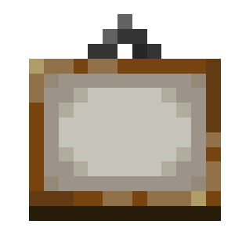 **Фиксированный**\
      `fixed`
    *  **Фиксированный по вертикали**\
      `vertical`
    *  **Фиксированный по горизонтали**\
      `horizontal`
    *  **Всегда повёрнут к игроку**\
      `center`

[^101]: **Объединение текста** `displayed_text`:

    *  **Разделение пробелом**\
      `spaces`
    *  **Объединение**\
      `concatenation`
    *  **Разделение на строки**\
      `separate_lines`

[^102]: **Выравнивание текста** `text_alignment`:

    *  **По центру**\
      `center`
    *  **Слева**\
      `left`
    *  **Справа**\
      `right`

[^103]: **Тень текста** `enable_text_shadow`:

    *  **Включить**\
      `true`
    *  **Выключить**\
      `false`

[^104]: **Видимость через блоки** `enable_see_through`:

    *  **Включить**\
      `true`
    *  **Выключить**\
      `false`

[^105]: **Тип модели** `display_model_type`:

    *  **Стандартный**\
      `none`
    *  **Левая рука от третьего лица**\
      `thirdperson_lefthand`
    *  **Правая рука от третьего лица**\
      `thirdperson_righthand`
    *  **Левая рука от первого лица**\
      `firstperson_lefthand`
    *  **Правая рука от первого лица**\
      `firstperson_righthand`
    *  **Голова**\
      `head`
    *  **Инвентарь**\
      `gui`
    * 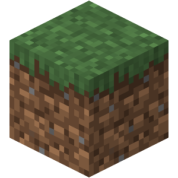 **На земле**\
      `ground`
    *  **Фиксированный**\
      `fixed`

[^106]: **Режим установки** `mode`:

    *  **Установка**\
      `set`
    *  **Добавление**\
      `add`

[^107]: **Тип угла** `input`:

    *  **Градусы**\
      `degrees`
    *  **Радианы**\
      `radians`

[^108]: **Порядок применения поворота** `rotation`:

    *  **Левый поворот (Поворот x Размер)**\
      `left_rotation`
    *  **Правый поворот (Размер x Поворот)**\
      `right_rotation`

[^109]: **Слот снаряжения** `slot`:

    *  **Основная рука**\
      `hand`
    *  **Второстепенная рука**\
      `off_hand`
    *  **Ботинки**\
      `feet`
    *  **Поножи**\
      `legs`
    *  **Нагрудник**\
      `chest`
    *  **Шлем**\
      `head`
    * 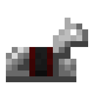 **Тело**\
      `body`

[^110]: **Состояние копания** `digging`:

    * 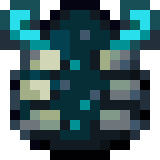 **Появление**\
      `emerge`
    *  **Закапывание**\
      `dig_down`
