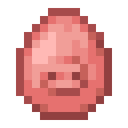
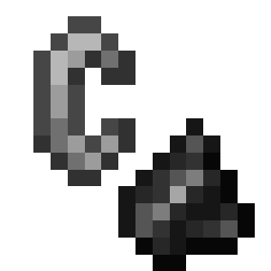
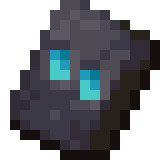
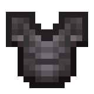
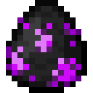
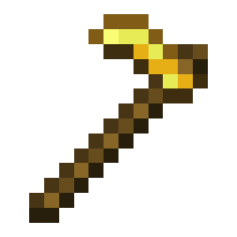
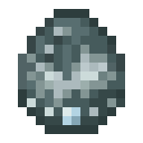
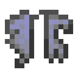
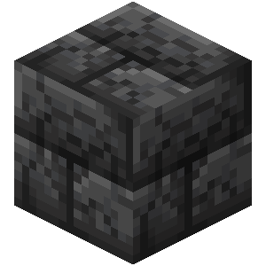
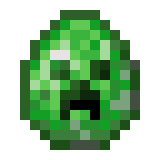

# Событие сущности

<figure><figcaption></figcaption></figure>

**Тип:** Событие\
**Текстовый идентификатор:** `entity_event`

***

## Использование

Поставьте блок события в самое начало строки и нажмите <kbd>ПКМ</kbd> по нему, чтобы открыть меню опций блока. Затем выберите событие, исходя из которого будет выполняться весь последующий код в строке.

### Опции

| Опция                                                                                                                                                                                                 | Описание                                                                                                                                                              | Возможность отмены                                                                                     |
| ----------------------------------------------------------------------------------------------------------------------------------------------------------------------------------------------------- | --------------------------------------------------------------------------------------------------------------------------------------------------------------------- | ------------------------------------------------------------------------------------------------------ |
| 
 <strong>Сущность создана</strong> <code>entity_spawn</code>
                                                  | Выполняет код, когда в мире появляется новая сущность.                                                                                                                |  **Отменяемое** |
| 
 <strong>Удаление сущности</strong> <code>entity_removed_from_world</code>
                                          | Выполняет код, когда из мира удаляется сущность.                                                                                                                      |  **Не отменяемое**                                |
| 
 <strong>Моб наносит урон мобу</strong> <code>entity_damage_entity</code>
                                      | Выполняет код, когда моб наносит урон другому мобу.                                                                                                                   |  **Отменяемое** |
| 
 <strong>Моб убил моба</strong> <code>entity_kill_entity</code>
                                                | Выполняет код, когда моб убил другого моба.                                                                                                                           |  **Отменяемое**                                    |
| 
 <strong>Сущность получает урон</strong> <code>entity_take_damage</code>
                                           | Выполняет код, когда сущность получает урон.                                                                                                                          |  **Отменяемое**                                    |
| 
 <strong>Сущность отталкивается</strong> <code>entity_knockback</code>
                                           | Выполняет код, когда сущность отталкивается.                                                                                                                          |  **Отменяемое**                                    |
| 
 <strong>Сущность исцеляется</strong> <code>entity_heal</code>
                                     | Выполняет код, когда сущность исцеляется.                                                                                                                             |  **Отменяемое**                                    |
| 
 <strong>Сущность возрождается от тотема</strong> <code>entity_resurrect</code>
                            | 
Выполняет код, когда сущность возрождается от Тотема бессмертия.  » По умолчанию, это событие отменено, если сущность не держит в руке Тотем бессмертия.
 |  **Отменяемое**                                    |
| 
 <strong>Запуск снаряда</strong> <code>projectile_launch</code>
                                                    | Выполняет код, когда запускается какой-либо снаряд.                                                                                                                   |  **Отменяемое**                                    |
| 
 <strong>Урон от снаряда</strong> <code>projectile_damage_entity</code>
                                               | Выполняет код, когда снаряд наносит урон сущности.                                                                                                                    |  **Отменяемое**                                    |
| 
 <strong>Снаряд убил сущность</strong> <code>projectile_kill_entity</code>
                                   | Выполняет код, когда снаряд убил сущность.                                                                                                                            |  **Отменяемое**                                    |
| 
 <strong>Попадание снаряда в блок</strong> <code>projectile_hit</code>
                                               | Выполняет код, когда снаряд попадает в блок.                                                                                                                          |  **Отменяемое**                                    |
| 
 <strong>Снаряд столкнулся с сущностью</strong> <code>projective_collide</code>
                                       | Выполняет код, когда снаряд сталкивается с сущностью.                                                                                                                 |  **Отменяемое**                                    |
| 
 <strong>Фейерверк взрывается</strong> <code>firework_explode</code>
                                        | Выполняет код, когда взрывается фейерверк.                                                                                                                            |  **Отменяемое**                                    |
| 
 <strong>Ломание висящего существа</strong> <code>hanging_break</code>
                                             | 
Выполняет код, когда ломается висящая сущность.  Работает с: » Рамками » Картинами » Поводками
                                                  |  **Отменяемое**                                    |
| 
 <strong>Сущность загорелась</strong> <code>entity_combust</code>
                                           | Выполняет код, когда сущность загорается.                                                                                                                             |  **Отменяемое**                                    |
| 
 <strong>Существо выбрасывает предмет</strong> <code>entity_drop_item</code>
                                          | Выполняет код, когда существо выбрасывает предмет.                                                                                                                    |  **Отменяемое**                                    |
| 
 <strong>Существо поднимает предмет</strong> <code>entity_pickup_item</code>
                                 | Выполняет код, когда существо поднимает предмет.                                                                                                                      |  **Отменяемое**                                    |
| 
 <strong>Предмет исчез</strong> <code>item_despawn</code>
                                                             | Выполняет код, когда предмет исчезает из мира спустя 5 минут после его создания.                                                                                      |  **Отменяемое**                                    |
| 
 <strong>Предметы на земле объединяются</strong> <code>item_merge</code>
                 | Выполняет код, когда рядом лежащие предметы объединяются в единый стак.                                                                                               |  **Отменяемое**                                    |
| 
 <strong>Сферы опыта объединяются</strong> <code>experience_orb_merge</code>
                              | Выполняет код, когда сфера опыта объединяется с другой сферой опыта.                                                                                                  |  **Отменяемое**                                    |
| 
 <strong>Сущность меняет экипировку</strong> <code>entity_equipment_changed</code>
                     | 
Выполняет код, когда экипировка сущности меняется.  » Событие возникает после изменения атрибутов или зачарований любой из частей экипировки.
            |  **Не отменяемое**                                |
| 
 <strong>Существо выполняет заклинание</strong> <code>entity_spell_cast</code>
                               | 
Выполняет код, когда существо выполняет заклинание.  Работает с: » Вызыватель » Иллюзор
                                                            |  **Отменяемое**                                    |
| 
 <strong>Сущность телепортируется</strong> <code>entity_teleport</code>
                                         | Выполняет код, когда сущность телепортируется.                                                                                                                        |  **Отменяемое**                                    |
| 
 <strong>Эндермен убегает</strong> <code>enderman_escape</code>
                                                | Выполняет код, когда Эндермен телепортируется, чтобы избежать что-либо.                                                                                               |  **Отменяемое**                                    |
| 
 <strong>Эндермен злится на игрока</strong> <code>enderman_attack_player</code>
                          | Выполняет код, когда Эндермен злится на игрока.                                                                                                                       |  **Отменяемое**                                    |
| 
 <strong>Смерть сущности</strong> <code>entity_death</code>
                                                  | Выполняет код, когда сущность умирает.                                                                                                                                |  **Отменяемое**                                    |
| 
 <strong>Урон транспорту</strong> <code>vehicle_take_damage</code>
                                          | Выполняет код, когда транспорт получает урон.                                                                                                                         |  **Отменяемое**                                    |
| 
 <strong>Блок начал падать</strong> <code>block_fall</code>
                                                           | Выполняет код, когда блок, затронутый гравитацией, превращается в падающий блок.                                                                                      |  **Отменяемое**                                    |
| 
 <strong>Падающий блок приземляется</strong> <code>falling_block_land</code>
                                           | Выполняет код, когда падающий блок превращается в обычный блок.                                                                                                       |  **Отменяемое**                                    |
| 
 <strong>Сущность взаимодействует с миром</strong> <code>entity_interact</code>
                                  | Выполняет код, когда сущность взаимодействует с миром.                                                                                                                |  **Отменяемое**                                    |
| 
 <strong>Раздатчик подстриг овцу</strong> <code>dispenser_shear_sheep</code>
                                         | Выполняет код, когда раздатчик срезает шерсть с овцы.                                                                                                                 |  **Отменяемое**                                    |
| 
 <strong>Овца отрастила шерсть</strong> <code>sheep_regrow_wool</code>
                                           | Выполняет код, когда Овца отращивает шерсть.                                                                                                                          |  **Отменяемое**                                    |
| 
 <strong>Сущность стреляет</strong> <code>entity_shot_bow</code>
                                                        | Выполняет код, когда сущность стреляет из лука или арбалета.                                                                                                          |  **Отменяемое**                                    |
| 
 <strong>Сущность заряжает арбалет</strong> <code>entity_load_crossbow</code>
                                      | Выполняет код, когда сущность заряжает арбалет.                                                                                                                       |  **Отменяемое**                                    |
| 
 <strong>Ведьма кидает зелье</strong> <code>witch_throw_potion</code>
                             | Выполняет код, когда Ведьма кидает зелье.                                                                                                                             |  **Отменяемое**                                    |
| 
 <strong>Поплавок удочки изменяет состояние</strong> <code>fishing_hook_state_change</code>
                     | 
Выполняет код, когда поплавок удочки изменяет своё состояние.  Работает с: » Поплавком удочки
                                                         |  **Не отменяемое**                                |
| 
 <strong>Пиглин торгуется</strong> <code>piglin_barter</code>
                                                   | Выполняет код, когда Пиглин торгуется.                                                                                                                                |  **Отменяемое**                                    |
| 
 <strong>Коза таранит сущность</strong> <code>goat_ram_entity</code>
                                              | Выполняет код, когда Коза таранит сущность.                                                                                                                           |  **Отменяемое**                                    |
| 
 <strong>Сущность заменяется другой сущностью</strong> <code>entity_transform</code>
                        | Выполняет код, когда сущность заменяется другой сущностью.                                                                                                            |  **Отменяемое**                                    |
| 
 <strong>Сущность начинает лететь на элитрах</strong> <code>entity_start_gliding</code>
                              | Выполняет код, когда сущность начинает лететь на элитрах.                                                                                                             |  **Отменяемое**                                    |
| 
 <strong>Сущность перестаёт лететь на элитрах</strong> <code>entity_stop_gliding</code>
                       | Выполняет код, когда сущность перестаёт лететь на элитрах.                                                                                                            |  **Отменяемое**                                    |
| 
 <strong>Сущность звонит в колокол</strong> <code>entity_bell_ring</code>
                                              | Выполняет код, когда сущность звонит в колокол.                                                                                                                       |  **Отменяемое**                                    |
| 
 <strong>Генерация блока из-за сущности</strong> <code>block_form_by_entity</code>
                                  | 
Выполняет код, когда блок генерируется впоследствии взаимодействия блоков и сущностей.  Работает с: » Снежными големами » Зачарованием "Ледоход"
   |  **Отменяемое**                                    |
| 
 <strong>Обновление статуса поломки блока</strong> <code>entity_block_break_progress_update</code>
 | 
Выполняет код, когда сущность обновляет статус поломки блока.  Работает с: » Зомби
                                                                    |  **Не отменяемое**                                |
| 
 <strong>Сущность взрывается</strong> <code>entity_explode</code>
                                     | Выполняет код, когда сущность взрывается.                                                                                                                             |  **Отменяемое**                                    |
| 
 <strong>Сущность решила взорваться</strong> <code>entity_explosion</code>
                                | Выполняет код, когда сущность приняла решение взорваться.                                                                                                             |  **Отменяемое**                                    |
| 
 <strong>Сущность отвязалась</strong> <code>entity_unleash_event</code>
                                                | Выполняет код, когда сущность отвязывается от поводка.                                                                                                                |  **Отменяемое**                                    |
| 
 <strong>Воронка подбирает предмет</strong> <code>hopper_pickup_item</code>
                                 | 
Выполняет код, когда воронка подбирает предмет.  » Чтобы выбрать предмет как сущность, используйте цель "Жертва".
                                        |  **Отменяемое**                                    |
