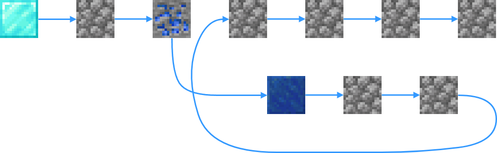

# Функция

<figure><figcaption></figcaption></figure>

**Тип:** Функция\
**Текстовый идентификатор:** `function`

***

## Использование

Поставьте блок в самое начало строки. Любой код, который вы напишете далее в этой строке, будет входить в функцию.

Присвойте название функции. Для этого возьмите значение [ **Текст**](../arguments/text.md) в активный слот напишите в чат название. Затем, продолжая держать значение в активном слоте, нажмите <kbd>ПКМ</kbd> по блоку функции.

#### Дополнительные аргументы функции:

*  **Отображать функцию в меню вызова** [**`->`**](#user-content-fn-1)[^1]
*  **Значок функции**
*  **Описание функции**

## Принцип работы

<figure><figcaption>
Схема, изображающая принцип работы функции.
</figcaption></figure>

Функция вызывается в строке кода блоком [ **Вызвать функцию**](call_function.md). Воспроизведение кода в строке не будет продолжаться до тех пор, пока функция не завершит своё выполнение.

Вы можете вынести часто повторяющийся код в функцию и вызывать её, чтобы сэкономить место в коде и ваше время.

[^1]: *  **Скрыть**
    *  **Отображать**
