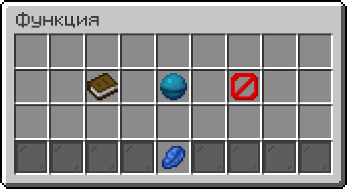

# Функция

<figure><figcaption></figcaption></figure>

**Тип:** Функция\
**Текстовый идентификатор:** `function`

***

## Использование

Поставьте блок в самое начало строки. Любой код, который вы напишете далее в этой строке, будет входить в функцию.

Присвойте название функции. Для этого возьмите значение [ **Текст**](../arguments/text.md) в активный слот напишите в чат название. Затем, продолжая держать значение в активном слоте, нажмите <kbd>ПКМ</kbd> по блоку функции. Вы можете также присвоить название через [настройки функции](function.md#nastroiki-funkcii).

Нажмите <kbd>ПКМ</kbd> по контейнеру чтобы открыть [меню управления функцией](#user-content-fn-1)[^1].

#### Настройки функции:

Отображаемое имя

Позволяет установить имя функции, которое будет отображаться по умолчанию, либо его перевод на 3 поддерживаемых языка:

* **Английский** (en\_US)
* **Русский** (ru\_RU)
* **Украинский** (ua\_UA)

Описание функции

Позволяет установить описание функции, которое будет отображаться по умолчанию, либо его перевод на 3 поддерживаемых языка:

* **Английский** (en\_US)
* **Русский** (ru\_RU)
* **Украинский** (ua\_UA)

Эта настройка функции поддерживает многострочный текст (например, через `\n` или ` `).

Отображаемый предмет

Положенный в ячейку предмет будет отображаться как значок функции.

Отображать функцию в меню вызова

*  **Скрыть**
*  **Отображать**

## Принцип работы

<figure><figcaption>
Схема, изображающая принцип работы функции.
</figcaption></figure>

Функция вызывается в строке кода блоком [ **Вызвать функцию**](call_function.md). Воспроизведение кода в строке не будет продолжаться до тех пор, пока функция не завершит своё выполнение.

Вы можете вынести часто повторяющийся код в функцию и вызывать её, чтобы сэкономить место в коде и ваше время.

[^1]: 
