# Действие над игроком

<figure><figcaption></figcaption></figure>

**Тип:** Действие\
**Текстовый идентификатор:** `player_action`

***

## Использование

Поставьте блок в строку и нажмите <kbd>ПКМ</kbd> по нему, чтобы открыть меню опций блока. Перейдите в нужную категорию и выберите действие, которое необходимо выполнить.

При выборе действия, над его блоком может появиться хранилище (по умолчанию: сундук), в котором содержатся [аргументы](../arguments/) действия.

### Опции




 <strong>Выдача, удаление, установка и сохранение предметов.</strong>

***

<table data-full-width="true"><thead><tr><th>Опция</th><th>Описание</th><th>Аргументы</th></tr></thead><tbody><tr><td> <strong>Выдать предмет</strong> <code>player_give_items</code></td><td>Выдаёт игроку предметы из сундука.</td><td> <strong>Предметы для выдачи</strong>  <strong>Количество предметов для выдачи</strong></td></tr><tr><td> <strong>Установить предметы</strong> <code>player_set_items</code></td><td>Устанавливает в инвентарь игрока соответственно предметы из сундука.</td><td> <strong>Предметы для выдачи в соответствующие слоты</strong></td></tr><tr><td> <strong>Установить предмет в слот</strong> <code>player_set_slot_item</code></td><td>Устанавливает предмет в слот в инвентаре игрока.</td><td> <strong>Предмет для выдачи</strong>  <strong>Слот для выдачи</strong></td></tr><tr><td> <strong>Установить экипировку</strong> <code>player_set_equipment</code></td><td>Устанавливает предметы в один из слотов экипировки (броня и предметы в руках) игрока.</td><td> <strong>Предметы для выдачи</strong>  <strong>Слот снаряжения</strong> <a data-footnote-ref href="#user-content-fn-1"><strong><code>-></code></strong></a></td></tr><tr><td> <strong>Установить броню</strong> <code>player_set_armor</code></td><td>Устанавливает броню игрока.  » Любой предмет или блок будет отображаться на голове, если положить его в слот головного убора.</td><td> <strong>Головной убор</strong>  <strong>Нагрудник</strong>  <strong>Штаны</strong>  <strong>Ботинки</strong></td></tr><tr><td>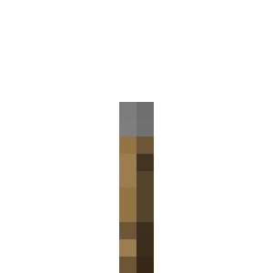 <strong>Заменить предметы</strong> <code>player_replace_items</code></td><td>Заменяет указанные предметы в инвентаре на определённый предмет.</td><td> <strong>Заменяемые предметы</strong>  <strong>Заменяющий предмет</strong>  <strong>Количество предметов для замены</strong></td></tr><tr><td> <strong>Удалить предметы</strong> <code>player_remove_items</code></td><td>Удаляет указанные предметы из инвентаря игрока.</td><td> <strong>Предметы для удаления</strong></td></tr><tr><td> <strong>Очистить предметы</strong> <code>player_clear_items</code></td><td>Удаляет все выбранные предметы из инвентаря игрока.</td><td> <strong>Предметы для очистки</strong></td></tr><tr><td> <strong>Очистить инвентарь</strong> <code>player_clear_inventory</code></td><td>Очищает инвентарь игрока.</td><td> <strong>Режим очистки</strong> <a data-footnote-ref href="#user-content-fn-2"><strong><code>-></code></strong></a></td></tr><tr><td>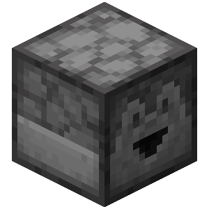 <strong>Выдать случайный предмет</strong> <code>player_give_random_item</code></td><td>Выдаёт игроку случайный предмет или стак из предметов в сундуке.</td><td> <strong>Предметы для выбора</strong></td></tr><tr><td> <strong>Установить предмет на курсор</strong> <code>player_set_cursor_item</code></td><td>Устанавливает предмет на курсор игрока.</td><td> <strong>Предмет для установки</strong></td></tr><tr><td>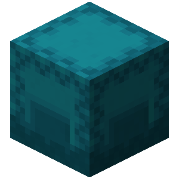 <strong>Сохранить текущий инвентарь</strong> <code>player_save_inventory</code></td><td>Сохраняет текущий инвентарь игрока. Его можно будет загрузить позже с помощью 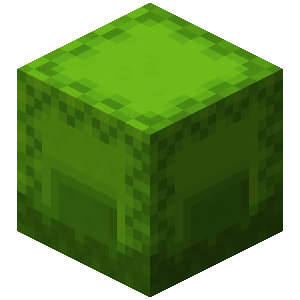 <strong>Загрузить сохранённый инвентарь</strong>.</td><td></td></tr><tr><td> <strong>Загрузить сохранённый инвентарь</strong> <code>player_load_inventory</code></td><td>Загружает выбранный сохранённый инвентарь.  » Если нет сохранённого инвентаря, инвентарь игрока будет очищен.</td><td></td></tr><tr><td>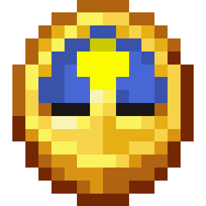 <strong>Установить задержку предмета</strong> <code>player_set_item_cooldown</code></td><td>Применяет визуальный эффект шкалы задержки для всех предметов выбранного типа.  » Задержка будет применена ко всем предметам выбранного типа.</td><td> <strong>Тип предмета для задержки</strong>  <strong>Задержка в тиках</strong>  <strong>Звук сброса задержки</strong></td></tr><tr><td> <strong>Установить задержку для группы предметов</strong> <code>player_set_item_group_cooldown</code></td><td>Применяет визуальный эффект шкалы задержки для всех предметов указанной группы.  » Задержка будет применена ко всем предметам, которые относятся к указанной группе.</td><td> <strong>Группа предметов</strong>  <strong>Задержка</strong> </td></tr><tr><td> <strong>Установить содержимое Эндер-сундука</strong> <code>player_set_ender_chest_contents</code></td><td>Устанавливает предметы в инвентарь Эндер-сундука игрока.</td><td> <strong>Предметы для установки</strong></td></tr><tr><td> <strong>Очистить содержимое Эндер-сундука</strong> <code>player_clear_ender_chest_contents</code></td><td>Очищает предметы в инвентаре Эндер-сундука игрока.</td><td></td></tr></tbody></table>




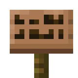 <strong>Отображение текста, отправка сообщений и проигрывание эффектов.</strong>

***

<table data-full-width="true"><thead><tr><th>Опция</th><th>Описание</th><th>Аргументы</th></tr></thead><tbody><tr><td> <strong>Отправить сообщение</strong> <code>player_send_message</code></td><td>Отправляет сообщение в чат указанным игрокам.</td><td> <strong>Текст для отправки</strong>  <strong>Объединение текста</strong> <a data-footnote-ref href="#user-content-fn-3"><strong><code>-></code></strong></a></td></tr><tr><td> <strong>Диалог</strong> <code>player_send_dialogue</code></td><td>Отправляет несколько сообщений в чат выбранным игрокам с задержкой после каждого сообщения.</td><td> <strong>Текст для отправки</strong>  <strong>Задержка между сообщениями</strong></td></tr><tr><td> <strong>Очистить чат</strong> <code>player_clear_chat</code></td><td>Удаляет все сообщения из окна чата выбранных игроков.</td><td></td></tr><tr><td> <strong>Отправить титул</strong> <code>player_send_title</code></td><td>Высвечивает выбранному игроку две надписи на экран - титул и подтитул.</td><td> <strong>Текст титула</strong>  <strong>Текст подтитула</strong>  <strong>Время появления в тиках</strong>  <strong>Задержка в тиках</strong>  <strong>Время удаления в тиках</strong></td></tr><tr><td>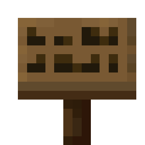 <strong>Отправить экшн-бар</strong> <code>player_send_action_bar</code></td><td>Высвечивает выбранному игроку экшн-бар.</td><td> <strong>Сообщения в экшн-баре</strong>  <strong>Объединение текста</strong> <a data-footnote-ref href="#user-content-fn-4"><strong><code>-></code></strong></a></td></tr><tr><td> <strong>Открыть книгу</strong> <code>player_open_book</code></td><td>Открывает книгу определённому игроку.</td><td> <strong>Книга для открытия</strong></td></tr><tr><td> <strong>Установить босс-бар</strong> <code>player_set_boss_bar</code></td><td>Устанавливает у определённого игрока пользовательский босс-бар.</td><td> <strong>ID босс-бара</strong>  <strong>Текст</strong>  <strong>Заполненность (0-100)</strong>  <strong>Цвет</strong> <a data-footnote-ref href="#user-content-fn-5"><strong><code>-></code></strong></a>  <strong>Стиль</strong> <a data-footnote-ref href="#user-content-fn-6"><strong><code>-></code></strong></a>  <strong>Эффект неба</strong> <a data-footnote-ref href="#user-content-fn-7"><strong><code>-></code></strong></a></td></tr><tr><td>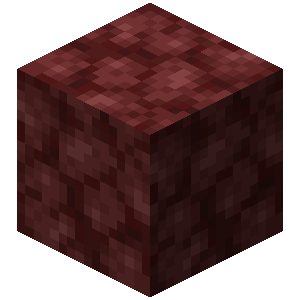 <strong>Удалить босс-бар</strong> <code>player_remove_boss_bar</code></td><td>Удаляет имеющийся босс-бар у определённого игрока.</td><td> <strong>ID босс-бара</strong></td></tr><tr><td> <strong>Отправить достижение игроку</strong> <code>player_send_advancement</code></td><td>Высвечивает игроку пользовательское всплывающее достижение.</td><td> <strong>Тип достижения</strong> <a data-footnote-ref href="#user-content-fn-8"><strong><code>-></code></strong></a>  <strong>Название достижения</strong>  <strong>Иконка достижения</strong></td></tr><tr><td> <strong>Установить текст в списке игроков</strong> <code>player_set_player_list_info</code></td><td>Устанавливает текст над или под списком игроков для игрока.</td><td> <strong>Текст в списке игроков</strong>  <strong>Позиция</strong> <a data-footnote-ref href="#user-content-fn-9"><strong><code>-></code></strong></a>  <strong>Объединение текста</strong> <a data-footnote-ref href="#user-content-fn-3"><strong><code>-></code></strong></a></td></tr><tr><td> <strong>Проиграть звук</strong> <code>player_play_sound</code></td><td>Проигрывает звук игроку.</td><td> <strong>Звук для проигрывания</strong>  <strong>Местоположение звука</strong></td></tr><tr><td> <strong>Проиграть звук от сущности</strong> <code>player_play_sound_from_entity</code></td><td>Проигрывает звук игроку от указанной сущности.  » Стерео звуки не будут проигрываться.</td><td> <strong>Звук для проигрывания</strong>  <strong>Имя или UUID сущности</strong></td></tr><tr><td> <strong>Остановить звук</strong> <code>player_stop_sound</code></td><td>Останавливает все или определённые звуки для игрока.</td><td> <strong>Эффекты для остановки</strong></td></tr><tr><td> <strong>Остановить звуки по источнику</strong> <code>player_stop_sounds_by_source</code></td><td>Останавливает все звуки по определённому источнику.</td><td> <strong>Источник звука</strong> <a data-footnote-ref href="#user-content-fn-10"><strong><code>-></code></strong></a></td></tr><tr><td> <strong>Проиграть последовательность звуков</strong> <code>player_play_sound_sequence</code></td><td>Проигрывает игроку последовательность звуков с задержкой между каждым звуком.</td><td> <strong>Звуки для проигрывателя</strong>  <strong>Задержка в тиках</strong>  <strong>Местоположение звука</strong></td></tr><tr><td> <strong>Показать диалоговое окно</strong> <code>player_show_dialog_menu_from_nbt</code></td><td>Показывает игроку диалоговое окно из NBT-тегов.</td><td> <strong>NBT-теги диалогового окна</strong></td></tr><tr><td>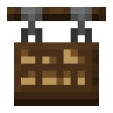 <strong>Закрыть диалоговое окно</strong> <code>player_close_dialog_menu</code></td><td>Закрывает текущее диалоговое окно игроку.</td><td></td></tr><tr><td> <strong>Обновление подсказок в чате</strong> <code>player_set_chat_completions</code></td><td>Обновляет игроку подсказки, показываемые при вводе текста в чате.</td><td> <strong>Подсказки</strong>  <strong>Тип обновления</strong> <a data-footnote-ref href="#user-content-fn-11"><strong><code>-></code></strong></a></td></tr><tr><td> <strong>Показать экран титров</strong> <code>player_show_win_screen</code></td><td>Показывает игроку экран титров.  » Действие <a href="player_action.md#inventarnye-menyu">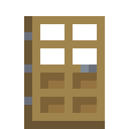 <strong>Закрыть Меню</strong></a> закрывает титры.</td><td></td></tr><tr><td> <strong>Показать экран демо-режима</strong> <code>player_show_demo_screen</code></td><td>Показывает игроку экран демо-режима.</td><td></td></tr></tbody></table>




 <strong>Отображение и изменение предметов в инвентарном меню.</strong>

***

<table data-full-width="true"><thead><tr><th>Опция</th><th>Описание</th><th>Аргументы</th></tr></thead><tbody><tr><td> <strong>Показать меню</strong> <code>player_show_inventory_menu</code></td><td>Показывает игроку инвентарное меню с выбранными предметами и названием.</td><td> <strong>Предметы инвентаря</strong>  <strong>Название инвентаря</strong>  <strong>Тип инвентаря</strong> <a data-footnote-ref href="#user-content-fn-12"><strong><code>-></code></strong></a></td></tr><tr><td>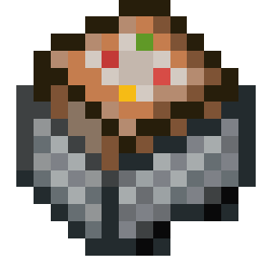 <strong>Расширить меню</strong> <code>player_expand_inventory_menu</code></td><td>Расширяет открытое инвентарное меню игрока на выбранное количество строк и заполняет его указанными предметами.</td><td> <strong>Предметы для заполнения</strong>  <strong>Количество строк для расширения</strong></td></tr><tr><td> <strong>Установить предмет в слот</strong> <code>player_set_inventory_menu_item</code></td><td>Устанавливает предмет в указанный слот открытого инвентарного меню игрока.</td><td> <strong>Предмет для установки</strong>  <strong>Слот для установки</strong></td></tr><tr><td> <strong>Установить название меню</strong> <code>player_set_inventory_menu_name</code></td><td>Устанавливает новое название для открытого инвентарного меню игрока.</td><td> <strong>Новое название</strong></td></tr><tr><td> <strong>Установить кастомный ID открытого инвентаря</strong> <code>player_set_inventory_menu_custom_id</code></td><td>Устанавливает кастомный ID для открытого меню игрока.</td><td> <strong>Кастомный ID</strong></td></tr><tr><td> <strong>Добавить строку меню</strong> <code>player_add_inventory_menu_row</code></td><td>Добавляет строку с указанными предметами в инвентаре типа "Сундук".</td><td> <strong>Предметы</strong>  <strong>Позиция строки</strong> <a data-footnote-ref href="#user-content-fn-13"><strong><code>-></code></strong></a></td></tr><tr><td> <strong>Убрать строки меню</strong> <code>player_remove_inventory_menu_row</code></td><td>Убирает одну или несколько строк в инвентаре типа "Сундук".</td><td> <strong>Количество строк</strong>  <strong>Позиция строки</strong> <a data-footnote-ref href="#user-content-fn-14"><strong><code>-></code></strong></a></td></tr><tr><td> <strong>Закрыть меню</strong> <code>player_close_inventory</code></td><td>Закрывает открытое инвентарное меню игрока.</td><td></td></tr><tr><td> <strong>Открыть меню блока</strong> <code>player_open_container_inventory</code></td><td>Открывает для игрока меню блока в указанном местоположении.</td><td> <strong>Местоположение блока для открытия</strong></td></tr></tbody></table>




 <strong>Изменение параметров игрока, такие как здоровье, голод, опыт и другое.</strong>

***

<table data-full-width="true"><thead><tr><th>Опция</th><th>Описание</th><th>Аргументы</th></tr></thead><tbody><tr><td> <strong>Нанести урон</strong> <code>player_damage</code></td><td>Наносит урон игроку.</td><td> <strong>Количество урона</strong>  <strong>Источник урона (имя или UUID существа)</strong></td></tr><tr><td>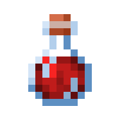 <strong>Исцелить игрока</strong> <code>player_heal</code></td><td>Исцеляет игрока.</td><td> <strong>Количество половинок сердец для излечения</strong></td></tr><tr><td> <strong>Установить здоровье игрока</strong> <code>player_set_health</code></td><td>Устанавливает здоровье игрока на выбранное количество.</td><td> <strong>Количество здоровья</strong></td></tr><tr><td> <strong>Установить максимальное здоровье игрока</strong> <code>player_set_max_health</code></td><td>Устанавливает максимальное количество здоровья для игрока.</td><td> <strong>Максимальное количество здоровья</strong>  <strong>Исцелить игрока</strong> <a data-footnote-ref href="#user-content-fn-15"><strong><code>-></code></strong></a></td></tr><tr><td> <strong>Установить дополнительное здоровье</strong> <code>player_set_absorption_health</code></td><td>Устанавливает дополнительное здоровье игрока.</td><td> <strong>Количество дополнительного здоровья</strong></td></tr><tr><td>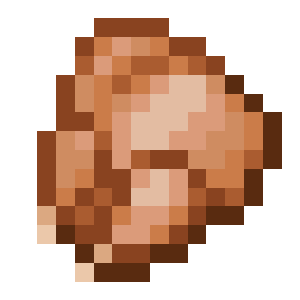 <strong>Установить голод</strong> <code>player_set_food</code></td><td>Устанавливает уровень голода игроку.</td><td> <strong>Уровень голода</strong>  <strong>Режим установки</strong> <a data-footnote-ref href="#user-content-fn-16"><strong><code>-></code></strong></a></td></tr><tr><td>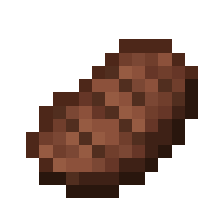 <strong>Установить насыщенность</strong> <code>player_set_saturation</code></td><td>Устанавливает второстепенный уровень голода (насыщенность) игроку.</td><td> <strong>Уровень насыщенности</strong>  <strong>Режим установки</strong> <a data-footnote-ref href="#user-content-fn-16"><strong><code>-></code></strong></a></td></tr><tr><td> <strong>Установить уровень истощения</strong> <code>player_set_exhaustion</code></td><td>Устанавливает уровень истощения игроку.</td><td> <strong>Уровень истощения</strong>  <strong>Режим установки</strong> <a data-footnote-ref href="#user-content-fn-16"><strong><code>-></code></strong></a></td></tr><tr><td>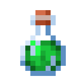 <strong>Прибавить уровень</strong> <code>player_give_experience</code></td><td>Прибавляет уровень игроку.</td><td> <strong>Количество для прибавки</strong>  <strong>Тип прибавления</strong> <a data-footnote-ref href="#user-content-fn-17"><strong><code>-></code></strong></a></td></tr><tr><td> <strong>Установить уровень</strong> <code>player_set_experience</code></td><td>Устанавливает уровень игроку.</td><td> <strong>Количество для установки</strong>  <strong>Тип установки</strong> <a data-footnote-ref href="#user-content-fn-18"><strong><code>-></code></strong></a></td></tr><tr><td> <strong>Выдать эффект</strong> <code>player_give_potion_effect</code></td><td>Выдаёт выбранные эффекты игроку.</td><td> <strong>Эффекты для выдачи</strong>  <strong>Перезаписывать существующие эффекты</strong> <a data-footnote-ref href="#user-content-fn-19"><strong><code>-></code></strong></a>  <strong>Показывать иконку эффекта</strong> <a data-footnote-ref href="#user-content-fn-20"><strong><code>-></code></strong></a>  <strong>Показывать частицы</strong> <a data-footnote-ref href="#user-content-fn-21"><strong><code>-></code></strong></a></td></tr><tr><td> <strong>Удалить эффект</strong> <code>player_remove_potion_effect</code></td><td>Удаляет выбранные эффекты у игрока.</td><td> <strong>Эффекты для удаления</strong></td></tr><tr><td> <strong>Очистить эффекты</strong> <code>player_clear_potion_effects</code></td><td>Очищает все эффекты у игрока.</td><td></td></tr><tr><td> <strong>Установить слот</strong> <code>player_set_hotbar_slot</code></td><td>Устанавливает выбранный слот игроку.</td><td> <strong>Номер слота</strong></td></tr><tr><td> <strong>Установить скорость атаки</strong> <code>player_set_attack_speed</code></td><td>Устанавливает скорость атаки игроку.</td><td> <strong>Скорость атаки</strong></td></tr><tr><td> <strong>Установить длительность неуязвимости</strong> <code>player_set_invulnerability_ticks</code></td><td>Устанавливает длительность неуязвимости для игрока.</td><td> <strong>Длительность неуязвимости (в тиках)</strong></td></tr><tr><td> <strong>Установить максимальную длительность неуязвимости</strong> <code>player_set_max_invulnerability_ticks</code></td><td>Устанавливает максимальную длительность неуязвимости для игрока.</td><td> <strong>Длительность (в тиках)</strong></td></tr><tr><td> <strong>Поджечь игрока</strong> <code>player_set_fire_ticks</code></td><td>Поджигает игрока на выбранное время.</td><td> <strong>Длительность (в тиках)</strong></td></tr><tr><td> <strong>Установить время заморозки</strong> <code>player_set_freeze_ticks</code></td><td>Устанавливает игроку время заморозки (количество тиков, которое игрок провёл в рыхлом снегу).</td><td> <strong>Время заморозки в тиках</strong>  <strong>Блокировка состояния (время не будет изменяться)</strong> <a data-footnote-ref href="#user-content-fn-22"><strong><code>-></code></strong></a></td></tr><tr><td> <strong>Установить оставшийся воздух</strong> <code>player_set_air_ticks</code></td><td>Устанавливает оставшийся воздух игроку.</td><td> <strong>Количество оставшегося воздуха (в тиках)</strong></td></tr><tr><td> <strong>Установить дистанцию падения</strong> <code>player_set_fall_distance</code></td><td>Устанавливает дистанцию, с которой падает игрок.</td><td> <strong>Дистанция падения</strong></td></tr><tr><td>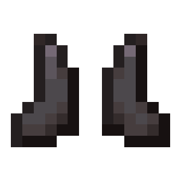 <strong>Установить скорость движения</strong> <code>player_set_movement_speed</code></td><td>Устанавливает скорость движения игрока.</td><td> <strong>Скорость движения</strong>  <strong>Тип движения</strong> <a data-footnote-ref href="#user-content-fn-23"><strong><code>-></code></strong></a></td></tr><tr><td> <strong>Установить атрибут</strong> <code>player_set_attribute</code></td><td>Устанавливает игроку указанное значение атрибута.</td><td> <strong>Значение атрибута</strong>  <strong>Тип атрибута</strong> <a data-footnote-ref href="#user-content-fn-24"><strong><code>-></code></strong></a></td></tr></tbody></table>




 <strong>Базовые настройки игрока, такие как режим игры, полёт и другое.</strong>

***

<table data-full-width="true"><thead><tr><th>Опция</th><th>Описание</th><th>Аргументы</th></tr></thead><tbody><tr><td> <strong>Установить режим игры</strong> <code>player_set_gamemode</code></td><td>Устанавливает режим игры для игрока.</td><td> <strong>Режим игры</strong> <a data-footnote-ref href="#user-content-fn-25"><strong><code>-></code></strong></a>  <strong>Режим полёта</strong> <a data-footnote-ref href="#user-content-fn-26"><strong><code>-></code></strong></a></td></tr><tr><td> <strong>Установить разрешение полёта игрока</strong> <code>player_set_allow_flying</code></td><td>Устанавливает разрешение полёта для игрока.</td><td> <strong>Может летать</strong> <a data-footnote-ref href="#user-content-fn-27"><strong><code>-></code></strong></a></td></tr><tr><td>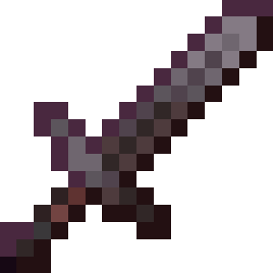 <strong>Установить разрешение атаковать игроков</strong> <code>player_set_pvp</code></td><td>Устанавливает разрешение игроку атаковать других игроков и наносить им урон.</td><td> <strong>Может атаковать</strong> <a data-footnote-ref href="#user-content-fn-28"><strong><code>-></code></strong></a></td></tr><tr><td> <strong>Установить выпадение предметов</strong> <code>player_set_death_drops</code></td><td>Устанавливает выпадение предметов из игрока при смерти.</td><td> <strong>Выпадение предметов</strong> <a data-footnote-ref href="#user-content-fn-29"><strong><code>-></code></strong></a></td></tr><tr><td> <strong>Установить сохранение инвентаря</strong> <code>player_set_inventory_kept</code></td><td>Устанавливает игроку сохранение инвентаря при смерти.</td><td> <strong>Сохранение инвентаря</strong> <a data-footnote-ref href="#user-content-fn-30"><strong><code>-></code></strong></a></td></tr><tr><td> <strong>Установить режим столкновения</strong> <code>player_set_collidable</code></td><td>Устанавливает игроку режим столкновения с существами.</td><td> <strong>Режим столкновения</strong> <a data-footnote-ref href="#user-content-fn-31"><strong><code>-></code></strong></a></td></tr><tr><td> <strong>Установить видимость</strong> <code>player_set_default_visible</code></td><td>Устанавливает игроку видимость.  » Видимость игрока может быть изменена через действие <a href="player_action.md#mir"> <strong>Скрыть сущность игроку</strong></a>.</td><td> <strong>Видимость</strong> <a data-footnote-ref href="#user-content-fn-32"><strong><code>-></code></strong></a></td></tr><tr><td> <strong>Отображение ника игрока</strong> <code>player_set_nametag_visible</code></td><td>Отобразит или скроет ник над головой.</td><td> <strong>Отображение ника</strong> <a data-footnote-ref href="#user-content-fn-33"><strong><code>-></code></strong></a></td></tr><tr><td> <strong>Установить мгновенное возрождение</strong> <code>player_set_instant_respawn</code></td><td>Устанавливает мгновенное возрождение игроку.</td><td> <strong>Мгновенное возрождение</strong> <a data-footnote-ref href="#user-content-fn-34"><strong><code>-></code></strong></a></td></tr><tr><td> <strong>Установить местоположение возрождения</strong> <code>player_set_spawn_point</code></td><td>Устанавливает игроку новое местоположение возрождения.</td><td> <strong>Местоположение возрождения</strong></td></tr></tbody></table>




 <strong>Запуск, телепортация и другие взаимодействия, связанные с перемещением игрока.</strong>

***

<table data-full-width="true"><thead><tr><th>Опция</th><th>Описание</th><th>Аргументы</th></tr></thead><tbody><tr><td> <strong>Телепортация</strong> <code>player_teleport</code></td><td>Телепортирует игрока в выбранное местоположение.  » Закрывает открытое инвентарное меню.</td><td> <strong>Новая позиция</strong>  <strong>Оставить текущий поворот</strong> <a data-footnote-ref href="#user-content-fn-35"><strong><code>-></code></strong></a>  <strong>Сохранение инерции</strong> <a data-footnote-ref href="#user-content-fn-36"><strong><code>-></code></strong></a>  <strong>Спешиться после телепортации</strong> <a data-footnote-ref href="#user-content-fn-37"><strong><code>-></code></strong></a></td></tr><tr><td> <strong>Случайная телепортация</strong> <code>player_randomized_teleport</code></td><td>Телепортирует игрока в случайное местоположение.</td><td> <strong>Позиции для телепорта</strong>  <strong>Оставить текущий поворот</strong> <a data-footnote-ref href="#user-content-fn-35"><strong><code>-></code></strong></a>  <strong>Сохранение инерции</strong> <a data-footnote-ref href="#user-content-fn-36"><strong><code>-></code></strong></a>  <strong>Спешиться после телепортации</strong> <a data-footnote-ref href="#user-content-fn-37"><strong><code>-></code></strong></a></td></tr><tr><td> <strong>Последовательность телепортаций</strong> <code>player_teleport_sequence</code></td><td>Телепортирует игрока между местоположениями с заданной задержкой.</td><td> <strong>Задержка в тиках</strong>  <strong>Позиции для телепортации</strong></td></tr><tr><td> <strong>Подбросить вверх</strong> <code>player_launch_up</code></td><td>Подбрасывает игрока вверх или вниз в зависимости от силы.</td><td> <strong>Сила подбрасывания</strong>  <strong>Учитывать текущую инерцию</strong> <a data-footnote-ref href="#user-content-fn-38"><strong><code>-></code></strong></a></td></tr><tr><td> <strong>Запустить вперёд</strong> <code>player_launch_forward</code></td><td>Запускает игрока вперёд или назад по направлению взгляда в зависимости от силы.</td><td> <strong>Сила подбрасывания</strong>  <strong>Учитывать текущую инерцию</strong> <a data-footnote-ref href="#user-content-fn-38"><strong><code>-></code></strong></a>  <strong>Ось запуска</strong> <a data-footnote-ref href="#user-content-fn-39"><strong><code>-></code></strong></a></td></tr><tr><td> <strong>Запустить к местоположению</strong> <code>player_launch_to_location</code></td><td>Запускает игрока к выбранному местоположению.</td><td> <strong>Конечная позиция</strong>  <strong>Сила запуска</strong>  <strong>Учитывать текущую инерцию</strong> <a data-footnote-ref href="#user-content-fn-38"><strong><code>-></code></strong></a></td></tr><tr><td> <strong>Посадить на существо</strong> <code>player_ride_entity</code></td><td>Сажает игрока на существо или другого игрока.</td><td> <strong>Имя или UUID цели</strong></td></tr><tr><td> <strong>Высадить из транспорта</strong> <code>player_leave_vehicle</code></td><td>Высаживает игрока из транспорта или существа.</td><td></td></tr><tr><td> <strong>Установить полёт</strong> <code>player_set_flying</code></td><td>Устанавливает для игрока состояние полёта.</td><td> <strong>Полёт</strong> <a data-footnote-ref href="#user-content-fn-40"><strong><code>-></code></strong></a></td></tr><tr><td> <strong>Установить полёт на элитрах</strong> <code>player_set_gliding</code></td><td>Устанавливает для игрока состояние полёта на элитрах.</td><td> <strong>Полёт на элитрах</strong> <a data-footnote-ref href="#user-content-fn-41"><strong><code>-></code></strong></a></td></tr><tr><td> <strong>Установить поворот</strong> <code>player_set_rotation</code></td><td>Устанавливает поворот игрока.</td><td> <strong>Горизонтальный поворот (yaw)</strong>  <strong>Вертикальный поворот (pitch)</strong></td></tr><tr><td> <strong>Установить поворот по вектору</strong> <code>player_set_rotation_by_vector</code></td><td>Устанавливает поворот игрока по вектору.</td><td> <strong>Вектор для поворота</strong></td></tr><tr><td> <strong>Повернуть к местоположению</strong> <code>player_face_location</code></td><td>Поворачивает игрока в сторону к местоположению.</td><td> <strong>Местоположение</strong></td></tr><tr><td> <strong>Запустить по вектору</strong> <code>player_set_velocity</code></td><td>Запускает игрока по указанному вектору.</td><td> <strong>Вектор движения</strong>  <strong>Учитывать текущую инерцию</strong> <a data-footnote-ref href="#user-content-fn-38"><strong><code>-></code></strong></a></td></tr><tr><td> <strong>Следить за целью</strong> <code>player_spectate_target</code></td><td>Устанавливает цель слежения игрока в режиме наблюдателя.</td><td> <strong>Имя или UUID цели</strong></td></tr><tr><td>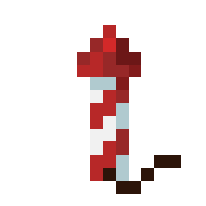 <strong>Ускорить полёт на элитрах</strong> <code>player_boost_elytra</code></td><td>Ускоряет полёт игрока на элитрах с силой указанного фейерверка.</td><td> <strong>Фейерверк для ускорения</strong></td></tr></tbody></table>




 <strong>Отображение визуальных эффектов в мире, связанные с игроком.</strong>

***

<table data-full-width="true"><thead><tr><th>Опция</th><th>Описание</th><th>Аргументы</th></tr></thead><tbody><tr><td> <strong>Запустить снаряд</strong> <code>player_launch_projectile</code></td><td>Запустить снаряд из местоположения игрока.</td><td> <strong>Снаряд для запуска</strong>  <strong>Место запуска</strong>  <strong>Имя снаряда</strong>  <strong>Скорость снаряда</strong>  <strong>Отклонение снаряда (0, чтобы снаряд летел ровно)</strong>  <strong>След, который будет оставаться за снарядом</strong></td></tr><tr><td> <strong>Установить время игрока</strong> <code>player_set_time</code></td><td>Установить время игроку, не меняя его для остальных игроков.</td><td> <strong>Время в тиках</strong></td></tr><tr><td> <strong>Установить погоду</strong> <code>player_set_weather</code></td><td>Установить погоду для игрока, не влияя на других игроков.</td><td> <strong>Тип погоды</strong> <a data-footnote-ref href="#user-content-fn-42"><strong><code>-></code></strong></a></td></tr><tr><td> <strong>Установить уровень дождя</strong> <code>player_set_rain_level</code></td><td>Устанавливает уровень дождя игроку.</td><td> <strong>Уровень дождя (от 0 до 100)</strong></td></tr><tr><td>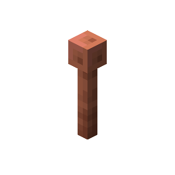 <strong>Установить уровень грозы</strong> <code>player_set_thunder_level</code></td><td>Устанавливает уровень грозы игроку.  » Для установки необходима дождливая погода.</td><td> <strong>Уровень грозы (от 0 до 100)</strong></td></tr><tr><td>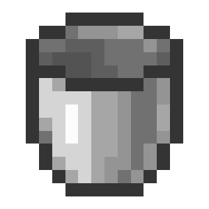 <strong>Сбросить погоду</strong> <code>player_reset_weather</code></td><td>Сбрасывает погоду игроку.</td><td></td></tr><tr><td> <strong>Установить цель компаса</strong> <code>player_set_compass_target</code></td><td>Установить цель компаса для игрока, в сторону которой будет крутиться стрелка компаса.</td><td> <strong>Цель компаса</strong></td></tr><tr><td>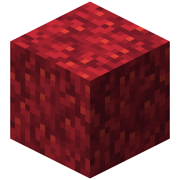 <strong>Показать блок</strong> <code>player_display_block</code></td><td>Показать игроку блок, не влияя на других игроков.</td><td> <strong>Местоположение блока</strong>  <strong>Блок, который требуется отобразить</strong></td></tr><tr><td>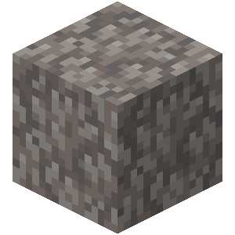 <strong>Скрыть отображаемые блоки</strong> <code>player_remove_display_blocks</code></td><td>Скрывает от игрока все отображаемые блоки в выбранном пространстве, не влияя на других игроков (максимальный размер пространства - 500 блоков).</td><td> <strong>Местоположение первого угла</strong>  <strong>Местоположение второго угла</strong></td></tr><tr><td>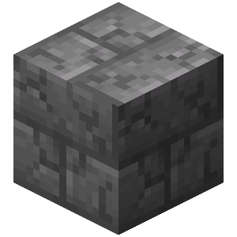 <strong>Показать анимацию ломания блока</strong> <code>player_send_break_animation</code></td><td>Показывает анимацию ломания блока (трещины) для игрока, не влияя на других игроков.</td><td> <strong>Местоположения блоков</strong>  <strong>Уровень разрушения блока (от 0 до 10)</strong></td></tr><tr><td> <strong>Открыть/Закрыть блок</strong> <code>player_set_block_opened_state</code></td><td>Отобразить игроку закрытие/открытие блока не меняя состояния блока для других игроков.  Работает с: » Сундуком » Сундуком-ловушкой » Эндер-сундуком » Шалкеровым ящиком » Бочкой</td><td> <strong>Местоположение блока</strong>  <strong>Состояние</strong> <a data-footnote-ref href="#user-content-fn-43"><strong><code>-></code></strong></a></td></tr><tr><td> <strong>Показать текст таблички</strong> <code>player_display_sign_text</code></td><td>Показать игроку изменение текста таблички, не изменяя её текст для других игроков.</td><td> <strong>Местоположение таблички</strong>  <strong>Первая строка таблички</strong>  <strong>Вторая строка таблички</strong>  <strong>Третья строка таблички</strong>  <strong>Четвёртая строка таблички</strong></td></tr><tr><td> <strong>Показать голограмму</strong> <code>player_display_hologram</code></td><td>Показывает игроку голограмму. Чтобы удалить голограмму на местоположении, оставьте текст пустым.  » Чтобы перенести текст на новую строку, используйте символы <code>\n</code>, к примеру: <code>Строка1\nСтрока2</code>.</td><td> <strong>Местоположение голограммы</strong>  <strong>Текст голограммы</strong></td></tr><tr><td>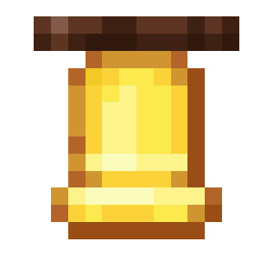 <strong>Показать удар в колокол</strong> <code>player_display_bell_ring</code></td><td>Показывает игроку анимацию удара в колокол, не влияя на других игроков.  Работает с: » Колоколами  » Направление "Вниз" останавливает анимацию удара.</td><td> <strong>Местоположение колокола</strong>  <strong>Направление удара</strong> <a data-footnote-ref href="#user-content-fn-44"><strong><code>-></code></strong></a></td></tr><tr><td> <strong>Установить границу мира игроку</strong> <code>player_set_world_border</code></td><td>Установить границу мира для игрока, не меняя её для других игроков.</td><td> <strong>Центр границы мира</strong>  <strong>Размер границы мира</strong>  <strong>Расстояние до появления красной обводки</strong></td></tr><tr><td>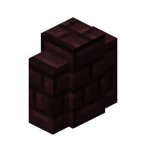 <strong>Передвинуть границу мира</strong> <code>player_shift_world_border</code></td><td>Передвинуть границу мира для игрока, не меняя её для других игроков.</td><td> <strong>Старый размер границы мира</strong>  <strong>Новый размер границы мира</strong>  <strong>Время изменения размера</strong></td></tr><tr><td>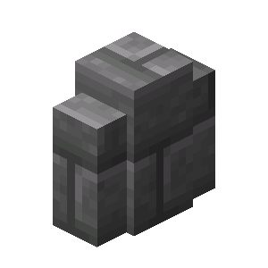 <strong>Удалить границу мира</strong> <code>player_remove_world_border</code></td><td>Установить границу мира для игрока на значение по умолчанию.</td><td></td></tr><tr><td> <strong>Установить тик-рейт</strong> <code>player_set_tick_rate</code></td><td>Устанавливает игроку тик-рейт, не влияя на других игроков.</td><td> <strong>Тик-рейт</strong></td></tr><tr><td> <strong>Скрыть сущность игроку</strong> <code>player_hide_entity</code></td><td>Скрывает указанную сущность для игрока.</td><td> <strong>Имя или UUID сущности</strong>  <strong>Скрытие</strong> <a data-footnote-ref href="#user-content-fn-45"><strong><code>-></code></strong></a></td></tr><tr><td> <strong>Установить дистанцию прорисовки</strong> <code>player_set_fog_distance</code></td><td>Устанавливает дистанцию прорисовки чанков для игрока. Значение "-1" сбрасывает до стандартной.</td><td> <strong>Дистанция прорисовки в чанках (2-32)</strong></td></tr><tr><td> <strong>Установить дистанцию симуляции</strong> <code>player_set_simulation_distance</code></td><td>Устанавливает дистанцию симуляции чанков для игрока.</td><td> <strong>Дистанция симуляции в чанках (2-32)</strong></td></tr><tr><td>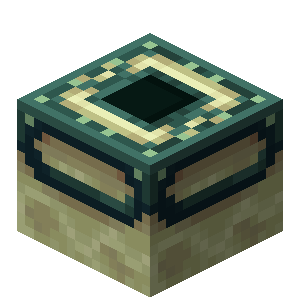 <strong>Показать анимацию луча Врат Энда</strong> <code>player_display_end_gateway_beam</code></td><td>Показывает анимацию луча Врат Энда на определённом местоположении.</td><td> <strong>Местоположение луча</strong>  <strong>Цвет луча</strong> <a data-footnote-ref href="#user-content-fn-46"><strong><code>-></code></strong></a></td></tr><tr><td> <strong>Показать анимацию подбора предмета</strong> <code>player_display_pick_up_animation</code></td><td>Показывает игроку анимацию подбора предмета.  » Действие работает с любой сущностью, в том числе игроком.</td><td> <strong>Имя или UUID поднимаемой сущности</strong>  <strong>Имя или UUID сущности, которая поднимает</strong>  <strong>Количество поднимаемых предметов</strong></td></tr><tr><td>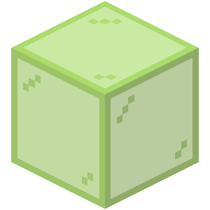 <strong>Показать отладочный маркер</strong> <code>player_show_debug_marker</code></td><td>Показывает игроку отладочный маркер на местоположении на указанное время. Красный и синий цвет работают для игроков на версии 1.19.4 и выше.  » Оставьте аргумент "Отображаемое имя" пустым, чтобы полностью скрыть имя.</td><td> <strong>Местоположение появления</strong>  <strong>Отображаемое имя</strong>  <strong>Длительность в миллисекундах (не обязательно)</strong>  <strong>Красный цвет (от 0 до 100)</strong>  <strong>Зелёный цвет (от 0 до 100)</strong>  <strong>Синий цвет (от 0 до 100)</strong>  <strong>Прозрачность (от 0 до 100)</strong></td></tr><tr><td> <strong>Удалить отладочные маркеры</strong> <code>player_clear_debug_markers</code></td><td>Удаляет все отладочные маркеры для игрока.</td><td></td></tr><tr><td> <strong>Установить свечение сущности</strong> <code>player_set_entity_glowing</code></td><td>Включает или выключает свечение сущности для данного игрока.</td><td> <strong>Имя или UUID сущности</strong>  <strong>Цвет свечения</strong> <a data-footnote-ref href="#user-content-fn-47"><strong><code>-></code></strong></a>  <strong>Свечение</strong> <a data-footnote-ref href="#user-content-fn-48"><strong><code>-></code></strong></a></td></tr></tbody></table>




 <strong>Отображение различных эффектов частиц для игроков.</strong>

***

<table data-full-width="true"><thead><tr><th>Опция</th><th>Описание</th><th>Аргументы</th></tr></thead><tbody><tr><td> <strong>Отобразить эффект частицы</strong> <code>player_display_particle</code></td><td>Отображает игроку эффект частицы на выбранном местоположении.</td><td> <strong>Эффект частиц для отображения</strong>  <strong>Местоположение эффекта</strong></td></tr><tr><td>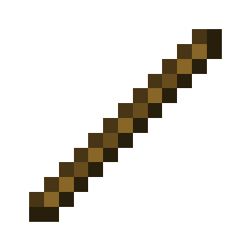 <strong>Отобразить линию частиц</strong> <code>player_display_particle_line</code></td><td>Отображает игроку линию эффекта частиц от начального местоположения до конечного с определённым расстоянием.</td><td> <strong>Эффект частиц для отображения</strong>  <strong>Начальное местоположение</strong>  <strong>Конечное местоположение</strong>  <strong>Количество/расстояние между частицами</strong>  <strong>Тип отображения частиц</strong> <a data-footnote-ref href="#user-content-fn-49"><strong><code>-></code></strong></a></td></tr><tr><td> <strong>Отобразить луч частиц</strong> <code>player_display_particle_ray</code></td><td>Отображает игроку луч эффекта частиц от начального местоположения по указанному вектору с определённым расстоянием.</td><td> <strong>Эффект частиц для отображения</strong>  <strong>Начальное местоположение</strong>  <strong>Направление луча</strong>  <strong>Количество/расстояние между частицами</strong>  <strong>Тип отображения частиц</strong> <a data-footnote-ref href="#user-content-fn-49"><strong><code>-></code></strong></a></td></tr><tr><td> <strong>Отобразить окружность частиц</strong> <code>player_display_particle_circle</code></td><td>Отображает игроку окружность из эффекта частиц с указанными параметрами.</td><td> <strong>Эффект частиц для отображения</strong>  <strong>Центр окружности</strong>  <strong>Радиус круга</strong>  <strong>Количество точек круга</strong>  <strong>Начальный угол</strong>  <strong>Нормаль плоскости, к которой окружность будет перпендикулярна</strong>  <strong>Тип угла</strong> <a data-footnote-ref href="#user-content-fn-50"><strong><code>-></code></strong></a></td></tr><tr><td> <strong>Отобразить куб частиц</strong> <code>player_display_particle_cube</code></td><td>Отображает игроку куб из эффекта частиц с указанными параметрами.</td><td> <strong>Эффект частиц для отображения</strong>  <strong>Первый угол куба</strong>  <strong>Второй угол куба</strong>  <strong>Расстояние между частицами</strong>  <strong>Тип куба</strong> <a data-footnote-ref href="#user-content-fn-51"><strong><code>-></code></strong></a></td></tr><tr><td> <strong>Отобразить сферу частиц</strong> <code>player_display_particle_sphere</code></td><td>Отображает игроку сферу из эффекта частиц с указанными параметрами.</td><td> <strong>Эффект частиц для отображения</strong>  <strong>Центр сферы</strong>  <strong>Радиус сферы</strong>  <strong>Количество точек сферы</strong></td></tr><tr><td> <strong>Отобразить спираль частиц</strong> <code>player_display_particle_spiral</code></td><td>Отображает игроку спираль из эффекта частиц с указанными параметрами.</td><td> <strong>Эффект частиц для отображения</strong>  <strong>Центр спирали</strong>  <strong>Дистанция спирали</strong>  <strong>Радиус спирали</strong>  <strong>Количество точек спирали</strong>  <strong>Количество оборотов</strong>  <strong>Начальный угол</strong>  <strong>Тип угла</strong> <a data-footnote-ref href="#user-content-fn-50"><strong><code>-></code></strong></a></td></tr><tr><td> <strong>Отобразить частицу вибрации</strong> <code>player_display_vibration</code></td><td>Отображает игроку частицу вибрации, движущуюся с одной точки на другую.</td><td> <strong>Начальное местоположение</strong>  <strong>Конечное местоположение</strong>  <strong>Время полёта до места назначения в тиках</strong></td></tr><tr><td> <strong>Отобразить эффект молнии</strong> <code>player_display_lightning</code></td><td>Отобразить молнию игроку, не показывая её для других игроков и не поджигая местность.</td><td> <strong>Место удара молнии</strong></td></tr></tbody></table>




 <strong>Действия, которые изменяют внешний вид игрока.</strong>

***

<table data-full-width="true"><thead><tr><th>Опция</th><th>Описание</th><th>Аргументы</th></tr></thead><tbody><tr><td>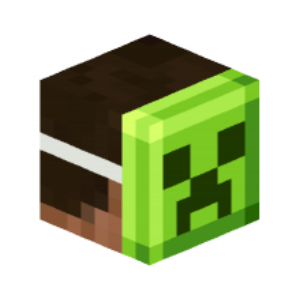 <strong>Замаскировать игрока под сущность</strong> <code>player_disguise_as_entity</code></td><td>Маскирует игрока под выбранную сущность.</td><td> <strong>Сущность для маскировки</strong>  <strong>Видимость для игрока</strong> <a data-footnote-ref href="#user-content-fn-52"><strong><code>-></code></strong></a></td></tr><tr><td>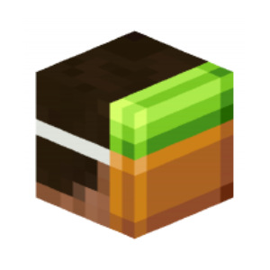 <strong>Замаскировать игрока под блок</strong> <code>player_disguise_as_block</code></td><td>Маскирует игрока под выбранный блок.</td><td> <strong>Блок для маскировки</strong>  <strong>Видимость для игрока</strong> <a data-footnote-ref href="#user-content-fn-52"><strong><code>-></code></strong></a></td></tr><tr><td> <strong>Замаскировать игрока под предмет</strong> <code>player_disguise_as_item</code></td><td>Маскирует игрока под предмет.</td><td> <strong>Предмет для маскировки</strong>  <strong>Видимость для игрока</strong> <a data-footnote-ref href="#user-content-fn-52"><strong><code>-></code></strong></a></td></tr><tr><td> <strong>Убрать маскировку</strong> <code>player_remove_disguise</code></td><td>Убирает маскировку игроку.</td><td></td></tr><tr><td> <strong>Замаскировать себя под сущность</strong> <code>player_self_disguise_as_entity</code></td><td>Маскирует игрока под сущность, но эту маскировку видно только этому игроку.</td><td> <strong>Сущность для маскировки</strong></td></tr><tr><td> <strong>Замаскировать себя под блок</strong> <code>player_self_disguise_as_block</code></td><td>Маскирует игрока под блок, но эту маскировку видно только этому игроку.</td><td> <strong>Блок для маскировки</strong></td></tr><tr><td> <strong>Замаскировать себя под предмет</strong> <code>player_self_disguise_as_item</code></td><td>Маскирует игрока под предмет, но эту маскировку видно только этому игроку.</td><td> <strong>Предмет для маскировки</strong></td></tr><tr><td> <strong>Убрать свою маскировку</strong> <code>player_remove_self_disguise</code></td><td>Убирает маскировку игрока, которую видно только ему.</td><td></td></tr><tr><td>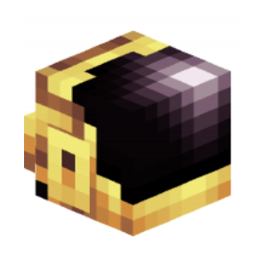 <strong>Установить скин</strong> <code>player_set_skin</code></td><td>Устанавливает скин указанного игрока для цели события.</td><td> <strong>Имя или UUID скина</strong>  <strong>Тип сервера скинов</strong> <a data-footnote-ref href="#user-content-fn-53"><strong><code>-></code></strong></a></td></tr><tr><td> <strong>Убрать скин</strong> <code>player_remove_skin</code></td><td>Возвращает обычный скин цели события.</td><td></td></tr><tr><td> <strong>Проиграть анимацию игроку</strong> <code>player_play_animation_action</code></td><td>Проигрывает для игрока определённую анимацию.</td><td> <strong>Тип анимации</strong> <a data-footnote-ref href="#user-content-fn-54"><strong><code>-></code></strong></a></td></tr><tr><td> <strong>Проиграть анимацию получения урона</strong> <code>player_play_hurt_animation</code></td><td>Проигрывает для игрока анимацию получения урона с определённым наклоном.</td><td> <strong>Угол получения урона (от 0 до 360 градусов)</strong></td></tr><tr><td> <strong>Установить позу игроку</strong> <code>player_set_pose</code></td><td>Устанавливает определённую позу игроку.</td><td> <strong>Отображаемая поза</strong> <a data-footnote-ref href="#user-content-fn-55"><strong><code>-></code></strong></a>  <strong>Блокировка позы</strong> <a data-footnote-ref href="#user-content-fn-56"><strong><code>-></code></strong></a></td></tr><tr><td> <strong>Сбросить позу игроку</strong> <code>player_remove_pose</code></td><td>Сбрасывает позу игроку.</td><td></td></tr><tr><td> <strong>Проиграть анимацию взмаха руки</strong> <code>player_swing_hand</code></td><td>Проигрывает для игрока анимацию взмаха руки.</td><td> <strong>Тип руки</strong> <a data-footnote-ref href="#user-content-fn-57"><strong><code>-></code></strong></a></td></tr><tr><td> <strong>Установить визуальный огонь</strong> <code>player_set_visual_fire</code></td><td>Устанавливает игроку эффект горения.</td><td> <strong>Визуальный огонь</strong> <a data-footnote-ref href="#user-content-fn-58"><strong><code>-></code></strong></a></td></tr><tr><td> <strong>Установить стрелы на игроке</strong> <code>player_set_arrows_in_body</code></td><td>Отображает определённое количество стрел на игроке.</td><td> <strong>Количество отображаемых стрел</strong></td></tr><tr><td> <strong>Установить жало пчелы на игроке</strong> <code>player_set_bee_stingers_in_body</code></td><td>Отображает определённое количество жал пчёл на игроке.</td><td> <strong>Количество отображаемых жал пчёл</strong></td></tr></tbody></table>




 <strong>Действия, которые относятся к другим категориям.</strong>

***

<table data-full-width="true"><thead><tr><th>Опция</th><th>Описание</th><th>Аргументы</th></tr></thead><tbody><tr><td> <strong>Выгнать игрока</strong> <code>player_kick</code></td><td>Выгоняет игрока из мира.</td><td></td></tr><tr><td> <strong>Переместить игрока в другой мир</strong> <code>player_redirect_world</code></td><td>Перемещает игрока в мир с указанным ID.</td><td> <strong>ID мира</strong></td></tr><tr><td> <strong>Показать скорборд</strong> <code>player_show_scoreboard</code></td><td>Отображает определённый скорборд игроку. Для отображения указанный скорборд должен иметь минимум одно значение.</td><td> <strong>ID скорборда</strong></td></tr><tr><td> <strong>Скрыть скорборд</strong> <code>player_hide_scoreboard</code></td><td>Скрывает текущий скорборд игрока.</td><td></td></tr></tbody></table>



### Селекторы

Нажатием <kbd>Shift</kbd> + <kbd>ПКМ</kbd> по блоку кода открывается меню селекторов, позволяющее выбрать цель, по отношению к которой будет воспроизведено действие.

| Селектор                                                                                       | Описание                                                                                                                                                 |
| ---------------------------------------------------------------------------------------------- | -------------------------------------------------------------------------------------------------------------------------------------------------------- |
|  **Текущая цель**  | Игроки, мобы и существа выбранные с помощью [ **Выбрать цель**](select.md). |
|  **Игрок по умолчанию** | Игрок, который спровоцировал данное событие.                                                                                                             |
|  **Убийца**         | Игрок, который убил жертву в данном событии.                                                                                                             |
|  **Атакующий**     | Игрок, который атаковал жертву в данном событии.                                                                                                         |
|  **Стрелок**               | Игрок, который выстрелил в данном событии.                                                                                                               |
|  **Жертва**     | Игрок, который получил урон или убит в данном событии.                                                                                                   |
|  **Случайный игрок** | Случайный игрок в мире.                                                                                                                                  |
|  **Все игроки**         | Все игроки в мире.                                                                                                                                       |

[^1]: **Слот снаряжения** `slot`:

    *  **Основная рука**\
      `hand`
    *  **Второстепенная рука**\
      `off_hand`
    *  **Ботинки**\
      `feet`
    *  **Поножи**\
      `legs`
    *  **Нагрудник**\
      `chest`
    *  **Шлем**\
      `head`
    *  **Тело**\
      `body`

[^2]: **Режим очистки** `clear_mode`:

    *  **Весь инвентарь**\
      `entire`
    *  **Главный инвентарь**\
      `main`
    *  **Верхний инвентарь**\
      `upper`
    *  **Хот-бар**\
      `hotbar`
    *  **Броня**\
      `armor`

[^3]: **Объединение текста** `merging`:

    *  **Разделение пробелом**\
      `spaces`
    *  **Объединение**\
      `concatenation`
    *  **Разделение на строки**\
      `separate_lines`

[^4]: **Объединение текста** `merging`:

    *  **Разделение пробелом**\
      `spaces`
    *  **Объединение**\
      `concatenation`

[^5]: **Цвет** `color`:

    * 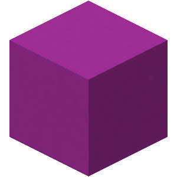 **Розовый**\
      `pink`
    * 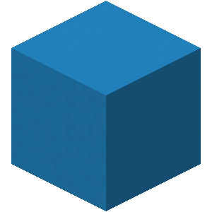 **Синий**\
      `blue`
    * 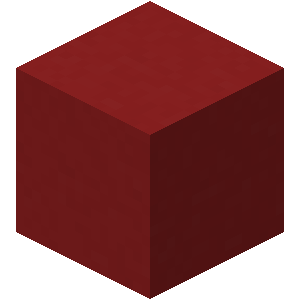 **Красный**\
      `red`
    * 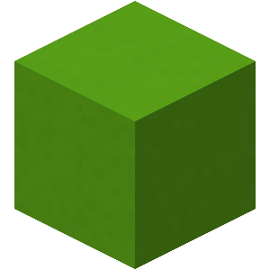 **Зелёный**\
      `green`
    * 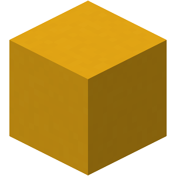 **Жёлтый**\
      `yellow`
    * 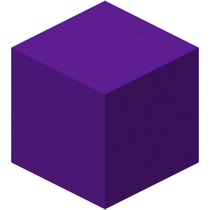 **Фиолетовый**\
      `purple`
    * 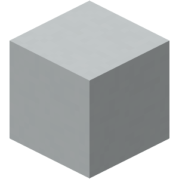 **Белый**\
      `white`

[^6]: **Стиль** `style`:

    *  **Сплошной**\
      `progress`
    *  **6 сегментов**\
      `notched_6`
    *  **10 сегментов**\
      `notched_10`
    *  **12 сегментов**\
      `notched_12`
    *  **20 сегментов**\
      `notched_20`

[^7]: **Эффект неба** `sky_effect`:

    *  **Отсутствует**\
      `none`
    *  **Туман**\
      `fog`
    *  **Тёмное небо**\
      `dark_sky`
    *  **Туман и тёмное небо**\
      `fog_and_dark_sky`

[^8]: **Тип достижения** `frame`:

    *  **Обычное достижение**\
      `task`
    *  **Испытание**\
      `goal`
    * 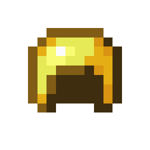 **Цель**\
      `challenge`

[^9]: **Позиция** `position`:

    *  **Сверху**\
      `header`
    *  **Снизу**\
      `footer`

[^10]: **Источник звука** `source`:

    *  **Общий**\
      `master`
    * 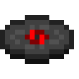 **Музыка**\
      `music`
    *  **Музыкальные блоки**\
      `record`
    *  **Погода**\
      `weather`
    * 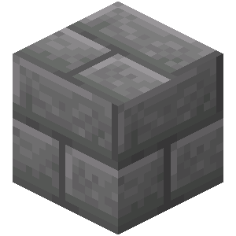 **Блоки**\
      `block`
    *  **Враждебные существа**\
      `hostile`
    * 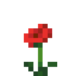 **Дружелюбные существа**\
      `neutral`
    *  **Игроки**\
      `player`
    * 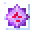 **Окружение**\
      `ambient`
    *  **Голос/Речь**\
      `voice`

[^11]: **Тип обновления** `setting_mode`:

    *  **Добавить**\
      `add`
    *  **Установить**\
      `set`
    *  **Удалить**\
      `remove`

[^12]: **Тип инвентаря** `inventory_type`:

    *  **Сундук**\
      `chest`
    * 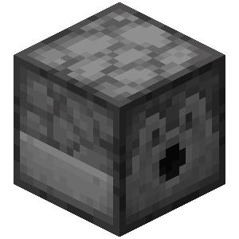 **Раздатчик**\
      `dispenser`
    *  **Выбрасыватель**\
      `dropper`
    *  **Печь**\
      `furnace`
    *  **Верстак**\
      `workbench`
    *  **Чародейский стол**\
      `enchanting`
    *  **Зельеварка**\
      `brewing`
    *  **Наковальня**\
      `anvil`
    *  **Стол кузнеца**\
      `smithing`
    *  **Маяк**\
      `beacon`
    *  **Воронка**\
      `hopper`
    * 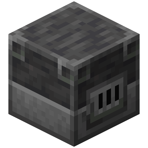 **Плавильная печь**\
      `blast_furnace`
    * 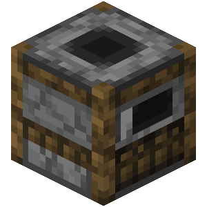 **Коптильня**\
      `smoker`
    * 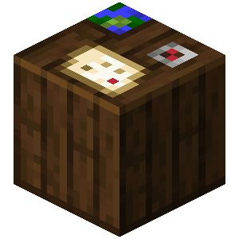 **Стол картографа**\
      `cartography`
    *  **Точило**\
      `grindstone`
    *  **Камнерез**\
      `stonecutter`
    * 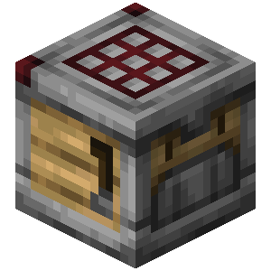 **Сборщик**\
      `crafter`

[^13]: **Позиция строки** `position`:

    * 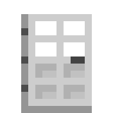 **Добавить строку сверху**\
      `top`
    *  **Добавить строку снизу**\
      `button`

[^14]: **Позиция строки** `position`:

    *  **Убрать строку сверху**\
      `top`
    *  **Убрать строку снизу**\
      `button`

[^15]: **Исцелить игрока** `heal`:

    *  **Да**\
      `true`
    *  **Нет**\
      `false`

[^16]: **Режим установки** `mode`:

    *  **Установка**\
      `set`
    *  **Прибавление**\
      `add`

[^17]: **Тип прибавления** `mode`:

    *  **Как очки опыта**\
      `points`
    *  **Как уровень**\
      `level`
    *  **Как процент от уровня**\
      `level_percentage`

[^18]: **Тип установки** `mode`:

    *  **Как очки опыта**\
      `points`
    *  **Как уровень**\
      `level`
    *  **Как процент от уровня**\
      `level_percentage`

[^19]: **Перезаписывать существующие эффекты** `overwrite`:

    *  **Да**\
      `true`
    *  **Нет**\
      `false`

[^20]: **Показывать иконку эффекта** `show_icon`:

    *  **Да**\
      `true`
    *  **Нет**\
      `false`

[^21]: **Показывать частицы** `particle_mode`:

    *  **Да**\
      `regular`
    *  **Прозрачными**\
      `ambient`
    *  **Нет**\
      `none`

[^22]: **Блокировка состояния (время не будет изменяться)** `ticking_locked`:

    *  **Включить**\
      `true`
    *  **Выключить**\
      `false`

[^23]: **Тип движения** `movement_type`:

    *  **Ходьба**\
      `walk`
    *  **Полёт**\
      `fly`

[^24]: **Тип атрибута** `attribute_type`:

    *  **Максимальное здоровье**\
      `generic_max_health`
    *  **Максимальное поглощение**\
      `generic_max_absorption`
    *  **Расстояние следования**\
      `generic_follow_range`
    *  **Сопротивление отталкиванию**\
      `generic_knockback_resistance`
    *  **Скорость передвижения**\
      `generic_movement_speed`
    *  **Скорость полёта**\
      `generic_flying_speed`
    *  **Урон атаки**\
      `generic_attack_damage`
    *  **Отталкивание атаки**\
      `generic_attack_knockback`
    *  **Скорость атаки**\
      `generic_attack_speed`
    *  **Очки защиты**\
      `generic_armor`
    *  **Очки плотности защиты**\
      `generic_armor_toughness`
    *  **Удача рыбалки**\
      `generic_luck`
    *  **Сила прыжка**\
      `generic_jump_strength`
    *  **Шанс подкрепления зомби**\
      `zombie_spawn_reinforcements`
    *  **Множитель урона от падения**\
      `generic_fall_damage_multiplier`
    *  **Безопасная высота падения**\
      `generic_safe_fall_distance`
    *  **Масштаб**\
      `generic_scale`
    *  **Высота шага**\
      `generic_step_height`
    *  **Гравитация**\
      `generic_gravity`
    *  **Расстояние взаимодействия с блоками**\
      `player_block_interaction_range`
    *  **Расстояние взаимодействия с сущностями**\
      `player_entity_interaction_range`
    *  **Скорость ломания блока**\
      `player_block_break_speed`
    *  **Время горения**\
      `generic_burning_time`
    *  **Сопротивление отбрасыванию от взрыва**\
      `generic_explosion_knockback_resistance`
    *  **Скорость передвижения по замедляющим блокам**\
      `generic_movement_efficiency`
    *  **Воздух под водой**\
      `generic_oxygen_bonus`
    *  **Скорость передвижения под водой**\
      `generic_water_movement_efficiency`
    *  **Скорость копания**\
      `player_mining_efficiency`
    *  **Скорость передвижения крадясь**\
      `player_sneaking_speed`
    *  **Скорость копания под водой**\
      `player_submerged_mining_speed`
    *  **Коэффициент разящего удара**\
      `player_sweeping_damage_ratio`

[^25]: **Режим игры** `gamemode`:

    *  **Выживание**\
      `survival`
    *  **Творческий**\
      `creative`
    *  **Приключение**\
      `adventure`
    *  **Наблюдатель**\
      `spectator`

[^26]: **Режим полёта** `flight_mode`:

    *  **Учитывать режим игры**\
      `respect_gamemode`
    *  **Оставить изначальный**\
      `keep_original`

[^27]: **Может летать** `allow_flying`:

    *  **Да**\
      `true`
    *  **Нет**\
      `false`

[^28]: **Может атаковать** `pvp`:

    *  **Да**\
      `true`
    *  **Нет**\
      `false`

[^29]: **Выпадение предметов** `death_drops`:

    *  **Выпадают**\
      `true`
    *  **Не выпадают**\
      `false`

[^30]: **Сохранение инвентаря** `kept`:

    *  **Включено**\
      `true`
    *  **Выключено**\
      `false`

[^31]: **Режим столкновения** `collidable`:

    *  **Сталкивается с другими игроками**\
      `true`
    *  **Не сталкивается с другими игроками**\
      `false`

[^32]: **Видимость** `default_visible`:

    *  **Видимый**\
      `true`
    *  **Невидимый**\
      `false`

[^33]: **Отображение ника** `visible`:

    *  **Отображать**\
      `true`
    *  **Не отображать**\
      `false`

[^34]: **Мгновенное возрождение** `instant_respawn`:

    *  **Включено**\
      `true`
    *  **Выключено**\
      `false`

[^35]: **Оставить текущий поворот** `keep_rotation`:

    *  **Включено**\
      `true`
    *  **Выключено**\
      `false`

[^36]: **Сохранение инерции** `keep_velocity`:

    *  **Включить**\
      `true`
    *  **Выключить**\
      `false`

[^37]: **Спешиться после телепортации** `dismount`:

    *  **Да**\
      `true`
    *  **Нет**\
      `false`

[^38]: **Учитывать текущую инерцию** `increment`:

    *  **Включено**\
      `true`
    *  **Выключено**\
      `false`

[^39]: **Ось запуска** `launch_axis`:

    *  **Все оси**\
      `yaw_and_pitch`
    *  **Только по горизонтали**\
      `yaw`

[^40]: **Полёт** `is_flying`:

    *  **Включено**\
      `true`
    *  **Выключено**\
      `false`

[^41]: **Полёт на элитрах** `is_gliding`:

    *  **Включено**\
      `true`
    *  **Выключено**\
      `false`

[^42]: **Тип погоды** `weather_type`:

    *  **Дождливая**\
      `downfall`
    *  **Солнечная**\
      `clear`

[^43]: **Состояние** `is_opened`:

    *  **Открытый**\
      `true`
    *  **Закрытый**\
      `false`

[^44]: **Направление удара** `direction`:

    *  **Вниз**\
      `down`
    *    **Север**

        `north`
    *    **Юг**

        `south`
    *    **Запад**

        `west`
    *    **Восток**

        `east`

[^45]: **Скрытие** `hide`:

    *  **Включить**\
      `true`
    *  **Выключить**\
      `false`

[^46]: **Цвет луча** `color`:

    *  **Светло-фиолетовый**\
      `light_purple`
    *  **Тёмно-фиолетовый**\
      `dark_purple`

[^47]: **Цвет свечения** `color`:

    *  **Белый**\
      `white`
    *  **Светло-серый**\
      `gray`
    *  **Серый**\
      `dark_gray`
    *  **Чёрный**\
      `black`
    *  **Тёмно-красный**\
      `dark_red`
    *  **Красный**\
      `red`
    *  **Золотой**\
      `gold`
    *  **Жёлтый**\
      `yellow`
    *  **Зелёный**\
      `green`
    *  **Тёмно-зелёный**\
      `dark_green`
    *  **Бирюзовый**\
      `dark_aqua`
    *  **Светло-синий**\
      `aqua`
    *  **Синий**\
      `blue`
    *  **Тёмно-синий**\
      `dark_blue`
    *  **Тёмно-фиолетовый**\
      `dark_purple`
    *  **Фиолетовый**\
      `purple`

[^48]: **Свечение** `glow`:

    *  **Включить**\
      `true`
    *  **Выключить**\
      `false`

[^49]: **Тип отображения частиц** `unit_of_measurement`:

    *  **По количеству**\
      `points`
    *  **По расстоянию**\
      `distance`

[^50]: **Тип угла** `angle_unit`:

    *  **Градусы**\
      `degrees`
    *  **Радианы**\
      `radians`

[^51]: **Тип куба** `type`:

    *  **Заполненный**\
      `solid`
    *  **Полный**\
      `hollow`
    *  **Каркас**\
      `wireframe`

[^52]: **Видимость для игрока** `visible_to_self`:

    *  **Видно**\
      `true`
    *  **Не видно**\
      `false`

[^53]: **Тип сервера скинов** `server_type`:

    *  **Скин Mojang**\
      `mojang`
    *  **Скин JustMC**\
      `server`

[^54]: **Тип анимации** `animation`:

    *  **Получение урона**\
      `damage`
    *  **Подъём с кровати**\
      `wake_up`
    *  **Тотем**\
      `totem`
    *  **Древний страж**\
      `jumpscare`

[^55]: **Отображаемая поза** `pose`:

    *  **Обычное состояние**\
      `standing`
    *  **Полёт на Элитрах**\
      `fall_flying`
    *  **Лежание**\
      `sleeping`
    *  **Плаванье**\
      `swimming`
    *  **Использование Тягуна**\
      `spin_attack`
    *  **Приседание**\
      `crouching`
    *  **Длинный прыжок**\
      `long_jumping`
    *  **Смерть**\
      `dying`
    *  **Кваканье (для Жаб)**\
      `croaking`
    *  **Использование языка (для Жаб)**\
      `using_tongue`
    *  **Сидение**\
      `sitting`
    *  **Рёв (для Хранителя)**\
      `roaring`
    *  **Нюханье (для Хранителя)**\
      `sniffing`
    *  **Появление из земли (для Хранителя)**\
      `emerging`
    *  **Зарывание в землю (для Хранителя)**\
      `digging`
    *  **Скольжение (для Вихря)**\
      `sliding`
    *  **Выстреливание (для Вихря)**\
      `shooting`
    *  **Вдыхание (для Вихря)**\
      `inhaling`

[^56]: **Блокировка позы** `locked`:

    *  **Включить**\
      `true`
    *  **Выключить**\
      `false`

[^57]: **Тип руки** `hand_type`:

    *  **Главная**\
      `main`
    *  **Второстепенная**\
      `off`

[^58]: **Установить визуальный огонь** `visual_fire`:

    *  **Включить**\
      `true`
    *  **Выключить**\
      `false`
