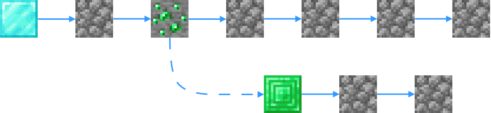

# Процесс

<figure><figcaption></figcaption></figure>

**Тип:** Процесс\
**Текстовый идентификатор:** `process`

***

## Использование

Поставьте блок в самое начало строки. Любой код, который вы напишете далее в этой строке, будет входить в процесс.

Присвойте название процессу. Для этого возьмите значение [ **Текст**](../arguments/text.md) в активный слот напишите в чат название. Затем, продолжая держать значение в активном слоте, нажмите <kbd>ПКМ</kbd> по блоку процесса.

#### Дополнительные аргументы процесса:

*  **Отображать процесс в меню вызова** [**`->`**](#user-content-fn-1)[^1]
*  **Значок процесса**
*  **Описание процесса**

## Принцип работы

<figure><figcaption>
Схема, изображающая принцип работы процесса.
</figcaption></figure>

Процесс запускается в строке кода блоком [ **Запустить процесс**](start_process.md). Строка кода, где он вызывается, будет продолжать свою работу, даже если сам процесс не завершился.

Процесс, в отличие от [ **функции**](function.md), запускает собственную строку кода независимо от строки, в которой он был вызван. То есть блок [ **Контроль действий**](control.md) не будет влиять на выполнение основной ветви кода.

Процесс можно запускать с различным [режимом передачи переменных](start_process.md#rezhim-peremennykh) и [целями](start_process.md#cel-processa).

Злоупотребление вызовом процессов может оказать значительную нагрузку на мир. Поэтому рекомендуется использовать процесс только в тех случаях, когда это действительно необходимо.

[^1]: * Скрыть
    * Отображать
