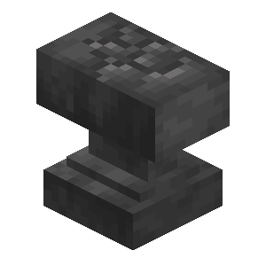

# Действие с переменной

<figure><figcaption>
Блок кода
</figcaption></figure>

**Тип:** Действие\
**Текстовый идентификатор:** `set_variable`

***

## Использование

Поставьте блок в строку и нажмите ПКМ по нему, чтобы открыть меню опций блока. Перейдите в нужную категорию и выберите действие, которое необходимо выполнить.

При выборе действия, над его блоком может появиться хранилище (по умолчанию: сундук), в котором содержатся [аргументы](../arguments/) действия.

### Опции



 **Различный операции присвоения.**

***

| Опция                                                                                                                                                                          | Описание                                                                   | Аргументы                                                                                                                                                                                                                                                                                                                                                                                                                                                                                                                                                                                                                                                                                                                                                                                                                                                                                         |
| ------------------------------------------------------------------------------------------------------------------------------------------------------------------------------ | -------------------------------------------------------------------------- | ------------------------------------------------------------------------------------------------------------------------------------------------------------------------------------------------------------------------------------------------------------------------------------------------------------------------------------------------------------------------------------------------------------------------------------------------------------------------------------------------------------------------------------------------------------------------------------------------------------------------------------------------------------------------------------------------------------------------------------------------------------------------------------------------------------------------------------------------------------------------------------------------- |
| 
 <strong>Установить значение (=)</strong> <code>set_variable_value</code>
                 | Присваивает значение к переменной.                                         | 
 <strong>Переменная для присвоения</strong>  <strong>Значение для присвоения</strong>
                                                                                                                                                                                                                                                                                                                                                                                                                                                                                                                                                                            |
| 
 <strong>Установить случайное значение</strong> <code>set_variable_random</code>
           | Присваивает случайное значение к переменной.                               | 
 <strong>Переменная для присвоения</strong>  <strong>Значения для выбора</strong>
                                                                                                                                                                                                                                                                                                                                                                                                                                                                                                                                                                                |
| 
 <strong>Очистить переменные</strong> <code>set_variable_purge</code>
                     | Очищает все переменные, подходящие под выбранные имена.                    | 
 <strong>Имена для сравнения</strong>  <strong>Тип переменной</strong> <a data-footnote-ref href="#user-content-fn-1"><strong><code>-></code></strong></a>  <strong>Режим сравнения</strong> <a data-footnote-ref href="#user-content-fn-2"><strong><code>-></code></strong></a>  <strong>Игнорирование регистра</strong> <a data-footnote-ref href="#user-content-fn-3"><strong><code>-></code></strong></a>
 |
| 
 <strong>Получить имена переменных</strong> <code>set_variable_get_list_variables</code>
 | Получает список имён всех переменных и присваивает результат к переменной. | 
 <strong>Переменная для присвоения</strong>  <strong>Тип переменных</strong> <a data-footnote-ref href="#user-content-fn-4"><strong><code>-></code></strong></a>
                                                                                                                                                                                                                                                                                                                                                                                                                                                                                   |



 **Различные числовые операции.**

***

| Опция                                                                                                                                                                                      | Описание                                                                                                                                                                                             | Аргументы                                                                                                                                                                                                                                                                                                                                                                                                                                                                                                                                                                                                                                                                                                                                                                                                                                                                                                                                                                                                                                                                                                                                                                                                                                                                                                                                                                                                                                                                                                                                                                                                                 |
| ------------------------------------------------------------------------------------------------------------------------------------------------------------------------------------------ | ---------------------------------------------------------------------------------------------------------------------------------------------------------------------------------------------------- | ------------------------------------------------------------------------------------------------------------------------------------------------------------------------------------------------------------------------------------------------------------------------------------------------------------------------------------------------------------------------------------------------------------------------------------------------------------------------------------------------------------------------------------------------------------------------------------------------------------------------------------------------------------------------------------------------------------------------------------------------------------------------------------------------------------------------------------------------------------------------------------------------------------------------------------------------------------------------------------------------------------------------------------------------------------------------------------------------------------------------------------------------------------------------------------------------------------------------------------------------------------------------------------------------------------------------------------------------------------------------------------------------------------------------------------------------------------------------------------------------------------------------------------------------------------------------------------------------------------------------- |
| 
 <strong>Преобразовать текст в число</strong> <code>set_variable_convert_text_to_number</code>
              | Присваивает к переменной результат преобразования числа в виде текста другой системы счисления в число десятичной системы счисления. Работает только с целыми числами.                               | 
 <strong>Переменная для присвоения</strong>  <strong>Текст для преобразования</strong>  <strong>Основание системы счисления</strong>
                                                                                                                                                                                                                                                                                                                                                                                                                                                                                                                                                                                                                                                                                                                                                                                                                                                                                                                                                                                                                                                                                                                                |
| 
 <strong>Сложение чисел (+)</strong> <code>set_variable_add</code>
                                         | Присваивает к переменной сумму чисел.                                                                                                                                                                | 
 <strong>Переменная для присвоения</strong>  <strong>Числа для суммирования</strong>
                                                                                                                                                                                                                                                                                                                                                                                                                                                                                                                                                                                                                                                                                                                                                                                                                                                                                                                                                                                                                                                                                                                                                                                                                                                                                           |
| 
 <strong>Вычитание чисел (-)</strong> <code>set_variable_subtract</code>
                            | Присваивает к переменной разницу чисел.                                                                                                                                                              | 
 <strong>Переменная для присвоения</strong>  <strong>Числа для вычитания</strong>
                                                                                                                                                                                                                                                                                                                                                                                                                                                                                                                                                                                                                                                                                                                                                                                                                                                                                                                                                                                                                                                                                                                                                                                                                                                                                              |
| 
 <strong>Умножение чисел (×)</strong> <code>set_variable_multiply</code>
                                  | Присваивает к переменной произведение чисел.                                                                                                                                                         | 
 <strong>Переменная для присвоения</strong>  <strong>Числа для умножения</strong>
                                                                                                                                                                                                                                                                                                                                                                                                                                                                                                                                                                                                                                                                                                                                                                                                                                                                                                                                                                                                                                                                                                                                                                                                                                                                                              |
| 
 <strong>Деление чисел (÷)</strong> <code>set_variable_divide</code>
                               | Присваивает к переменной частное чисел.                                                                                                                                                              | 
 <strong>Переменная для присвоения</strong>  <strong>Числа для деления</strong>  <strong>Режим деления</strong> <a data-footnote-ref href="#user-content-fn-5"><strong><code>-></code></strong></a>
                                                                                                                                                                                                                                                                                                                                                                                                                                                                                                                                                                                                                                                                                                                                                                                                                                                                                                                                                                                                                                                     |
| 
 <strong>Остаток от деления (%)</strong> <code>set_variable_remainder</code>
                         | Присваивает к переменной остаток от деления двух чисел.                                                                                                                                              | 
 <strong>Переменная для присвоения</strong>  <strong>Делимое</strong>  <strong>Делитель</strong>  <strong>Режим работы</strong> <a data-footnote-ref href="#user-content-fn-6"><strong><code>-></code></strong></a>
                                                                                                                                                                                                                                                                                                                                                                                                                                                                                                                                                                                                                                                                                                                                                                                                                                                                                                                  |
| 
 <strong>Прибавление (+=)</strong> <code>set_variable_increment</code>
                            | Прибавляет к переменной выбранное число.                                                                                                                                                             | 
 <strong>Переменная для присвоения</strong>  <strong>Число для прибавления</strong>
                                                                                                                                                                                                                                                                                                                                                                                                                                                                                                                                                                                                                                                                                                                                                                                                                                                                                                                                                                                                                                                                                                                                                                                                                                                                                            |
| 
 <strong>Отнимание (-=)</strong> <code>set_variable_decrement</code>
                                    | Отнимает от переменной выбранное число.                                                                                                                                                              | 
 <strong>Переменная для присвоения</strong>  <strong>Число для отнимания</strong>
                                                                                                                                                                                                                                                                                                                                                                                                                                                                                                                                                                                                                                                                                                                                                                                                                                                                                                                                                                                                                                                                                                                                                                                                                                                                                              |
| 
 <strong>Степень числа (^)</strong> <code>set_variable_pow</code>
                            | Присваивает к переменной значение степени с выбранным основанием и показателем.                                                                                                                      | 
 <strong>Переменная для присвоения</strong>  <strong>Основание степени</strong>  <strong>Показатель степени</strong>
                                                                                                                                                                                                                                                                                                                                                                                                                                                                                                                                                                                                                                                                                                                                                                                                                                                                                                                                                                                                                                                                                                                                        |
| 
 <strong>Корень числа (√)</strong> <code>set_variable_root</code>
                               | Присваивает к переменной значение корня с выбранным подкоренным числом и показателем.                                                                                                                | 
 <strong>Переменная для присвоения</strong>  <strong>Подкоренной число</strong>  <strong>Показатель корня</strong>
                                                                                                                                                                                                                                                                                                                                                                                                                                                                                                                                                                                                                                                                                                                                                                                                                                                                                                                                                                                                                                                                                                                                          |
| 
 <strong>Логарифм числа (log)</strong> <code>set_variable_log</code>
                                    | Присваивает к переменной значение логарифма с выбранным аргументом и основанием.                                                                                                                     | 
 <strong>Переменная для присвоения</strong>  <strong>Аргумент логарифма</strong>  <strong>Основание логарифма</strong>
                                                                                                                                                                                                                                                                                                                                                                                                                                                                                                                                                                                                                                                                                                                                                                                                                                                                                                                                                                                                                                                                                                                                      |
| 
 <strong>Модуль числа</strong> <code>set_variable_absolute</code>
                                         | Присваивает к переменной значение модуля выбранного числа.                                                                                                                                           | 
 <strong>Переменная для присвоения</strong>  <strong>Число в модуле</strong>
                                                                                                                                                                                                                                                                                                                                                                                                                                                                                                                                                                                                                                                                                                                                                                                                                                                                                                                                                                                                                                                                                                                                                                                                                                                                                                   |
| 
 <strong>Минимальное значение</strong> <code>set_variable_min</code>
                          | Присваивает к переменной наименьшее число из выбранных.                                                                                                                                              | 
 <strong>Переменная для присвоения</strong>  <strong>Числа для выбора</strong>
                                                                                                                                                                                                                                                                                                                                                                                                                                                                                                                                                                                                                                                                                                                                                                                                                                                                                                                                                                                                                                                                                                                                                                                                                                                                                                 |
| 
 <strong>Максимальное значение</strong> <code>set_variable_max</code>
                           | Присваивает к переменной наибольшее число из выбранных.                                                                                                                                              | 
 <strong>Переменная для присвоения</strong>  <strong>Числа для выбора</strong>
                                                                                                                                                                                                                                                                                                                                                                                                                                                                                                                                                                                                                                                                                                                                                                                                                                                                                                                                                                                                                                                                                                                                                                                                                                                                                                 |
| 
 <strong>Ограничить число</strong> <code>set_variable_clamp</code>
                                    | Проверяет, находится ли число между минимальным и максимальным значением, и если нет, устанавливает его на ближайшее.                                                                                | 
 <strong>Переменная для присвоения</strong>  <strong>Число для ограничения</strong>  <strong>Минимальное значение</strong>  <strong>Максимальное значение</strong>
                                                                                                                                                                                                                                                                                                                                                                                                                                                                                                                                                                                                                                                                                                                                                                                                                                                                                                                                                                       |
| 
 <strong>Обернуть число</strong> <code>set_variable_warp</code>
                                     | Проверяет, находится ли число между двумя границами, и если нет, оборачивает его вокруг этой границы.                                                                                                | 
 <strong>Переменная для присвоения</strong>  <strong>Число для оборачивания</strong>  <strong>Минимальное значение</strong>  <strong>Максимальное значение</strong>
                                                                                                                                                                                                                                                                                                                                                                                                                                                                                                                                                                                                                                                                                                                                                                                                                                                                                                                                                                      |
| 
 <strong>Среднее значение</strong> <code>set_variable_average</code>
                                  | Присваивает к переменной среднее значение чисел.                                                                                                                                                     | 
 <strong>Переменная для присвоения</strong>  <strong>Числа для получения значения</strong>
                                                                                                                                                                                                                                                                                                                                                                                                                                                                                                                                                                                                                                                                                                                                                                                                                                                                                                                                                                                                                                                                                                                                                                                                                                                                                     |
| 
 <strong>Округлить число</strong> <code>set_variable_round</code>
                                  | Присваивает к переменной округлённое выбранным способом число.                                                                                                                                       | 
 <strong>Переменная для присвоения</strong>  <strong>Число для округления</strong>  <strong>Количество цифр после целой части</strong>  <strong>Способ округления</strong> <a data-footnote-ref href="#user-content-fn-7"><strong><code>-></code></strong></a>
                                                                                                                                                                                                                                                                                                                                                                                                                                                                                                                                                                                                                                                                                                                                                                                                                                                                       |
| 
 <strong>Случайное число</strong> <code>set_variable_random_number</code>
                                 | Присваивает к переменной случайное число в выбранном диапазоне.                                                                                                                                      | 
 <strong>Переменная для присвоения</strong>  <strong>Минимальное значение</strong>  <strong>Максимальное значение</strong>  <strong>Тип числа</strong> <a data-footnote-ref href="#user-content-fn-8"><strong><code>-></code></strong></a>
                                                                                                                                                                                                                                                                                                                                                                                                                                                                                                                                                                                                                                                                                                                                                                                                                                                                                           |
| 
 <strong>Побитовая операция над числами</strong> <code>set_variable_bitwise_operation</code>
            | Присваивает к переменной результат побитовой операции над числами.                                                                                                                                   | 
 <strong>Переменная для присвоения</strong>  <strong>Первый операнд</strong>  <strong>Второй операнд</strong>  <strong>Тип операции</strong> <a data-footnote-ref href="#user-content-fn-9"><strong><code>-></code></strong></a>
                                                                                                                                                                                                                                                                                                                                                                                                                                                                                                                                                                                                                                                                                                                                                                                                                                                                                                     |
| 
 <strong>Синус числа</strong> <code>set_variable_sine</code>
                                          | Возвращает синус от числа.                                                                                                                                                                           | 
 <strong>Переменная для присвоения</strong>  <strong>Число для получения синуса</strong>  <strong>Тип операции</strong> <a data-footnote-ref href="#user-content-fn-10"><strong><code>-></code></strong></a>  <strong>Тип угла</strong> <a data-footnote-ref href="#user-content-fn-11"><strong><code>-></code></strong></a>
                                                                                                                                                                                                                                                                                                                                                                                                                                                                                                                                                                                                                                                                                                                                                                                                     |
| 
 <strong>Косинус числа</strong> <code>set_variable_cosine</code>
                                    | Возвращает косинус от числа.                                                                                                                                                                         | 
 <strong>Переменная для присвоения</strong>  <strong>Число для получения косинуса</strong>  <strong>Тип операции</strong> <a data-footnote-ref href="#user-content-fn-12"><strong><code>-></code></strong></a>  <strong>Тип угла</strong> <a data-footnote-ref href="#user-content-fn-13"><strong><code>-></code></strong></a>
                                                                                                                                                                                                                                                                                                                                                                                                                                                                                                                                                                                                                                                                                                                                                                                                   |
| 
 <strong>Тангенс числа</strong> <code>set_variable_tangent</code>
                                     | Возвращает тангенс от числа.                                                                                                                                                                         | 
 <strong>Переменная для присвоения</strong>  <strong>Число для получения тангенса</strong>  <strong>Тип операции</strong> <a data-footnote-ref href="#user-content-fn-14"><strong><code>-></code></strong></a>  <strong>Тип угла</strong> <a data-footnote-ref href="#user-content-fn-15"><strong><code>-></code></strong></a>
                                                                                                                                                                                                                                                                                                                                                                                                                                                                                                                                                                                                                                                                                                                                                                                                   |
| 
 <strong>Котангенс числа</strong> <code>set_variable_cotangent</code>
                                 | Возвращает котангенс от числа.                                                                                                                                                                       | 
 <strong>Переменная для присвоения</strong>  <strong>Число для получения котангенса</strong>  <strong>Тип операции</strong> <a data-footnote-ref href="#user-content-fn-16"><strong><code>-></code></strong></a>  <strong>Тип угла</strong> <a data-footnote-ref href="#user-content-fn-17"><strong><code>-></code></strong></a>
                                                                                                                                                                                                                                                                                                                                                                                                                                                                                                                                                                                                                                                                                                                                                                                                 |
| 
 <strong>Шум Перлина</strong> <code>set_variable_perlin_noise_3d</code>
                           | Присваивает к переменной значение шума Перлина в определённом местоположении. Возвращает число, со значением от -1 до 1.                                                                             | 
 <strong>Переменная для присвоения</strong>  <strong>Местоположение для установки шума</strong>  <strong>Ключ шума</strong>  <strong>Частота шума</strong>  <strong>Количество октав шума</strong>  <strong>Частота октав шума</strong>  <strong>Амплитуда октав шума</strong>  <strong>Диапазон значений</strong> <a data-footnote-ref href="#user-content-fn-18"><strong><code>-></code></strong></a>  <strong>Нормализация значений</strong> <a data-footnote-ref href="#user-content-fn-19"><strong><code>-></code></strong></a>
 |
| 
 <strong>Шум Симплекс</strong> <code>set_variable_simplex_noise_3d</code>
                            | Присваивает к переменной значение шума Симплекс в определённом местоположении. Возвращает число, со значением от -1 до 1.                                                                            | 
 <strong>Переменная для присвоения</strong>  <strong>Местоположение для установки шума</strong>  <strong>Ключ шума</strong>  <strong>Частота шума</strong>  <strong>Количество октав шума</strong>  <strong>Амплитуда октав шума</strong>  <strong>Диапазон значений</strong> <a data-footnote-ref href="#user-content-fn-20"><strong><code>-></code></strong></a>  <strong>Нормализация значений</strong> <a data-footnote-ref href="#user-content-fn-21"><strong><code>-></code></strong></a>
                                                                                                                                                         |
| 
 <strong>Шум Вороного</strong> <code>set_variable_voronoi_noise_3d</code>
                              | Присваивает к переменной значение шума Вороного в определённом местоположении. Возвращает число, со значением от 0 до 1.                                                                             | 
 <strong>Переменная для присвоения</strong>  <strong>Местоположение для установки</strong>  <strong>Ключ шума</strong>  <strong>Частота шума</strong>  <strong>Смещение шума</strong>  <strong>Диапазон значений</strong> <a data-footnote-ref href="#user-content-fn-22"><strong><code>-></code></strong></a>  <strong>Режим расстояния</strong> <a data-footnote-ref href="#user-content-fn-23"><strong><code>-></code></strong></a>
                                                                                                                                                                                                                                                                                                                                     |
| 
 <strong>Нормально распределённое случайное число</strong> <code>set_variable_gaussian_distribution</code>
 | Выдаёт случайное число близкое к среднему значению μ со стандартным отклонением σ с шансом, заданным графиком нормального распределения.                                                             | 
 <strong>Переменная для присвоения</strong>  <strong>Отклонение σ от среднего значения μ</strong>  <strong>Среднее значение μ</strong>  <strong>Тип σ отклонения</strong> <a data-footnote-ref href="#user-content-fn-24"><strong><code>-></code></strong></a>
                                                                                                                                                                                                                                                                                                                                                                                                                                                                                                                                                                                                                                                                                                                                                                                                                                                                       |
| 
 <strong>Интерполировать число</strong> <code>set_variable_lerp_number</code>
                           | Вычисляет число между двумя числами с определённым коэффициентом и присваивает результат к переменной. При коэффициенте 0 будет возвращено первое число, при 1 - второе, при 0.5 - среднее значение. | 
 <strong>Переменная для присвоения</strong>  <strong>Первое число</strong>  <strong>Второе число</strong>  <strong>Коэффициент (от 0 до 1)</strong>
                                                                                                                                                                                                                                                                                                                                                                                                                                                                                                                                                                                                                                                                                                                                                                                                                                                                                                                                                                                      |
| 
 <strong>Перевести число в другой диапазон</strong> <code>set_variable_map_range</code>
        | Переводит число с одного диапазона в другой и присваивает результат к переменной.                                                                                                                    | 
 <strong>Переменная для присвоения</strong>  <strong>Число для изменения</strong>  <strong>Нижний предел изначального диапазона</strong>  <strong>Верхний предел изначального диапазона</strong>  <strong>Нижний предел нового диапазона</strong>  <strong>Верхний предел нового диапазона</strong>
                                                                                                                                                                                                                                                                                                                                                                                                                                                                                                                                                                                                |



 **Различные операции над текстом.**

***

| Опция                                                                                                                                                                                       | Описание                                                                                                                                                                                                                         | Аргументы                                                                                                                                                                                                                                                                                                                                                                                                                                                                                                                                                                                                                                                                                                                                                                                                                                                                                                                                                                                                                                                                                                                                                                                                                                                                                                                                                                                                                                                                                                                                                                                                                                                                                                                                                                                                                                                                                                                                                                                                                                                                                                                                                                                                                                                                                                                                                                                                                                                                                                                                                                                                                                                                                                                                                                  |
| ------------------------------------------------------------------------------------------------------------------------------------------------------------------------------------------- | -------------------------------------------------------------------------------------------------------------------------------------------------------------------------------------------------------------------------------- | -------------------------------------------------------------------------------------------------------------------------------------------------------------------------------------------------------------------------------------------------------------------------------------------------------------------------------------------------------------------------------------------------------------------------------------------------------------------------------------------------------------------------------------------------------------------------------------------------------------------------------------------------------------------------------------------------------------------------------------------------------------------------------------------------------------------------------------------------------------------------------------------------------------------------------------------------------------------------------------------------------------------------------------------------------------------------------------------------------------------------------------------------------------------------------------------------------------------------------------------------------------------------------------------------------------------------------------------------------------------------------------------------------------------------------------------------------------------------------------------------------------------------------------------------------------------------------------------------------------------------------------------------------------------------------------------------------------------------------------------------------------------------------------------------------------------------------------------------------------------------------------------------------------------------------------------------------------------------------------------------------------------------------------------------------------------------------------------------------------------------------------------------------------------------------------------------------------------------------------------------------------------------------------------------------------------------------------------------------------------------------------------------------------------------------------------------------------------------------------------------------------------------------------------------------------------------------------------------------------------------------------------------------------------------------------------------------------------------------------------------------------------------- |
| 
 <strong>Установить текст в переменную</strong> <code>set_variable_text</code>
                               | Объединяет и присваивает к переменной одно или несколько значений текста.                                                                                                                                                        | 
 <strong>Переменная для присвоения</strong>  <strong>Текст для установки</strong>  <strong>Объединение текста</strong> <a data-footnote-ref href="#user-content-fn-25"><strong><code>-></code></strong></a>
                                                                                                                                                                                                                                                                                                                                                                                                                                                                                                                                                                                                                                                                                                                                                                                                                                                                                                                                                                                                                                                                                                                                                                                                                                                                                                                                                                                                                                                                                                                                                                                                                                                                                                                                                                                                                                                                                                                                                                                                                                                                                                                                                                                                      |
| 
 <strong>Приобразовать число в текст</strong> <code>set_variable_convert_number_to_text</code>
         | 
Присваивает к переменной результат преобразования числа в текст.  » Работает только с целыми числами. » Основание системы счисления должно находиться в диапазоне от 2 до 36 включительно.
                       | 
 <strong>Переменная для присвоения</strong>  <strong>Число для преобразования</strong>  <strong>Основание системы счисления</strong>
                                                                                                                                                                                                                                                                                                                                                                                                                                                                                                                                                                                                                                                                                                                                                                                                                                                                                                                                                                                                                                                                                                                                                                                                                                                                                                                                                                                                                                                                                                                                                                                                                                                                                                                                                                                                                                                                                                                                                                                                                                                                                                                                                                                                                                                                         |
| 
 <strong>Заменить текст</strong> <code>set_variable_replace_text</code>
                                      | Заменяет весь текст или его часть и присваивает результат к переменной.                                                                                                                                                          | 
 <strong>Переменная для присвоения</strong>  <strong>Исходный текст</strong>  <strong>Текст для замены</strong>  <strong>Замена</strong>  <strong>Количество замен</strong> <a data-footnote-ref href="#user-content-fn-26"><strong><code>-></code></strong></a>  <strong>Игнорировать регистр</strong> <a data-footnote-ref href="#user-content-fn-27"><strong><code>-></code></strong></a>
                                                                                                                                                                                                                                                                                                                                                                                                                                                                                                                                                                                                                                                                                                                                                                                                                                                                                                                                                                                                                                                                                                                                                                                                                                                                                                                                                                                                                                                                                                                                                                                                                                                                        |
| 
 <strong>Заменить совпадение с регулярным выражением</strong> <code>set_variable_regex_replace_text</code>
   | Заменяет текст, соответствующий указанному регулярному выражению, и присваивает результат к переменной. Аргумент "Замена" может содержать $<название группы> для ссылки на группу. Включайте только те флаги, которые вам нужны! | 
 <strong>Переменная для присвоения</strong>  <strong>Исходный текст</strong>  <strong>Регулярное выражение</strong>  <strong>Замена</strong>  <strong>Количество замен</strong> <a data-footnote-ref href="#user-content-fn-28"><strong><code>-></code></strong></a>  <strong>Игнорировать регистр (флаг ignore_case)</strong> <a data-footnote-ref href="#user-content-fn-29"><strong><code>-></code></strong></a>  <strong>Многострочный режим (флаг multiline)</strong> <a data-footnote-ref href="#user-content-fn-30"><strong><code>-></code></strong></a>  <strong>Воспринимать шаблон дословно (флаг literal)</strong> <a data-footnote-ref href="#user-content-fn-31"><strong><code>-></code></strong></a>  <strong>Режим UNIX строк (флаг unix_lines)</strong> <a data-footnote-ref href="#user-content-fn-32"><strong><code>-></code></strong></a>  <strong>Разрешить комментарии и игнорирование пробелов (флаг comments)</strong> <a data-footnote-ref href="#user-content-fn-33"><strong><code>-></code></strong></a>  <strong>Режим dotall (флаг dotall)</strong> <a data-footnote-ref href="#user-content-fn-34"><strong><code>-></code></strong></a>  <strong>Каноническая эквивалентность (флаг cannon_eq)</strong> <a data-footnote-ref href="#user-content-fn-35"><strong><code>-></code></strong></a>
 |
| 
 <strong>Удалить текст</strong> <code>set_variable_remove_text</code>
                               | Удаляет весь текст или его часть и присваивает результат к переменной.                                                                                                                                                           | 
 <strong>Переменная для присвоения</strong>  <strong>Исходный текст</strong>  <strong>Регулярные выражения</strong> <a data-footnote-ref href="#user-content-fn-36"><strong><code>-></code></strong></a>  <strong>Текст для удаления</strong>
                                                                                                                                                                                                                                                                                                                                                                                                                                                                                                                                                                                                                                                                                                                                                                                                                                                                                                                                                                                                                                                                                                                                                                                                                                                                                                                                                                                                                                                                                                                                                                                                                                                                                                                                                                                                                                                                                                                                                                                                                                                         |
| 
 <strong>Обрезать текст</strong> <code>set_variable_trim_text</code>
                                       | Обрезает текст и присваивает результат к переменной.                                                                                                                                                                             | 
 <strong>Переменная для присвоения</strong>  <strong>Текст для обрезки</strong>  <strong>Начальная позиция</strong>  <strong>Конечная позиция</strong>
                                                                                                                                                                                                                                                                                                                                                                                                                                                                                                                                                                                                                                                                                                                                                                                                                                                                                                                                                                                                                                                                                                                                                                                                                                                                                                                                                                                                                                                                                                                                                                                                                                                                                                                                                                                                                                                                                                                                                                                                                                                                                                                                            |
| 
 <strong>Удалить пробелы</strong> <code>set_variable_strip_text</code>
                                | Удаляет пробелы в тексте и присваивает результат к переменной.                                                                                                                                                                   | 
 <strong>Переменная для присвоения</strong>  <strong>Текст для изменения</strong>  <strong>Тип удаления</strong> <a data-footnote-ref href="#user-content-fn-37"><strong><code>-></code></strong></a>
                                                                                                                                                                                                                                                                                                                                                                                                                                                                                                                                                                                                                                                                                                                                                                                                                                                                                                                                                                                                                                                                                                                                                                                                                                                                                                                                                                                                                                                                                                                                                                                                                                                                                                                                                                                                                                                                                                                                                                                                                                                                                                                                                                                                            |
| 
 <strong>Повторить текст</strong> <code>set_variable_repeat_text</code>
                                     | Присваивает к переменной текст, повторённый определённое количество раз.                                                                                                                                                         | 
 <strong>Переменная для присвоения</strong>  <strong>Текст для присвоения</strong>  <strong>Количество повторений</strong>
                                                                                                                                                                                                                                                                                                                                                                                                                                                                                                                                                                                                                                                                                                                                                                                                                                                                                                                                                                                                                                                                                                                                                                                                                                                                                                                                                                                                                                                                                                                                                                                                                                                                                                                                                                                                                                                                                                                                                                                                                                                                                                                                                                                                                                                                                           |
| 
 <strong>Объединить список в текст</strong> <code>set_variable_join_text</code>
                     | Объединяет элементы списка в единый текст и присваивает результат к переменной.                                                                                                                                                  | 
 <strong>Переменная для присвоения</strong>  <strong>Список для объединения</strong>  <strong>Разделитель</strong>  <strong>Префикс</strong>  <strong>Постфикс</strong>  <strong>Лимит элементов (если пусто, то все элементы)</strong>  <strong>Текст после лимита (по умолчанию - "...")</strong>
                                                                                                                                                                                                                                                                                                                                                                                                                                                                                                                                                                                                                                                                                                                                                                                                                                                                                                                                                                                                                                                                                                                                                                                                                                                                                                                                                                                                                                                                                                                                                                                                                                                      |
| 
 <strong>Получить хеш текста</strong> <code>set_variable_hash</code>
                                | Присваивает к переменной значение хеша текста.                                                                                                                                                                                   | 
 <strong>Переменная для присвоения</strong>  <strong>Исходный текст</strong>  <strong>Алгоритм</strong> <a data-footnote-ref href="#user-content-fn-38"><strong><code>-></code></strong></a>
                                                                                                                                                                                                                                                                                                                                                                                                                                                                                                                                                                                                                                                                                                                                                                                                                                                                                                                                                                                                                                                                                                                                                                                                                                                                                                                                                                                                                                                                                                                                                                                                                                                                                                                                                                                                                                                                                                                                                                                                                                                                                                                                                                                                                     |
| 
 <strong>Очистить цвета текста</strong> <code>set_variable_clear_color_codes</code>
                    | Очищает текст от цветовых кодов и присваивает результат к переменной.                                                                                                                                                            | 
 <strong>Переменная для присвоения</strong>  <strong>Текст для изменения</strong>
                                                                                                                                                                                                                                                                                                                                                                                                                                                                                                                                                                                                                                                                                                                                                                                                                                                                                                                                                                                                                                                                                                                                                                                                                                                                                                                                                                                                                                                                                                                                                                                                                                                                                                                                                                                                                                                                                                                                                                                                                                                                                                                                                                                                                                                                                                                                                                                                                                                       |
| 
 <strong>Получить символ по индексу</strong> <code>set_variable_get_char_at</code>
                          | Получает символ из текста по указанному индексу и присваивает результат к переменной.                                                                                                                                            | 
 <strong>Переменная для присвоения</strong>  <strong>Текст для получения символа</strong>  <strong>Индекс</strong>
                                                                                                                                                                                                                                                                                                                                                                                                                                                                                                                                                                                                                                                                                                                                                                                                                                                                                                                                                                                                                                                                                                                                                                                                                                                                                                                                                                                                                                                                                                                                                                                                                                                                                                                                                                                                                                                                                                                                                                                                                                                                                                                                                                                                                                                                                                   |
| 
 <strong>Получить символ по числу</strong> <code>set_variable_to_char</code>
                          | Получает определённый символ по числу и присваивает результат к переменной.                                                                                                                                                      | 
 <strong>Переменная для присвоения</strong>  <strong>Число для получения списка</strong>
                                                                                                                                                                                                                                                                                                                                                                                                                                                                                                                                                                                                                                                                                                                                                                                                                                                                                                                                                                                                                                                                                                                                                                                                                                                                                                                                                                                                                                                                                                                                                                                                                                                                                                                                                                                                                                                                                                                                                                                                                                                                                                                                                                                                                                                                                                                                                                                                                                        |
| 
 <strong>Получить число по символу</strong> <code>set_variable_char_to_number</code>
                  | Получает определённое число из символа и присваивает результат к переменной.                                                                                                                                                     | 
 <strong>Переменная для присвоение</strong>  <strong>Символ для получения числа</strong>
                                                                                                                                                                                                                                                                                                                                                                                                                                                                                                                                                                                                                                                                                                                                                                                                                                                                                                                                                                                                                                                                                                                                                                                                                                                                                                                                                                                                                                                                                                                                                                                                                                                                                                                                                                                                                                                                                                                                                                                                                                                                                                                                                                                                                                                                                                                                                                                                                                                |
| 
 <strong>Получить длину текста</strong> <code>set_variable_text_length</code>
                           | Присваивает к переменной значение количества символов в тексте.                                                                                                                                                                  | 
 <strong>Переменная для присвоения</strong>  <strong>Текст для получения длины</strong>
                                                                                                                                                                                                                                                                                                                                                                                                                                                                                                                                                                                                                                                                                                                                                                                                                                                                                                                                                                                                                                                                                                                                                                                                                                                                                                                                                                                                                                                                                                                                                                                                                                                                                                                                                                                                                                                                                                                                                                                                                                                                                                                                                                                                                                                                                                                                                                                                                                                 |
| 
 <strong>Получить индекс подтекста</strong> <code>set_variable_get_index_of_subtext</code>
          | Получает индекс подтекста из текста и присваивает результат к переменной.                                                                                                                                                        | 
 <strong>Переменная для присвоения</strong>  <strong>Текст для получения индекса</strong>  <strong>Подтекст</strong>  <strong>Начальный индекс</strong>  <strong>Режим поиска</strong> <a data-footnote-ref href="#user-content-fn-39"><strong><code>-></code></strong></a>
                                                                                                                                                                                                                                                                                                                                                                                                                                                                                                                                                                                                                                                                                                                                                                                                                                                                                                                                                                                                                                                                                                                                                                                                                                                                                                                                                                                                                                                                                                                                                                                                                                                                                                                                                                                                                                                                                                        |
| 
 <strong>Разделить текст на элементы</strong> <code>set_variable_split_text</code>
                    | Разделяет текст на элементы списка по заданному символу и присваивает результат к переменной.                                                                                                                                    | 
 <strong>Переменная для присвоения</strong>  <strong>Текст для разделения</strong>  <strong>Разделитель</strong>
                                                                                                                                                                                                                                                                                                                                                                                                                                                                                                                                                                                                                                                                                                                                                                                                                                                                                                                                                                                                                                                                                                                                                                                                                                                                                                                                                                                                                                                                                                                                                                                                                                                                                                                                                                                                                                                                                                                                                                                                                                                                                                                                                                                                                                                                                                             |
| 
 <strong>Разобрать JSON</strong> <code>set_variable_parse_json</code>
                       | Разбирает текст JSON на элементы: словари (если текст заключён в фигурные скобки) и списки (если текст заключён в квадратные скобки), с которыми можно работать, чтобы получить нужные значения.                                 | 
 <strong>Переменная для записи результата</strong>  <strong>JSON текст</strong>
                                                                                                                                                                                                                                                                                                                                                                                                                                                                                                                                                                                                                                                                                                                                                                                                                                                                                                                                                                                                                                                                                                                                                                                                                                                                                                                                                                                                                                                                                                                                                                                                                                                                                                                                                                                                                                                                                                                                                                                                                                                                                                                                                                                                                                                                                                                                                                                                                                                         |
| 
 <strong>Преобразовать в JSON</strong> <code>set_variable_to_json</code>
                                     | Преобразует словари и списки в JSON текст.                                                                                                                                                                                       | 
 <strong>Переменная для записи результата</strong>  <strong>Список/Словарь со значениями</strong>  <strong>Форматирование Pretty Print</strong> <a data-footnote-ref href="#user-content-fn-40"><strong><code>-></code></strong></a>
                                                                                                                                                                                                                                                                                                                                                                                                                                                                                                                                                                                                                                                                                                                                                                                                                                                                                                                                                                                                                                                                                                                                                                                                                                                                                                                                                                                                                                                                                                                                                                                                                                                                                                                                                                                                                                                                                                                                                                                                                                                                                                                                                                               |
| 
 <strong>Создать формат времени</strong> <code>set_variable_format_timestamp</code>
 | Преобразовывает число (миллисекунды) в указанный формат времени и присваивает результат к переменной.                                                                                                                            | 
 <strong>Переменная для присвоения</strong>  <strong>Число для преобразования</strong>  <strong>Шаблон времени (например, mm:ss)</strong>  <strong>Часовой пояс (GMT+1..13, GMT-1..13)</strong>  <strong>Язык (ru_RU, en_US...)</strong>  <strong>Формат времени</strong> <a data-footnote-ref href="#user-content-fn-41"><strong><code>-></code></strong></a>
                                                                                                                                                                                                                                                                                                                                                                                                                                                                                                                                                                                                                                                                                                                                                                                                                                                                                                                                                                                                                                                                                                                                                                                                                                                                                                                                                                                                                                                                                                                                                                                                                                                                                                          |
| 
 <strong>Получить ширину текста в пикселях</strong> <code>set_variable_get_text_width</code>
               | 
Получает размер каждого символа в тексте, суммирует их и присваивает результат к переменной.  » Значения могут быть не актуальными, если используется ресурспак со своими символами.
                                | 
 <strong>Переменная для присвоения</strong>  <strong>Исходный текст</strong>
                                                                                                                                                                                                                                                                                                                                                                                                                                                                                                                                                                                                                                                                                                                                                                                                                                                                                                                                                                                                                                                                                                                                                                                                                                                                                                                                                                                                                                                                                                                                                                                                                                                                                                                                                                                                                                                                                                                                                                                                                                                                                                                                                                                                                                                                                                                                                                                                                                                            |



 **Различные операции над стилизуемым текстом.**

***

| Опция                                                                                                                                                                                                                        | Описание                                                                                                                | Аргументы                                                                                                                                                                                                                                                                                                                                                                                                                                                                                                                                                                                                                                                                                                                                                                                                                                                                                                                                                                                                                                                                                                                                                                                                                                                                                                                                                                                                                                                                                                                                                          |
| ---------------------------------------------------------------------------------------------------------------------------------------------------------------------------------------------------------------------------- | ----------------------------------------------------------------------------------------------------------------------- | ------------------------------------------------------------------------------------------------------------------------------------------------------------------------------------------------------------------------------------------------------------------------------------------------------------------------------------------------------------------------------------------------------------------------------------------------------------------------------------------------------------------------------------------------------------------------------------------------------------------------------------------------------------------------------------------------------------------------------------------------------------------------------------------------------------------------------------------------------------------------------------------------------------------------------------------------------------------------------------------------------------------------------------------------------------------------------------------------------------------------------------------------------------------------------------------------------------------------------------------------------------------------------------------------------------------------------------------------------------------------------------------------------------------------------------------------------------------------------------------------------------------------------------------------------------------ |
| 
 <strong>Преобразовать в стилизуемый текст</strong> <code>set_variable_parse_to_component</code>
                                    | Преобразует обычный текст в стилизуемый текст.                                                                          | 
 <strong>Переменная для присвоения</strong>  <strong>Текст для преобразования</strong>  <strong>Тип преобразования</strong> <a data-footnote-ref href="#user-content-fn-42"><strong><code>-></code></strong></a>
                                                                                                                                                                                                                                                                                                                                                                                                                                                                                                                                                                                                                                                                                                                                                                                                                                                                                                                                                                                         |
| 
 <strong>Изменить тип преобразования стилизуемого текста</strong> <code>set_variable_change_component_parsing</code>
                  | Изменяет тип преобразования для указанного стилизуемого текста.                                                         | 
 <strong>Переменная для присвоения</strong>  <strong>Стилизуемый текст для установки</strong>  <strong>Тип преобразования</strong> <a data-footnote-ref href="#user-content-fn-43"><strong><code>-></code></strong></a>
                                                                                                                                                                                                                                                                                                                                                                                                                                                                                                                                                                                                                                                                                                                                                                                                                                                                                                                                                                                  |
| 
 <strong>Получить тип преобразования стилизуемого текста</strong> <code>set_variable_get_component_parsing</code>
                             | Присваивает к переменной значение типа преобразования указанного стилизуемого текста.                                   | 
 <strong>Переменная для присвоения</strong>  <strong>Исходный стилизуемый текст</strong>
                                                                                                                                                                                                                                                                                                                                                                                                                                                                                                                                                                                                                                                                                                                                                                                                                                                                                                                                                                                                                                                                                                                                                                                                                                        |
| 
 <strong>Объединить стилизуемые тексты</strong> <code>set_variable_append_component</code>
                                      | Объединяет указанные стилизуемые тексты в единый стилизуемый текст и присваивает результат к переменной.                | 
 <strong>Переменная для присвоения</strong>  <strong>Стилизуемые тексты для объединения</strong>  <strong>Объединение текста</strong> <a data-footnote-ref href="#user-content-fn-44"><strong><code>-></code></strong></a>
                                                                                                                                                                                                                                                                                                                                                                                                                                                                                                                                                                                                                                                                                                                                                                                                                                                                                                                                                                               |
| 
 <strong>Получить дочерние части стилизуемого текста</strong> <code>set_variable_get_component_children</code>
                          | Присваивает к переменной дочерние части указанного стилизуемого текста.                                                 | 
 <strong>Переменная для присвоения</strong>  <strong>Стилизуемый текст</strong>
                                                                                                                                                                                                                                                                                                                                                                                                                                                                                                                                                                                                                                                                                                                                                                                                                                                                                                                                                                                                                                                                                                                                                                                                                                                 |
| 
 <strong>Сжать стилизуемый текст</strong> <code>set_variable_compact_component</code>
                                                  | Присваивает к переменной указанный стилизуемый текст без элементов стиля и дочерних частей.                             | 
 <strong>Переменная для присвоения</strong>  <strong>Сжимаемый стилизуемый текст</strong>
                                                                                                                                                                                                                                                                                                                                                                                                                                                                                                                                                                                                                                                                                                                                                                                                                                                                                                                                                                                                                                                                                                                                                                                                                                       |
| 
 <strong>Создать переводимый стилизуемый текст</strong> <code>set_variable_create_translatable_component</code>
                     | Присваивает к переменной переводимый стилизуемый текст с указанными аргументами.                                        | 
 <strong>Переменная для присвоения</strong>  <strong>Ключ</strong>  <strong>Аргументы для вставки</strong>
                                                                                                                                                                                                                                                                                                                                                                                                                                                                                                                                                                                                                                                                                                                                                                                                                                                                                                                                                                                                                                                                                                           |
| 
 <strong>Создать стилизуемый текст с привязкой к клавише</strong> <code>set_variable_create_keybind_component</code>
              | Присваивает к переменной стилизуемый текст, привязанный к клавише клиента.                                              | 
 <strong>Переменная для присвоения</strong>  <strong>Ключ клавиши</strong>
                                                                                                                                                                                                                                                                                                                                                                                                                                                                                                                                                                                                                                                                                                                                                                                                                                                                                                                                                                                                                                                                                                                                                                                                                                                      |
| 
 <strong>Получить HEX-цвет стилизуемого текста</strong> <code>set_variable_get_component_hex_color</code>
                               | Присваивает к переменной HEX-цвет указанного стилизуемого текста.                                                       | 
 <strong>Переменная для присвоения</strong>  <strong>Стилизуемый текст</strong>
                                                                                                                                                                                                                                                                                                                                                                                                                                                                                                                                                                                                                                                                                                                                                                                                                                                                                                                                                                                                                                                                                                                                                                                                                                                 |
| 
 <strong>Установить HEX-цвет стилизуемого текста</strong> <code>set_variable_set_component_hex_color</code>
                             | Устанавливает HEX-цвет указанному стилизуемому тексту и присваивает его к переменной.                                   | 
 <strong>Переменная для присвоения</strong>  <strong>Стилизуемый текст</strong>  <strong>HEX-цвет</strong>
                                                                                                                                                                                                                                                                                                                                                                                                                                                                                                                                                                                                                                                                                                                                                                                                                                                                                                                                                                                                                                                                                                           |
| 
 <strong>Получить декорации стилизуемого текста</strong> <code>set_variable_get_component_decorations</code>
                           | Присваивает к переменной все декорации (стилизацию) стилизуемого текста.                                                | 
 <strong>Переменная для присвоения</strong>  <strong>Стилизуемый текст</strong>
                                                                                                                                                                                                                                                                                                                                                                                                                                                                                                                                                                                                                                                                                                                                                                                                                                                                                                                                                                                                                                                                                                                                                                                                                                                 |
| 
 <strong>Установить декорации стилизуемого текста</strong> <code>set_variable_set_component_decorations</code>
                         | Устанавливает декорации указанному стилизуемому тексту и присваивает его к переменной.                                  | 
 <strong>Переменная для присвоения</strong>  <strong>Стилизуемый текст</strong>  <strong>Жирный текст</strong> <a data-footnote-ref href="#user-content-fn-45"><strong><code>-></code></strong></a>  <strong>Наклоненный текст</strong> <a data-footnote-ref href="#user-content-fn-46"><strong><code>-></code></strong></a>  <strong>Подчёркнутый текст</strong> <a data-footnote-ref href="#user-content-fn-47"><strong><code>-></code></strong></a>  <strong>Перечёркнутый текст</strong> <a data-footnote-ref href="#user-content-fn-48"><strong><code>-></code></strong></a>  <strong>Зашифрованный текст</strong> <a data-footnote-ref href="#user-content-fn-49"><strong><code>-></code></strong></a>
 |
| 
 <strong>Установить шрифт стилизуемому тексту</strong> <code>set_variable_set_component_font</code>
            | Устанавливает шрифт указанному стилизуемому тексту и присваивает его к переменной.                                      | 
 <strong>Переменная для присвоения</strong>  <strong>Стилизуемый текст</strong>  <strong>Пространство имён (minecraft: и т.п.)</strong>  <strong>ID шрифта</strong>
                                                                                                                                                                                                                                                                                                                                                                                                                                                                                                                                                                                                                                                                                                                                                                                                                                                                                                                                       |
| 
 <strong>Установить стилизуемому тексту текст при наведении</strong> <code>set_variable_set_component_hover</code>
                     | Устанавливает указанному стилизуемому тексту текст, отображаемый при наведении и присваивает его к переменной.          | 
 <strong>Переменная для присвоения</strong>  <strong>Стилизуемый текст</strong>  <strong>Стилизуемый текст, отображаемый при наведении</strong>
                                                                                                                                                                                                                                                                                                                                                                                                                                                                                                                                                                                                                                                                                                                                                                                                                                                                                                                                                                                                                                                                      |
| 
 <strong>Установить стилизуемому тексту предмет при наведении</strong> <code>set_variable_set_component_item_hover</code>
 | Устанавливает указанному стилизуемому тексту предмет, отображаемый при наведении и присваивает его к переменной.        | 
 <strong>Переменная для присвоения</strong>  <strong>Стилизуемый текст</strong>  <strong>Предмет, отображаемый при наведении</strong>
                                                                                                                                                                                                                                                                                                                                                                                                                                                                                                                                                                                                                                                                                                                                                                                                                                                                                                                                                                                                                                                                          |
| 
 <strong>Установить стилизуемому тексту сущность при наведении</strong> <code>set_variable_set_component_entity_hover</code>
     | Устанавливает указанному стилизуемому тексту сущность, отображаемую при наведении и присваивает её к переменной.        | 
 <strong>Переменная для присвоения</strong>  <strong>Стилизуемый текст</strong>  <strong>Имя или UUID сущности</strong>
                                                                                                                                                                                                                                                                                                                                                                                                                                                                                                                                                                                                                                                                                                                                                                                                                                                                                                                                                                                                                                                                                              |
| 
 <strong>Установить стилизуемому тексту действие при нажатии</strong> <code>set_variable_set_component_click</code>
                      | Устанавливает указанному стилизуемому тексту действие при нажатии и присваивает его к переменной.                       | 
 <strong>Переменная для присвоения</strong>  <strong>Стилизуемый текст</strong>  <strong>Значение действия</strong>  <strong>Действие при нажатии</strong> <a data-footnote-ref href="#user-content-fn-50"><strong><code>-></code></strong></a>
                                                                                                                                                                                                                                                                                                                                                                                                                                                                                                                                                                                                                                                                                                                                                                                                                                               |
| 
 <strong>Установить стилизуемому тексту предлагаемое сообщение</strong> <code>set_variable_set_component_insertion</code>
            | Устанавливает указанному стилизуемому тексту предлагаемое сообщение при нажатии с Shift и присваивает его к переменной. | 
 <strong>Переменная для присвоения</strong>  <strong>Стилизуемый текст</strong>  <strong>Предлагаемое сообщение</strong>
                                                                                                                                                                                                                                                                                                                                                                                                                                                                                                                                                                                                                                                                                                                                                                                                                                                                                                                                                                                                                                                                                             |



 **Различные операции над местоположениями.**

***

| Опция                                                                                                                                                                                                         | Описание                                                                                                                | Аргументы                                                                                                                                                                                                                                                                                                                                                                                                                                                                                                                                                                                                                                                                                                                                                                                                                                                                                                                                                                                                                                                                                                                               |
| ------------------------------------------------------------------------------------------------------------------------------------------------------------------------------------------------------------- | ----------------------------------------------------------------------------------------------------------------------- | --------------------------------------------------------------------------------------------------------------------------------------------------------------------------------------------------------------------------------------------------------------------------------------------------------------------------------------------------------------------------------------------------------------------------------------------------------------------------------------------------------------------------------------------------------------------------------------------------------------------------------------------------------------------------------------------------------------------------------------------------------------------------------------------------------------------------------------------------------------------------------------------------------------------------------------------------------------------------------------------------------------------------------------------------------------------------------------------------------------------------------------- |
| 
 <strong>Получить координату местоположения</strong> <code>set_variable_get_coordinate</code>
                             | Получает значение выбранной координаты с местоположения и присваивает результат к переменной.                           | 
 <strong>Переменная для присвоения</strong>  <strong>Местоположение для получения значения</strong>  <strong>Тип координаты</strong> <a data-footnote-ref href="#user-content-fn-51"><strong><code>-></code></strong></a>
                                                                                                                                                                                                                                                                                                                                                                                                                                                                                                                                                |
| 
 <strong>Получить все координаты местоположения</strong> <code>set_variable_get_all_coordinates</code>
                    | Получает значение всех координат с местоположения и присваивает их в переменные.                                        | 
 <strong>Местоположение для получения</strong>  <strong>Координата X</strong>  <strong>Координата Y</strong>  <strong>Координата Z</strong>  <strong>Горизонтальный поворот</strong>  <strong>Вертикальный поворот</strong>
                                                                                                                                                                                     |
| 
 <strong>Установить координату местоположения</strong> <code>set_variable_set_coordinate</code>
                          | Устанавливает значение выбранной координаты в местоположение и присваивает результат к переменной.                      | 
 <strong>Переменная для присвоения</strong>  <strong>Местоположение для установки</strong>  <strong>Значение координаты</strong>  <strong>Тип координаты</strong> <a data-footnote-ref href="#user-content-fn-52"><strong><code>-></code></strong></a>
                                                                                                                                                                                                                                                                                                                                                                                                |
| 
 <strong>Создать местоположение</strong> <code>set_variable_set_all_coordinates</code>
                                   | Создаёт местоположение из указанных координат.                                                                          | 
 <strong>Переменная для присвоения</strong>  <strong>Координата X</strong>  <strong>Координата Y</strong>  <strong>Координата Z</strong>  <strong>Горизонтальный поворот</strong>  <strong>Вертикальный поворот</strong>
                                                                                                                                                                                         |
| 
 <strong>Сдвинуть координату местоположения</strong> <code>set_variable_shift_coordinate</code>
                              | Сдвигает координату местоположения на определённое значение.                                                            | 
 <strong>Переменная для присвоения</strong>  <strong>Местоположение для сдвига</strong>  <strong>Значение сдвига</strong>  <strong>Тип координаты</strong> <a data-footnote-ref href="#user-content-fn-53"><strong><code>-></code></strong></a>
                                                                                                                                                                                                                                                                                                                                                                                                       |
| 
 <strong>Сдвинуть все координаты местоположения</strong> <code>set_variable_shift_all_coordinates</code>
                     | Сдвигает все координаты местоположения на определённые значения.                                                        | 
 <strong>Переменная для присвоения</strong>  <strong>Местоположение для сдвига</strong>  <strong>Сдвиг по оси X</strong>  <strong>Сдвиг по оси Y</strong>  <strong>Сдвиг по оси Z</strong>  <strong>Сдвиг по горизонтальному повороту</strong>  <strong>Сдвиг по вертикальному повороту</strong>
 |
| 
 <strong>Сдвинуть местоположение в направлении</strong> <code>set_variable_shift_location_in_direction</code>
         | Сдвигает местоположение в определённом направлении на определённое значение.                                            | 
 <strong>Переменная для присвоения</strong>  <strong>Местоположение для сдвига</strong>  <strong>Значение сдвига</strong>  <strong>Направление</strong> <a data-footnote-ref href="#user-content-fn-54"><strong><code>-></code></strong></a>
                                                                                                                                                                                                                                                                                                                                                                                                          |
| 
 <strong>Сместить местоположение в сторону местоположения</strong> <code>set_variable_shift_location_towards_location</code>
 | Смещает местоположение в сторону заданного местоположения на определённое расстояние и присваивает его в переменную.    | 
 <strong>Переменная для присвоения</strong>  <strong>Местоположение для сдвига</strong>  <strong>К какому местоположению смещать</strong>  <strong>На сколько смещать местоположение</strong>
                                                                                                                                                                                                                                                                                                                                                                                                                                                                |
| 
 <strong>Сдвинуть местоположение по вектору</strong> <code>set_variable_shift_location_on_vector</code>
           | Сдвигает указанное местоположение по вектору и присваивает результат к переменной.                                      | 
 <strong>Переменная для присвоения</strong>  <strong>Местоположение для сдвига</strong>  <strong>Вектор сдвига</strong>  <strong>Расстояние сдвига</strong>
                                                                                                                                                                                                                                                                                                                                                                                                                                                                                         |
| 
 <strong>Установить относительное местоположение</strong> <code>set_variable_location_relative</code>
                      | Устанавливает местоположение относительно стороны блока на определённом расстоянии, присваивает результат к переменной. | 
 <strong>Переменная для присвоения</strong>  <strong>Относительное местоположение</strong>  <strong>Расстояние</strong>  <strong>Сторона блока</strong> <a data-footnote-ref href="#user-content-fn-55"><strong><code>-></code></strong></a>
                                                                                                                                                                                                                                                                                                                                                                                                          |
| 
 <strong>Получить направление местоположения</strong> <code>set_variable_get_location_direction</code>
                      | Присваивает к переменной направление местоположения.                                                                    | 
 <strong>Переменная для присвоения</strong>  <strong>Местоположение для получения</strong>
                                                                                                                                                                                                                                                                                                                                                                                                                                                                                                                                                                                                                                                                                                                                                                                                      |
| 
 <strong>Установить направление местоположения</strong> <code>set_variable_set_location_direction</code>
                    | Устанавливает направление местоположения и присваивает результат к переменной.                                          | 
 <strong>Переменная для присвоения</strong>  <strong>Местоположение для установки</strong>  <strong>Вектор направления</strong>
                                                                                                                                                                                                                                                                                                                                                                                                                                                                                                                                                                                                                                        |
| 
 <strong>Округлить местоположение</strong> <code>set_variable_align_location</code>
                                   | Округляет местоположение к центру или углу блока и присваивает результат к переменной.                                  | 
 <strong>Переменная для присвоения</strong>  <strong>Местоположение</strong>  <strong>Сохранение поворота</strong> <a data-footnote-ref href="#user-content-fn-56"><strong><code>-></code></strong></a>  <strong>Тип координаты</strong> <a data-footnote-ref href="#user-content-fn-57"><strong><code>-></code></strong></a>  <strong>Режим округления</strong> <a data-footnote-ref href="#user-content-fn-58"><strong><code>-></code></strong></a>
                                                                      |
| 
 <strong>Направить местоположение</strong> <code>set_variable_face_location</code>
                                        | Поворачивает местоположение в направлении другого местоположения и присваивает результат к переменной.                  | 
 <strong>Переменная для присвоения</strong>  <strong>Местоположение для установки</strong>  <strong>Целевое местоположение</strong>
                                                                                                                                                                                                                                                                                                                                                                                                                                                                                                                                                                                                                                             |
| 
 <strong>Получить расстояние между местоположениями</strong> <code>set_variable_locations_distance</code>
                      | Получает расстояние между местоположениями и присваивает результат к переменной.                                        | 
 <strong>Переменная для присвоения</strong>  <strong>Первое местоположение</strong>  <strong>Второе местоположение</strong>  <strong>Тип расстояния</strong> <a data-footnote-ref href="#user-content-fn-59"><strong><code>-></code></strong></a>
                                                                                                                                                                                                                                                                                                                                                                                                        |
| 
 <strong>Получить центральное местоположение</strong> <code>set_variable_center_location</code>
                          | Находит местоположение равное центру между двумя местоположениями и присваивает результат к переменной.                 | 
 <strong>Переменная для присвоения</strong>  <strong>Местоположения для установки</strong>
                                                                                                                                                                                                                                                                                                                                                                                                                                                                                                                                                                                                                                                                                                                                                                                                      |
| 
 <strong>Создать случайное местоположение</strong> <code>set_variable_random_location</code>
                                 | Создаёт случайное местоположение в регионе между двумя углами и присваивает результат к переменной.                     | 
 <strong>Переменная для присвоения</strong>  <strong>Первый угол региона</strong>  <strong>Второй угол региона</strong>  <strong>Округление до целых координат</strong> <a data-footnote-ref href="#user-content-fn-60"><strong><code>-></code></strong></a>
                                                                                                                                                                                                                                                                                                                                                                                             |



 **Различные операции над предметами.**

***

| Опция                                                                                                                                                                                                     | Описание                                                                                                                                                                                                                                                         | Аргументы                                                                                                                                                                                                                                                                                                                                                                                                                                                                                                                                                                                                                                                                                                                                                                                                                                                                                                                                                                                                                                                                                                                                                                                                                                                                                                                                                                                                                                                                                                                                                                                                                                                                                                                                                                                                                                                                                                                                                                                                                                                                                                                                                                                                                                                                                                                               |
| --------------------------------------------------------------------------------------------------------------------------------------------------------------------------------------------------------- | ---------------------------------------------------------------------------------------------------------------------------------------------------------------------------------------------------------------------------------------------------------------- | --------------------------------------------------------------------------------------------------------------------------------------------------------------------------------------------------------------------------------------------------------------------------------------------------------------------------------------------------------------------------------------------------------------------------------------------------------------------------------------------------------------------------------------------------------------------------------------------------------------------------------------------------------------------------------------------------------------------------------------------------------------------------------------------------------------------------------------------------------------------------------------------------------------------------------------------------------------------------------------------------------------------------------------------------------------------------------------------------------------------------------------------------------------------------------------------------------------------------------------------------------------------------------------------------------------------------------------------------------------------------------------------------------------------------------------------------------------------------------------------------------------------------------------------------------------------------------------------------------------------------------------------------------------------------------------------------------------------------------------------------------------------------------------------------------------------------------------------------------------------------------------------------------------------------------------------------------------------------------------------------------------------------------------------------------------------------------------------------------------------------------------------------------------------------------------------------------------------------------------------------------------------------------------------------------------------------------------- |
| 
 <strong>Установить предмету компонент</strong> <code>set_variable_set_item_component</code>
                             | Устанавливает предмету компонент с указанным значением и присваивает предмет к переменной.                                                                                                                                                                       | 
 <strong>Переменная</strong>  <strong>Предмет</strong>  <strong>Ключ компонента</strong>  <strong>Значение</strong>
                                                                                                                                                                                                                                                                                                                                                                                                                                                                                                                                                                                                                                                                                                                                                                                                                                                                                                                                                                                                                                                                                                                                                                                                                                                                                                                                                                                                                                                                                                                                                                                                                                                                                                                                                      |
| 
 <strong>Получить тип предмета</strong> <code>set_variable_get_item_type</code>
                           | Присваивает к переменной тип предмета, представленный в виде текста.                                                                                                                                                                                             | 
 <strong>Переменная для присвоения</strong>  <strong>Предмет</strong>  <strong>Текстовое представление</strong> <a data-footnote-ref href="#user-content-fn-61"><strong><code>-></code></strong></a>
                                                                                                                                                                                                                                                                                                                                                                                                                                                                                                                                                                                                                                                                                                                                                                                                                                                                                                                                                                                                                                                                                                                                                                                                                                                                                                                                                                                                                                                                                                                                                                                                                                                                                                                                                                    |
| 
 <strong>Установить тип предмета</strong> <code>set_variable_set_item_type</code>
                         | Меняет тип предмета, не изменяя другие данные предмета.                                                                                                                                                                                                          | 
 <strong>Переменная для присвоения</strong>  <strong>Предмет</strong>  <strong>Тип предмета</strong>
                                                                                                                                                                                                                                                                                                                                                                                                                                                                                                                                                                                                                                                                                                                                                                                                                                                                                                                                                                                                                                                                                                                                                                                                                                                                                                                                                                                                                                                                                                                                                                                                                                                                                                                                                                                                                                                                                |
| 
 <strong>Получить имя предмета</strong> <code>set_variable_get_item_name</code>
                                        | Присваивает к переменной отображаемое имя предмета.                                                                                                                                                                                                              | 
 <strong>Переменная для присвоения</strong>  <strong>Предмет</strong>
                                                                                                                                                                                                                                                                                                                                                                                                                                                                                                                                                                                                                                                                                                                                                                                                                                                                                                                                                                                                                                                                                                                                                                                                                                                                                                                                                                                                                                                                                                                                                                                                                                                                                                                                                                                                                                                                                                                                                                                                                          |
| 
 <strong>Установить имя предмета</strong> <code>set_variable_set_item_name</code>
                                      | Устанавливает отображаемое имя предмета.                                                                                                                                                                                                                         | 
 <strong>Переменная для присвоения</strong>  <strong>Предмет</strong>  <strong>Имя</strong>
                                                                                                                                                                                                                                                                                                                                                                                                                                                                                                                                                                                                                                                                                                                                                                                                                                                                                                                                                                                                                                                                                                                                                                                                                                                                                                                                                                                                                                                                                                                                                                                                                                                                                                                                                                                                                                                                                         |
| 
 <strong>Получить описание предмета</strong> <code>set_variable_get_item_lore</code>
                                       | Присваивает к переменной текст описания предмета.                                                                                                                                                                                                                | 
 <strong>Переменная для присвоения</strong>  <strong>Предмет</strong>
                                                                                                                                                                                                                                                                                                                                                                                                                                                                                                                                                                                                                                                                                                                                                                                                                                                                                                                                                                                                                                                                                                                                                                                                                                                                                                                                                                                                                                                                                                                                                                                                                                                                                                                                                                                                                                                                                                                                                                                                                          |
| 
 <strong>Установить описание предмета</strong> <code>set_variable_set_item_lore</code>
                                     | 
Устанавливает описание предмета.  » Очищает описание если не указано новое.
                                                                                                                                                                         | 
 <strong>Переменная для присвоения</strong>  <strong>Новое описание</strong>  <strong>Предмет</strong>
                                                                                                                                                                                                                                                                                                                                                                                                                                                                                                                                                                                                                                                                                                                                                                                                                                                                                                                                                                                                                                                                                                                                                                                                                                                                                                                                                                                                                                                                                                                                                                                                                                                                                                                                                                                                                                                                              |
| 
 <strong>Получить строку описания предмета</strong> <code>set_variable_get_item_lore_line</code>
                         | Присваивает к переменной строку описания предмета.                                                                                                                                                                                                               | 
 <strong>Переменная для присвоения</strong>  <strong>Предмет</strong>  <strong>Номер строки</strong>
                                                                                                                                                                                                                                                                                                                                                                                                                                                                                                                                                                                                                                                                                                                                                                                                                                                                                                                                                                                                                                                                                                                                                                                                                                                                                                                                                                                                                                                                                                                                                                                                                                                                                                                                                                                                                                                                        |
| 
 <strong>Установить строку описания предмета</strong> <code>set_variable_set_item_lore_line</code>
                        | Устанавливает строку описания предмета.                                                                                                                                                                                                                          | 
 <strong>Переменная для присвоения</strong>  <strong>Предмет</strong>  <strong>Новое описание</strong>  <strong>Номер строки</strong>  <strong>Режим установки</strong> <a data-footnote-ref href="#user-content-fn-62"><strong><code>-></code></strong></a>
                                                                                                                                                                                                                                                                                                                                                                                                                                                                                                                                                                                                                                                                                                                                                                                                                                                                                                                                                                                                                                                                                                                                                                                                                                                                                                                                                                                                                                                                              |
| 
 <strong>Удалить строку описания предмета</strong> <code>set_variable_remove_item_lore_line</code>
               | Удаляет строку описания предмета и присваивает результат к переменной.                                                                                                                                                                                           | 
 <strong>Переменная для присвоения</strong>  <strong>Предмет</strong>  <strong>Номер строки</strong>
                                                                                                                                                                                                                                                                                                                                                                                                                                                                                                                                                                                                                                                                                                                                                                                                                                                                                                                                                                                                                                                                                                                                                                                                                                                                                                                                                                                                                                                                                                                                                                                                                                                                                                                                                                                                                                                                        |
| 
 <strong>Получить количество предметов</strong> <code>set_variable_get_item_amount</code>
                              | Присваивает к переменной количество предметов в стаке.                                                                                                                                                                                                           | 
 <strong>Переменная для присвоения</strong>  <strong>Предмет</strong>
                                                                                                                                                                                                                                                                                                                                                                                                                                                                                                                                                                                                                                                                                                                                                                                                                                                                                                                                                                                                                                                                                                                                                                                                                                                                                                                                                                                                                                                                                                                                                                                                                                                                                                                                                                                                                                                                                                                                                                                                                          |
| 
 <strong>Установить количество предметов</strong> <code>set_variable_set_item_amount</code>
                            | Устанавливает количество предметов в стаке.                                                                                                                                                                                                                      | 
 <strong>Переменная для присвоения</strong>  <strong>Предмет</strong>  <strong>Количество</strong>
                                                                                                                                                                                                                                                                                                                                                                                                                                                                                                                                                                                                                                                                                                                                                                                                                                                                                                                                                                                                                                                                                                                                                                                                                                                                                                                                                                                                                                                                                                                                                                                                                                                                                                                                                                                                                                                                          |
| 
 <strong>Получить максимальное количество предметов</strong> <code>set_variable_get_item_max_stack_size</code>
   | Присваивает к переменной максимально возможное количество предметов в стаке.                                                                                                                                                                                     | 
 <strong>Переменная для присвоения</strong>  <strong>Предмет</strong>
                                                                                                                                                                                                                                                                                                                                                                                                                                                                                                                                                                                                                                                                                                                                                                                                                                                                                                                                                                                                                                                                                                                                                                                                                                                                                                                                                                                                                                                                                                                                                                                                                                                                                                                                                                                                                                                                                                                                                                                                                          |
| 
 <strong>Установить максимальное количество предметов</strong> <code>set_variable_set_item_max_stack_size</code>
 | 
Устанавливает максимальное количество предметов в стаке для указанного предмета и присваивает его к переменной.  » Количество предметов в стаке может быть лишь от 1 до 99. » Значение 0 вернёт максимальное количество к значению по умолчанию.
 | 
 <strong>Переменная</strong>  <strong>Предмет</strong>  <strong>Количество предметов в стаке</strong>
                                                                                                                                                                                                                                                                                                                                                                                                                                                                                                                                                                                                                                                                                                                                                                                                                                                                                                                                                                                                                                                                                                                                                                                                                                                                                                                                                                                                                                                                                                                                                                                                                                                                                                                                                                                                                                                                       |
| 
 <strong>Получить прочность предмета</strong> <code>set_variable_get_item_durability</code>
                   | Присваивает к переменной прочность указанного предмета.                                                                                                                                                                                                          | 
 <strong>Переменная для присвоения</strong>  <strong>Предмет</strong>  <strong>Тип прочности</strong> <a data-footnote-ref href="#user-content-fn-63"><strong><code>-></code></strong></a>
                                                                                                                                                                                                                                                                                                                                                                                                                                                                                                                                                                                                                                                                                                                                                                                                                                                                                                                                                                                                                                                                                                                                                                                                                                                                                                                                                                                                                                                                                                                                                                                                                                                                                                                                                                              |
| 
 <strong>Установить прочность предмета</strong> <code>set_variable_set_item_durability</code>
                 | Устанавливает прочность предмету и присваивает результат к переменной.                                                                                                                                                                                           | 
 <strong>Переменная для присвоения</strong>  <strong>Предмет</strong>  <strong>Новая прочность</strong>  <strong>Тип прочности</strong> <a data-footnote-ref href="#user-content-fn-64"><strong><code>-></code></strong></a>
                                                                                                                                                                                                                                                                                                                                                                                                                                                                                                                                                                                                                                                                                                                                                                                                                                                                                                                                                                                                                                                                                                                                                                                                                                                                                                                                                                                                                                                                                                                                                                                                                         |
| 
 <strong>Установить неломаемость предмета</strong> <code>set_variable_set_item_unbreakable</code>
                 | Устанавливает неломаемость предмету и присваивает результат к переменной.                                                                                                                                                                                        | 
 <strong>Переменная для присвоения</strong>  <strong>Предмет</strong>  <strong>Неломаемость</strong> <a data-footnote-ref href="#user-content-fn-65"><strong><code>-></code></strong></a>
                                                                                                                                                                                                                                                                                                                                                                                                                                                                                                                                                                                                                                                                                                                                                                                                                                                                                                                                                                                                                                                                                                                                                                                                                                                                                                                                                                                                                                                                                                                                                                                                                                                                                                                                                                               |
| 
 <strong>Получить зачарования предмета</strong> <code>set_variable_get_item_enchantments</code>
                | Присваивает к переменной словарь зачарований и их уровней предмета.                                                                                                                                                                                              | 
 <strong>Переменная для присвоения</strong>  <strong>Предмет</strong>
                                                                                                                                                                                                                                                                                                                                                                                                                                                                                                                                                                                                                                                                                                                                                                                                                                                                                                                                                                                                                                                                                                                                                                                                                                                                                                                                                                                                                                                                                                                                                                                                                                                                                                                                                                                                                                                                                                                                                                                                                          |
| 
 <strong>Установить зачарования предмету</strong> <code>set_variable_set_item_enchantments</code>
              | Устанавливает зачарования предмету и присваивает результат к переменной.                                                                                                                                                                                         | 
 <strong>Переменная для присвоения</strong>  <strong>Предмет</strong>  <strong>Зачарования и их уровни</strong>
                                                                                                                                                                                                                                                                                                                                                                                                                                                                                                                                                                                                                                                                                                                                                                                                                                                                                                                                                                                                                                                                                                                                                                                                                                                                                                                                                                                                                                                                                                                                                                                                                                                                                                                                                                                                                                            |
| 
 <strong>Добавить зачарование предмету</strong> <code>set_variable_add_item_enchantment</code>
                   | Добавляет зачарование предмету и присваивает результат к переменной.                                                                                                                                                                                             | 
 <strong>Переменная для присвоения</strong>  <strong>Предмет</strong>  <strong>ID зачарования</strong>  <strong>Уровень зачарования</strong>
                                                                                                                                                                                                                                                                                                                                                                                                                                                                                                                                                                                                                                                                                                                                                                                                                                                                                                                                                                                                                                                                                                                                                                                                                                                                                                                                                                                                                                                                                                                                                                                                                                                                                                                     |
| 
 <strong>Удалить зачарование предмета</strong> <code>set_variable_remove_enchantment</code>
                          | Удаляет зачарование с предмета и присваивает результат к переменной.                                                                                                                                                                                             | 
 <strong>Переменная для присвоения</strong>  <strong>Предмет</strong>  <strong>ID зачарования</strong>
                                                                                                                                                                                                                                                                                                                                                                                                                                                                                                                                                                                                                                                                                                                                                                                                                                                                                                                                                                                                                                                                                                                                                                                                                                                                                                                                                                                                                                                                                                                                                                                                                                                                                                                                                                                                                                                                              |
| 
 <strong>Получить текст книги</strong> <code>set_variable_get_book_text</code>
                                    | Присваивает к переменной значение текста книги на определённой странице.                                                                                                                                                                                         | 
 <strong>Переменная для присвоения</strong>  <strong>Книга для получения значения</strong>  <strong>Номер страницы</strong>
                                                                                                                                                                                                                                                                                                                                                                                                                                                                                                                                                                                                                                                                                                                                                                                                                                                                                                                                                                                                                                                                                                                                                                                                                                                                                                                                                                                                                                                                                                                                                                                                                                                                                                                                                                                                                                                 |
| 
 <strong>Установить текст книги на странице</strong> <code>set_variable_set_book_page</code>
                      | Устанавливает текст книги на определённой странице и присваивает результат к переменной.                                                                                                                                                                         | 
 <strong>Переменная для присвоения</strong>  <strong>Книга для изменения</strong>  <strong>Новый текст</strong>  <strong>Номер страницы</strong>  <strong>Режим установки</strong> <a data-footnote-ref href="#user-content-fn-66"><strong><code>-></code></strong></a>
                                                                                                                                                                                                                                                                                                                                                                                                                                                                                                                                                                                                                                                                                                                                                                                                                                                                                                                                                                                                                                                                                                                                                                                                                                                                                                                                                                                                                                                                   |
| 
 <strong>Установить текст книги</strong> <code>set_variable_set_book_pages</code>
                                  | Устанавливает текст книги и присваивает результат к переменной.                                                                                                                                                                                                  | 
 <strong>Переменная для присвоения</strong>  <strong>Книга для изменения</strong>  <strong>Новый текст</strong>
                                                                                                                                                                                                                                                                                                                                                                                                                                                                                                                                                                                                                                                                                                                                                                                                                                                                                                                                                                                                                                                                                                                                                                                                                                                                                                                                                                                                                                                                                                                                                                                                                                                                                                                                                                                                                                                                     |
| 
 <strong>Получить кастомный тег предмета</strong> <code>set_variable_get_item_custom_tag</code>
                 | Присваивает к переменной значение кастомного тега предмета.                                                                                                                                                                                                      | 
 <strong>Переменная для присвоения</strong>  <strong>Предмет</strong>  <strong>Имя тега</strong>  <strong>Значение по умолчанию</strong>
                                                                                                                                                                                                                                                                                                                                                                                                                                                                                                                                                                                                                                                                                                                                                                                                                                                                                                                                                                                                                                                                                                                                                                                                                                                                                                                                                                                                                                                                                                                                                                                                                                                                                                                                   |
| 
 <strong>Получить кастомные теги предмета</strong> <code>set_variable_get_item_custom_tags</code>
             | Присваивает к переменной словарь кастомных тегов предмета.                                                                                                                                                                                                       | 
 <strong>Переменная для присвоения</strong>  <strong>Предмет</strong>
                                                                                                                                                                                                                                                                                                                                                                                                                                                                                                                                                                                                                                                                                                                                                                                                                                                                                                                                                                                                                                                                                                                                                                                                                                                                                                                                                                                                                                                                                                                                                                                                                                                                                                                                                                                                                                                                                                                                                                                                                          |
| 
 <strong>Установить кастомный тег предмету</strong> <code>set_variable_set_item_custom_tag</code>
                | Устанавливает кастомный тег предмету и присваивает результат к переменной.                                                                                                                                                                                       | 
 <strong>Переменная для присвоения</strong>  <strong>Предмет</strong>  <strong>Имя тега</strong>  <strong>Значение тега</strong>
                                                                                                                                                                                                                                                                                                                                                                                                                                                                                                                                                                                                                                                                                                                                                                                                                                                                                                                                                                                                                                                                                                                                                                                                                                                                                                                                                                                                                                                                                                                                                                                                                                                                                                                                         |
| 
 <strong>Удалить кастомный тег предмета</strong> <code>set_variable_remove_item_custom_tag</code>
                  | Удаляет кастомный тег предмета и присваивает результат к переменной.                                                                                                                                                                                             | 
 <strong>Переменная для присвоения</strong>  <strong>Предмет</strong>  <strong>Имя тега</strong>
                                                                                                                                                                                                                                                                                                                                                                                                                                                                                                                                                                                                                                                                                                                                                                                                                                                                                                                                                                                                                                                                                                                                                                                                                                                                                                                                                                                                                                                                                                                                                                                                                                                                                                                                                                                                                                                                                    |
| 
 <strong>Установить флаги видимости предмету</strong> <code>set_variable_set_item_visibility_flags</code>
           | Устанавливает определённые флаги видимости предмету и присваивает результат к переменной.                                                                                                                                                                        | 
 <strong>Переменная для присвоения</strong>  <strong>Предмет</strong>  <strong>Скрытие цвета</strong> <a data-footnote-ref href="#user-content-fn-67"><strong><code>-></code></strong></a>  <strong>Скрытие зачарований</strong> <a data-footnote-ref href="#user-content-fn-68"><strong><code>-></code></strong></a>  <strong>Скрытие атрибутов</strong> <a data-footnote-ref href="#user-content-fn-69"><strong><code>-></code></strong></a>  <strong>Скрытие неразрушимости</strong> <a data-footnote-ref href="#user-content-fn-70"><strong><code>-></code></strong></a>  <strong>Скрытие "Можно ставить на"</strong> <a data-footnote-ref href="#user-content-fn-71"><strong><code>-></code></strong></a>  <strong>Скрытие "Можно ломать"</strong> <a data-footnote-ref href="#user-content-fn-72"><strong><code>-></code></strong></a>  <strong>Скрытие характеристик</strong> <a data-footnote-ref href="#user-content-fn-73"><strong><code>-></code></strong></a>  <strong>Скрытие отделки брони</strong> <a data-footnote-ref href="#user-content-fn-74"><strong><code>-></code></strong></a>
 |
| 
 <strong>Получить цвет предмета</strong> <code>set_variable_get_item_color</code>
                                    | 
Присваивает к переменной значение цвета предмета.  Работает с: » Кожаной бронёй » Зельями » Стрелами с эффектом » Заполненными картами
                                                                                                  | 
 <strong>Переменная для присвоения</strong>  <strong>Предмет</strong>
                                                                                                                                                                                                                                                                                                                                                                                                                                                                                                                                                                                                                                                                                                                                                                                                                                                                                                                                                                                                                                                                                                                                                                                                                                                                                                                                                                                                                                                                                                                                                                                                                                                                                                                                                                                                                                                                                                                                                                                                                          |
| 
 <strong>Установить цвет предмета</strong> <code>set_variable_set_item_color</code>
                                  | 
Устанавливает указанный цвет предмету и присваивает результат к переменной.  Работает с: » Кожаной бронёй » Зельями » Стрелами с эффектом » Заполненными картами » Звёздочками фейерверков
                                           | 
 <strong>Переменная для присвоения</strong>  <strong>Предмет</strong>  <strong>Цвет</strong>
                                                                                                                                                                                                                                                                                                                                                                                                                                                                                                                                                                                                                                                                                                                                                                                                                                                                                                                                                                                                                                                                                                                                                                                                                                                                                                                                                                                                                                                                                                                                                                                                                                                                                                                                                                                                                                                                                        |
| 
 <strong>Получить NBT тег предмета</strong> <code>set_variable_get_item_nbt_tags</code>
                                 | Присваивает к переменной NBT теги указанного предмета.                                                                                                                                                                                                           | 
 <strong>Переменная для присвоения</strong>  <strong>Предмет</strong>
                                                                                                                                                                                                                                                                                                                                                                                                                                                                                                                                                                                                                                                                                                                                                                                                                                                                                                                                                                                                                                                                                                                                                                                                                                                                                                                                                                                                                                                                                                                                                                                                                                                                                                                                                                                                                                                                                                                                                                                                                          |
| 
 <strong>Получить владельца головы</strong> <code>set_variable_get_player_head_owner</code>
                         | Получает имя или UUID владельца головы и присваивает результат к переменной.                                                                                                                                                                                     | 
 <strong>Переменная для присвоения</strong>  <strong>Голова игрока</strong>  <strong>Возвращаемое значение</strong> <a data-footnote-ref href="#user-content-fn-75"><strong><code>-></code></strong></a>
                                                                                                                                                                                                                                                                                                                                                                                                                                                                                                                                                                                                                                                                                                                                                                                                                                                                                                                                                                                                                                                                                                                                                                                                                                                                                                                                                                                                                                                                                                                                                                                                                                                                                                                                                                |
| 
 <strong>Получить местоположение магнетита</strong> <code>set_variable_get_compass_lodestone</code>
                   | Получает с намагниченного компаса местоположение магнетита и присваивает результат к переменной.                                                                                                                                                                 | 
 <strong>Переменная для присвоения</strong>  <strong>Намагниченный компас</strong>
                                                                                                                                                                                                                                                                                                                                                                                                                                                                                                                                                                                                                                                                                                                                                                                                                                                                                                                                                                                                                                                                                                                                                                                                                                                                                                                                                                                                                                                                                                                                                                                                                                                                                                                                                                                                                                                                                                                                                                                                             |
| 
 <strong>Установить местоположение магнетита</strong> <code>set_variable_set_compass_lodestone</code>
                   | Устанавливает компасу местоположение магнетита и присваивает результат к переменной.                                                                                                                                                                             | 
 <strong>Переменная для присвоения</strong>  <strong>Компас</strong>  <strong>Местоположение магнетита</strong>  <strong>Наличие магнетита на местоположении</strong> <a data-footnote-ref href="#user-content-fn-76"><strong><code>-></code></strong></a>
                                                                                                                                                                                                                                                                                                                                                                                                                                                                                                                                                                                                                                                                                                                                                                                                                                                                                                                                                                                                                                                                                                                                                                                                                                                                                                                                                                                                                                                                                                                                                                                              |
| 
 <strong>Удалить местоположение магнетита</strong> <code>set_variable_remove_compass_lodestone</code>
                   | Удаляет с намагниченного компаса местоположение магнетита и присваивает результат к переменной.                                                                                                                                                                  | 
 <strong>Переменная для присвоения</strong>  <strong>Намагниченный компас</strong>
                                                                                                                                                                                                                                                                                                                                                                                                                                                                                                                                                                                                                                                                                                                                                                                                                                                                                                                                                                                                                                                                                                                                                                                                                                                                                                                                                                                                                                                                                                                                                                                                                                                                                                                                                                                                                                                                                                                                                                                                             |
| 
 <strong>Получить голову игрока</strong> <code>set_variable_get_player_head</code>
                                  | Получает голову игрока в виде предмета и присваивает результат к переменной.                                                                                                                                                                                     | 
 <strong>Переменная для присвоения</strong>  <strong>Значение</strong>  <strong>Тип значения</strong> <a data-footnote-ref href="#user-content-fn-77"><strong><code>-></code></strong></a>
                                                                                                                                                                                                                                                                                                                                                                                                                                                                                                                                                                                                                                                                                                                                                                                                                                                                                                                                                                                                                                                                                                                                                                                                                                                                                                                                                                                                                                                                                                                                                                                                                                                                                                                                                                                    |
| 
 <strong>Получить данные модели предмета</strong> <code>set_variable_get_item_custom_model_data</code>
           | Получает данные модели предмета (CustomModelData) и присваивает результат к переменной.                                                                                                                                                                          | 
 <strong>Переменная для присвоения</strong>  <strong>Предмет</strong>
                                                                                                                                                                                                                                                                                                                                                                                                                                                                                                                                                                                                                                                                                                                                                                                                                                                                                                                                                                                                                                                                                                                                                                                                                                                                                                                                                                                                                                                                                                                                                                                                                                                                                                                                                                                                                                                                                                                                                                                                                          |
| 
 <strong>Установить данные модели предмета</strong> <code>set_variable_set_item_custom_model_data</code>
        | Устанавливает данные модели предмета (CustomModelData) и присваивает результат к переменной.                                                                                                                                                                     | 
 <strong>Переменная для присвоения</strong>  <strong>Предмет</strong>  <strong>Номер модели</strong>
                                                                                                                                                                                                                                                                                                                                                                                                                                                                                                                                                                                                                                                                                                                                                                                                                                                                                                                                                                                                                                                                                                                                                                                                                                                                                                                                                                                                                                                                                                                                                                                                                                                                                                                                                                                                                                                                        |
| 
 <strong>Удалить данные модели предмета</strong> <code>set_variable_remove_item_custom_model_data</code>
        | Удаляет данные модели предмета (CustomModelData) и присваивает результат к переменной.                                                                                                                                                                           | 
 <strong>Переменная для присвоения</strong>  <strong>Предмет</strong>
                                                                                                                                                                                                                                                                                                                                                                                                                                                                                                                                                                                                                                                                                                                                                                                                                                                                                                                                                                                                                                                                                                                                                                                                                                                                                                                                                                                                                                                                                                                                                                                                                                                                                                                                                                                                                                                                                                                                                                                                                          |
| 
 <strong>Получить эффекты зелий из предмета</strong> <code>set_variable_get_item_potion_effects</code>
             | Получает эффекты зелий из предмета и присваивает результат к переменной.                                                                                                                                                                                         | 
 <strong>Переменная для присвоения</strong>  <strong>Предмет</strong>
                                                                                                                                                                                                                                                                                                                                                                                                                                                                                                                                                                                                                                                                                                                                                                                                                                                                                                                                                                                                                                                                                                                                                                                                                                                                                                                                                                                                                                                                                                                                                                                                                                                                                                                                                                                                                                                                                                                                                                                                                          |
| 
 <strong>Установить эффекты зелий предмету</strong> <code>set_variable_add_item_potion_effects</code>
              | Устанавливает эффекты зелий предмету и присваивает результат к переменной.                                                                                                                                                                                       | 
 <strong>Переменная для присвоения</strong>  <strong>Предмет</strong>  <strong>Эффекты зелий</strong>  <strong>Перезаписывать существующие эффекты</strong> <a data-footnote-ref href="#user-content-fn-78"><strong><code>-></code></strong></a>  <strong>Показывать иконку эффекта</strong> <a data-footnote-ref href="#user-content-fn-79"><strong><code>-></code></strong></a>  <strong>Показывать частицы</strong> <a data-footnote-ref href="#user-content-fn-80"><strong><code>-></code></strong></a>
                                                                                                                                                                                                                                                                                                                                                                                                                                                                                                                                                                                                                                                                                                                                                                                                                                                                                                                                                                                                                                                                                         |
| 
 <strong>Удалить эффекты зелий из предмета</strong> <code>set_variable_remove_item_potion_effects</code>
               | Удаляет эффекты зелий из предмета и присваивает результат к переменной.                                                                                                                                                                                          | 
 <strong>Переменная для присвоения</strong>  <strong>Предмет</strong>  <strong>Эффекты зелий</strong>
                                                                                                                                                                                                                                                                                                                                                                                                                                                                                                                                                                                                                                                                                                                                                                                                                                                                                                                                                                                                                                                                                                                                                                                                                                                                                                                                                                                                                                                                                                                                                                                                                                                                                                                                                                                                                                                                    |
| 
 <strong>Установить броне шаблон</strong> <code>set_variable_set_armor_trim</code>
         | Устанавливает броне указанный шаблон и присваивает результат к переменной.                                                                                                                                                                                       | 
 <strong>Переменная для присвоения</strong>  <strong>Броня</strong>  <strong>Материал шаблона</strong>  <strong>Шаблон</strong>
                                                                                                                                                                                                                                                                                                                                                                                                                                                                                                                                                                                                                                                                                                                                                                                                                                                                                                                                                                                                                                                                                                                                                                                                                                                                                                                                                                                                                                                                                                                                                                                                                                                                                                                              |
| 
 <strong>Изменить содержимое мешка</strong> <code>set_variable_set_bundle_items</code>
            | Изменяет содержимое мешка и присваивает результат к переменной.                                                                                                                                                                                                  | 
 <strong>Переменная для присвоения</strong>  <strong>Мешок</strong>  <strong>Предметы для изменения</strong>  <strong>Тип изменения</strong> <a data-footnote-ref href="#user-content-fn-81"><strong><code>-></code></strong></a>
                                                                                                                                                                                                                                                                                                                                                                                                                                                                                                                                                                                                                                                                                                                                                                                                                                                                                                                                                                                                                                                                                                                                                                                                                                                                                                                                                                                                                                                                                                                                                                                                                      |
| 
 <strong>Получить содержимое мешка</strong> <code>set_variable_get_bundle_items</code>
            | Получает содержимое мешка и присваивает результат к переменной.                                                                                                                                                                                                  | 
 <strong>Переменная для присвоения</strong>  <strong>Мешок</strong>
                                                                                                                                                                                                                                                                                                                                                                                                                                                                                                                                                                                                                                                                                                                                                                                                                                                                                                                                                                                                                                                                                                                                                                                                                                                                                                                                                                                                                                                                                                                                                                                                                                                                                                                                                                                                                                                                                                                                                                                                                            |
| 
 <strong>Установить предмету блоки для установки</strong> <code>set_variable_set_item_placeable_blocks</code>
              | Устанавливает предмету блоки, на которые его можно поставить и присваивает результат к переменной.                                                                                                                                                               | 
 <strong>Переменная для присвоения</strong>  <strong>Предмет</strong>  <strong>Блоки, на которые можно поставить предмет</strong>
                                                                                                                                                                                                                                                                                                                                                                                                                                                                                                                                                                                                                                                                                                                                                                                                                                                                                                                                                                                                                                                                                                                                                                                                                                                                                                                                                                                                                                                                                                                                                                                                                                                                                                                                                                                                                                             |
| 
 <strong>Получить блоки для установки предмета</strong> <code>set_variable_get_item_placeable_blocks</code>
                | Получает блоки, на которые может быть установлен предмет и присваивает результат к переменной.                                                                                                                                                                   | 
 <strong>Переменная для присвоения</strong>  <strong>Предмет</strong>
                                                                                                                                                                                                                                                                                                                                                                                                                                                                                                                                                                                                                                                                                                                                                                                                                                                                                                                                                                                                                                                                                                                                                                                                                                                                                                                                                                                                                                                                                                                                                                                                                                                                                                                                                                                                                                                                                                                                                                                                                          |
| 
 <strong>Установить предмету блоки для ломания</strong> <code>set_variable_set_item_destroyable_blocks</code>
       | Устанавливает предмету блоки, которые можно им ломать и присваивает результат к переменной.                                                                                                                                                                      | 
 <strong>Переменная для присвоения</strong>  <strong>Предмет</strong>  <strong>Блоки, которые можно ломать предметом</strong>
                                                                                                                                                                                                                                                                                                                                                                                                                                                                                                                                                                                                                                                                                                                                                                                                                                                                                                                                                                                                                                                                                                                                                                                                                                                                                                                                                                                                                                                                                                                                                                                                                                                                                                                                                                                                                                                 |
| 
 <strong>Получить блоки для ломания предметом</strong> <code>set_variable_get_item_destroyable_blocks</code>
        | Получает блоки, которые может ломать предмет и присваивает результат к переменной.                                                                                                                                                                               | 
 <strong>Переменная для присвоения</strong>  <strong>Предмет</strong>
                                                                                                                                                                                                                                                                                                                                                                                                                                                                                                                                                                                                                                                                                                                                                                                                                                                                                                                                                                                                                                                                                                                                                                                                                                                                                                                                                                                                                                                                                                                                                                                                                                                                                                                                                                                                                                                                                                                                                                                                                          |
| 
 <strong>Получить редкость предмета</strong> <code>set_variable_get_item_rarity</code>
                                | Получает редкость предмета и присваивает результат к переменной.                                                                                                                                                                                                 | 
 <strong>Переменная для присвоения</strong>  <strong>Предмет</strong>
                                                                                                                                                                                                                                                                                                                                                                                                                                                                                                                                                                                                                                                                                                                                                                                                                                                                                                                                                                                                                                                                                                                                                                                                                                                                                                                                                                                                                                                                                                                                                                                                                                                                                                                                                                                                                                                                                                                                                                                                                          |
| 
 <strong>Установить изображение карте</strong> <code>set_variable_set_texture_to_map</code>
                          | Устанавливает изображение карте по указанной ссылке. При перезагрузке сервера изображения могут пропасть, поэтому рекомендуется повторно устанавливать его тем же картам при запуске мира.                                                                       | 
 <strong>Переменная для присвоения</strong>  <strong>Карта для установки</strong>  <strong>Ссылка на изображение</strong>
                                                                                                                                                                                                                                                                                                                                                                                                                                                                                                                                                                                                                                                                                                                                                                                                                                                                                                                                                                                                                                                                                                                                                                                                                                                                                                                                                                                                                                                                                                                                                                                                                                                                                                                                                                                                                                                           |
| 
 <strong>Получить атрибут предмета</strong> <code>set_variable_get_item_attribute</code>
                                | Получает определённый атрибут с предмета в виде словаря "UUID - Значение" и присваивает результат к переменной.                                                                                                                                                  | 
 <strong>Переменная для присвоения</strong>  <strong>Предмет</strong>  <strong>Имя атрибута</strong>  <strong>Тип атрибута</strong> <a data-footnote-ref href="#user-content-fn-82"><strong><code>-></code></strong></a>  <strong>Слот атрибута</strong> <a data-footnote-ref href="#user-content-fn-83"><strong><code>-></code></strong></a>  <strong>Операция атрибута</strong> <a data-footnote-ref href="#user-content-fn-84"><strong><code>-></code></strong></a>
                                                                                                                                                                                                                                                                                                                                                                                                                                                                                                                                                                                                                                                                                                                                                                                                                                                                                                                                                                                                                                                                                                                                         |
| 
 <strong>Добавить атрибут предмету</strong> <code>set_variable_set_item_attribute</code>
                                | Добавляет определённый атрибут предмету и присваивает результат к переменной.                                                                                                                                                                                    | 
 <strong>Переменная для присвоения</strong>  <strong>Предмет</strong>  <strong>Значение атрибута</strong>  <strong>Имя атрибута</strong>  <strong>Тип атрибута</strong> <a data-footnote-ref href="#user-content-fn-85"><strong><code>-></code></strong></a>  <strong>Слот атрибута</strong> <a data-footnote-ref href="#user-content-fn-86"><strong><code>-></code></strong></a>  <strong>Операция атрибута</strong> <a data-footnote-ref href="#user-content-fn-87"><strong><code>-></code></strong></a>
                                                                                                                                                                                                                                                                                                                                                                                                                                                                                                                                                                                                                                                                                                                                                                                                                                                                                                                                                                                  |
| 
 <strong>Удалить атрибут у предмета</strong> <code>set_variable_remove_item_attribute</code>
                            | Удаляет атрибут у предмета и присваивает результат к переменной.                                                                                                                                                                                                 | 
 <strong>Переменная для присвоения</strong>  <strong>Предмет</strong>  <strong>Имя или UUID атрибута</strong>  <strong>Тип атрибута</strong> <a data-footnote-ref href="#user-content-fn-88"><strong><code>-></code></strong></a>
                                                                                                                                                                                                                                                                                                                                                                                                                                                                                                                                                                                                                                                                                                                                                                                                                                                                                                                                                                                                                                                                                                                                                                                                                                                                                                                                                                                                                                                                                                                                                                                                                            |
| 
 <strong>Получить свойство блока</strong> <code>set_variable_get_block_material_property</code>
                  | Получает определённое свойство блока и присваивает результат к переменной.                                                                                                                                                                                       | 
 <strong>Переменная для присвоения</strong>  <strong>Блок для получения</strong>  <strong>Свойство</strong> <a data-footnote-ref href="#user-content-fn-89"><strong><code>-></code></strong></a>
                                                                                                                                                                                                                                                                                                                                                                                                                                                                                                                                                                                                                                                                                                                                                                                                                                                                                                                                                                                                                                                                                                                                                                                                                                                                                                                                                                                                                                                                                                                                                                                                                                                                                                                                                            |



 **Различные действия для манипуляции со списками.**

***

| Опция                                                                                                                                                                                               | Описание                                                                                                 | Аргументы                                                                                                                                                                                                                                                                                                                                                                                                                                                                                                                                                                                                                                                                                                |
| --------------------------------------------------------------------------------------------------------------------------------------------------------------------------------------------------- | -------------------------------------------------------------------------------------------------------- | -------------------------------------------------------------------------------------------------------------------------------------------------------------------------------------------------------------------------------------------------------------------------------------------------------------------------------------------------------------------------------------------------------------------------------------------------------------------------------------------------------------------------------------------------------------------------------------------------------------------------------------------------------------------------------------------------------- |
| 
 <strong>Создать список</strong> <code>set_variable_create_list</code>
                                        | 
Создаёт список, содержащий указанные значения.  » Очищает список если он уже существует.
    | 
 <strong>Переменная для присвоения</strong>  <strong>Значения</strong>
                                                                                                                                                                                                                                                                                                                                                                                                  |
| 
 <strong>Добавить значение</strong> <code>set_variable_append_value</code>
                                        | Добавляет указанные значения в конец списка.                                                             | 
 <strong>Список</strong>  <strong>Значения</strong>
                                                                                                                                                                                                                                                                                                                                                                                                                     |
| 
 <strong>Объединить два списка</strong> <code>set_variable_append_list</code>
                           | Объединяет два указанных списка в один.                                                                  | 
 <strong>Переменная для присвоения</strong>  <strong>Первый список</strong>  <strong>Второй список</strong>
                                                                                                                                                                                                                |
| 
 <strong>Получить значение из списка</strong> <code>set_variable_get_list_value</code>
                               | Получает значение из списка по указанному индексу.                                                       | 
 <strong>Переменная для присвоения</strong>  <strong>Список</strong>  <strong>Индекс</strong>  <strong>Значение по умолчанию</strong>
                                                                                     |
| 
 <strong>Установить значение списка</strong> <code>set_variable_set_list_value</code>
                       | Устанавливает значение списка по указанному индексу.                                                     | 
 <strong>Переменная для присвоения</strong>  <strong>Список</strong>  <strong>Индекс</strong>  <strong>Значение</strong>
                                                                                                  |
| 
 <strong>Получить случайное значение списка</strong> <code>set_variable_get_list_random_value</code>
        | Получает случайное значение из списка.                                                                   | 
 <strong>Переменная для присвоения</strong>  <strong>Список</strong>
                                                                                                                                                                                                                                                                                                                                                                                  |
| 
 <strong>Вставить значение в список</strong> <code>set_variable_insert_list_value</code>
                           | Вставляет значение в список по указанному индексу, сдвигая все значения в нём после него вправо.         | 
 <strong>Переменная для присвоения</strong>  <strong>Список</strong>  <strong>Индекс</strong>  <strong>Значение</strong>
                                                                                                  |
| 
 <strong>Получить индекс значения списка</strong> <code>set_variable_get_list_index_of_value</code>
                 | Выполняет поиск значения в списке и получает его индекс, если он найден. В случае неудачи возвращает -1. | 
 <strong>Переменная для присвоения</strong>  <strong>Список</strong>  <strong>Значение</strong>  <strong>Режим поиска</strong> <a data-footnote-ref href="#user-content-fn-90"><strong><code>-></code></strong></a>
   |
| 
 <strong>Удалить значение из списка</strong> <code>set_variable_remove_list_value</code>
                              | Удаляет указанное значение из списка.                                                                    | 
 <strong>Переменная для присвоения</strong>  <strong>Список</strong>  <strong>Значение</strong>  <strong>Режим удаления</strong> <a data-footnote-ref href="#user-content-fn-91"><strong><code>-></code></strong></a>
 |
| 
 <strong>Удалить значение из списка по индексу</strong> <code>set_variable_remove_list_value_at_index</code>
 | Удаляет значение из списка, которое находится по указанному индексу.                                     | 
 <strong>Удалённое значение</strong>  <strong>Переменная для присвоения</strong>  <strong>Список</strong>  <strong>Индекс</strong>
                                                                             |
| 
 <strong>Удалить повторяющиеся значения</strong> <code>set_variable_remove_list_duplicates</code>
         | Удаляет все значения, которые попадаются в списке больше одного раза.                                    | 
 <strong>Переменная для присвоения</strong>  <strong>Список</strong>
                                                                                                                                                                                                                                                                                                                                                                                  |
| 
 <strong>Обрезать список</strong> <code>set_variable_trim_list</code>
                                              | Возвращает список, содержащий элементы указанного списка, которые находятся на указанных индексах.       | 
 <strong>Переменная для присвоения</strong>  <strong>Список</strong>  <strong>Индекс начала</strong>  <strong>Индекс конца</strong>
                                                                             |
| 
 <strong>Получить размер списка</strong> <code>set_variable_get_list_length</code>
                              | Получает количество элементов, содержащихся в указанном списке.                                          | 
 <strong>Переменная для присвоения</strong>  <strong>Список</strong>
                                                                                                                                                                                                                                                                                                                                                                                  |
| 
 <strong>Перевернуть список</strong> <code>set_variable_reverse_list</code>
                                  | Меняет порядок следования элементов на обратный.                                                         | 
 <strong>Переменная для присвоения</strong>  <strong>Список</strong>
                                                                                                                                                                                                                                                                                                                                                                                  |
| 
 <strong>Отсортировать список</strong> <code>set_variable_sort_any_list</code>
                    | 
Сортирует элементы списка.  Работает с: » Числами » Текстом » Списками
             | 
 <strong>Переменная для присвоения</strong>  <strong>Список</strong>  <strong>Способ сортировки</strong> <a data-footnote-ref href="#user-content-fn-92"><strong><code>-></code></strong></a>
                                                                                                                                  |
| 
 <strong>Рандомизировать список</strong> <code>set_variable_randomize_list_order</code>
                       | Устанавливает порядок элементов случайным образом.                                                       | 
 <strong>Переменная для присвоения</strong>  <strong>Список</strong>
                                                                                                                                                                                                                                                                                                                                                                                  |
| 
 <strong>Сгладить список</strong> <code>set_variable_flatten_list</code>
                                            | Разделяет подсписки указанного списка на отдельные элементы.                                             | 
 <strong>Переменная для присвоения</strong>  <strong>Список</strong>
                                                                                                                                                                                                                                                                                                                                                                                  |



 **Различные действия для манипуляции со словарями.**

***

| Опция                                                                                                                                                                                            | Описание                                                                                                                                   | Аргументы                                                                                                                                                                                                                                                                                                                                                                                                                                                                                                                                                                                                                                                      |
| ------------------------------------------------------------------------------------------------------------------------------------------------------------------------------------------------ | ------------------------------------------------------------------------------------------------------------------------------------------ | -------------------------------------------------------------------------------------------------------------------------------------------------------------------------------------------------------------------------------------------------------------------------------------------------------------------------------------------------------------------------------------------------------------------------------------------------------------------------------------------------------------------------------------------------------------------------------------------------------------------------------------------------------------- |
| 
 <strong>Создать словарь</strong> <code>set_variable_create_map</code>
                                  | 
Создаёт словарь из списка ключей и значений и присваивает результат к переменной.  » Очищает словарь, если он уже существует.
 | 
 <strong>Переменная для присвоения</strong>  <strong>Список ключей</strong>  <strong>Список значений</strong>
                                                                                                                                                                    |
| 
 <strong>Создать словарь из значений</strong> <code>set_variable_create_map_from_values</code>
          | 
Создаёт словарь из ключей и значений и присваивает результат к переменной.  » Очищает словарь, если он уже существует.
        | 
 <strong>Переменная для присвоения</strong>  <strong>Ключи</strong>  <strong>Значения</strong>
                                                                                                                                                                                                                       |
| 
 <strong>Установить значение словаря</strong> <code>set_variable_set_map_value</code>
                          | Устанавливает определённое значение словаря по ключу и присваивает результат к переменной.                                                 | 
 <strong>Переменная для присвоения</strong>  <strong>Словарь для изменения</strong>  <strong>Ключ</strong>  <strong>Новое значение</strong>
                                      |
| 
 <strong>Получить значение словаря</strong> <code>set_variable_get_map_value</code>
                               | Получает определённое значение словаря по ключу и присваивает результат к переменной.                                                      | 
 <strong>Переменная для присвоения</strong>  <strong>Словарь для изменения</strong>  <strong>Ключ</strong>  <strong>Значение по умолчанию</strong>
                               |
| 
 <strong>Получить значение словаря по индексу</strong> <code>set_variable_get_map_value_by_index</code>
 | Получает значение по индексу и присваивает результат к переменной.                                                                         | 
 <strong>Переменная для присвоения</strong>  <strong>Словарь для получения значения</strong>  <strong>Индекс значения</strong>  <strong>Значение по умолчанию</strong>
 |



[^1]: * Игровая
    * Сохранённая
    * Локальная

[^2]: * Полное соответствие
    * Имя содержит текст
    * Текст содержит имя

[^3]: * Включено
    * Выключено

[^4]: * Игровые
    * Сохранённые
    * Локальные

[^5]: * По умолчанию
    * Обычное округление
    * Округлить до меньшего
    * Округлить до большего

[^6]: * Остаток от деления (оставляет знак делимого)
    * Остаток по модулю (оставляет знак делителя)

[^7]: * Обычное округление
    * Округление до меньшего
    * Округление до большего

[^8]: * Целое
    * Дробное

[^9]: * ИЛИ (or)
    * И (and)
    * НЕ (not)
    * Исключающее ИЛИ (xor)
    * Сдвиг влево (left\_shift)
    * Сдвиг вправо (right\_shift)
    * Беззнаковый сдвиг вправо (unsigned\_right\_shift)

[^10]: * Синус
    * Арксинус
    * Гиперболический синус

[^11]: * Градусы
    * Радианы

[^12]: * Косинус
    * Арккосинус
    * Гиперболический косинус

[^13]: * Градусы
    * Радианы

[^14]: * Тангенс
    * Арктангенс
    * Гиперболический тангенс

[^15]: * Градусы
    * Радианы

[^16]: * Котангенс
    * Арккотангенс
    * Гиперболический котангенс

[^17]: * Градусы
    * Радианы

[^18]: * От 0 до 1
    * Полный диапазон (от -1 до 1 или больше)

[^19]: * Нормализировать
    * Не нормализировать

[^20]: * От 0 до 1
    * Полный диапазон (от -1 до 1 или больше)

[^21]: * Нормализировать
    * Не нормализировать

[^22]: * От 0 до 1
    * От -1 до 1

[^23]: * Включить
    * Выключить

[^24]: * Полное отклонение
    * Отклонение в сторону ≥ μ

[^25]: * Разделение пробелом
    * Объединение
    * Разделение на строки

[^26]: * Заменить все совпадения
    * Заменить только первое совпадение

[^27]: * Игнорировать
    * Не игнорировать

[^28]: * Заменить все совпадения
    * Заменить только первое совпадение

[^29]: * Включено
    * Выключено

[^30]: * Включён
    * Выключен

[^31]: * Включено
    * Выключено

[^32]: * Включён
    * Выключен

[^33]: * Включено
    * Выключено

[^34]: * Включён
    * Выключен

[^35]: * Включено
    * Выключено

[^36]: * Включить
    * Выключить

[^37]: * В начале и конце
    * В начале
    * В конце
    * Отступы

[^38]: * MD5
    * SHA-1
    * SHA-256

[^39]: * С начала (получить первый индекс)
    * С конца (получить последний индекс)

[^40]: * Включить
    * Выключить

[^41]: * Настраиваемое
    * 01/01/1970 00:00:00 (dd\_mm\_yyyy\_hh\_mm\_s)
    * 01/01/1970 (dd\_mm\_yyyy)
    * 1970/01/01 00:00:00 (yyyy\_mm\_dd\_hh\_mm\_s)
    * 1970/01/01 (yyyy\_mm\_dd)
    * Thu, 01 January (eee\_d\_mmmm)
    * Thu, January 01 (eee\_mmmm\_d)
    * Thursday (eeee)
    * 00:00:00 (hh\_mm\_ss)
    * 00:00 AM (h\_mm\_a)
    * 00h00m00s (h\_h\_m\_m\_s\_s)
    * 00.00 (s\_s)

[^42]: * Обычный
    * Цветной (&)
    * Стилизуемый
    * JSON

[^43]: * Обычный
    * Цветной (&)
    * Стилизуемый
    * JSON

[^44]: * Разделение пробелом
    * Объединение
    * Разделение на строки

[^45]: * Не установлено
    * Нет
    * Да

[^46]: * Не установлено
    * Нет
    * Да

[^47]: * Не установлено
    * Нет
    * Да

[^48]: * Не установлено
    * Нет
    * Да

[^49]: * Не установлено
    * Нет
    * Да

[^50]: * Скопировать в буфер обмена
    * Предложить сообщение
    * Открыть ссылку
    * Изменить страницу книги

[^51]: * Ось X
    * Ось Y
    * Ось Z
    * Горизонтальный поворот
    * Вертикальный поворот

[^52]: * Ось X
    * Ось Y
    * Ось Z
    * Вертикальный поворот
    * Горизонтальный поворот

[^53]: * X
    * Y
    * Z
    * Вертикальный поворот
    * Горизонтальный поворот

[^54]: * Вперёд/Назад
    * Вверх/Вниз
    * Влево/Вправо

[^55]: * Север
    * Восток
    * Юг
    * Запад
    * Верх
    * Низ
    * Северо-восток
    * Северо-запад
    * Юго-восток
    * Юго-запад

[^56]: * Включить
    * Выключить

[^57]: * Все координаты
    * Координаты X и Z
    * Координата Y

[^58]: * К центру блока
    * К углу блока

[^59]: * В объёме
    * В плоскости
    * По высоте

[^60]: * Включить
    * Выключить

[^61]: * ID предмета
    * Имя предмета
    * Предмет

[^62]: * Замена
    * Добавление

[^63]: * Текущая прочность
    * Текущий процент прочности
    * Остаточная прочность
    * Остаточный процент прочности
    * Максимальная прочность

[^64]: * Текущая прочность
    * Текущий процент прочности
    * Остаточная прочность
    * Остаточный процент прочности

[^65]: * Включить
    * Выключить

[^66]: * Замена
    * Добавление

[^67]: * Включено
    * Без изменений
    * Выключено

[^68]: * Включено
    * Без изменений
    * Выключено

[^69]: * Включено
    * Без изменений
    * Выключено

[^70]: * Включено
    * Без изменений
    * Выключено

[^71]: * Включено
    * Без изменений
    * Выключено

[^72]: * Включено
    * Без изменений
    * Выключено

[^73]: * Включено
    * Без изменений
    * Выключено

[^74]: * Включено
    * Без изменений
    * Выключено

[^75]: * Имя владельца
    * UUID владельца
    * Параметр value скина

[^76]: * Проверять
    * Не проверять

[^77]: * Имя или UUID игрока
    * Параметр value скина

[^78]: * Да
    * Нет

[^79]: * Да
    * Нет

[^80]: * Да
    * Прозрачными
    * Нет

[^81]: * Добавить
    * Установить
    * Удалить

[^82]: * Максимальное здоровье
    * Максимальное поглощение
    * Расстояние следования
    * Сопротивление отталкиванию
    * Скорость передвижения
    * Скорость полёта
    * Урон атаки
    * Отталкивание атаки
    * Скорость атаки
    * Очки защиты
    * Очки плотности защиты
    * Удача рыбалки
    * Сила прыжка
    * Шанс подкрепления зомби
    * Множитель урона от падения
    * Безопасная высота падения
    * Масштаб
    * Высота шага
    * Гравитация
    * Расстояние взаимодействия с блоками
    * Расстояние взаимодействия с сущностями
    * Скорость ломания блока
    * Время горения
    * Сопротивление отбрасыванию от взрыва
    * Скорость передвижения по замедляющим блокам
    * Воздух под водой
    * Скорость передвижения под водой
    * Скорость копания
    * Скорость передвижения крадясь
    * Скорость копания под водой
    * Коэффициент разящего удара

[^83]: * Все
    * Основная рука
    * Второстепенная рука
    * Любая рука
    * Ботинки
    * Поножи
    * Нагрудник
    * Шлем
    * Любая броня
    * Тело (работает не со всеми сущностями)

[^84]: * Количество (amount)
    * Процент (percentage)
    * Произведение (multiplicative)

[^85]: * Максимальное здоровье
    * Максимальное поглощение
    * Расстояние следования
    * Сопротивление отталкиванию
    * Скорость передвижения
    * Скорость полёта
    * Урон атаки
    * Отталкивание атаки
    * Скорость атаки
    * Очки защиты
    * Очки плотности защиты
    * Удача рыбалки
    * Сила прыжка
    * Шанс подкрепления зомби
    * Множитель урона от падения
    * Безопасная высота падения
    * Масштаб
    * Высота шага
    * Гравитация
    * Расстояние взаимодействия с блоками
    * Расстояние взаимодействия с сущностями
    * Скорость ломания блока
    * Время горения
    * Сопротивление отбрасыванию от взрыва
    * Скорость передвижения по замедляющим блокам
    * Воздух под водой
    * Скорость передвижения под водой
    * Скорость копания
    * Скорость передвижения крадясь
    * Скорость копания под водой
    * Коэффициент разящего удара

[^86]: * Все
    * Основная рука
    * Второстепенная рука
    * Любая рука
    * Ботинки
    * Поножи
    * Нагрудник
    * Шлем
    * Любая броня
    * Тело (работает не со всеми сущностями)

[^87]: * Количество (amount)
    * Процент (percentage)
    * Произведение (multiplicative)

[^88]: * Максимальное здоровье
    * Максимальное поглощение
    * Расстояние следования
    * Сопротивление отталкиванию
    * Скорость передвижения
    * Скорость полёта
    * Урон атаки
    * Отталкивание атаки
    * Скорость атаки
    * Очки защиты
    * Очки плотности защиты
    * Удача рыбалки
    * Сила прыжка
    * Шанс подкрепления зомби
    * Множитель урона от падения
    * Безопасная высота падения
    * Масштаб
    * Высота шага
    * Гравитация
    * Расстояние взаимодействия с блоками
    * Расстояние взаимодействия с сущностями
    * Скорость ломания блока
    * Время горения
    * Сопротивление отбрасыванию от взрыва
    * Скорость передвижения по замедляющим блокам
    * Воздух под водой
    * Скорость передвижения под водой
    * Скорость копания
    * Скорость передвижения крадясь
    * Скорость копания под водой
    * Коэффициент разящего удара

[^89]: * Прочность
    * Устойчивость к взрыву
    * Скользкость

[^90]: * С начала (получить первый индекс)
    * С конца (получить последний индекс)

[^91]: * Первое совпадение
    * Последнее совпадение
    * Все совпадения

[^92]: * По возрастанию
    * По убыванию
