# Действие над миром

<figure><figcaption></figcaption></figure>

**Тип:** Действие\
**Текстовый идентификатор:** `game_action`

***

## Использование

Поставьте блок в строку и нажмите <kbd>ПКМ</kbd> по нему, чтобы открыть меню опций блока. Перейдите в нужную категорию и выберите действие, которое необходимо выполнить.

При выборе действия, над его блоком может появиться хранилище (по умолчанию: сундук), в котором содержатся [аргументы](../arguments/) действия.

### Опции



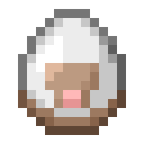 **Действия, которые создают сущностей в мире.**

***

<table data-full-width="true"><thead><tr><th>Опция</th><th>Описание</th><th>Аргументы</th></tr></thead><tbody><tr><td>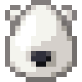 <strong>Создать моба</strong> <code>game_spawn_mob</code></td><td>Создаёт моба в указанном местоположении с выбранными параметрами.</td><td> <strong>Тип моба</strong>  <strong>Место создания</strong>  <strong>Количество здоровья</strong>  <strong>Имя</strong>  <strong>Эффекты</strong>  <strong>Предмет в основной руке</strong>  <strong>Головной убор</strong>  <strong>Нагрудник</strong>  <strong>Поножи</strong>  <strong>Ботинки</strong>  <strong>Предмет во второстепенной руке</strong>  <strong>Стандартное снаряжение</strong> <a data-footnote-ref href="#user-content-fn-1"><strong><code>-></code></strong></a></td></tr><tr><td> <strong>Создать предмет</strong> <code>game_spawn_item</code></td><td>Создаёт предмет в указанном местоположении с выбранными параметрами.</td><td> <strong>Предмет для создания</strong>  <strong>Место создания</strong>  <strong>Имя</strong>  <strong>Задать движение предмета при создании</strong> <a data-footnote-ref href="#user-content-fn-2"><strong><code>-></code></strong></a>  <strong>Смогут ли подбирать предмет мобы</strong> <a data-footnote-ref href="#user-content-fn-3"><strong><code>-></code></strong></a>  <strong>Смогут ли подбирать предмет игроки</strong> <a data-footnote-ref href="#user-content-fn-4"><strong><code>-></code></strong></a></td></tr><tr><td>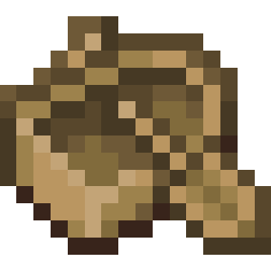 <strong>Создать транспорт</strong> <code>game_spawn_vehicle</code></td><td>Создаёт транспорт в указанном местоположении с выбранными параметрами.</td><td> <strong>Тип транспорта</strong>  <strong>Место создания</strong>  <strong>Имя</strong></td></tr><tr><td> <strong>Создать сферу опыта</strong> <code>game_spawn_experience_orb</code></td><td>Создаёт сферу опыта в указанном местоположении с выбранными параметрами.</td><td> <strong>Место создания</strong>  <strong>Количество опыта</strong>  <strong>Имя</strong></td></tr><tr><td> <strong>Создать взрыв</strong> <code>game_create_explosion</code></td><td>Создаёт взрыв в указанном местоположении.</td><td> <strong>Место создания</strong>  <strong>Сила взрыва (от 0 до 4)</strong>  <strong>Появление огня</strong> <a data-footnote-ref href="#user-content-fn-5"><strong><code>-></code></strong></a>  <strong>Разрушение блоков</strong> <a data-footnote-ref href="#user-content-fn-6"><strong><code>-></code></strong></a></td></tr><tr><td> <strong>Создать подожжённый динамит</strong> <code>game_spawn_primed_tnt</code></td><td>Создаёт подожжённый динамит в указанном местоположении.</td><td> <strong>Место создания</strong>  <strong>Мощность динамита (от 0 до 4)</strong>  <strong>Время задержки взрыва</strong>  <strong>Имя</strong>  <strong>Блок для маскировки</strong></td></tr><tr><td>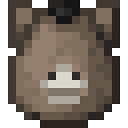 <strong>Создать челюсти заклинателя</strong> <code>game_spawn_evoker_fangs</code></td><td>Создаёт челюсти заклинателя в указанном местоположении.</td><td> <strong>Место создания</strong>  <strong>Имя</strong></td></tr><tr><td> <strong>Создать фейерверк</strong> <code>game_launch_firework</code></td><td>Запускает фейерверк в указанном местоположении.</td><td> <strong>Фейерверк для создания</strong>  <strong>Место создания</strong>  <strong>Движение</strong> <a data-footnote-ref href="#user-content-fn-7"><strong><code>-></code></strong></a>  <strong>Мгновенный взрыв</strong> <a data-footnote-ref href="#user-content-fn-8"><strong><code>-></code></strong></a></td></tr><tr><td> <strong>Запустить снаряд</strong> <code>game_launch_projectile</code></td><td>Запускает снаряд в указанном местоположении.</td><td> <strong>Снаряд для запуска</strong>  <strong>Место запуска</strong>  <strong>Скорость снаряда</strong>  <strong>Отклонение снаряда (0, чтобы снаряд летел ровно)</strong>  <strong>Имя снаряда</strong>  <strong>След, который будет оставаться за снарядом</strong></td></tr><tr><td> <strong>Создать снаряд Шалкера</strong> <code>game_spawn_shulker_bullet</code></td><td>Создаёт снаряд Шалкера в указанном местоположении.</td><td> <strong>Место создания</strong>  <strong>Имя</strong></td></tr><tr><td> <strong>Создать молнию</strong> <code>game_spawn_lightning_bolt</code></td><td>Создаёт молнию в указанном местоположении.</td><td> <strong>Место создания</strong></td></tr><tr><td> <strong>Создать облако туманного зелья</strong> <code>game_spawn_effect_cloud</code></td><td>Создаёт облако туманного зелья, которое пропитывает эффектами сущностей в нём.</td><td> <strong>Место создания</strong>  <strong>Эффекты зелья</strong>  <strong>Радиус облака</strong>  <strong>Длительность</strong>  <strong>Частицы облака</strong>  <strong>Имя</strong></td></tr><tr><td> <strong>Создать падающий блок</strong> <code>game_spawn_falling_block</code></td><td>Создаёт падающий блок в указанном местоположении.</td><td> <strong>Блок для создания</strong>  <strong>Место создания</strong>  <strong>Имя</strong>  <strong>Должен исчезать</strong> <a data-footnote-ref href="#user-content-fn-9"><strong><code>-></code></strong></a></td></tr><tr><td> <strong>Создать стойку для брони</strong> <code>game_spawn_armor_stand</code></td><td>Создаёт стойку для брони в указанном местоположении.</td><td> <strong>Головной убор</strong>  <strong>Нагрудник</strong>  <strong>Поножи</strong>  <strong>Ботинки</strong>  <strong>Предмет в правой руке</strong>  <strong>Предмет в левой руке</strong>  <strong>Установить гравитацию</strong> <a data-footnote-ref href="#user-content-fn-10"><strong><code>-></code></strong></a>  <strong>Режим маркера</strong> <a data-footnote-ref href="#user-content-fn-11"><strong><code>-></code></strong></a>  <strong>Сделать маленьким</strong> <a data-footnote-ref href="#user-content-fn-12"><strong><code>-></code></strong></a>  <strong>Отображение рук</strong> <a data-footnote-ref href="#user-content-fn-13"><strong><code>-></code></strong></a>  <strong>Отображение плиты</strong> <a data-footnote-ref href="#user-content-fn-14"><strong><code>-></code></strong></a>  <strong>Невидимость</strong> <a data-footnote-ref href="#user-content-fn-15"><strong><code>-></code></strong></a>  <strong>Место создания</strong>  <strong>Имя стойки</strong></td></tr><tr><td> <strong>Создать кристалл Энда</strong> <code>game_spawn_end_crystal</code></td><td>Создаёт кристалл Энда в указанном местоположении.</td><td> <strong>Место создания</strong>  <strong>Имя</strong>  <strong>Создание фундамента</strong> <a data-footnote-ref href="#user-content-fn-16"><strong><code>-></code></strong></a></td></tr><tr><td> <strong>Создать око Энда</strong> <code>game_spawn_eye_of_ender</code></td><td>Создаёт в указанном местоположении око Энда, которое будет двигаться в сторону цели.</td><td> <strong>Место создания</strong>  <strong>Цель</strong>  <strong>Длительность жизни</strong>  <strong>Имя</strong>  <strong>По окончанию</strong> <a data-footnote-ref href="#user-content-fn-17"><strong><code>-></code></strong></a></td></tr><tr><td>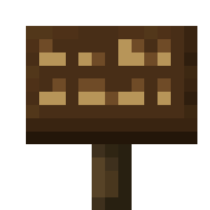 <strong>Создать визуализатор текста</strong> <code>game_spawn_text_display</code></td><td>Создаёт визуализатор текста на указанном местоположении.</td><td> <strong>Место создания</strong>  <strong>Имя</strong>  <strong>Объединение текста</strong> <a data-footnote-ref href="#user-content-fn-18"><strong><code>-></code></strong></a>  <strong>Отображаемый текст</strong></td></tr><tr><td>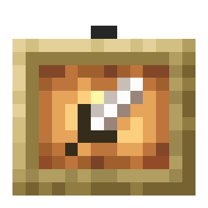 <strong>Создать визуализатор предмета</strong> <code>game_spawn_item_display</code></td><td>Создаёт визуализатор предмета на указанном местоположении.</td><td> <strong>Место создания</strong>  <strong>Имя</strong>  <strong>Отображаемый предмет</strong></td></tr><tr><td> <strong>Создать визуализатор блока</strong> <code>game_spawn_block_display</code></td><td>Создаёт визуализатор блока на указанном местоположении.</td><td> <strong>Место создания</strong>  <strong>Имя</strong>  <strong>Отображаемый блок</strong></td></tr><tr><td> <strong>Создать сущность взаимодействия</strong> <code>game_spawn_interaction_entity</code></td><td>Создаёт сущность взаимодействия на указанном местоположении.  » Определяйте взаимодействие при помощи событий атаки и клика по сущности.</td><td> <strong>Место создания</strong>  <strong>Имя</strong>  <strong>Горизонтальный размер</strong>  <strong>Вертикальный размер</strong>  <strong>Отзывчивость</strong> <a data-footnote-ref href="#user-content-fn-19"><strong><code>-></code></strong></a></td></tr></tbody></table>



 **Действия, которые взаимодействуют с миром и блоками.**

***

<table data-full-width="true"><thead><tr><th>Опция</th><th>Описание</th><th>Аргументы</th></tr></thead><tbody><tr><td> <strong>Установить блок</strong> <code>game_set_block</code></td><td>Устанавливает выбранный тип блока на выбранных местоположениях.</td><td> <strong>Блок</strong>  <strong>Местоположения установки блока</strong>  <strong>Обновлять блоки вокруг</strong> <a data-footnote-ref href="#user-content-fn-20"><strong><code>-></code></strong></a></td></tr><tr><td> <strong>Установить блоки в регионе</strong> <code>game_set_region</code></td><td>Устанавливает выбранный тип блока на весь выбранный регион.</td><td> <strong>Блок</strong>  <strong>Угол региона</strong>  <strong>Противоположный угол региона</strong></td></tr><tr><td> <strong>Заменить блоки в регионе</strong> <code>game_replace_blocks_in_region</code></td><td>Заменяет одни блоки на другие в выбранном регионе.</td><td> <strong>Блоки для замены</strong>  <strong>Угол региона</strong>  <strong>Противоположный угол региона</strong>  <strong>Новый блок</strong></td></tr><tr><td> <strong>Очистить регион</strong> <code>game_clear_region</code></td><td>Удаляет все блоки в регионе.</td><td> <strong>Угол региона</strong>  <strong>Противоположный угол региона</strong></td></tr><tr><td>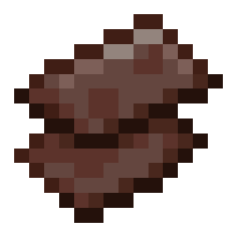 <strong>Клонировать блоки региона</strong> <code>game_clone_region</code></td><td>Клонирует регион на выбранное местоположение.</td><td> <strong>Угол региона</strong>  <strong>Противоположный угол региона</strong>  <strong>Местоположение копирования</strong>  <strong>Местоположение для вставки</strong>  <strong>Игнорировать воздух</strong> <a data-footnote-ref href="#user-content-fn-21"><strong><code>-></code></strong></a>  <strong>Клонировать существ</strong> <a data-footnote-ref href="#user-content-fn-22"><strong><code>-></code></strong></a></td></tr><tr><td> <strong>Сломать блок</strong> <code>game_break_block</code></td><td>Разрушает блоки на указанных местоположениях, как если бы это сделал игрок в режиме выживания нужным инструментом.</td><td> <strong>Местоположения блоков</strong>  <strong>Инструмент</strong>  <strong>Выпадение опыта</strong> <a data-footnote-ref href="#user-content-fn-23"><strong><code>-></code></strong></a></td></tr><tr><td>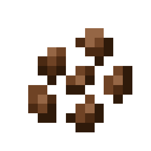 <strong>Установить возраст</strong> <code>game_set_age</code></td><td>Устанавливает возраст блока на выбранном местоположении.  Работает с: » Любыми блоками, которые могут иметь возраст</td><td> <strong>Местоположение блока</strong>  <strong>Тики</strong></td></tr><tr><td> <strong>Удобрить блок</strong> <code>game_bone_meal_block</code></td><td>Удобряет блок на выбранном местоположении.</td><td> <strong>Местоположение блока</strong>  <strong>Количество попыток удобрить</strong></td></tr><tr><td> <strong>Создать дерево</strong> <code>game_generate_tree</code></td><td>Создаёт дерево на выбранном местоположении.</td><td> <strong>Местоположение дерева</strong>  <strong>Тип дерева</strong> <a data-footnote-ref href="#user-content-fn-24"><strong><code>-></code></strong></a></td></tr><tr><td> <strong>Установить стадию роста блока</strong> <code>game_block_growth</code></td><td>Устанавливает стадию роста для блока на выбранном местоположении.</td><td> <strong>Местоположение блока</strong>  <strong>Стадия роста</strong>  <strong>Тип роста</strong> <a data-footnote-ref href="#user-content-fn-25"><strong><code>-></code></strong></a></td></tr><tr><td> <strong>Заполнить контейнер</strong> <code>game_fill_container</code></td><td>Заполняет контейнер на выбранном местоположении указанными предметами.  Работает с: » Любыми контейнерами</td><td> <strong>Местоположение контейнера</strong>  <strong>Предметы для заполнения</strong></td></tr><tr><td> <strong>Установить предметы в контейнере</strong> <code>game_set_container</code></td><td>Устанавливает указанные предметы в контейнер на выбранном местоположении.  Работает с: » Любыми контейнерами</td><td> <strong>Местоположение контейнера</strong>  <strong>Предметы для установки</strong></td></tr><tr><td> <strong>Установить предмет в слот контейнера</strong> <code>game_set_item_in_container_slot</code></td><td>Установить предмет в указанный слот контейнера на выбранном местоположении.  Работает с: » Любыми контейнерами</td><td> <strong>Местоположение контейнера</strong>  <strong>Предмет</strong>  <strong>Номер слота</strong></td></tr><tr><td> <strong>Заменить предметы в контейнере</strong> <code>game_replace_container_items</code></td><td>Заменяет указанные предметы в контейнере на выбранном местоположении на определённый предмет.  Работает с: » Любыми контейнерами</td><td> <strong>Заменяемые предметы</strong>  <strong>Местоположение контейнера</strong>  <strong>Заменяющий предмет</strong>  <strong>Количество предметов для замены</strong></td></tr><tr><td> <strong>Удалить предметы из контейнера</strong> <code>game_remove_container_items</code></td><td>Удаляет из контейнера на выбранном местоположении указанные предметы.  Работает с: » Любыми контейнерами</td><td> <strong>Местоположение контейнера</strong>  <strong>Предметы</strong></td></tr><tr><td> <strong>Очистить предметы в контейнере</strong> <code>game_clear_container_items</code></td><td>Очищает указанные предметы из контейнера.  Работает с: » Любыми контейнерами</td><td> <strong>Местоположение контейнера</strong>  <strong>Предметы</strong></td></tr><tr><td> <strong>Очистить контейнер</strong> <code>game_clear_container</code></td><td>Удаляет все предметы из контейнера на выбранном местоположении.  Работает с: » Любыми контейнерами</td><td> <strong>Местоположение контейнера</strong></td></tr><tr><td> <strong>Установить имя контейнеру</strong> <code>game_set_container_name</code></td><td>Устанавливает имя контейнеру на выбранном местоположении.  Работает с: » Любыми контейнерами</td><td> <strong>Местоположение контейнера</strong>  <strong>Имя контейнера</strong></td></tr><tr><td> <strong>Установить ключ контейнера</strong> <code>game_set_container_lock</code></td><td>Устанавливает определённый ключ контейнеру на выбранном местоположении.  » В качестве ключа контейнера служит любой предмет с определённым именем.</td><td> <strong>Местоположение контейнера</strong>  <strong>Имя ключа контейнера</strong></td></tr><tr><td> <strong>Установить текст таблички</strong> <code>game_set_sign_text</code></td><td>Устанавливает текст таблички на выбранном местоположении.  Работает с: » Табличками</td><td> <strong>Местоположение таблички</strong>  <strong>Текст для установки</strong>  <strong>Строка</strong>  <strong>Сторона таблички</strong> <a data-footnote-ref href="#user-content-fn-26"><strong><code>-></code></strong></a></td></tr><tr><td>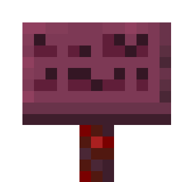 <strong>Установить цвет текста таблички</strong> <code>game_set_sign_text_color</code></td><td>Устанавливает цвет текста таблички на выбранном местоположении.  Работает с: » Табличками</td><td> <strong>Местоположение таблички</strong>  <strong>Сторона таблички</strong> <a data-footnote-ref href="#user-content-fn-26"><strong><code>-></code></strong></a>  <strong>Цвет текста</strong> <a data-footnote-ref href="#user-content-fn-27"><strong><code>-></code></strong></a>  <strong>Свечение текста</strong> <a data-footnote-ref href="#user-content-fn-28"><strong><code>-></code></strong></a></td></tr><tr><td> <strong>Установить вощённость таблички</strong> <code>game_set_sign_waxed</code></td><td>Устанавливает вощённость таблички на выбранном местоположении.  Работает с: » Табличками</td><td> <strong>Местоположение таблички</strong>  <strong>Вощённость</strong> <a data-footnote-ref href="#user-content-fn-29"><strong><code>-></code></strong></a></td></tr><tr><td> <strong>Установить голову игрока</strong> <code>game_set_player_head</code></td><td>Устанавливает голову игрока на выбранном местоположении.  Работает с: » Головами игроков</td><td> <strong>Местоположение головы</strong>  <strong>Значение</strong>  <strong>Тип значения</strong> <a data-footnote-ref href="#user-content-fn-30"><strong><code>-></code></strong></a></td></tr><tr><td> <strong>Установить время готовки печи</strong> <code>game_set_furnace_cook_time</code></td><td>Устанавливает время готовки печи на выбранном местоположении.  Работает с: » Печками » Плавильнями » Коптильнями</td><td> <strong>Местоположение печи</strong>  <strong>Время готовки</strong></td></tr><tr><td> <strong>Установить предмет в костёр</strong> <code>game_set_campfire_item</code></td><td>Устанавливает предмет в костёр на выбранном местоположении.  Работает с: » Кострами</td><td> <strong>Местоположение костра</strong>  <strong>Предмет</strong>  <strong>Время готовки</strong>  <strong>Слот</strong> <a data-footnote-ref href="#user-content-fn-31"><strong><code>-></code></strong></a></td></tr><tr><td> <strong>Установить книгу в кафедру</strong> <code>game_set_lectern_book</code></td><td>Устанавливает книгу в кафедру на выбранном местоположении.  Работает с: » Кафедрами</td><td> <strong>Местоположение кафедры</strong>  <strong>Книга для установки</strong>  <strong>Страница</strong></td></tr><tr><td> <strong>Установить предмет в подозрительный блок</strong> <code>game_set_brushable_block_item</code></td><td>Устанавливает предмет в подозрительный блок (песок, гравий) на выбранном местоположении.  Работает с: » Подозрительным песком » Подозрительным гравием</td><td> <strong>Местоположение блока</strong>  <strong>Предмет</strong></td></tr><tr><td> <strong>Установить украшение вазы</strong> <code>game_set_decorate_pot_sherd</code></td><td>Устанавливает указанный черепок выбранной стороне вазы на указанном местоположении.  Работает с: » Вазами</td><td> <strong>Местоположение вазы</strong>  <strong>Черепок для установки</strong>  <strong>Сторона вазы</strong> <a data-footnote-ref href="#user-content-fn-32"><strong><code>-></code></strong></a></td></tr><tr><td> <strong>Продлить скалк-заражение к местоположению</strong> <code>game_bloom_skulk_catalyst</code></td><td>Продлевает скалк-заражение к местоположению.  Работает с: » Скалк-катализаторами</td><td> <strong>Местоположение скалкового катализатора</strong>  <strong>Конечное местоположение</strong>  <strong>Сила заражения</strong></td></tr><tr><td> <strong>Установить скалк-крикуну возможность призыва</strong> <code>game_set_sculk_shrieker_can_summon</code></td><td>Устанавливает указанному скалк-крикуну возможность призыва Вардена.  Работает с: » Скалк-крикунами</td><td> <strong>Местоположение скалк-крикуна</strong>  <strong>Возможность призыва</strong> <a data-footnote-ref href="#user-content-fn-33"><strong><code>-></code></strong></a></td></tr><tr><td> <strong>Установить состояние скалк-крикуну</strong> <code>game_set_sculk_shrieker_shrieking</code></td><td>Устанавливает указанному скалк-крикуну состояние.  Работает с: » Скалк-крикунами</td><td> <strong>Местоположение скалк-крикуна</strong>  <strong>Состояние</strong> <a data-footnote-ref href="#user-content-fn-34"><strong><code>-></code></strong></a></td></tr><tr><td> <strong>Установить скалк-крикуну уровень опасности</strong> <code>game_set_sculk_shrieker_warning_level</code></td><td>Устанавливает указанному скалк-крикуну уровень опасности.  Работает с: » Скалк-крикунами</td><td> <strong>Местоположение скалк-крикуна</strong>  <strong>Уровень опасности</strong></td></tr><tr><td>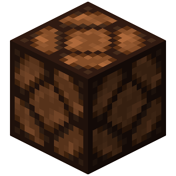 <strong>Активировать блок</strong> <code>game_set_block_powered</code></td><td>Активирует блок на выбранном местоположении.  Работает с: » Активируемыми блоками</td><td> <strong>Местоположение блока</strong>  <strong>Активация</strong> <a data-footnote-ref href="#user-content-fn-35"><strong><code>-></code></strong></a></td></tr><tr><td> <strong>Установить силу редстоун-сигнала</strong> <code>game_set_block_analogue_power</code></td><td>Устанавливает на выбранном местоположении определённую силу сигнала.  Работает с: » Активируемыми блоками</td><td> <strong>Местоположение блока</strong>  <strong>Новая сила сигнала</strong></td></tr><tr><td>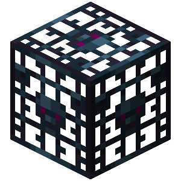 <strong>Установить сущность в спавнере</strong> <code>game_set_spawner_entity</code></td><td>Устанавливает спавнеру на выбранном местоположении сущность внутри.  Работает с: » Спавнерами</td><td> <strong>Местоположение спавнера</strong>  <strong>Яйцо призыва сущности</strong></td></tr><tr><td> <strong>Вызвать случайный тик</strong> <code>game_random_tick_block</code></td><td>Вызывает случайный тик на выбранном местоположении.</td><td> <strong>Местоположение</strong>  <strong>Количество тиков</strong></td></tr><tr><td> <strong>Обновить смежные блоки</strong> <code>game_update_block</code></td><td>Обновляет соседние блоки на указанном местоположении, если блок на местоположении не является воздухом. Сам по себе блок на местоположении не обновляется, но может обновиться от соседних.</td><td> <strong>Местоположение</strong></td></tr><tr><td> <strong>Установить параметр блоку</strong> <code>game_set_block_single_data</code></td><td>Устанавливает указанный параметр блоку на местоположении на заданное значение.</td><td> <strong>Местоположение блока</strong>  <strong>Изменяемый параметр</strong>  <strong>Новое значение</strong></td></tr></tbody></table>



 **Действия, которые изменяют поведение события.**

***

<table data-full-width="true"><thead><tr><th>Опция</th><th>Описание</th><th>Аргументы</th></tr></thead><tbody><tr><td> <strong>Отмена события</strong> <code>game_cancel_event</code></td><td>Отменяет начальное событие, которое вызвало этот код.</td><td></td></tr><tr><td> <strong>Возврат события</strong> <code>game_uncancel_event</code></td><td>Возвращает отмену события, которое вызвало этот код.</td><td></td></tr><tr><td> <strong>Убрать сообщение события</strong> <code>game_hide_event_message</code></td><td>Убирает отправку сообщения события, которое вызвало этот код.  Работает с: » Событием <a href="player_event.md#sobytiya-mira"> <strong>Игрок зашёл в мир</strong></a> » Событием <a href="player_event.md#sobytiya-mira">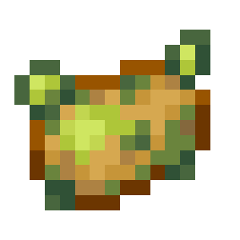 <strong>Игрок вышел из мира</strong></a> » Событием <a href="player_event.md#sobytiya-smerti"> <strong>Игрок умирает</strong></a></td><td> <strong>Убрать сообщение</strong> <a data-footnote-ref href="#user-content-fn-36"><strong><code>-></code></strong></a></td></tr><tr><td> <strong>Установить урон события</strong> <code>game_set_event_damage</code></td><td>Устанавливает урон, связанный с этим событием.  Работает с: » Событиями урона</td><td> <strong>Количество урона</strong></td></tr><tr><td> <strong>Установить вектор отталкивания события</strong> <code>game_set_event_knockback_vector</code></td><td>Устанавливает вектор отталкивания, связанный с этим событием.  Работает с: » Событием <a href="player_event.md#sobytiya-urona"> <strong>Игрок отталкивается</strong></a> » Событием <a href="entity_event.md#opcii"> <strong>Сущность отталкивается</strong></a></td><td> <strong>Вектор отталкивания</strong></td></tr><tr><td> <strong>Установить вектор скорости события</strong> <code>game_set_event_velocity</code></td><td>Устанавливает вектор скорости, связанный с этим событием.  Работает с: » Событием <a href="player_event.md#sobytiya-peredvizheniya"> <strong>Игрок изменил вектор скорости</strong></a></td><td> <strong>Вектор скорости</strong></td></tr><tr><td> <strong>Установить лечение события</strong> <code>game_set_event_heal</code></td><td>Устанавливает значение лечения, связанное с этим событием.  Работает с: » Событием <a href="player_event.md#sobytiya-urona">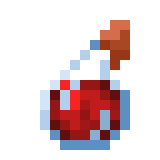 <strong>Игрок восстанавливает здоровье</strong></a> » Событием <a href="entity_event.md#opcii"> <strong>Сущность исцеляется</strong></a></td><td> <strong>Количество лечения</strong></td></tr><tr><td> <strong>Установить истощение события</strong> <code>game_set_event_exhaustion</code></td><td>Устанавливает значение истощения, связанное с этим событием.  Работает с: » Событием <a href="player_event.md#sobytiya-urona"> <strong>Игрок истощается</strong></a></td><td> <strong>Количество истощения</strong></td></tr><tr><td> <strong>Установить опыт события</strong> <code>game_set_event_experience</code></td><td>Устанавливает значение опыта, связанное с этим событием.  Работает с: » Событием <a href="player_event.md#sobytiya-predmetov"> <strong>Игрок рыбачит</strong></a> » Событием <a href="player_event.md#sobytiya-vzaimodeistviya-s-sushnostyu"> <strong>Игрок поднял сферу опыта</strong></a> » Событиями убийства</td><td> <strong>Количество опыта</strong></td></tr><tr><td> <strong>Установить конечный слот события</strong> <code>game_set_event_target_slot</code></td><td>Устанавливает конечный слот, связанный с этим событием.  Работает с: » Событием <a href="player_event.md#sobytiya-inventarya"> <strong>Игрок находит предмет в инвентаре</strong></a></td><td> <strong>Слот для установки</strong></td></tr><tr><td> <strong>Установить начальный слот события</strong> <code>game_set_event_source_slot</code></td><td>Устанавливает начальный слот, связанный с этим событием.  Работает с: » Событием <a href="player_event.md#sobytiya-inventarya"> <strong>Игрок находит предмет в инвентаре</strong></a></td><td> <strong>Слот для установки</strong></td></tr><tr><td> <strong>Установить снаряд события</strong> <code>game_set_event_projectile</code></td><td>Заменяет снаряд, который связан с этим событием.</td><td> <strong>Снаряд</strong>  <strong>Отображаемое имя снаряда</strong></td></tr><tr><td> <strong>Установить звук события</strong> <code>game_set_event_sound</code></td><td>Устанавливает звук для проигрывания, связанный с этим событием, заменяя изначальный.</td><td> <strong>Проигрываемый звук</strong></td></tr><tr><td> <strong>Очистить взорванные блоки</strong> <code>game_clear_exploded_blocks</code></td><td>Возвращает взорванные блоки в исходное положение.  Работает с: » Событием <a href="world_event.md#sobytiya-blokov"> <strong>Сущность взрывается</strong></a> » Событием <a href="world_event.md#sobytiya-blokov"> <strong>Блок взрывается</strong></a></td><td> <strong>Местоположения блоков</strong></td></tr><tr><td> <strong>Установить предмет события</strong> <code>game_set_event_item</code></td><td>Устанавливает предмет, связанный с этим событием.  Работает с: » Событием <a href="world_event.md#sobytiya-blokov"> <strong>Раздатчик надевает броню</strong></a> » Событием <a href="world_event.md#sobytiya-blokov"> <strong>Блок выбрасывает предмет</strong></a> » Событием <a href="player_event.md#sobytiya-predmetov"> <strong>Игрок употребляет предмет</strong></a> » Событием <a href="player_event.md#sobytiya-inventarya"> <strong>Игрок крафтит предмет</strong></a> » Событием <a href="player_event.md#sobytiya-predmetov"> <strong>Игрок выбрасывает предмет</strong></a> » Событием <a href="entity_event.md#opcii"> <strong>Существо выбрасывает предмет</strong></a> » Событием <a href="entity_event.md#opcii"> <strong>Существо поднимает предмет</strong></a> » Событием <a href="player_event.md#sobytiya-inventarya"> <strong>Игрок кликает в своём инвентаре</strong></a> » Событием <a href="player_event.md#sobytiya-inventarya"> <strong>Игрок кликает в инвентаре</strong></a> » Событием <a href="player_event.md#sobytiya-predmetov"> <strong>Игрок изменяет книгу</strong></a> » Событием <a href="player_event.md#sobytiya-vzaimodeistviya-s-sushnostyu"> <strong>Игрок поднял снаряд</strong></a> » Событием <a href="entity_event.md#opcii">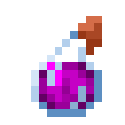 <strong>Ведьма кидает зелье</strong></a></td><td> <strong>Новый предмет события</strong></td></tr><tr><td> <strong>Установить предметы события</strong> <code>game_set_event_items</code></td><td>Устанавливает предметы связанные с этим событием.  Работает с: » Событием <a href="player_event.md#sobytiya-inventarya"> <strong>Игрок находит предмет в инвентаре</strong></a></td><td> <strong>Предметы для установки</strong></td></tr><tr><td> <strong>Установить теги в полученную информацию</strong> <code>game_set_event_uery_info</code></td><td>Устанавливает дополнительные теги в полученную отладочную информацию, которые скопируются в буфер обмена, если событие не отменено.  Работает с: » Событием <a href="player_event.md#sobytiya-vzaimodeistviya-s-mirom"> <strong>Игрок получает информацию о блоке</strong></a> » Событием <a href="player_event.md#sobytiya-vzaimodeistviya-s-sushnostyu"> <strong>Игрок получает информацию о сущности</strong></a>  » Изменения касаются только дополнительной информации.</td><td> <strong>Дополнительные теги</strong></td></tr><tr><td> <strong>Разрешить передвижение</strong> <code>game_set_event_move_allowed</code></td><td>Разрешает передвижение, если оно не удалось.  Работает с: » Событием <a href="player_event.md#sobytiya-peredvizheniya"> <strong>Игроку не удалось передвинуться</strong></a></td><td> <strong>Разрешить передвижение</strong> <a data-footnote-ref href="#user-content-fn-37"><strong><code>-></code></strong></a></td></tr></tbody></table>



 **Действия, которые создают или изменяют скорборды.**

***

<table data-full-width="true"><thead><tr><th>Опция</th><th>Описание</th><th>Аргументы</th></tr></thead><tbody><tr><td> <strong>Создать скорборд</strong> <code>game_create_scoreboard</code></td><td>Создаёт скорборд с определённым ID. Чтобы отобразить скорборд игроку, используйте действие <a href="player_action.md#raznoe"> <strong>Показать скорборд</strong></a>.</td><td> <strong>ID скорборда</strong>  <strong>Заголовок</strong></td></tr><tr><td> <strong>Удалить скорборд</strong> <code>game_remove_scoreboard</code></td><td>Удаляет указанный скорборд.</td><td> <strong>ID скорборда</strong></td></tr><tr><td> <strong>Изменить заголовок скорборда</strong> <code>game_set_scoreboard_title</code></td><td>Изменяет заголовок указанного скорборда.</td><td> <strong>ID скорборда</strong>  <strong>Новый заголовок</strong></td></tr><tr><td> <strong>Установить значение скорборда</strong> <code>game_set_scoreboard_score</code></td><td>Устанавливает значение указанной строке в скорборде.</td><td> <strong>ID скорборда</strong>  <strong>ID линии</strong>  <strong>Счёт</strong></td></tr><tr><td> <strong>Установить линию в скорборде</strong> <code>game_set_scoreboard_line</code></td><td>Устанавливает линию в скорборде.</td><td> <strong>ID скорборда</strong>  <strong>ID линии</strong>  <strong>Отображаемый текст</strong>  <strong>Значение</strong>  <strong>Формат текста</strong>  <strong>Тип формата</strong> <a data-footnote-ref href="#user-content-fn-38"><strong><code>-></code></strong></a></td></tr><tr><td> <strong>Установить отображаемый текст линии скорборда</strong> <code>game_set_scoreboard_line_display</code></td><td>Устанавливает указанной линии скорборда отображаемый текст.</td><td> <strong>ID скорборда</strong>  <strong>ID линии</strong>  <strong>Отображаемый текст</strong></td></tr><tr><td> <strong>Установить формат текста линии скорборда</strong> <code>game_set_scoreboard_line_format</code></td><td>Устанавливает форматирование текста указанной линии скорборда.</td><td> <strong>ID скорборда</strong>  <strong>ID линии</strong>  <strong>Формат текста</strong>  <strong>Тип формата</strong> <a data-footnote-ref href="#user-content-fn-38"><strong><code>-></code></strong></a></td></tr><tr><td> <strong>Установить форматирование значений скорборда</strong> <code>game_set_scoreboard_number_format</code></td><td>Устанавливает форматирование значений для скорборда.</td><td> <strong>ID скорборда</strong>  <strong>Формат текста</strong>  <strong>Тип формата</strong> <a data-footnote-ref href="#user-content-fn-38"><strong><code>-></code></strong></a></td></tr><tr><td> <strong>Удалить значение скорборда по тексту</strong> <code>game_remove_scoreboard_score_by_name</code></td><td>Удаляет значение указанной строки в скорборде.</td><td> <strong>ID скорборда</strong>  <strong>ID линии</strong></td></tr><tr><td> <strong>Удалить значение скорборда по счёту</strong> <code>game_remove_scoreboard_score_by_score</code></td><td>Удаляет значение указанного скорборда по счёту.</td><td> <strong>ID скорборда</strong>  <strong>Счёт значения для удаления</strong></td></tr><tr><td> <strong>Очистить значения скорборда</strong> <code>game_clear_scoreboard_scores</code></td><td>Очищает все значения указанного скорборда.</td><td> <strong>ID скорборда</strong></td></tr></tbody></table>



 **Действия, которые взаимодействуют на мир.**

***

<table data-full-width="true"><thead><tr><th>Опция</th><th>Описание</th><th>Аргументы</th></tr></thead><tbody><tr><td> <strong>Установить время мира</strong> <code>game_set_world_time</code></td><td>Устанавливает время мира в тиках.</td><td> <strong>Время в тиках</strong></td></tr><tr><td> <strong>Установить выпадение блоков</strong> <code>game_set_block_drops_enabled</code></td><td>Устанавливает правило в мире на выпадение блоков при их разрушении.</td><td> <strong>Выпадение блоков</strong> <a data-footnote-ref href="#user-content-fn-39"><strong><code>-></code></strong></a></td></tr><tr><td> <strong>Установить сложность мира</strong> <code>game_set_world_difficulty</code></td><td>Устанавливает определённую сложность в мире.</td><td> <strong>Сложность</strong> <a data-footnote-ref href="#user-content-fn-40"><strong><code>-></code></strong></a></td></tr><tr><td> <strong>Установить игровое правило мира</strong> <code>game_set_world_gamerule</code></td><td>Устанавливает определённое игровое правило (gamerule) мира.  » Оставьте аргумент "Значение" пустым, чтобы сбросить его на состояние по умолчанию.</td><td> <strong>Игровое правило</strong> <a data-footnote-ref href="#user-content-fn-41"><strong><code>-></code></strong></a>  <strong>Значение</strong></td></tr><tr><td> <strong>Установить погоду мира</strong> <code>game_set_world_weather</code></td><td>Устанавливает погоду мира на определённое время.  » По умолчания, если не указать длительность, погода не будет изменяться.</td><td> <strong>Тип погоды</strong> <a data-footnote-ref href="#user-content-fn-42"><strong><code>-></code></strong></a>  <strong>Длительность</strong></td></tr><tr><td> <strong>Установить дистанцию симуляции мира</strong> <code>game_set_world_simulation_distance</code></td><td>Устанавливает дистанцию симуляции чанков для мира.</td><td> <strong>Дистанция симуляции в чанках (2-32)</strong></td></tr></tbody></table>



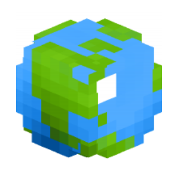 **Действия, которые взаимодействуют с интернет-ресурсами.**

***

<table data-full-width="true"><thead><tr><th>Опция</th><th>Описание</th><th>Аргументы</th></tr></thead><tbody><tr><td> <strong>Отправить веб-запрос</strong> <code>game_send_web_request</code></td><td>Отправляет веб-запрос с выбранным методом и телом на выбранный URL.</td><td> <strong>URL</strong>  <strong>Тело запроса</strong>  <strong>Заголовки запроса</strong>  <strong>Тип запроса</strong> <a data-footnote-ref href="#user-content-fn-43"><strong><code>-></code></strong></a>  <strong>Медиа тип запроса</strong> <a data-footnote-ref href="#user-content-fn-44"><strong><code>-></code></strong></a></td></tr></tbody></table>



[^1]: **Стандартное снаряжение** `natural_equipment`:

    *  **Включить**\
      `true`
    *  **Выключить**\
      `false`

[^2]: **Задать движение предмета при создании** `apply_motion`:

    *  **Да**\
      `true`
    *  **Нет**\
      `false`

[^3]: **Смогут ли подбирать предмет мобы** `can_mob_pickup`:

    *  **Да**\
      `true`
    *  **Нет**\
      `false`

[^4]: **Смогут ли подбирать предмет игроки** `can_player_pickup`:

    *  **Да**\
      `true`
    *  **Нет**\
      `false`

[^5]: **Появление огня** `fire`:

    *  **Включить**\
      `true`
    *  **Выключить**\
      `false`

[^6]: **Разрушение блоков** `break_blocks`:

    *  **Включить**\
      `true`
    *  **Выключить**\
      `false`

[^7]: **Движение** `movement`:

    *  **Вверх**\
      `upwards`
    *  **Направленное**\
      `directional`

[^8]: **Мгновенный взрыв** `instant`:

    *  **Да**\
      `true`
    *  **Нет**\
      `false`

[^9]: **Должен исчезать** `should_expire`:

    *  **Да**\
      `true`
    *  **Нет**\
      `false`

[^10]: **Установить гравитацию** `gravity`:

    *  **Включить**\
      `true`
    *  **Выключить**\
      `false`

[^11]: **Режим маркера** `marker`:

    *  **Включён**\
      `true`
    *  **Выключен**\
      `false`

[^12]: **Сделать маленьким** `small`:

    *  **Включить**\
      `true`
    *  **Выключить**\
      `false`

[^13]: **Отображение рук** `show_arms`:

    *  **Включить**\
      `true`
    *  **Выключить**\
      `false`

[^14]: **Отображение плиты** `base_plate`:

    *  **Включить**\
      `true`
    *  **Выключить**\
      `false`

[^15]: **Невидимость** `invisible`:

    *  **Включить**\
      `true`
    *  **Выключить**\
      `false`

[^16]: **Создание фундамента** `show_bottom`:

    *  **Да**\
      `true`
    *  **Нет**\
      `false`

[^17]: **По окончанию** `end_of_lifespan`:

    *  **Выпасть предметом**\
      `drop`
    *  **Расколоться**\
      `shatter`
    *  **Случайно**\
      `random`

[^18]: **Объединение текста** `merging_mode`:

    *  **Разделение пробелом**\
      `spaces`
    *  **Объединение**\
      `concatenation`
    *  **Разделение на строки**\
      `separate_lines`

[^19]: **Отзывчивость** `responsive`:

    *  **Включить**\
      `true`
    *  **Выключить**\
      `false`

[^20]: **Обновлять блоки вокруг** `update_blocks`:

    *  **Обновлять**\
      `true`
    *  **Не обновлять**\
      `false`

[^21]: **Игнорировать воздух** `ignore_air`:

    *  **Игнорировать**\
      `true`
    *  **Не игнорировать**\
      `false`

[^22]: **Клонировать существ** `copy_entity`:

    *  **Клонировать**\
      `true`
    *  **Не клонировать**\
      `false`

[^23]: **Выпадение опыта** `drop_exp`:

    *  **Включить**\
      `true`
    *  **Выключить**\
      `false`

[^24]: **Тип дерева** `tree_type`:

    *  **Обычное дерево**\
      `tree`
    *  **Большое дерево**\
      `big_tree`
    *  **Обычная ель**\
      `redwood`
    *  **Высокая ель**\
      `tall_redwood`
    * 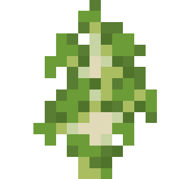 **Обычная берёза**\
      `birch`
    *  **Дерево джунглей**\
      `jungle`
    *  **Маленькое дерево джунглей**\
      `small_jungle`
    *  **Дерево джунглей с какао-бобами**\
      `cocoa_tree`
    *  **Куст джунглей**\
      `jungle_bush`
    * 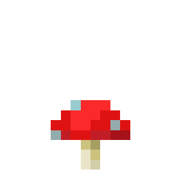 **Красный гриб**\
      `red_mushroom`
    * 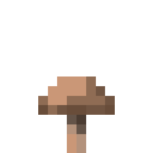 **Коричневый гриб**\
      `brown_mushroom`
    *  **Болотное дерево**\
      `swamp`
    *  **Акация**\
      `acacia`
    * 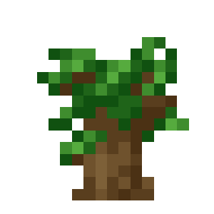 **Тёмный дуб**\
      `dark_oak`
    *  **Огромная секвойя**\
      `mega_redwood`
    * 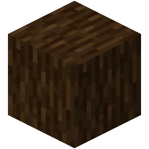 **Огромная сосна**\
      `mega_pine`
    *  **Высокая берёза**\
      `tall_birch`
    * 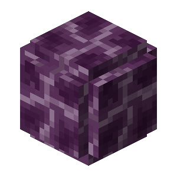 **Дерево хоруса**\
      `chorus_plant`
    * 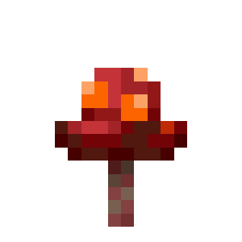 **Багровый гриб**\
      `crimson_fungus`
    *  **Искажённый гриб**\
      `warped_fungus`
    *  **Азалия**\
      `azalea`
    * 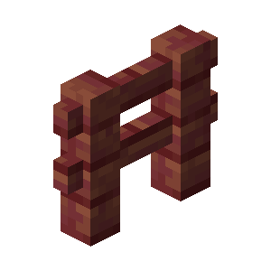 **Мангровое дерево**\
      `mangrove`
    * 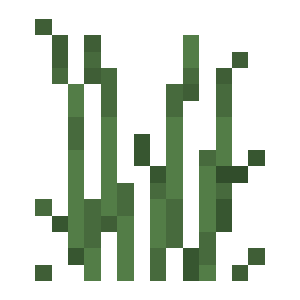 **Высокое мангровое дерево**\
      `tall_mangrove`
    *  **Вишня**\
      `cherry`

[^25]: **Тип роста** `growth_type`:

    * 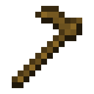 **Номер стадии роста**\
      `stage_number`
    *  **Процент роста**\
      `percentage`

[^26]: **Сторона таблички** `side`:

    *  **Передняя**\
      `front`
    *  **Задняя**\
      `back`
    * 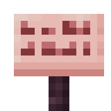 **Все**\
      `all`

[^27]: **Цвет текста** `sign_text_color`:

    *  **Белый**\
      `white`
    *  **Оранжевый**\
      `orange`
    *  **Пурпурный**\
      `magenta`
    *  **Голубой**\
      `light_blue`
    *  **Жёлтый**\
      `yellow`
    *  **Лаймовый**\
      `lime`
    * 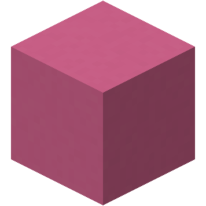 **Розовый**\
      `pink`
    * 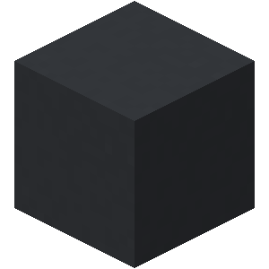 **Серый**\
      `gray`
    * 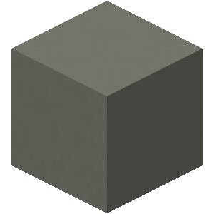 **Светло-серый**\
      `light_gray`
    * 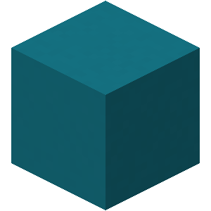 **Бирюзовый**\
      `cyan`
    *  **Фиолетовый**\
      `purple`
    * 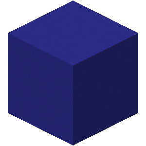 **Синий**\
      `blue`
    *  **Коричневый**\
      `brown`
    * 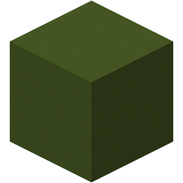 **Зелёный**\
      `green`
    *  **Красный**\
      `red`
    * 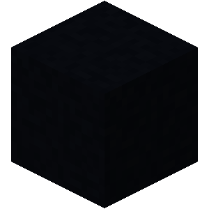 **Чёрный**\
      `black`

[^28]: **Свечение текста** `glowing`:

    *  **Включить**\
      `true`
    *  **Выключить**\
      `false`

[^29]: **Вощённость** `waxed`:

    *  **Включить**\
      `true`
    *  **Выключить**\
      `false`

[^30]: **Тип значения** `receive_type`:

    *  **Имя или UUID игрока**\
      `name_or_uuid`
    *  **Параметр "value" скина**\
      `value`

[^31]: **Слот** `slot`:

    *  **Первый**\
      `first`
    *  **Второй**\
      `second`
    *  **Третий**\
      `third`
    *  **Четвёртый**\
      `fourth`

[^32]: **Сторона вазы** `side`:

    * 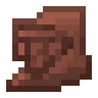 **Задняя сторона**\
      `back`
    *  **Левая сторона**\
      `left`
    * 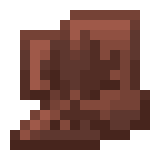 **Правая сторона**\
      `right`
    *  **Передняя сторона**\
      `front`

[^33]: **Возможность призыва** `can_summon`:

    *  **Может призывать**\
      `true`
    *  **Не может призывать**\
      `false`

[^34]: **Состояние** `shrieking`:

    *  **Кричащий**\
      `true`
    *  **Не кричащий**\
      `false`

[^35]: **Активация** `powered`:

    *  **Включить**\
      `true`
    *  **Выключить**\
      `false`

[^36]: **Убрать сообщение** `hide`:

    *  **Да**\
      `true`
    *  **Нет**\
      `false`

[^37]: **Разрешить передвижение** `allowed`:

    *  **Да**\
      `true`
    *  **Нет**\
      `false`

[^38]: **Тип формата** `format`:

    *  **Пустой**\
      `blank`
    *  **Текстовый**\
      `fixed`
    *  **Стиль**\
      `styled`
    *  **Обычный**\
      `reset`

[^39]: **Выпадение блоков** `enable`:

    *  **Включено**\
      `true`
    *  **Выключено**\
      `false`

[^40]: **Сложность** `difficulty`:

    *  **Мирная**\
      `peaceful`
    * 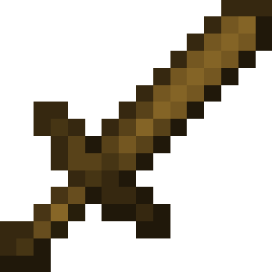 **Лёгкая**\
      `easy`
    *  **Нормальная**\
      `normal`
    *  **Сложная**\
      `hard`

[^41]: **Игровое правило** `gamerule`:

    * Отключение рейдов (disableRaids)
    * Смена дня и ночи (doDaylightCycle)
    * Выпадение экипировки сущностей (doEntityDrops)
    * Распространение огня (doFireTick)
    * Мгновенное возрождение (doImmediateRespawn)
    * Появление фантомов (doInsomnia)
    * Выпадение добычи с мобов (doMobLoot)
    * Появление мобов (doMobSpawning)
    * Патрули Разбойников (doPatrolSpawning)
    * Выпадение блоков (doTileDrops)
    * Странствующие торговцы (doTraderSpawning)
    * Изменения погоды (doWeatherCycle)
    * Урон от утопления (drowningDamage)
    * Урон от падения (fallDamage)
    * Урон от огня (fireDamage)
    * Прощение умерших игроков (forgiveDeadPlayers)
    * Сохранение инвентаря при смерти (keepInventory)
    * Разрушительные действия мобов (mobGriefing)
    * Снаряды могут разрушать блоки (projectilesCanBreakBlocks)
    * Сообщения о смерти (showDeathMessages)
    * Регенерация здоровья (naturalRegeneration)
    * Слепая ярость (universalAnger)
    * Процент спящих (playersSleepingPercentage)
    * Малый экран отладки (reducedDebugInfo)
    * Урон от замерзания (freezeDamage)
    * Частота случайных тиков (randomTickSpeed)
    * Предел сущностей в одном блоке (maxEntityCramming)
    * Радиус области возрождения (spawnRadius)
    * Возобновление источников лавы (lavaSourceConversion)
    * Возобновление источников воды (waterSourceConversion)
    * Потеря части добычи при взрыве динамита (tntExplosionDropDecay)
    * Потеря части добычи при взрыве от взаимодействия с блоком (blockExplosionDropDecay)
    * Потеря части добычи при взрыве моба (mobExplosionDropDecay)
    * Создание только по рецепту (doLimitedCrafting)
    * Время прохождения портала Незера вне творческого режима (playersNetherPortalDefaultDelay)
    * Время прохождения портала Незера в творческом режиме (playersNetherPortalCreativeDelay)
    * Высота снежного покрова (showAccumulationHeight)
    * Радиус чанков возрождения (shawnChunkRadius)
    * Появление Хранителей (doWardenSpawning)
    * Исчезновение брошенного эндер-жемчуга при смерти (enderPearlsVanishOnDeath)
    * Распространение лозы (doVinesSpread)

[^42]: **Тип погоды** `weather_type`:

    *  **Ясная**\
      `clear`
    *  **Дождливая**\
      `raining`
    *  **Гроза**\
      `thunder`

[^43]: **Тип запроса** `request_type`:

    *  **GET**\
      `get`
    *  **HEAD**\
      `head`
    *  **POST**\
      `post`
    *  **PUT**\
      `put`
    *  **PATCH**\
      `patch`
    *  **DELETE**\
      `delete`

[^44]: **Медиа тип запроса** `content_type`:

    *  **Обычный текст (text/plain)**\
      `text_plain`
    *  **JSON (application/json)**\
      `application_json`
