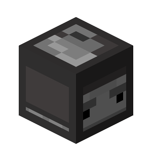

# Событие мира

<figure><figcaption>
Блок кода
</figcaption></figure>

**Тип:** Событие\
**Текстовый идентификатор:** `world_event`

***

## Использование

Поставьте блок события в самое начало строки и нажмите ПКМ по нему, чтобы открыть меню опций блока. Перейдите в нужную категорию и выберите событие, исходя из которого будет выполняться весь последующий код в строке.

### Опции



 **Общие события мира.**

***

| Опция                                                                                                                                                               | Описание                                                                                                         | Возможность отмены                                                  |
| ------------------------------------------------------------------------------------------------------------------------------------------------------------------- | ---------------------------------------------------------------------------------------------------------------- | ------------------------------------------------------------------- |
| 
 <strong>Запуск мира</strong> <code>world_start</code>
                            | Выполняет код в момент запуска мира в режиме игры.                                                               |  **Не отменяемое** |
| 
 <strong>Остановка мира</strong> <code>world_stop</code>
                         | Выполняет код в момент остановки режима игры в мире.                                                             |  **Не отменяемое** |
| 
 <strong>Пропуск времени</strong> <code>time_skip</code>
                            | 
Выполняет код если произошёл пропуск времени.  Работает с: » Сном » Установкой времени в коде
 |  **Отменяемое**        |
| 
 <strong>Ответ от сервера</strong> <code>world_web_response</code>
             | Выполняет код, когда сервер, на который был отправлен запрос, отвечает.                                          |  **Не отменяемое** |
| 
 <strong>Ошибка веб-запроса</strong> <code>world_web_exception</code>
 | Выполняет код, когда сервер, на который был отправлен запрос, отвечает ошибкой.                                  |  **Не отменяемое** |



 **Генерация блоков, изменение уровня редстоуна.**

***

| Опция                                                                                                                                                                      | Описание                                                                                                                                                                                                                   | Возможность отмены                                                  |
| -------------------------------------------------------------------------------------------------------------------------------------------------------------------------- | -------------------------------------------------------------------------------------------------------------------------------------------------------------------------------------------------------------------------- | ------------------------------------------------------------------- |
| 
 <strong>Блок поджигается</strong> <code>block_ignite</code>
                         | Выполняет код, когда когда блок поджигается.                                                                                                                                                                               |  **Не отменяемое** |
| 
 <strong>Сгорание блока</strong> <code>block_burn</code>
                         | Выполняет код в момент сгорания блока.                                                                                                                                                                                     |  **Отменяемое**        |
| 
 <strong>Исчезновение блока</strong> <code>block_fade</code>
                                 | 
Выполняет код, когда блок исчезает, к примеру, когда тает лёд или снег, затухает огонь или засыхает коралл.  Работает с: » Снегом » Льдом » Огнём » Кораллами » Черепашьими яйцами » Дёрном
 |  **Отменяемое**        |
| 
 <strong>Поршень выдвигается</strong> <code>block_piston_extend</code>
                    | Выполняет код, когда поршень выдвигает блок.                                                                                                                                                                               |  **Отменяемое**        |
| 
 <strong>Поршень втягивается</strong> <code>block_piston_retract</code>
            | Выполняет код, когда поршень втягивает блок.                                                                                                                                                                               |  **Отменяемое**        |
| 
 <strong>Подрыв динамита</strong> <code>tnt_prime</code>
                                     | Выполняет код, когда блок динамита поджигается.                                                                                                                                                                            |  **Отменяемое**        |
| 
 <strong>Блок взрывается</strong> <code>block_explode</code>
                         | Выполняет код, когда блок создаёт взрыв.                                                                                                                                                                                   |  **Отменяемое**        |
| 
 <strong>Сущность взрывается</strong> <code>entity_explode</code>
          | Выполняет код, когда сущность взрывается.                                                                                                                                                                                  |  **Отменяемое**        |
| 
 <strong>Сущность решила взорваться</strong> <code>entity_explosion</code>
     | Выполняет код, когда сущность приняла решение взорваться.                                                                                                                                                                  |  **Отменяемое**        |
| 
 <strong>Опадание листьев</strong> <code>leaves_decay</code>
                          | Выполняет код, когда листья опадают.                                                                                                                                                                                       |  **Отменяемое**        |
| 
 <strong>Дерево вырастает</strong> <code>structure_grow</code>
                    | Выполняет код, когда дерево или гриб вырастает.                                                                                                                                                                            |  **Отменяемое**        |
| 
 <strong>Рост блока</strong> <code>block_grow</code>
                                 | 
Выполняет код, когда блок вырастает.  Работает с: » Семенами » Тыквами и арбузами » Черепашьими яйцами
                                                                                               |  **Отменяемое**        |
| 
 <strong>Перемещение блока</strong> <code>block_flow</code>
                         | 
Выполняет код, когда блок перемещается.  Работает с: » Жидкостями » Яйцом дракона
                                                                                                                       |  **Отменяемое**        |
| 
 <strong>Удобрение блока</strong> <code>block_fertilize</code>
                         | Выполняет код, когда блок удобряется.                                                                                                                                                                                      |  **Отменяемое**        |
| 
 <strong>Блок активируется</strong> <code>redstone_level_change</code>
                  | Выполняет код, когда блок активируется редстоуном.                                                                                                                                                                         |  **Не отменяемое** |
| 
 <strong>Завершение зельеварения</strong> <code>brew_complete</code>
               | Выполняет код, когда зельеварение в блоке заканчивается.                                                                                                                                                                   |  **Отменяемое**        |
| 
 <strong>Генерация блока</strong> <code>block_form</code>
                            | 
Выполняет код, когда блок генерируется впоследствии взаимодействия блоков.  Работает с: » Снегом » Льдом » Генерацией булыжника и т.п. » Затвердеванием цемента
                                   |  **Отменяемое**        |
| 
 <strong>Распространение блока</strong> <code>block_spread</code>
                 | 
Выполняет код, когда блок распространяется.  Работает с: » Грибами » Огнём
                                                                                                                              |  **Отменяемое**        |
| 
 <strong>Генерация блока из-за сущности</strong> <code>block_form_by_entity</code>
       | 
Выполняет код, когда блок генерируется впоследствии взаимодействия блоков и сущностей.  Работает с: » Снежными големами » Зачарованием "Ледоход"
                                                        |  **Отменяемое**        |
| 
 <strong>Создание портала</strong> <code>portal_create</code>
                    | Выполняет код, когда в мире создаётся портал.                                                                                                                                                                              |  **Отменяемое**        |
| 
 <strong>Звон колокола</strong> <code>bell_ring</code>
                                      | Выполняет код, когда в мире звонит колокол.                                                                                                                                                                                |  **Отменяемое**        |
| 
 <strong>Сущность звонит в колокол</strong> <code>entity_bell_ring</code>
            | Выполняет код, когда сущность звонит в колокол.                                                                                                                                                                            |  **Отменяемое**        |
| 
 <strong>Проигрывание звука нотным блоком</strong> <code>note_play</code>
             | Выполняет код, когда в мире нотный блок проигрывает звук.                                                                                                                                                                  |  **Отменяемое**        |
| 
 <strong>Блок выбрасывает предмет</strong> <code>dispenser_dispense_item</code>
          | Выполняет код, когда блок выбрасывает предмет.                                                                                                                                                                             |  **Отменяемое**        |
| 
 <strong>Раздатчик надевает броню</strong> <code>dispenser_equip_armor</code>
          | Выполняет код, когда раздатчик надевает броню на сущность.                                                                                                                                                                 |  **Отменяемое**        |
| 
 <strong>Изменение уровня воды</strong> <code>fluid_level_change</code>
               | Выполняет код, когда изменяется уровень воды в блоке.                                                                                                                                                                      |  **Отменяемое**        |
| 
 <strong>Губка впитывает воду</strong> <code>sponge_absorb</code>
                         | Выполняет код, когда губка впитывает воду.                                                                                                                                                                                 |  **Отменяемое**        |
| 
 <strong>Скалк цветёт</strong> <code>sculk_bloom</code>
                           | Выполняет код, когда скалк цветёт.                                                                                                                                                                                         |  **Отменяемое**        |
| 
 <strong>Падающий блок приземляется</strong> <code>falling_block_land</code>
                | Выполняет код, когда падающий блок превращается в обычный блок.                                                                                                                                                            |  **Отменяемое**        |
| 
 <strong>Предмет переместился в контейнер</strong> <code>item_moved_into_container</code>
 | Выполняет код, когда предмет перемещается в контейнер.                                                                                                                                                                     |  **Отменяемое**        |
| 
 <strong>Воронка подбирает предмет</strong> <code>hopper_pickup_item</code>
      | 
Выполняет код, когда воронка подбирает предмет.  » Чтобы выбрать предмет как сущность, используйте цель "Жертва".
                                                                                             |  **Отменяемое**        |
| 
 <strong>Печь начала плавку</strong> <code>furnace_start_smelt</code>
                    | 
Выполняет код, когда печь начинает плавку.  Работает с: » Печами » Плавильнями » Коптильнями
                                                                                                         |  **Не отменяемое** |
| 
 <strong>Печь закончила плавку</strong> <code>furnace_smelt</code>
                 | 
Выполняет код, когда печь заканчивает плавку.  Работает с: » Печами » Плавильнями » Коптильнями
                                                                                                      |  **Отменяемое**        |
| 
 <strong>Печь использует топливо</strong> <code>furnace_burn</code>
                         | 
Выполняет код, когда печь использует предмет как топливо.  Работает с: » Печами » Плавильнями » Коптильнями
                                                                                          |  **Отменяемое**        |


