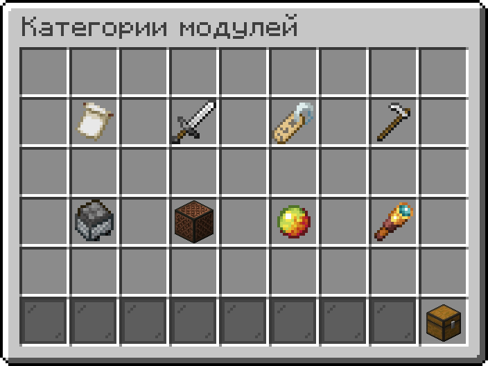
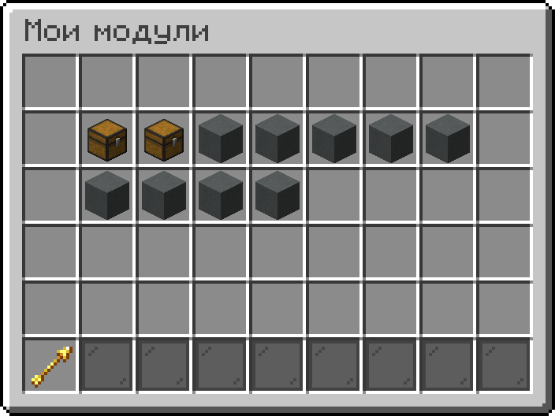

# Модуль

## Создание модуля

Выделите нужные строки кода [ **манипулятором**](./#vzaimodeistvie-s-pomoshyu-manipulyatora) и откройте меню нажатием клавиши F, затем выберите вариант «Сохранить как модуль».

Из предложенного списка выберите подходящую категорию. После этого вам потребуется придумать ID для модуля и ввести его в чат.

#### Требования к ID:

* Содержит не менее 3-х символов
* Начинается с латинской буквы
* Может содержать в себе только латинские буквы, числа и символы `_`

Конечный ID вашего модуля будет выглядеть так: `Username/ID`.

## Управление модулем

Перейдите в [**Меню модулей**](#user-content-fn-1)[^1] с помощью команды `/module` и перейдите в раздел  [**Мои модули**](#user-content-fn-2)[^2].\
В этом меню показаны все созданные вами модули.

* Нажатие ЛКМ устанавливает выбранный модуль в редакторе кода, в котором вы находитесь на данный момент.
* Нажатие ПКМ открывает настройки выбранного модуля.

#### Настройки модуля имеют следующий функционал:

Название модуля

Позволяет установить название и описание модуля. По умолчанию установлено ID модуля.\
\
» Если вы хотите установить описание модулю, то используйте `\n` после названия. Например, `Fly Away\nДобавляет реактивные ранцы.`

Доступность модуля

*  **Приватный** (модуль можете установить только вы)
*  **Публичный** (модуль виден всем игрокам и каждый может его установить)

Категория

Позволяет изменить категорию.

Удалить модуль

Безвозвратно удаляет модуль.

## Загрузка модуля

Самый простой способ загрузки модуля — воспользоваться [**Меню модулей**](#user-content-fn-3)[^3].\
Введите команду `/module` и выберите нужную категорию. Наведите курсор на модуль, который хотите разместить в своём редакторе кода и нажмите ЛКМ.\
Вы можете проголосовать за понравившийся модуль наведя на него курсом и нажав Shift + ЛКМ.

#### Команды модулей:

| Команда                                                      | Описание                                            |
| ------------------------------------------------------------ | --------------------------------------------------- |
| `/module`                                                    | Открыть [**Меню модулей**](#user-content-fn-4)[^4]. |
| `/module load` [`<force>`](#user-content-fn-5)[^5] `<ID>`    | Загрузить модуль.                                   |
| `/module loadUrl` [`<force>`](#user-content-fn-6)[^6] `<ID>` | Загрузить модуль по URL.                            |
| `/module remove <module>`                                    | Безвозвратно удалить свой модуль.                   |

[^1]: 

[^2]: Количество доступных для создания модулей зависит от [ранга](https://justmc.io/shop).

[^3]: 

[^4]: 

[^5]: Удаляет весь остальной код.

[^6]: Удаляет весь остальной код.
