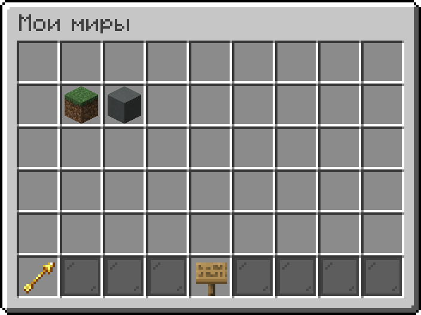
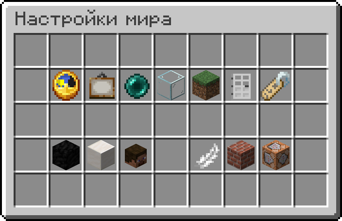
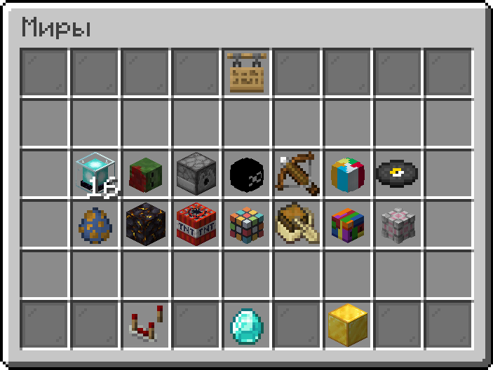
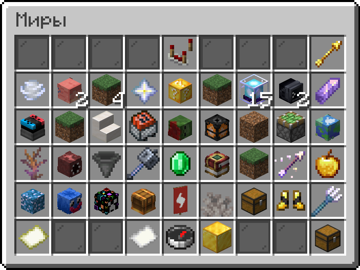
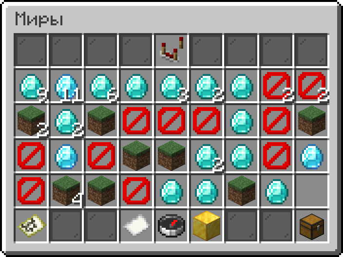
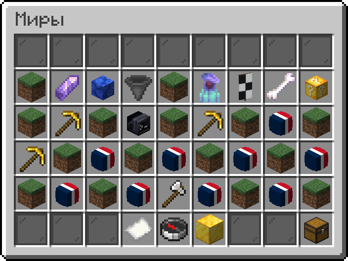
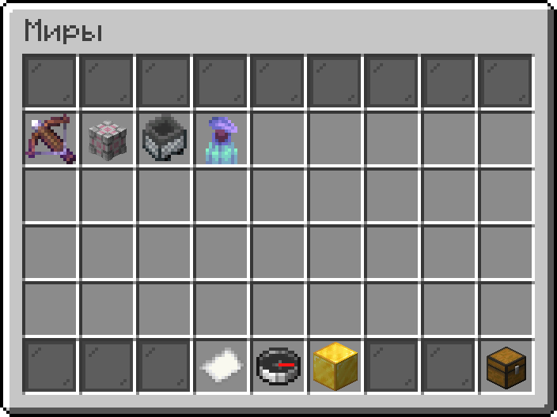

# Мир

## Создание мира

Находясь на спавне режима[^1] вам нужно открыть меню  [**Мои миры**](#user-content-fn-2)[^2] и нажать на  **Создать мир**. Вам представится выбор из четырёх типов мира.

<table><thead><tr><th width="55" align="center">№</th><th width="299">Тип мира</th><th>Описание</th></tr></thead><tbody><tr><td align="center">1</td><td>Пустой</td><td>Каменная платформа 32x32 блока.</td></tr><tr><td align="center">2</td><td>Плоский</td><td>Ванильный плоский мир, 4 блока в высоту.</td></tr><tr><td align="center">3*</td><td>Кодинг</td><td>Этаж редактора кода, растянутый во всю ширину мира.</td></tr><tr><td align="center">4*</td><td>Отладка</td><td>Ванильный мир отладки.</td></tr></tbody></table>

\*Секретный тип мира, скрытый в меню.

Нажатием <kbd>ПКМ</kbd> по типу мира откроются расширенные настройки, где можно выбрать размер и измерение для будущего мира. При выборе пустого типа мира можно выбрать также и биом: **бездна** или **равнины**.

После создания мира ему присваивается свой ID. Это уникальный номер, который никак нельзя изменить. Посмотреть его можно в  [**Настройках мира**](#user-content-fn-3)[^3], либо в меню  [**Мои миры**](#user-content-fn-2)[^2].

## Управление миром

При запуске мира в [режиме строительства](world.md#sostoyaniya-mira) вам выдаётся специальный предмет, открывающий  [**Настройки мира**](#user-content-fn-3)[^3]. Но если вы находитесь в режиме игры, либо компаса по каким-либо причинам у вас нет, то данное меню можно открыть и другим способом — например, командой `/world` или `/plot`.

#### Меню настроек мира имеет следующий функционал:

Изменение времени

*  **Утро** (6:00 или 0 тиков)
*  **День** (12:00 или 6000 тиков)
*  **Вечер** (18:00 или 13000 тиков)
*  **Ночь** (0:00 или 18000 тиков)

Управление медиа

*  **Выбрать отображаемый предмет**
*  **Выбрать категории**
*  **Реклама мира**
*  **Опубликовать мир**
*  **Удалить мир из публичного доступа**

Изменение точки возрождения

* Нажатие <kbd>ЛКМ</kbd> — установить на текущую позицию
* Нажатие <kbd>ПКМ</kbd> — сбросить на стандартную позицию

Изменение размера мира

Укажите размер, написав нужное число в чат. Максимальный размер мира зависит от вашего [ранга](https://justmc.io/shop).

Управление приватностью

*  **Публичный** (в мир может зайти любой игрок)
*  **Приватный** (в мир можете зайти только вы и игроки в белом списке)

Изменение названия мира

Напишите название мира в чат.\
\
» Если вы хотите установить описание мира, то используйте `\n` после названия. Например, `Skyfall\nБитвы на элитрах!`

Управление чёрным списком

Игроки, занесённые в чёрный список, не смогут зайти в ваш мир.

Управление белым списком

Игроки, включённые в белый список, будут обладать множеством прав в вашем мире.

Просмотр игроков онлайн (в мире)

Показывает, кто на данный момент находится в вашем мире.

Управление полётом

Позволяет игрокам летать.

Управление строительством

Переводит игроков в творческий режим.

Управление кодом

Позволяет игрокам заходить в [редактор кода](editor/).

### Состояния мира

Мир имеет 2 состояния: **режим строительства** и **режим игры**.

Режим строительства устанавливается по умолчанию при создании мира. Если мир находится в режиме игры, то активировать режим строительства можно командой `/build`.

Режим игры вызывается командой `/play`. При запуске мира в режиме игры, активируется код, расположенный в специальном редакторе, в который можно переместиться при помощи команды `/dev`.

### Команды

Доступные команды в мире:



**Команды, управляющие процессом игры.**

***

| Команда                               | Описание                                                            |
| ------------------------------------- | ------------------------------------------------------------------- |
| [`/gamemode`](#user-content-fn-4)[^4] | Изменить режим игры.                                                |
| `/give`                               | Выдать любой предмет игроку.                                        |
| [`/teleport`](#user-content-fn-5)[^5] | Телепортироваться в любое место или телепортировать другого игрока. |
| `/fly`                                | Изменить режим полёта.                                              |
| `/kill`                               | Убить игрока или сущность.                                          |
| `/summon`                             | Призвать сущность.                                                  |



**Команды для управления миром.**

***

| Команда                                 | Описание                                                                                                                                       |
| --------------------------------------- | ---------------------------------------------------------------------------------------------------------------------------------------------- |
| `/world`                                | Открыть меню управления миром.                                                                                                                 |
| `/world resourcepack`                   | 
Управление ресурспаками мира. Данная команда доступна только от <a href="https://justmc.io/shop">ранга</a> Moon.
                     |
| `/dev`                                  | 
Перейти в <a href="editor/">редактор кода</a>. При указании ника игрока изменяется уровень его прав в категории «Управление кодом».‎
 |
| `/play`                                 | Перевести мир в режим игры.                                                                                                                    |
| `/build`                                | 
Перевести мир в режим строительства. При указании ника игрока изменяется уровень его прав в категории «Управление строительством».
   |
| [`/gamerule`](#user-content-fn-6)[^6]   | Изменить игровые правила мира.                                                                                                                 |
| `/time`                                 | Изменить текущее время в мире.                                                                                                                 |
| `/weather`                              | Изменить текущую погоду в мире.                                                                                                                |
| [`/enviroment`](#user-content-fn-7)[^7] | Управление переменными и инвентарями игроков.                                                                                                  |



**Команды для взаимодействия с миром.**

***

| Команда                               | Описание                                                                                                                                                                                |
| ------------------------------------- | --------------------------------------------------------------------------------------------------------------------------------------------------------------------------------------- |
| [`/spawn`](#user-content-fn-8)[^8]    | 
Выйти из мира на спавн <a data-footnote-ref href="#user-content-fn-1">режима</a>. Владелец мира может указать ник игрока, который впоследствии будет телепортирован на спавн.
 |
| [`/favorite`](#user-content-fn-9)[^9] | Добавить мир в [**Избранные миры**](world.md#menyu-imeet-sleduyushie-razdely).                                                                                                          |
| [`/vote`](#user-content-fn-10)[^10]   | Проголосовать за мир.                                                                                                                                                                   |
| `/world ad`                           | Прорекламировать мир в чате за 5 изумрудов.                                                                                                                                             |
| `/world limit bar`                    | Вызвать боссбар, показывающий нагрузку на мир в реальном времени (TPS, MSPT и CPU).                                                                                                     |



**Команды для использования вспомогательных инструментов.**

***

### Head Database (HDB)

| Команда       | Описание                                                  |
| ------------- | --------------------------------------------------------- |
| `/hdb`        | Открыть меню выбора голов, отсортированное по категориям. |
| `/hdb search` | Искать головы по определённому запросу.                   |
| `/head`       | Получить голову игрока по его нику.                       |

***

### Редактор предметов


Доступно только от [ранга](https://justmc.io/shop) Star.\
В качестве альтернативы, на сервере разрешено использовать модификации наподобие [IBE Editor](https://modrinth.com/mod/ibe-editor).


| Команда                                     | Описание                                              |
| ------------------------------------------- | ----------------------------------------------------- |
| `/item color`                               | Придать цвет окрашиваемому предмету.                  |
| `/item count`                               | Установить определённое количество предметов в слоте. |
| `/item durability`                          | Установить прочность предмету.                        |
| `/item emptyname`                           | Очистить название предмета.                           |
| [`/item enchant`](#user-content-fn-11)[^11] | Установить зачарование предмету.                      |
| `/item equip`                               | Поместить предмет в слоты для брони.                  |
| [`/item lore`](#user-content-fn-12)[^12]    | Редактировать описание предмета.                      |
| `/item material`                            | Заменить предмет на другой, сохранив все показатели.  |
| `/item modeldata`                           | Редактировать значение ModelData.                     |
| [`/item rename`](#user-content-fn-13)[^13]  | Переименовать предмет.                                |
| `/item send`                                | Отправить предмет игроку в инвентарь.                 |
| [`/item trim`](#user-content-fn-14)[^14]    | Применить кузнечный шаблон к элементу брони.          |
| `/item unbreakable`                         | Установить неразрушимость предмету.                   |



## Публикация мира

Если игроку понравился мир, то он может за него проголосовать командой `/vote`, в результате чего миру начисляется 1 голос, который сбросится через две недели. После сброса голоса тот самый игрок снова сможет проголосовать за этот же мир. Когда у мира набирается 10 голосов одновременно, у владельца появляется возможность опубликовать мир.

После того, как мир опубликовали, он появляется в списке опубликованных миров. Теперь его может запустить любой игрок в режиме игры, даже когда автора нет на сервере.

Особо успешным и качественным мирам администрация сервера присуждает отметку **Рекомендовано**. Миры с этой отметкой отображаются на главной странице в меню миров.

## Меню миров

Меню миров открывается нажатием <kbd>ЛКМ</kbd>/<kbd>ПКМ</kbd> по предмету  [**Миры**](#user-content-fn-15)[^15] на спавне режима[^1] или командой `/worlds`. В этом меню расположены все опубликованные миры, которые можно отсортировать по категориям. Помимо этого, присутствует функция  **Поиск миров**, позволяющая найти мир по его названию.

#### Меню имеет следующие разделы:

*  [**Миры онлайн**](#user-content-fn-16)[^16] — миры, в которые сейчас играют игроки.
*  [**Недавние миры**](#user-content-fn-17)[^17] — список миров, куда вы недавно заходили.
*  [**Избранные миры**](#user-content-fn-18)[^18] — список миров, избранных пользователем.
*  [**Мои миры**](#user-content-fn-2)[^2] — список ваших миров.

#### Команды Creative+, связанные с мирами:

| Команда         | Описание                                                                                                                                                                   |
| --------------- | -------------------------------------------------------------------------------------------------------------------------------------------------------------------------- |
| `/join <ID>`    | 
Присоединиться к миру по его ID. Если ввести эту команду в глобальный чат, то она станет кликабельной и любой игрок сможет зайти в указанный мир одним нажатием.
 |
| `/locate <ник>` | Показать, в каком мире сейчас находится игрок.                                                                                                                             |
| `/worlds`       | Открыть меню миров.                                                                                                                                                        |
| `/world limit`  | Посмотреть текущую нагрузку миров на сервер (TPS, MSPT и CPU).                                                                                                             |
| `/world worlds` | Посмотреть миры онлайн на сервере, на котором вы находитесь.                                                                                                               |

[^1]: Creative+

[^2]: Количество доступных для создания миров зависит от [ранга](https://justmc.io/shop).

[^3]: 

[^4]: Можно заменить на: `/gm`

[^5]: Можно заменить на: `/tp`

[^6]: Можно заменить на: `/gr`

[^7]: Можно заменить на: `/env`

[^8]: Можно заменить на: `/s`

[^9]: Можно заменить на: `/fav`

[^10]: Можно заменить на: `/v`

[^11]: Можно заменить на: `/enchant`

[^12]: Можно заменить на: `/lore`

[^13]: Можно заменить на: `/rename`

[^14]: Можно заменить на: `/trim`

[^15]: 

[^16]: 

[^17]: 

[^18]: 
