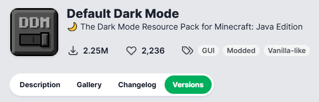
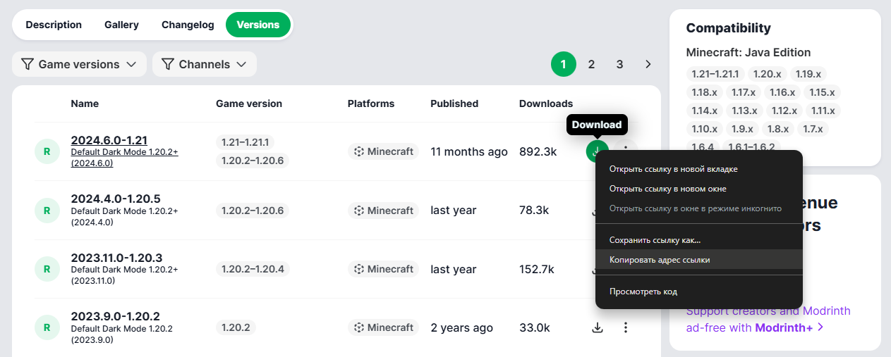
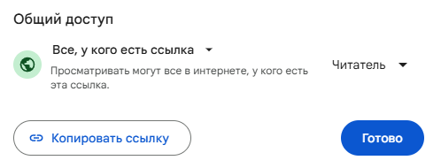
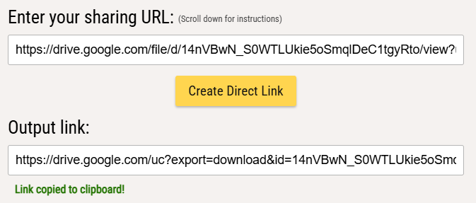
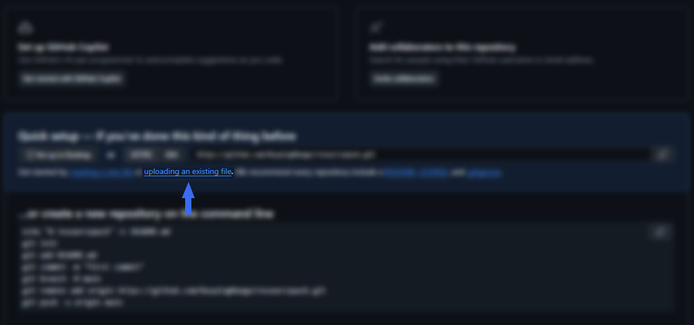
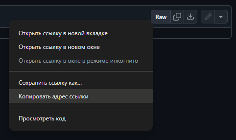

# Ресурспак


Доступно только от ранга [Moon](https://justmc.io/shop).


## Команды

| Команда                      | Описание                                                                                                                                  |
| ---------------------------- | ----------------------------------------------------------------------------------------------------------------------------------------- |
| `/world resourcepack add`    | 
Установить ресурспак в мир.  » Действуют <a href="resourcepack.md#limity">лимиты</a> на размер файла в зависимости от ранга.
 |
| `/world resourcepack remove` | Удалить ресурспак из мира.                                                                                                                |
| `/world resourcepack query`  | Показать список установленных ресурспаков.                                                                                                |
| `/world resourcepack clear`  | Удалить все ресурспаки.                                                                                                                   |

### Лимиты

| Ранг   | Максимальный размер файла |
| ------ | ------------------------- |
| Moon   | 5 МБ                      |
| Planet | 8 МБ                      |
| Star   | 11 МБ                     |
| Galaxy | 14 МБ                     |
| Nova   | 17 МБ                     |

## Установка

Для установки ресурспака в мир требуется прямая ссылка на его скачивание, которая должна быть отправлена командой `/world resourcepack add <ссылка>`.

#### Советы:

* Не используйте ссылки на "страницу" ресурспака на каком-либо сайте. Это не сработает, потому что нужна именно прямая ссылка, при переходе по которой сразу начинается скачивание ресурспака.
* Сервер не хостит ресурспаки на своей стороне. Каждому игроку ресурспак загружается напрямую по указанной вами ссылке, поэтому в качестве хоста рекомендуется использовать только те ресурсы, в стабильности которых вы уверены. Также желательно не использовать ресурсы, заблокированные в определённых странах. В противном случае, игроки из этих стран не смогут загрузить ресурспак.

### Публичный ресурспак

Если вы хотите установить ресурспак, который распространяется свободно и публично доступен для скачивания, то для получения ссылки можно использовать тот же ресурс, на котором он размещён.

В качестве примера возьмём [Default Dark Mode](https://modrinth.com/resourcepack/default-dark-mode), доступный для скачивания на Modrinth.



### Откройте страницу ресурспака на сайте




### Перейдите в раздел "Versions"

<figure><figcaption></figcaption></figure>



### Выберите нужную версию и нажмите <kbd>ПКМ</kbd> по кнопке скачивания




### В появившемся контекстном меню нажмите "Копировать адрес ссылки"

<figure><figcaption></figcaption></figure>



### Установите ресурспак в мир по скопированной ссылке

Конечная команда выглядит так: `/world resourcepack add https://cdn.modrinth.com/data/6SLU7tS5/versions/KW0bu9nm/Default-Dark-Mode-1.20.2%2B-2024.6.0.zip`



### Собственный ресурспак

Для установки собственного ресурспака в мир в первую очередь нужно выбрать ресурс, который будет использоваться в качестве хоста.

Для примеров используем [Google Диск](https://drive.google.com/) и [GitHub](https://github.com/).

#### Google Диск



### Откройте Google Диск и загрузите туда файл ресурспака

Требуется аккаунт Google.



### Откройте к файлу доступ по ссылке и скопируйте её

Для этого откройте файл двойным нажатием <kbd>ЛКМ</kbd> и перейдите в "Настройки доступа".

<figure><figcaption></figcaption></figure>



### Конвертируйте ссылку

На данный момент это ссылка на веб-страницу для просмотра файла. Чтобы превратить её в ссылку на скачивание, её необходимо конвертировать. Это можно сделать с помощью [данного сайта](https://sites.google.com/site/gdocs2direct).

<figure><figcaption></figcaption></figure>



### Установите ресурспак в мир по полученной ссылке

`/world resourcepack add <ссылка>`



#### GitHub



### Создайте новый репозиторий

Требуется аккаунт GitHub.

Перейдите по [этой ссылке](https://github.com/new).\
Затем достаточно указать название и нажать "Create repository".



### Загрузите файл ресурспака

Для этого нажмите по ссылке "uploading an existing file".

<figure><figcaption></figcaption></figure>



### Скопируйте ссылку на скачивание

Откройте загруженный файл в репозитории и нажмите <kbd>ПКМ</kbd> по кнопке "Raw". В появившемся контекстном меню нажмите "Копировать адрес ссылки".

<figure><figcaption></figcaption></figure>



### Установите ресурспак в мир по полученной ссылке

`/world resourcepack add <ссылка>`


