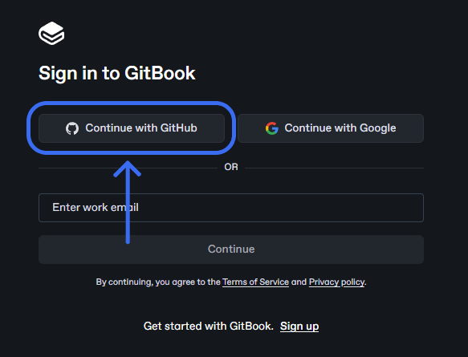
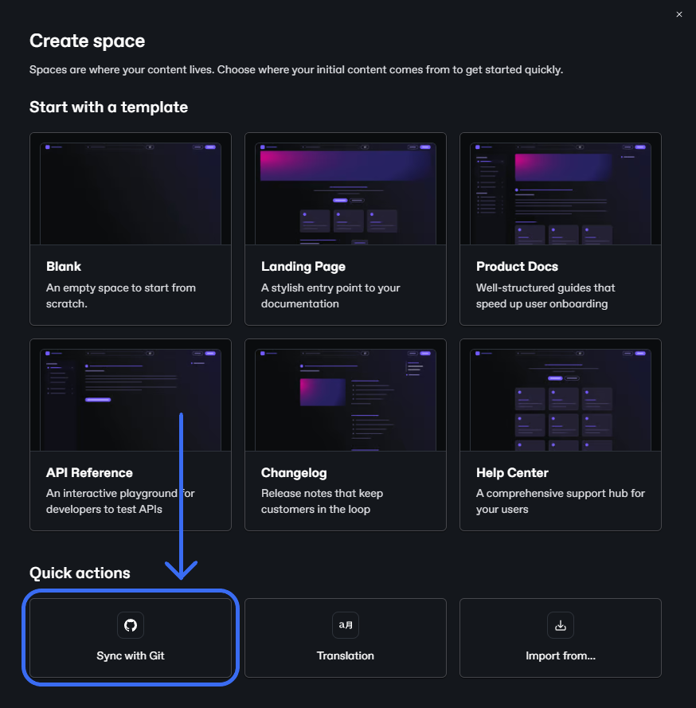
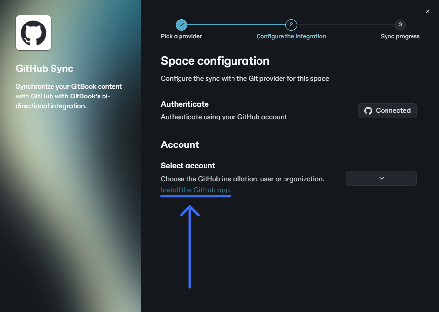
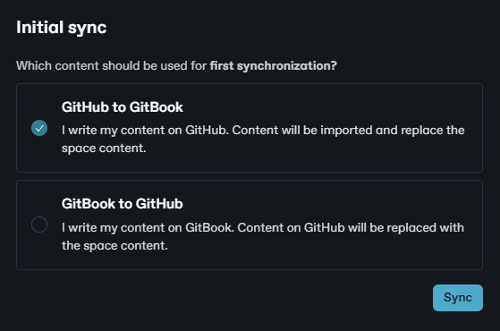
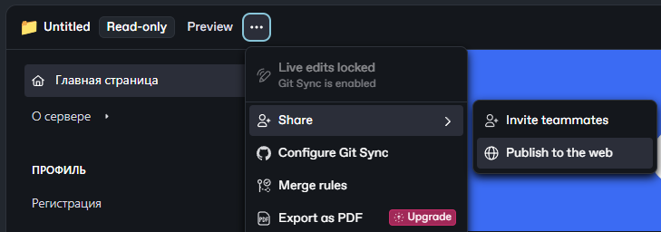
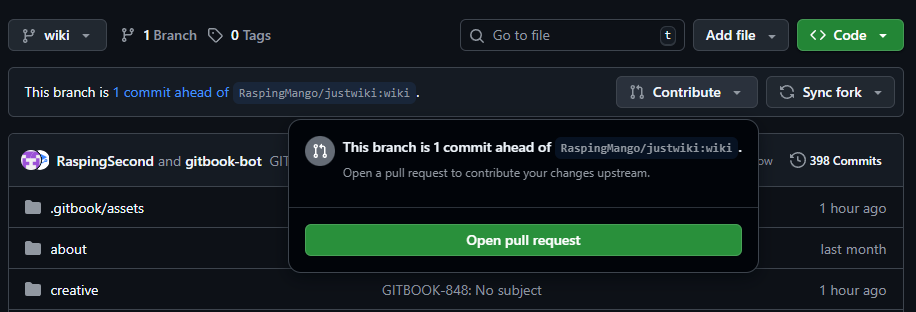
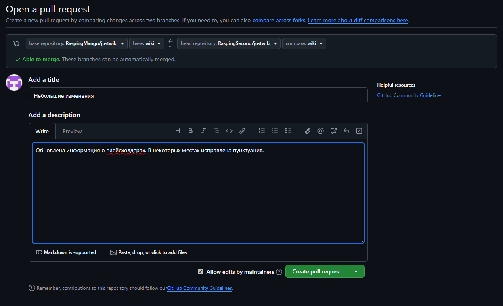

# Инструкция по редактированию

Для внесения своих изменений в вики вам требуется аккаунт GitHub. Если у вас его нет, то необходимо его [зарегистрировать](https://github.com/signup).



#### Создайте форк JustWiki

Перейдите на репозиторий по [этой ссылке](https://github.com/RaspingMango/justwiki) и нажмите на кнопку <i class="fa-code-fork">:code-fork:</i> **Fork**, находящуюся вверху справа. Вам откроется окно, в котором не нужно вносить никаких изменений, поэтому просто нажмите **Create fork**. В результате копия репозитория появится в вашем пространстве.



#### Авторизуйтесь на GitBook

<figure><figcaption></figcaption></figure>

Перейдите на [GitBook](https://app.gitbook.com/join) и войдите в свой аккаунт. Для авторизации можно использовать аккаунт GitHub, который у вас уже есть.



#### Синхронизируйте репозиторий

В навигационном меню слева есть строка **Spaces**. Наведитесь на неё и нажмите на <i class="fa-plus">:plus:</i> и выберите **New space**.

<figure><figcaption></figcaption></figure>

В открывшемся окне нажмите **Sync with Git** и выберите GitHub. Затем пройдите все манипуляции, необходимые для установки приложения GitBook в ваш форк репозитория на GitHub.

<figure><figcaption>
После прохождения аутентификации, нажмите "Install the GitHub app" и установите приложение в репозиторий JustWiki. Затем выберите этот репозиторий в этом же окне.
</figcaption></figure>

Первая синхронизация обязательно должна произойти по принципу <i class="fa-github">:github:</i> **GitHub** -> <i class="fa-gitbook">:gitbook:</i> **GitBook**.

<figure><figcaption>
Если выбран первый вариант, то нажмите "Sync".
</figcaption></figure>



#### Внесите свои изменения

Если синхронизация репозитория прошла успешно, то вы можете смело редактировать вики, используя редактор GitBook.

В правом верхнем углу есть кнопка <i class="fa-code-pull-request-draft">:code-pull-request-draft:</i> **Edit**, при нажатии на которую вы переместитесь в режим редактирования. На этом же месте будет кнопка <i class="fa-code-merge">:code-merge:</i> **Merge**, нажав на которую, все ваши изменения вступят в силу и синхронизируются с вашим репозиторием.



#### Опубликуйте сайт

Выложите свою версию сайта в открытый доступ.

<figure><figcaption>
Нажмите кнопку "Publish to the web".
</figcaption></figure>

После того, как вы опубликовали сайт, скопируйте ссылку на него.



#### Создайте запрос на слияние

Перейдите на страницу своего форка JustWiki на GitHub.

<figure><figcaption></figcaption></figure>

Нажмите <i class="fa-code-pull-request">:code-pull-request:</i> **Contribute** и **Open pull request**.

<figure><figcaption></figcaption></figure>

Вставьте скопированную ссылку на вашу версию сайта в описание. По желанию, можете также перечислить свои изменения в описании. Затем нажмите **Create pull request**.

В результате ваш запрос пройдёт модерацию и будет принят при условии, что все внесённые вами изменения корректны.


